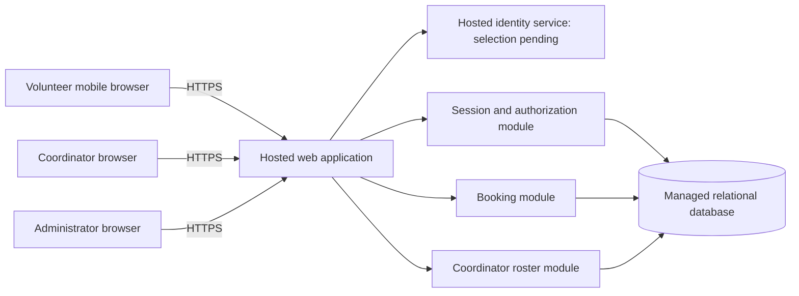

# ARCH-001 — Volunteer shift sign-up

## Basis and outcome

This design covers the six active, current-release requirements in approved
[PRD-001](../prd/PRD-001.md), version 1. The source hash covers the entire file.
The workspace contains no application, architecture template, AGENTS.md, test
configuration, or BRN-001. The approved PRD is the authority; its upstream claims
have not been independently checked. This document does not alter its approval,
requirements, or generated epic map. No epics have been created.

Use one hosted web application, a managed relational database, and a hosted
identity service. Separate identity integration, application sessions, booking,
and coordinator roster access within the application. This fits the stated 120
volunteers and one coordinator without introducing distributed business services.
The logical design is defined in [ADR-002](../adr/ADR-002.md). Identity-provider
selection remains open in [ADR-001](../adr/ADR-001.md).

Four requirements are ready for epic decomposition: FR-002, FR-003, NFR-002,
and NFR-003. FR-001 and NFR-001 are blocked on ADR-001. Ready means there is
enough architecture to scope an epic; it does not mean implemented, tested,
approved for release, or independent of sign-in delivery.

## Components and trust boundaries

Browsers are untrusted. Only the server accesses the database or provider
credentials. Every protected request resolves an application session and checks
current server-owned roles; browser-supplied volunteer IDs or roles confer no
authority. The external identity service establishes identity, while the
application controls product authorization and session validity.

| Component | Responsibility | Requirements |
|---|---|---|
| Mobile-first web UI | Sign-in entry, open shifts, booking result, coordinator daily view | FR-001, FR-002, FR-003 |
| Identity adapter | Map a verified provider subject to an enrolled volunteer; no automatic account linking by unverified contact data | FR-001, NFR-001 |
| Session/authorization module | Server sessions, role checks, administrator revocation | FR-001, NFR-001, NFR-002 |
| Booking module | List open shifts and atomically reserve capacity for the current volunteer | FR-002 |
| Roster/contact module | Day-scoped booked-volunteer view and coordinator-only phone projection | FR-003, NFR-002 |
| Hosted runtime and managed database | Run all product components off site; protect persistent state | NFR-003, supporting all other requirements |

No public database API, service per feature, event bus, native app, payroll, or
donation subsystem is needed. A separate contact-access module is an internal
boundary, not another deployed service.

## Data and authorization

| Entity | Minimum fields and integrity rules |
|---|---|
| Volunteer | Internal ID, display name, enrolled/active state; provider issuer and subject uniquely mapped to one volunteer |
| Role assignment | Principal ID and explicit role: volunteer, coordinator, administrator; role changes are privileged operations |
| Volunteer contact | Volunteer ID and phone number; separate from general volunteer and booking projections |
| Session | Digest of opaque session token, principal ID, expiry, revoked state, generation captured at issuance |
| Principal security state | Current session generation; incrementing it invalidates all older sessions for that principal |
| Shift | ID, warehouse start/end instants, capacity, published/open state; positive capacity and end after start |
| Booking | Shift ID, volunteer ID, created time; unique pair (shift ID, volunteer ID), foreign keys |
| Audit event | Actor ID, operation, target ID, time and outcome; no phone numbers, credentials or session tokens |

Volunteer access is limited to published shift availability and their own booking
results. Coordinator access includes daily rosters and phones. Administrator
access permits session revocation; it does **not** imply coordinator access.
A person may hold both roles, but phone access always requires the coordinator
role. Unauthenticated callers receive no protected information.

Store times as UTC instants and use a configured warehouse IANA time zone to
derive local-day boundaries. Never infer the warehouse zone from a browser or
the development environment. Shift capacities, times, local zone, initial
volunteers and role assignments are deployment inputs, not invented PRD facts.

## Flows and interface contracts

These logical HTTP contracts allow epic decomposition without selecting a web
framework. All mutations require a valid session, authorization, and CSRF
protection. User-specific responses use `Cache-Control: no-store`.

### Sign-in and revocation

The identity adapter accepts only successfully verified authentication results
and maps them to an enrolled, active principal. It issues an opaque application
session in a Secure, HttpOnly, SameSite cookie. Provider tokens are not product
API credentials. Specific provider callbacks, login method, account enrollment,
recovery, and fresh-authentication rules are gated by ADR-001.

For every protected request, every application instance checks session expiry,
revocation, principal generation, and current role in the authoritative store.
Do not cache successful authorization across requests. If that store cannot be
read, fail closed. Administrator-only
`POST /admin/volunteers/{id}/revoke-sessions` increments the target generation
atomically and records an audit event; report success only after commit.
Session issuance and revocation serialize on the same principal security state,
so issuance cannot accidentally resurrect an earlier session generation.

The intended server enforcement is the next protected operation after committed
revocation, within NFR-001's five-minute ceiling. Revalidate at the authorization
boundary of writes, serializing with revocation where needed. Open browser tabs,
other devices, other application instances, and provider refresh/callback paths
must not bypass this rule. Removing a cookie in one browser is insufficient.
Fresh legitimate sign-in after revocation is distinct from replay of a revoked
session; ADR-001 must settle the provider behavior at this boundary.

### Booking

`GET /shifts?date=YYYY-MM-DD` returns published shifts and available capacity,
without identities or phones. `POST /shifts/{id}/bookings` derives volunteer ID
from the session; clients cannot book as another volunteer.

In one database transaction, lock the shift row, check it is published/open and
has not started, check existing booking, count bookings against capacity, and
insert if there is room. Every writer must use that lock protocol. A duplicate
request returns the existing booking without consuming another place; a full or
closed shift returns a conflict. Rollback leaves no partial reservation. A
success response is sent only after commit. Capacity shown before submission is
advisory; the transaction decides whether the place is still available.

For the pilot, “open” is interpreted as published, before its start, and below
configured capacity. This is an explicit design assumption. Overlap restrictions,
waiting lists, cancellation, reminders and volunteer-managed shift creation have
no approved requirement and are excluded from this design.

### Daily roster and phone privacy

`GET /coordinator/roster?date=YYYY-MM-DD` requires the coordinator role. It reads
committed bookings for the warehouse-local day and returns shift details,
volunteer names, and phone numbers where present. It includes empty shifts so
the coordinator can see staffing gaps. Use explicit response-field allowlists;
general volunteer serializers must never contain phone fields.

The roster initially loads on navigation and refreshes while visible. A proposed
30-second polling interval supports the summary's “live roster”; it is a design
default, not a PRD service-level target. Display the last successful refresh and
an error on failed refresh; never label stale data as current. Avoid persistent
client storage and offline caching for roster data.

Authorization runs before contact reads. Phone values must not appear in
volunteer responses, HTML hydration data, client bundles, error text, analytics,
request/response logs or audit events. Operational support credentials must not
be a routine route for staff to browse contacts; provision restricted database
access and redact diagnostics. Encryption alone does not satisfy NFR-002.

## Hosting and operations

NFR-003 applies to **every** component and every feature epic, including identity,
sessions, booking, roster, administration, logs and backups. Use a hosted runtime
with HTTPS, a managed relational database with transactions and backups, and a
hosted identity service. No production component depends on an on-site machine.
Hosting vendor and framework are implementation choices constrained by these
capabilities; no vendor capability or price has been assumed.

Keep credentials in the host's secret facility. Separate pilot/test data from
production. Run controlled schema migrations, back up persistent data, and prove
restore before launch. Monitor failed sign-ins, authorization denials, revocation
errors, booking conflicts and roster refresh failures without capturing phone
values. Database failure denies protected work; booking failures do not report
success. An identity outage prevents new sign-ins; valid application sessions can
continue only while their authoritative session checks succeed.

Bootstrap Tuesday and Thursday shifts and enrolled users through a controlled
operator import, then add other shifts after the pilot. This supplies necessary
data without silently adding a scheduling-management product feature. Budget,
deployment account, warehouse zone, initial data, backup retention and recovery
objectives must be recorded before deployment; the PRD supplies none of them.
SM-01 remains measured by the coordinator's shift log; bookings alone do not
prove attendance or achievement of the 95% target. ASM-01 remains open.

## Requirement coverage and epic readiness

Direct architectural blockers are distinct from delivery dependencies. Each
feature epic must cite its FR and **all** applicable NFRs in its upstream links.
Global constraints must not be confined to a standalone infrastructure epic.

| Requirement | Design / decision | Ready for epics? | Required acceptance evidence in implementation |
|---|---|---|---|
| FR-001 | Identity adapter; ADR-001 | **BLOCKED** — provider, enrollment and recovery unresolved | Real selected-provider sign-in; invalid identity denied; subject mapping and session creation verified |
| FR-002 | Booking transaction; ADR-002 | **READY** — delivery depends on FR-001 and NFR-001 | Signed-in booking succeeds; full/closed shifts denied; simultaneous last-place requests yield exactly one new booking; retries never duplicate |
| FR-003 | Coordinator daily view; ADR-002 | **READY** — delivery depends on authenticated roles and NFR-002 | Correct local-day roster and empty shifts; new committed booking appears on refresh; non-coordinator denied |
| NFR-001 | Central session state; ADR-001 and ADR-002 | **BLOCKED** — enforcement design exists, but provider replay/refresh contract is unresolved | Administrator revokes all target sessions; replay fails within 300 seconds on every instance/device; refresh/callback cannot revive a revoked session; other volunteers unaffected |
| NFR-002 | Role separation and contact projections; ADR-002 | **READY** — applies to sign-in, booking and roster wherever contacts could flow | Coordinator sees phones; volunteer (including own phone), anonymous caller, and administrator-only role cannot; inspect API, rendered payloads, caches and logs |
| NFR-003 | Hosted topology; ADR-002 | **READY** — global inheritance across all feature epics | Deployment inventory demonstrates every production component runs on hosted services with no on-site dependency |

Suggested decomposition order (planning guidance, not generated epics):

1. Plan hosted application and data foundation under NFR-003; apply privacy and
   session interfaces from the start.
2. Resolve ADR-001, then define the sign-in/session epic covering FR-001,
   NFR-001, NFR-002 and NFR-003.
3. Define booking under FR-002 plus NFR-001/002/003. Domain work can use a test
   principal adapter; production acceptance depends on the real identity path.
4. Define coordinator roster under FR-003 plus NFR-001/002/003. This retains the
   PRD's should priority, while phone privacy remains mandatory everywhere.

All product delivery remains dependent on closing the identity decision. A ready
booking or roster epic must retain that dependency rather than marking the whole
PRD ready. Mock identity results cannot satisfy final acceptance.

## Open decisions and verification record

| Item | Disposition and next evidence |
|---|---|
| ADR-001 | Open; proposed owner PRD owner Priya Nair with the implementation lead. Record available volunteer login channels, eligible hosted provider, enrollment/recovery policy, and successful revocation proof. No interview performed because the user requested no questions. |
| Meaning of open shift | Adopt the explicit pilot interpretation above for decomposition; document any change to eligibility, cutoff, overlap or cancellation policy before implementing affected behavior. |
| Warehouse configuration and seed data | Required before deployed acceptance; values are operational inputs, not architecture blockers. |
| ASM-01 | PRD validation is still open; confirm browser access before rollout. No claim that the September meeting validation occurred. |

Documentation verification on 2026-09-28 applies to the current working-tree
files, not a commit: `.git` is an empty placeholder and `git status --short`
returns “not a git repository.”

| Check | Status | Evidence |
|---|---|---|
| Source authority preserved | PASS | `sha256sum docs/specs/prd/PRD-001.md` matches the upstream hash; approved source and generated epic map unchanged |
| Requirement coverage | PASS | Document check extracts all six active FR/NFR IDs from PRD-001 and finds exactly one readiness row for each |
| Decision traceability | PASS | Document check verifies relative Markdown links, ADR IDs, and explicit ADR-001 blocker references for FR-001/NFR-001 |
| Architecture acceptance scenarios | NOT_RUN | All six implementation evidence scenarios above are planned; no application exists |
| Repository tests and quality gates | NOT_RUN | No test runner, validation scripts or repository quality thresholds are supplied; documentation-only work makes no runtime behavior change |
| Identity selection / overall epic readiness | BLOCKED | ADR-001 remains proposed; only the four requirements marked READY can proceed directly to decomposition |

The document checks used `python3` with an inline standard-library audit of the
PRD hash, requirement IDs, readiness rows, local Markdown targets and ADR blocker
references. This checks documentation integrity only; it does not validate
runtime security, provider suitability, or implementation acceptance.
