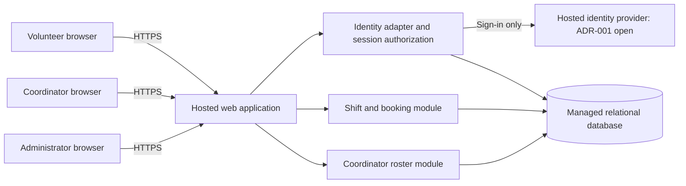

# ARCH-001 — Volunteer shift sign-up

## Scope and status

Architecture for the approved [PRD-001 v1](../prd/PRD-001.md), covering all three functional and all three non-functional requirements. This is a planning baseline, not evidence of implementation or stakeholder approval. The source hash is SHA-256 of the complete PRD file. No source code, repository instructions, architecture templates, test commands, or quality gates are present in the supplied workspace. BRN-001 is referenced by the PRD but is unavailable; no additional requirements are inferred from it.

**Epic readiness:** FR-002, FR-003, NFR-001, NFR-002, and NFR-003 have sufficient architecture to decompose into epics. FR-001 is blocked by the identity-provider decision in [ADR-001](../adr/ADR-001.md). Booking and roster epics can be planned against the contracts below, but their integrated delivery depends on sign-in. No pilot release is ready until all applicable must requirements pass verification. FR-003 remains a should requirement; its priority is not changed here.

Work plan: define boundaries and data flows; record consequential decisions and unresolved assumptions; map each requirement to epic scope, dependencies, and verification. This document and the linked ADRs provide that baseline. No epics are created, and the PRD's generated epic map remains untouched.

## Components and deployment

Use one hosted modular web application and one managed relational database. The browser receives mobile-first pages and calls same-origin endpoints. Modules share one deployment and database transaction boundary. About 120 volunteers and three daily shifts do not justify independent services, queues, or a separate reporting store.

The public network ends at the application's HTTPS boundary. Only the server accesses the database and identity-provider credentials. Browser-supplied roles and volunteer IDs never grant authority. Identity-provider authentication produces a mapped local principal; application authorization remains local. See [ADR-002](../adr/ADR-002.md) for sessions and privacy, and [ADR-003](../adr/ADR-003.md) for hosting and transactional booking.

Host the application, database, identity service, secrets, backups, and operational monitoring off-site. Use separate pilot/test environments with synthetic test data, HTTPS, managed secrets, restricted database access, encrypted storage/backups, and a restore procedure. Hosting vendor, region, runtime, and framework are implementation selections; they must preserve these boundaries. No service purchases or deployments are authorized by this document.

## Data ownership

| Entity | Minimum fields and invariants | Owning module |
|---|---|---|
| Principal | Local ID, provider issuer and subject (unique pair), active flag, local roles, session generation | Identity/session |
| Volunteer | ID, principal ID (unique), display name | Identity/profile |
| VolunteerContact | Volunteer ID (unique), nullable phone number; separated from ordinary profile projections | Coordinator contact access |
| Session | Hash of opaque session secret, principal ID, generation at issue, issued/expiry timestamps | Identity/session |
| Shift | ID, start/end instants, positive capacity, open/closed status | Shift/booking |
| Booking | ID, shift ID, volunteer ID, created timestamp; unique (shift ID, volunteer ID), foreign keys | Shift/booking |
| SecurityEvent | Event type, actor/target opaque IDs, timestamp, outcome; no contact details or secrets | Identity/session |

Database records are authoritative for availability, bookings, roles, and session revocation. Store instants in UTC and configure the food bank's IANA timezone for daily roster boundaries; the user's workstation timezone is not evidence of the food bank's timezone. Phone numbers do not enter authentication claims, generic profile payloads, logs, analytics, or URLs.

## Contracts and critical flows

These are architectural contracts; exact route naming can be refined in stories without changing authorization or invariants.

| Interface | Authorization | Result and failure behavior |
|---|---|---|
| Start sign-in / identity callback | Validated identity flow; callback bound to initiating browser | Map verified identity to provisioned local principal, issue application session; unknown or inactive principal denied |
| `GET /shifts` | Active volunteer session | Open future shifts, capacity remaining, own booking state; no other volunteers' contact data |
| `POST /shifts/{id}/bookings` | Active volunteer session; volunteer derived from principal | Create own booking atomically; duplicate retry returns existing booking; unavailable shift returns conflict |
| `GET /roster?date=YYYY-MM-DD` | Coordinator role | All shifts for the local day, including empty shifts, with booked volunteers and optional phones |
| `POST /admin/volunteers/{id}/revoke-sessions` | Administrator role | Increment principal session generation in an atomic transaction; acknowledge only after commit |

Every protected endpoint checks the session against the authoritative database and current local roles. Invalid/revoked sessions yield an unauthenticated response; valid sessions lacking permission yield a forbidden response. A session-store outage denies protected access and reports temporary unavailability. State-changing requests require CSRF protection. Rate-limit authentication and mutation endpoints. Never return a success response for a failed or uncertain commit.

**Sign-in (FR-001):** isolate provider-specific work behind an adapter returning verified issuer and subject. Do not use a display name, phone number, or an unverified email as an identity key. Provisioned local principals and roles are authoritative. Candidate protocol and selection gates are in ADR-001; credentials, enrollment, and recovery remain blocked until that decision closes.

**Book a shift (FR-002):** within a single transaction, lock the shift record, return any existing booking for that volunteer, check it is open and starts in the future, count committed bookings, and insert only if capacity remains. All booking writers must take the same shift lock; the uniqueness constraint also prevents duplicate bookings. Commit before returning confirmation. On a lost response, a retry returns the existing booking even if the shift has since filled or closed. Concurrent attempts for the last place must yield exactly one new booking. Roll back on failure. Display authoritative availability after a conflict.

**Daily roster (FR-003):** query the same committed booking data, grouping by shifts starting within the selected local day's UTC boundaries. Calculate consecutive local midnights correctly across daylight-saving transitions. Show names and optional phones only after coordinator authorization. As a planning default, fetch on page load, manual refresh, and every 30 seconds while visible; show last successful refresh time and stale/error state. The PRD supplies no numeric freshness target; this polling interval is a design assumption, not a new acceptance criterion.

**Revoke sessions (NFR-001):** increment the volunteer principal's generation; any session with an older generation is invalid. Read the primary session/role state on every protected request, without a positive authorization cache or stale read replica. All application instances enforce this. A provider token alone cannot call application endpoints or restore a revoked application session. Session issuance and revocation serialize on the same principal record. Existing requests have a proposed maximum duration of 30 seconds, and no authenticated long-lived stream is introduced. New requests after revocation commit fail immediately, which is stronger than the required five-minute bound. Account suspension is distinct from session revocation; a subsequent explicit sign-in may create a new session. Do not interpret revocation as permanent account disablement.

**Contact privacy (NFR-002):** use an explicit coordinator-only contact query and response projection. Volunteer, anonymous, and administrator-only principals receive no phone numbers, including their own, consistent with the PRD's literal rule. A coordinator may also hold the administrator role, but administrator does not imply coordinator. Do not include hidden contact fields in HTML or client state. Protected responses use `Cache-Control: no-store`; omit phone data from logs, traces, errors, and analytics. Service credentials are privileged processing identities, never browser credentials; operational database access is restricted and audited.

## Assumptions, gaps, and decision boundaries

| ID | Planning treatment | Consequence / closure |
|---|---|---|
| GAP-01 | Identity provider and usable volunteer credential/enrollment method are unknown | Blocks FR-001 epic readiness; ADR-001 records options and evidence required. Product owner coordinates selection; implementer validates integration. No invented existing accounts, email coverage, or vendor contract. |
| ASM-A1 | An open shift means explicitly open, future, and below configured capacity; one booking per volunteer per shift | Adopted pilot planning default for FR-002. Overlap rules, cancellation, waitlists, and recurring-shift automation are not added to scope. Record changes before implementing different business rules. |
| ASM-A2 | Authorized operator provisions volunteers, role grants, shift times/capacities, and optional contacts through a controlled import or operational procedure | Epic stories must specify validation and accountable operator. No shift-management or contact-editing UI is inferred. Seed data and the real food bank timezone are pilot setup gates, not architectural blockers. |
| ASM-A3 | Coordinator and administrator are separate permissions; one person may receive both | Administrator is required by NFR-001 although omitted from the PRD personas. No automatic elevation of the coordinator. Record initial role assignment before pilot. |
| ASM-A4 | Polling is adequate for the coordinator's live roster | FR-003 epic can proceed with explicit freshness assumption above; a stricter freshness requirement may change delivery design. |
| ASM-01 | PRD smartphone-access assumption remains open | Product owner validates via the meeting evidence specified in the PRD. Mobile browser checks support usability, but do not prove volunteer device access. |
| OPS-01 | No hosting budget, region, retention period, availability target, or recovery target is specified | Capture operational choices in hosting stories before provisioning real volunteer data. Do not claim unprovided SLAs or compliance requirements. |

Payroll and donations remain excluded. Notifications, volunteer self-editing, exports, and automated outcome analytics are not required for this pilot. SM-01 remains measured through the coordinator's shift log: 83% baseline to 95% fully staffed by pilot end. A booking count alone is not evidence of actual staffing.

## Requirement coverage and epic readiness

READY means sufficient decisions and stable boundaries exist to write epics and acceptance criteria. BLOCKED means a material architectural choice prevents completing that requirement's epic definition. A delivery dependency on another epic does not itself prevent decomposition. All readiness judgments are scoped to PRD-001 v1; reopen them if assumptions or source requirements change.

| Requirement | Architectural realization | Decision coverage | Epic readiness | Delivery dependencies / evidence to require |
|---|---|---|---|---|
| FR-001 | Hosted identity adapter and provisioned local principal | ADR-001 open; ADR-002; ADR-003 | **BLOCKED** | Choose provider, enrollment, and recovery; then V-01 plus V-04/V-06 |
| FR-002 | Authorized, atomic capacity-limited booking | ADR-002; ADR-003 | **READY** | Sign-in integration FR-001; NFR-001, NFR-002, NFR-003; V-02 |
| FR-003 | Coordinator-only daily roster from committed bookings | ADR-002; ADR-003 | **READY** | Staff sign-in via identity adapter, booking data, NFR-001, NFR-002, NFR-003; V-03/V-05 |
| NFR-001 | Administrator revokes all local sessions; primary-store check per request | ADR-002; ADR-003 | **READY** | Local design independent of provider; integrated V-04 still depends on ADR-001 |
| NFR-002 | Role enforcement and coordinator-only contact projection | ADR-002; ADR-003 | **READY** | Applies to identity/profile, shifts, bookings, roster, admin, and observability; V-05 |
| NFR-003 | Hosted application, identity, database, and operations | ADR-003; constrains ADR-001 | **READY** | **Whole-product constraint:** applies to FR-001, FR-002, FR-003 and both other NFRs; V-06 |

NFR-001 is not silently deferred with the identity-provider choice: application-owned sessions make revocation design independent of provider token lifetimes. NFR-002 also constrains sign-in and generic profile responses even though phones are primarily exposed through the roster. NFR-003 must be carried into every epic, not only a hosting epic.

Suggested decomposition, without assigning epic IDs or editing the generated epic map:

| Epic scope | Readiness and requirements | Sequencing |
|---|---|---|
| Hosted foundation | READY: NFR-003 across all requirements | Establish environments, data store, secrets, backups, monitoring, deployment/restore procedure |
| Application sessions and permissions | READY: NFR-001, NFR-002 | Can verify with test principals; integrated authentication follows identity selection |
| Volunteer sign-in | BLOCKED: FR-001, constrained by all NFRs | Close ADR-001; include coordinator/admin authentication needed by downstream flows |
| Open shifts and booking | READY: FR-002, all NFRs | Use principal/session contract; deliver after hosted foundation and authentication integration |
| Daily coordinator roster | READY: FR-003, all NFRs | Use authorized roster contract and booking records; maintain should priority |

## Verification plan and current evidence

No executable behavior was changed. There is no application or test harness, so a meaningful failing behavior test cannot yet be established. The scenarios below are future epic acceptance evidence, not test results. Implementation must begin with failing tests for the relevant behavior and use the selected repository's eventual required gates.

| Evidence ID | Requirement | Acceptance evidence to collect | Current outcome |
|---|---|---|---|
| V-01 | FR-001 | Valid enrolled volunteer signs in on a mobile browser; invalid/cancelled/replayed callbacks and unknown identities fail; chosen enrollment/recovery path works | BLOCKED: ADR-001 open; no implementation |
| V-02 | FR-002 | Signed-in volunteer books open shift; anonymous/revoked requests denied; last-place race allows one booking; repeated request returns one booking; full/closed/past shifts reject new booking; failed transaction leaves capacity unchanged | NOT_RUN: no implementation |
| V-03 | FR-003 | Coordinator sees correct day, all shifts including empty ones, and committed bookings; day-boundary/DST cases; refresh and stale/error display; volunteer/admin-only access denied | NOT_RUN: no implementation |
| V-04 | NFR-001 | Create multiple sessions on multiple devices/instances; admin revokes; every old session fails at once after commit and at 300 seconds; unauthorized revocation denied; store outage fails closed; session issuance race cannot revive old session; provider token cannot bypass checks | NOT_RUN: no implementation |
| V-05 | NFR-002 | Seed recognizable phone; inspect API, HTML, client state, errors, logs, traces, and caches across anonymous/volunteer/admin/coordinator roles; only coordinator responses contain phone; arbitrary-ID and role-tampering attempts fail | NOT_RUN: no implementation |
| V-06 | NFR-003 | Inspect deployment manifest and service inventory for all components; run hosted sign-in, booking, roster and revocation from ordinary browsers with no on-site server; prove backup restore | NOT_RUN: no deployment |
| V-07 | SM-01 / ASM-01 | Coordinator shift-log comparison and smartphone-access validation recorded by product owner | NOT_RUN: operational evidence unavailable |

Document-level verification of this exact working-tree baseline is recorded in [ARCH-001 verification](ARCH-001-verification.md). Documentation coverage can pass while runtime requirements remain untested. Roll out Tuesday/Thursday shifts first, as specified, then all shifts after pilot review; validate authorization, revocation, booking races, and restore before pilot use with real data.

## Change log

| Date | Version | Change |
|---|---|---|
| 2026-09-28 | 1 | Defined planning architecture, requirement coverage, scoped identity blocker, and verification plan against approved PRD-001 v1 |
