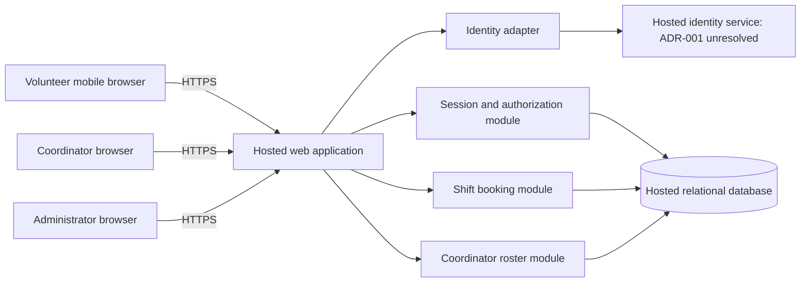

# PRD-001 architecture and epic readiness

## 1. Scope and decision basis

This working design covers all three functional requirements and all three non-functional requirements in [PRD-001 v1](../prd/PRD-001.md). It supports approximately 120 volunteers, one coordinator, mobile browsers, and the Tuesday/Thursday pilot before expansion to every shift. Payroll and donations remain outside scope.

The workspace contains no application code, repository instructions, architecture template, test commands, or additional specifications. BRN-001 is referenced by the approved PRD but is unavailable; this design relies on the PRD without claiming to validate its upstream research. The PRD and its generated epic map are unchanged. No epics are created by this document.

Plan: define system boundaries and shared controls; map each requirement to components, decisions, and verification; check coverage and record unresolved dependencies. Document verification is recorded in [ARC-001 verification](ARC-001-verification.md).

## 2. System design

Use a single hosted web application with server-side modules and a hosted relational database. A separate identity adapter connects to a managed identity service once [ADR-001](../adr/ADR-001.md) is resolved. This is a proposed architecture, not a claim that hosting or identity services have been provisioned or approved.



The browser is untrusted. Every protected server operation checks the application session and current roles. The database accepts connections only from authorized hosted services and restricted operational access; browsers never receive database credentials or identity-provider tokens. Keep application modules in one deployable unit: the pilot does not establish a need for microservices, a queue, or a separate reporting database.

| Component | Responsibility | Requirements |
|---|---|---|
| Mobile web UI | Sign-in entry, available shifts, booking result, coordinator daily roster | FR-001, FR-002, FR-003 |
| Identity adapter | Translate verified external identity into an internal volunteer ID; isolate provider details | FR-001, NFR-001 |
| Session and authorization module | Application sessions, role checks, administrator revocation | FR-001, FR-002, FR-003, NFR-001, NFR-002 |
| Shift booking module | List open shifts and commit a booking atomically | FR-002 |
| Coordinator roster module | Read committed daily bookings and coordinator-only contact projection | FR-003, NFR-002 |
| Hosted relational database | Volunteers, roles, sessions, shifts, bookings, isolated contact data | All six requirements |
| Hosted runtime and operations | TLS, secrets, deployment, backups, monitoring, restricted access | NFR-003, supporting NFR-001 and NFR-002 |

NFR-003 applies to the **entire product**, including identity, sessions, storage, runtime, and operational dependencies. It is not satisfied merely by hosting the booking page.

## 3. Data and interfaces

| Entity | Minimum fields and invariants |
|---|---|
| Volunteer | Internal ID, display name, identity issuer and subject with a unique pair; session generation counter |
| Role assignment | Principal ID and explicit role: volunteer, coordinator, or administrator; no automatic administrator-to-coordinator inheritance |
| Volunteer contact | Volunteer ID and optional phone number; stored separately from general volunteer projections |
| Application session | Hash of opaque session token, principal ID, generation at issuance, expiry, revocation timestamp |
| Shift | ID, start/end instants, positive capacity, open/closed state; one configured food-bank timezone for dates |
| Booking | ID, shift ID, volunteer ID, created timestamp; unique pair of shift and volunteer |
| Security audit event | Actor ID, target ID, action, timestamp and outcome; no phone numbers, cookies, tokens, or credentials |

Roles are application-controlled. Neither browser input nor arbitrary identity-provider claims can grant coordinator or administrator access. Phone numbers do not enter identity claims or the general volunteer entity.

Logical server contracts (route spelling and framework are implementation choices):

| Operation | Authorization and result |
|---|---|
| Start/complete sign-in | Provider-specific details blocked by ADR-001; on verified identity, issue an application session for an enrolled principal |
| List open shifts | Current volunteer session; return times and remaining places, without attendee contact data |
| Book a shift | Current volunteer session; derive volunteer ID from the session, never from a client-supplied owner; return committed booking or unavailable result |
| Read daily roster | Current coordinator session; date interpreted in configured food-bank timezone; return shifts and booked volunteer names, with a coordinator-only phone field |
| Revoke a volunteer's sessions | Current administrator session; invalidate all existing application sessions for that volunteer and audit the action |

Use secure, HttpOnly, same-site cookies over HTTPS for opaque application session tokens and CSRF protection on mutations. The identity adapter must validate the provider's authentication result and bind it to the initiating browser flow before issuing an application session. Provider-specific protocol, enrollment, recovery, and callback details belong to ADR-001 and the sign-in epic.

### Booking consistency

For a booking request, begin a transaction, authorize the current session, lock the shift record, and check for an existing booking by that volunteer. Return that existing booking on a retry. Otherwise check that the shift is open, has not started, and has remaining capacity before inserting and committing. All paths that alter bookings or capacity must use the same serialization boundary. The uniqueness constraint is a second defense against duplicates. A last-place race must produce exactly one new booking; a network retry after a successful commit must not consume another place.

Open-shift listings are advisory snapshots. The transaction decides availability, and the UI shows a confirmed booking only after commit. If storage is unavailable, report failure without claiming success. Cancellation, waitlists, recurring scheduling tools, and overlap restrictions are not introduced by this design.

### Daily roster

Query the authoritative booking store for shifts whose start falls within the selected local calendar day, converted to an interval of instants. Include shifts with no bookings. Avoid a replicated reporting store for the pilot. Proposed refresh behavior is an initial read, manual refresh, and a 30-second refresh while the page is visible; this is a design default, not a new PRD latency requirement. Display the last successful refresh time and an error when refresh fails so an old roster is not presented as current.

## 4. Shared security and hosting controls

### NFR-001: session revocation within five minutes

Maintain application sessions in the hosted database. On every protected request, read authoritative session validity, expiry, and the principal's current generation; do not cache successful authorization across requests. An administrator revocation transaction increments the volunteer's generation, making every previously issued session invalid. A successful response means the transaction committed, not merely that work was queued. Revocation and session issuance serialize on the same principal record; an authentication flow initiated before revocation cannot issue a session using the new generation without restarting authentication.

Every application instance uses the same authority. Recheck authorization before committing protected mutations or emitting sensitive responses after long-running work. If session validity cannot be established, deny access. Database failure during revocation is reported as failure and must never be acknowledged as successful revocation. This design targets rejection on the next request after a successful revocation, stronger than the PRD's five-minute maximum; the integration test must still measure the actual bound.

Existing identity-provider sessions or unexpired provider tokens cannot bypass application session checks. Revocation invalidates existing application sessions; the PRD does not require disabling the account or preventing a later fresh sign-in. ADR-001 must verify that provider integration preserves this distinction and cannot silently resurrect an old application session.

### NFR-002: phone numbers visible only to the coordinator

Apply the rule literally: a volunteer, including the owner of the phone number, and an administrator without the coordinator role receive no phone values through product interfaces. The coordinator role alone enables the contact projection. This is enforced server-side before serialization, rather than by hiding a UI column. Do not include phones in general profile responses, booking responses, identity claims, URLs, audit events, telemetry, or error messages. Do not add phone editing, downloads, or exports to the pilot.

Use private, no-store responses for authenticated pages and APIs; exclude them from shared/CDN caches and offline storage. Revalidate the coordinator role for each roster request and clear displayed sensitive data when a session fails. Infrastructure access is a separate unresolved operational boundary: maintain least privilege and restricted backups; see assumption A-05 if the requirement is intended to prohibit all operator-level access to stored plaintext.

### NFR-003: hosted services across the product

Run the application, relational database, identity service, secrets management, logs, and backups on hosted services. No on-site machine is a runtime dependency. Use separate pilot/test configuration, controlled database migrations, encrypted transport and storage, and restricted service credentials. Select hosting products later against these constraints; no particular vendor is needed to decompose booking or roster work.

Before the pilot, verify a backup restoration, monitoring of failed bookings and revocations without sensitive payloads, and a rollback procedure that retains committed bookings. Disable writes during incompatible migrations rather than allowing inconsistent capacity accounting. These are proposed operational acceptance checks, not invented PRD availability or recovery-time targets.

## 5. Decisions, assumptions, and unresolved items

The following defaults make epic decomposition concrete without silently changing the approved PRD. Epic authors must carry the assumptions and checks forward.

| ID | Decision or assumption | Effect and resolution |
|---|---|---|
| D-01 | Single hosted modular application and relational database | Working architecture for all requirements; transactional booking and one authorization boundary |
| D-02 | Application-controlled sessions and explicit roles | Working architecture for NFR-001/NFR-002, independent of provider-issued token expiry |
| D-03 | Identity provider, sign-in channel, enrollment and recovery unresolved | [ADR-001](../adr/ADR-001.md); blocks FR-001 epic readiness, and later end-to-end integration of all protected features |
| A-01 | An open shift is explicitly open, in the future, and below a configured capacity; one booking per volunteer per shift | Proposed interpretation of FR-002. Carry into booking epic acceptance criteria; product owner can revise before implementation |
| A-02 | Coordinator supplies initial shifts, capacities, names, and any phone data through a restricted operational import | No scheduling or contact-management UI is implied. Validate import data and protect phone inputs; exact pilot data is a rollout prerequisite |
| A-03 | Food-bank timezone is deployment configuration; daily membership is based on shift start | Actual timezone is unspecified; do not assume the workspace timezone. Confirm before pilot data import; include midnight/daylight-saving checks |
| A-04 | Coordinator and administrator are separate privileges; an authorized operator provisions initial role assignments | Administrator is required by NFR-001 even though absent from the PRD persona section. Confirm operator ownership before rollout; no public role self-assignment |
| A-05 | NFR-002 governs product-visible access and excludes raw infrastructure administration from its role model | If it also forbids plaintext access by service operators, field encryption with separately controlled decryption keys requires further design before storing real phones. Record this as a pilot data gate, not an exception to coordinator-only product access |
| A-06 | No email address, external account, or login method is assumed for volunteers | The smartphone assumption does not establish an identity channel; this is the material input missing for ADR-001 |

ASM-01 remains open in the PRD. Mobile-browser testing and confirmation of volunteer access to the chosen identity channel are pilot gates. SM-01 remains measured by the coordinator's shift log; do not add analytics infrastructure or claim that booked capacity proves actual attendance or achieves the 95% staffing target.

## 6. Requirement readiness and epic handoff

**Ready** means a requirement has sufficient architecture and testable contracts to begin epic decomposition using the recorded defaults. It does not mean implementation is verified, the design is formally approved, or the pilot can launch. **Blocked** means a material architecture decision is still needed to write the requirement's full epic. An integration dependency does not prevent decomposition of a provider-independent module.

| Requirement | Epic readiness | Architecture coverage | Dependencies and epic evidence to require |
|---|---|---|---|
| FR-001: volunteer sign-in | **BLOCKED** | Identity adapter, application session, ADR-001 | Resolve provider, available identity channel, enrollment/recovery and role bootstrap. Verify real sign-in, invalid identity rejection, callback handling, and revocation integration |
| FR-002: book an open shift | **READY** | Booking transaction, session contract, D-01, A-01/A-02 | Carry NFR-001, NFR-002 and NFR-003. Decompose using a test identity adapter; production integration depends on FR-001. Require last-place race, duplicate retry, unavailable shift, unauthorized request, and database failure checks |
| FR-003: daily coordinator roster | **READY** | Roster query, role contract, D-02, A-03 | Carry NFR-001, NFR-002 and NFR-003. Production integration depends on FR-001. Require correct local-day membership, empty shifts, committed bookings, role denial, contact filtering, and refresh-error behavior |
| NFR-001: revoke sessions in five minutes | **READY** | Authoritative application sessions, generation invalidation, D-02 | Cross-cutting acceptance criteria on every protected operation; provider-independent control can be decomposed now. Real-provider proof depends on ADR-001 and FR-001 |
| NFR-002: coordinator-only phones | **READY** | Separate contact projection, explicit roles, no sensitive caching/logging | Attach to sign-in/profile, booking, roster, and operational work. Require role/access-path matrix and leakage checks. A-05 must be resolved before loading real phones |
| NFR-003: entirely hosted product | **READY** | Runtime, identity, database, secrets, logs, backups | Attach to every epic; deployment evidence must include all runtime dependencies, with no on-site server. Exact provider provisioning is a delivery dependency |

Suggested epic boundaries, **not created epics**:

1. Hosted foundation and session/authorization controls: NFR-001, NFR-003 and the shared NFR-002 boundary; deliver contracts and test fixtures for dependent work.
2. Volunteer sign-in: FR-001 and its cross-cutting NFRs; hold full decomposition until ADR-001 is resolved.
3. Shift availability and booking: FR-002 with all three NFRs; include restricted initial shift import under A-02.
4. Coordinator daily roster: FR-003 with all three NFRs; include date handling and coordinator-only contact reads.

The FR-003 priority remains **should** and the other requirements retain their PRD priorities. Global NFRs are mandatory constraints even if represented as shared work; they cannot be omitted from feature epic acceptance criteria.

```yaml readiness
source: {id: PRD-001, version: 1}
requirements:
  - id: FR-001
    readiness: blocked
    blocked_by: [ADR-001]
    constraints: [NFR-001, NFR-002, NFR-003]
  - id: FR-002
    readiness: ready
    blocked_by: []
    integration_dependencies: [FR-001]
    constraints: [NFR-001, NFR-002, NFR-003]
  - id: FR-003
    readiness: ready
    blocked_by: []
    integration_dependencies: [FR-001]
    constraints: [NFR-001, NFR-002, NFR-003]
  - id: NFR-001
    readiness: ready
    applies_to: [FR-001, FR-002, FR-003]
    integration_dependencies: [ADR-001, FR-001]
  - id: NFR-002
    readiness: ready
    applies_to: [FR-001, FR-002, FR-003]
    rollout_dependencies: [A-05]
  - id: NFR-003
    readiness: ready
    scope: whole_product
    applies_to: [FR-001, FR-002, FR-003, NFR-001, NFR-002]
```

## 7. Required implementation verification

These are future epic acceptance checks, not test results. Establish meaningful failing tests before implementing each behavior, then run the resulting repository's test and quality gates.

| Check | Requirements | Required evidence |
|---|---|---|
| V-01 | FR-001 | Successful real-provider mobile sign-in; invalid, replayed, or mismatched authentication results rejected; correct enrolled-principal mapping |
| V-02 | FR-002 | Two volunteers race for one remaining place: exactly one new booking. Repeated request by the winner returns the same booking; closed, started, and full shifts reject new bookings; unauthenticated and forged-owner requests cannot book for another volunteer |
| V-03 | FR-003 | Selected day's shifts and booked names match committed data, including empty shifts and local-day boundaries; manual/poll refresh shows new bookings and reports refresh failure |
| V-04 | NFR-001, all FRs | Create multiple sessions on different app instances, successfully revoke, and measure rejection across every protected endpoint within 300 seconds. Include stale tokens, a pending sign-in callback, long-running work, provider session reuse, database failure, and unauthorized revocation attempts |
| V-05 | NFR-002, all FRs | Coordinator sees phone values; anonymous, volunteer (including self), and administrator-only callers cannot. Inspect response bodies, page source, errors, logs, identity claims, caches, and stale role/session paths |
| V-06 | NFR-003, whole product | Hosted inventory and deployment smoke flow cover sign-in, booking, roster and revocation; confirm no on-site runtime dependency; restore backup and exercise rollback without losing committed bookings |

## Change log

| Version | Date | Change |
|---|---|---|
| 1 | 2026-09-28 | Initial working architecture, six-requirement readiness map, identity ADR and planned verification; no PRD edits or approval claims |
