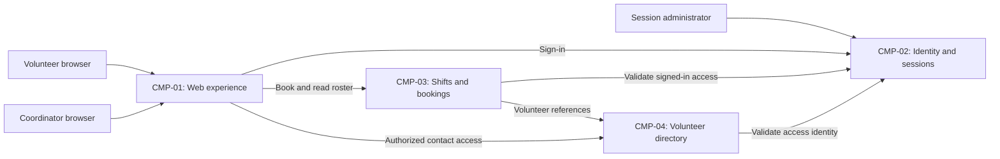

# ARCH-001 — Volunteer shift sign-up for the Riverside Food Bank architecture

## 1. Context and scope

This description examines PRD-001 version 1, status approved, owned by Priya Nair.
The system supports about 120 volunteers signing in and booking warehouse shifts from
mobile browsers, and a coordinator viewing the daily roster. Session administration
and protection of volunteer phone numbers are within scope. Payroll, donations, and
an installed mobile app are outside scope.

The request explicitly selected PRD-001 and instructed proceeding without questions.
No inspection scope was named, so no code or configuration was inspected. No existing
ARCH or ADR was found in the contract document locations. A new ARCH is therefore
proposed; the request did not confirm the create outcome, so outcome remains null.

No policy documents or local preference file were found. Framework defaults apply:
an interview limit of 8, no mandated platforms, and the quality floor for internal
operation. No questions were asked. All component assignments below are proposals;
no architectural decision has been accepted and no ADR is written.

## 2. Quality drivers

PRD-001#NFR-001 requires an administrator to revoke a volunteer's signed-in sessions
within five minutes. This governs both session creation in PRD-001#FR-001 and the
signed-in booking boundary in PRD-001#FR-002. ARCH-001#DEC-02 must establish how all
relevant session consumers enforce the deadline; selecting an identity provider alone
does not settle revocation.

PRD-001#NFR-002 limits phone-number visibility to the coordinator. Ownership of those
numbers and enforcement at data access boundaries remain open in ARCH-001#DEC-03
and ARCH-001#DEC-04. The proposal keeps contact data behind a protected directory
responsibility rather than treating presentation controls as sufficient enforcement.

PRD-001#NFR-003 applies to the whole product: it must run on hosted services because
there is no on-site server. ARCH-001#DEC-07 applies to every functional requirement
and quality requirement, including hosted identity, revocation, and contact-data
protection. Hosted operation is required; providers and deployment units remain open.

The operating context is internal, as recorded in the PRD, despite the release name
Pilot. Its required quality categories are constraint, security, and privacy, covered
respectively by PRD-001#NFR-003, PRD-001#NFR-001, and PRD-001#NFR-002. No required
category lacks an NFR. The summary's live-roster goal motivates ARCH-001#DEC-08;
this proposal invents no numeric freshness target or availability commitment.

## 3. Components

The diagram shows proposed logical responsibilities and interactions, not chosen
services or deployment units. ARCH-001#DEC-06 governs their boundaries. Data ownership,
authentication, privacy enforcement, and roster propagation remain subject to the
separate decisions below.



```yaml items
components:
  - id: CMP-01
    status: active
    name: "Web experience"
    responsibility: "Proposed mobile browser entry point for sign-in, booking, and coordinator roster views; owns no authoritative records and does not alone enforce access to phone numbers."
    owns_data: []
    interacts_with:
      - "CMP-02"
      - "CMP-03"
      - "CMP-04"
    deployment: "Open: see DEC-07"
    upstream:
      - {id: PRD-001, item: NFR-001, relation: informed_by, version: 1, hash: null}
      - {id: PRD-001, item: NFR-002, relation: informed_by, version: 1, hash: null}
      - {id: PRD-001, item: NFR-003, relation: informed_by, version: 1, hash: null}
  - id: CMP-02
    status: active
    name: "Identity and sessions"
    responsibility: "Proposed authentication and session-lifecycle responsibility, including administrator revocation; does not own shift bookings or volunteer phone numbers. Provider and enforcement mechanism remain open."
    owns_data:
      - "Proposed: authentication identities and session validity or revocation state"
    interacts_with:
      - "CMP-01"
      - "CMP-03"
      - "CMP-04"
    deployment: "Open: see DEC-07"
    upstream:
      - {id: PRD-001, item: NFR-001, relation: informed_by, version: 1, hash: null}
      - {id: PRD-001, item: NFR-003, relation: informed_by, version: 1, hash: null}
  - id: CMP-03
    status: active
    name: "Shifts and bookings"
    responsibility: "Proposed authority for open shifts, booking changes, and daily roster queries; references volunteer identities and does not own credentials or contact records."
    owns_data:
      - "Proposed: warehouse shifts and availability"
      - "Proposed: volunteer bookings from which daily rosters are derived"
    interacts_with:
      - "CMP-01"
      - "CMP-02"
      - "CMP-04"
    deployment: "Open: see DEC-07"
    upstream:
      - {id: PRD-001, item: NFR-001, relation: informed_by, version: 1, hash: null}
      - {id: PRD-001, item: NFR-002, relation: informed_by, version: 1, hash: null}
      - {id: PRD-001, item: NFR-003, relation: informed_by, version: 1, hash: null}
  - id: CMP-04
    status: active
    name: "Volunteer directory"
    responsibility: "Proposed owner of volunteer contact records and coordinator-only contact access; does not authenticate volunteers or own bookings. Role authority and enforcement remain open."
    owns_data:
      - "Proposed: volunteer contact profiles, including phone numbers"
    interacts_with:
      - "CMP-01"
      - "CMP-02"
      - "CMP-03"
    deployment: "Open: see DEC-07"
    upstream:
      - {id: PRD-001, item: NFR-002, relation: informed_by, version: 1, hash: null}
      - {id: PRD-001, item: NFR-003, relation: informed_by, version: 1, hash: null}
```

## 4. Architectural questions

Each question is blocking and open because no mandated platform or explicit decision
settles it. References express dependencies, not acceptance. Implementation details
such as endpoint fields, table columns, and page layouts remain for later specs.

```yaml items
decisions:
  - id: DEC-01
    status: active
    question: "Which identity provider handles volunteer sign-in?"
    blocking: true
    state: open
    resolved_by: []
    notes: "Carries the PRD's explicit NEEDS ADR marker. Booking consumes the resulting authenticated identity. No platform is mandated; provider selection does not resolve session revocation."
    upstream:
      - {id: PRD-001, item: FR-001, relation: informed_by, version: 1, hash: null}
      - {id: PRD-001, item: FR-002, relation: informed_by, version: 1, hash: null}
  - id: DEC-02
    status: active
    question: "How will administrator revocation make every volunteer session stop working within five minutes across session consumers?"
    blocking: true
    state: open
    resolved_by: []
    notes: "Sign-in creates sessions and booking accepts them. The shared validity mechanism and its propagation bound must be decided independently of provider selection; no mechanism is accepted."
    upstream:
      - {id: PRD-001, item: FR-001, relation: informed_by, version: 1, hash: null}
      - {id: PRD-001, item: FR-002, relation: informed_by, version: 1, hash: null}
      - {id: PRD-001, item: NFR-001, relation: informed_by, version: 1, hash: null}
  - id: DEC-03
    status: active
    question: "Which component is the authoritative owner of volunteer contact records?"
    blocking: true
    state: open
    resolved_by: []
    notes: "CMP-04 is a proposed contact owner. The coordinator-facing roster must use an agreed volunteer reference and authorized contact boundary; copying phone numbers into roster data is not an accepted design."
    upstream:
      - {id: PRD-001, item: FR-003, relation: informed_by, version: 1, hash: null}
      - {id: PRD-001, item: NFR-002, relation: informed_by, version: 1, hash: null}
  - id: DEC-04
    status: active
    question: "How will data access enforce that only the coordinator can view volunteer phone numbers?"
    blocking: true
    state: open
    resolved_by: []
    notes: "The coordinator authorization authority and enforcement boundary must be shared by directory and roster consumers. A hidden browser field alone does not establish the required restriction."
    upstream:
      - {id: PRD-001, item: FR-003, relation: informed_by, version: 1, hash: null}
      - {id: PRD-001, item: NFR-002, relation: informed_by, version: 1, hash: null}
  - id: DEC-05
    status: active
    question: "Which component owns the authoritative shift availability and booking state?"
    blocking: true
    state: open
    resolved_by: []
    notes: "CMP-03 is the proposed authority shared by booking and daily rosters. Epics need a common write owner and availability consistency boundary; storage technology and detailed booking rules are not selected here."
    upstream:
      - {id: PRD-001, item: FR-002, relation: informed_by, version: 1, hash: null}
      - {id: PRD-001, item: FR-003, relation: informed_by, version: 1, hash: null}
  - id: DEC-06
    status: active
    question: "What component boundaries separate the web experience, identity and sessions, bookings, and volunteer directory?"
    blocking: true
    state: open
    resolved_by: []
    notes: "CMP-01 through CMP-04 describe proposed responsibilities only. Their separation into modules or services, and the resulting trust boundaries, have not been accepted. All features and quality responsibilities cross or rely on these boundaries."
    upstream:
      - {id: PRD-001, item: FR-001, relation: informed_by, version: 1, hash: null}
      - {id: PRD-001, item: FR-002, relation: informed_by, version: 1, hash: null}
      - {id: PRD-001, item: FR-003, relation: informed_by, version: 1, hash: null}
      - {id: PRD-001, item: NFR-001, relation: informed_by, version: 1, hash: null}
      - {id: PRD-001, item: NFR-002, relation: informed_by, version: 1, hash: null}
      - {id: PRD-001, item: NFR-003, relation: informed_by, version: 1, hash: null}
  - id: DEC-07
    status: active
    question: "What hosted deployment topology will run the whole product?"
    blocking: true
    state: open
    resolved_by: []
    notes: "The no-on-site-server constraint is given. Hosted providers, deployment units, persistence placement, and environment arrangement remain undecided. Hosting governs sign-in, booking, roster access, revocation, and private contact handling."
    upstream:
      - {id: PRD-001, item: FR-001, relation: informed_by, version: 1, hash: null}
      - {id: PRD-001, item: FR-002, relation: informed_by, version: 1, hash: null}
      - {id: PRD-001, item: FR-003, relation: informed_by, version: 1, hash: null}
      - {id: PRD-001, item: NFR-001, relation: informed_by, version: 1, hash: null}
      - {id: PRD-001, item: NFR-002, relation: informed_by, version: 1, hash: null}
      - {id: PRD-001, item: NFR-003, relation: informed_by, version: 1, hash: null}
  - id: DEC-08
    status: active
    question: "How will booking changes become visible in the coordinator's daily roster?"
    blocking: true
    state: open
    resolved_by: []
    notes: "Booking and roster epics must share a read and update interaction model. Reading authoritative booking state and maintaining a separate projection imply different consistency obligations; neither is accepted. No numeric freshness target is assumed."
    upstream:
      - {id: PRD-001, item: FR-002, relation: informed_by, version: 1, hash: null}
      - {id: PRD-001, item: FR-003, relation: informed_by, version: 1, hash: null}
```

## 5. Evidence inspected

Only the PRD supplied project evidence for architectural analysis. Contract-path checks
found no policy, local preferences, ARCH, or ADR to apply. There are no observed-practice
findings because no code was inspected.

```yaml items
evidence:
  - id: EVD-01
    status: active
    source: "PRD-001"
    kind: prd
    finding: "Version 1, status approved: volunteer sign-in, signed-in shift booking, and coordinator daily rosters; five-minute session revocation, coordinator-only phone visibility, and hosted operation for the whole product. Operating context is internal. The identity provider is explicitly marked NEEDS ADR."
    classification: context
```

## 6. Deployment

PRD-001#NFR-003 requires hosted services for the entire product. Browser access follows
the PRD's mobile-first web experience. ARCH-001#DEC-07 leaves hosting providers,
deployment units, persistence placement, and environments open. The component diagram
does not imply four separately deployed services. ARCH-001#DEC-06 must settle logical
boundaries before epics can depend on them.

The PRD starts with Tuesday and Thursday shifts before extending to all shifts. That
rollout sequence does not choose a hosting topology or change the internal operating
context. No on-site infrastructure is proposed.

## 7. Requirement changes proposed to the PRD owner

- None.

## 8. Open questions

- [NEEDS CLARIFICATION: No inspection scope was named and no code or configuration was inspected; existing capabilities and their suitability for reuse are unknown.]
- [NEEDS CLARIFICATION: The create outcome has not been explicitly confirmed; outcome remains null under the instruction to proceed without questions.]
- [NEEDS CLARIFICATION: host model/session identity unavailable]

## Change Log

| Version | Date | Author | Change | Items affected |
|---|---|---|---|---|
| 1 | 2026-09-28 | codex (session unknown) | Initial draft for PRD-001 v1; proposed components and eight open decisions, with incomplete host provenance. Policy resolution: interview.max_calls=8 (default); architecture.mandated_platforms=none (default); quality.required_categories=floor only (default) | all |
