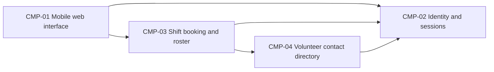

# ARCH-001 — Volunteer shift sign-up for the Riverside Food Bank architecture

## 1. Context and scope

This draft describes the shared architecture questions for PRD-001 version 1, status approved,
owned by Priya Nair. About 120 volunteers use mobile web pages to sign in and book warehouse
shifts; a coordinator reads the daily roster. Session administration and contact-data protection
support these capabilities. Payroll, donations and installed mobile apps are outside scope.

No inspection scope was named and no code or configuration was inspected. No existing ARCH,
ADR, policy document or local preference file was found at the contract paths. Framework defaults
apply. The proposed outcome is create because no ARCH covers this system; the outcome remains
unconfirmed. The instruction to proceed without questions authorizes documenting the proposed
shape, but supplies no architectural decisions. No ADR is written.

## 2. Quality drivers

PRD-001#NFR-001 requires an administrator to revoke volunteer sessions with enforcement within
five minutes. Provider selection and revocation enforcement are separate questions: selecting a
provider does not establish the lifetime or invalidation behavior of application sessions.

PRD-001#NFR-002 restricts volunteer phone numbers to the coordinator. Contact ownership and
authorization must be shared across booking and roster work; filtering only the displayed page
would not establish this restriction on data returned to a volunteer.

PRD-001#NFR-003 requires hosted services for the whole product because there is no on-site server.
It constrains every capability without selecting a provider or deployment topology.

The operating context is internal, as stated in the PRD; the release name Pilot does not change
that context. The required quality categories are constraint, security and privacy. All three
are covered by PRD-001#NFR-003, PRD-001#NFR-001 and PRD-001#NFR-002 respectively. No additional
quality categories are mandated. PRD-001#FR-003 calls for the daily booked roster, while the
summary describes it as live; the interaction design must establish a common source of booking
truth without inventing a quantitative freshness target.

## 3. Components

These are proposed logical responsibilities, not accepted service or deployment boundaries.
Data ownership below is also proposed. ARCH-001#DEC-04 and ARCH-001#DEC-05 retain those choices.
The arrows show required collaborations; their implementation is not decided.



```yaml items
components:
  - id: CMP-01
    status: active
    name: "Mobile web interface"
    responsibility: "Presents volunteer sign-in and booking, coordinator roster and session-administration interactions; does not own durable records or make authoritative access decisions."
    owns_data: []
    interacts_with:
      - "CMP-02"
      - "CMP-03"
    deployment: "Open: see DEC-07"
    upstream:
      - {id: PRD-001, item: NFR-001, relation: informed_by, version: 1, hash: null}
      - {id: PRD-001, item: NFR-002, relation: informed_by, version: 1, hash: null}
      - {id: PRD-001, item: NFR-003, relation: informed_by, version: 1, hash: null}
  - id: CMP-02
    status: active
    name: "Identity and sessions"
    responsibility: "Proposed responsibility for authentication, session validity and administrator revocation; does not own warehouse bookings or volunteer phone numbers. Provider and enforcement remain open."
    owns_data:
      - "Proposed: account identities and session revocation state"
    interacts_with:
      - "CMP-01"
      - "CMP-03"
      - "CMP-04"
    deployment: "Open: see DEC-07"
    upstream:
      - {id: PRD-001, item: NFR-001, relation: informed_by, version: 1, hash: null}
      - {id: PRD-001, item: NFR-003, relation: informed_by, version: 1, hash: null}
  - id: CMP-03
    status: active
    name: "Shift booking and roster"
    responsibility: "Proposed shared responsibility for open shifts, booking acceptance and the coordinator roster; checks caller authority and uses the contact directory without owning credentials."
    owns_data:
      - "Proposed: warehouse shifts and bookings associated with volunteer identities"
    interacts_with:
      - "CMP-01"
      - "CMP-02"
      - "CMP-04"
    deployment: "Open: see DEC-07"
    upstream:
      - {id: PRD-001, item: NFR-001, relation: informed_by, version: 1, hash: null}
      - {id: PRD-001, item: NFR-002, relation: informed_by, version: 1, hash: null}
      - {id: PRD-001, item: NFR-003, relation: informed_by, version: 1, hash: null}
  - id: CMP-04
    status: active
    name: "Volunteer contact directory"
    responsibility: "Proposed owner of volunteer contact records with coordinator-only phone-number access; does not authenticate callers or accept shift bookings."
    owns_data:
      - "Proposed: volunteer contact records and their association with account identities"
    interacts_with:
      - "CMP-02"
      - "CMP-03"
    deployment: "Open: see DEC-07"
    upstream:
      - {id: PRD-001, item: NFR-002, relation: informed_by, version: 1, hash: null}
      - {id: PRD-001, item: NFR-003, relation: informed_by, version: 1, hash: null}
```

## 4. Architectural questions

```yaml items
decisions:
  - id: DEC-01
    status: active
    question: "Which identity provider handles volunteer sign-in?"
    blocking: true
    state: open
    resolved_by: []
    notes: "Records the PRD NEEDS ADR marker. Sign-in, authenticated booking and session administration depend on the provider contract. No mandated provider or explicit decision exists; revocation enforcement is separately tracked in ARCH-001#DEC-02."
    upstream:
      - {id: PRD-001, item: FR-001, relation: informed_by, version: 1, hash: null}
      - {id: PRD-001, item: FR-002, relation: informed_by, version: 1, hash: null}
      - {id: PRD-001, item: NFR-001, relation: informed_by, version: 1, hash: null}
  - id: DEC-02
    status: active
    question: "How will administrator revocation stop all of a volunteer's signed-in sessions from working within five minutes?"
    blocking: true
    state: open
    resolved_by: []
    notes: "Sign-in creates sessions and booking consumes them. A shared validation mechanism must bound stale authorization after revocation; provider choice alone does not decide application-session invalidation. No mechanism has been accepted."
    upstream:
      - {id: PRD-001, item: FR-001, relation: informed_by, version: 1, hash: null}
      - {id: PRD-001, item: FR-002, relation: informed_by, version: 1, hash: null}
      - {id: PRD-001, item: NFR-001, relation: informed_by, version: 1, hash: null}
  - id: DEC-03
    status: active
    question: "Where will coordinator authorization for volunteer phone-number access be enforced?"
    blocking: true
    state: open
    resolved_by: []
    notes: "The roster and contact-data capability need one authoritative role and access-check contract. Browser display rules alone cannot enforce privacy. The enforcement boundary is undecided."
    upstream:
      - {id: PRD-001, item: FR-003, relation: informed_by, version: 1, hash: null}
      - {id: PRD-001, item: NFR-002, relation: informed_by, version: 1, hash: null}
  - id: DEC-04
    status: active
    question: "How will authoritative ownership of volunteer contact, shift and booking records be allocated between components?"
    blocking: true
    state: open
    resolved_by: []
    notes: "Proposed ownership in the component block is not accepted. Booking and roster must agree on the authoritative booking records and volunteer references, while phone data must retain the coordinator-only restriction. Table fields and migrations belong to later specs."
    upstream:
      - {id: PRD-001, item: FR-002, relation: informed_by, version: 1, hash: null}
      - {id: PRD-001, item: FR-003, relation: informed_by, version: 1, hash: null}
      - {id: PRD-001, item: NFR-002, relation: informed_by, version: 1, hash: null}
  - id: DEC-05
    status: active
    question: "What component boundaries will separate presentation, identity and sessions, shift operations and contact-data access?"
    blocking: true
    state: open
    resolved_by: []
    notes: "The diagram proposes logical responsibilities only. Modules within one application and independently deployed services create different shared contracts and operational costs. No boundary choice has been accepted. Deployment is separately tracked in ARCH-001#DEC-07."
    upstream:
      - {id: PRD-001, item: FR-001, relation: informed_by, version: 1, hash: null}
      - {id: PRD-001, item: FR-002, relation: informed_by, version: 1, hash: null}
      - {id: PRD-001, item: FR-003, relation: informed_by, version: 1, hash: null}
      - {id: PRD-001, item: NFR-001, relation: informed_by, version: 1, hash: null}
      - {id: PRD-001, item: NFR-002, relation: informed_by, version: 1, hash: null}
  - id: DEC-06
    status: active
    question: "How will accepted bookings become visible in the coordinator roster?"
    blocking: true
    state: open
    resolved_by: []
    notes: "A roster reading authoritative bookings and a separately updated roster projection have different consistency and failure behavior. Independent booking and roster epics must share this interaction contract; no approach or numerical freshness target has been accepted."
    upstream:
      - {id: PRD-001, item: FR-002, relation: informed_by, version: 1, hash: null}
      - {id: PRD-001, item: FR-003, relation: informed_by, version: 1, hash: null}
  - id: DEC-07
    status: active
    question: "What hosted deployment topology will run the whole product?"
    blocking: true
    state: open
    resolved_by: []
    notes: "The whole-product hosting constraint governs every functional and quality requirement. Hosted application units, identity and data services, and environment placement remain undecided; no on-site server is permitted."
    upstream:
      - {id: PRD-001, item: FR-001, relation: informed_by, version: 1, hash: null}
      - {id: PRD-001, item: FR-002, relation: informed_by, version: 1, hash: null}
      - {id: PRD-001, item: FR-003, relation: informed_by, version: 1, hash: null}
      - {id: PRD-001, item: NFR-001, relation: informed_by, version: 1, hash: null}
      - {id: PRD-001, item: NFR-002, relation: informed_by, version: 1, hash: null}
      - {id: PRD-001, item: NFR-003, relation: informed_by, version: 1, hash: null}
```

## 5. Evidence inspected

```yaml items
evidence:
  - id: EVD-01
    status: active
    source: "PRD-001"
    kind: prd
    finding: "Version 1, status approved: mobile web sign-in, signed-in shift booking and coordinator roster; five-minute session revocation, coordinator-only phone access and hosted services for the whole product. The identity provider is explicitly marked NEEDS ADR. Operating context is internal."
    classification: context
```

## 6. Deployment

All product execution and durable storage must use hosted services under PRD-001#NFR-003.
ARCH-001#DEC-07 leaves the hosting provider, application units, supporting services and environment
placement open. The logical components above do not imply four separate services. The PRD's
Tuesday/Thursday pilot describes rollout scope, not an accepted deployment environment design.
No hosting configuration or operational capability has been verified.

## 7. Requirement changes proposed to the PRD owner

- None.

## 8. Open questions

- [NEEDS CLARIFICATION: No inspection scope was named and no code was inspected; existing implementation capabilities and opportunities for reuse are unknown.]
- [NEEDS CLARIFICATION: host model/session identity unavailable] The session ID is exposed by the host, but its exact model ID is unavailable. Provenance validation remains unresolved.
- [NEEDS CLARIFICATION: The create outcome is proposed but unconfirmed; the request to define architecture without questions does not select an outcome.]

## Change Log

| Version | Date | Author | Change | Items affected |
|---|---|---|---|---|
| 1 | 2026-09-28 | codex (session 01a0ea13-9c6c-7b63-8570-75ba650e2cce) | Initial draft for PRD-001 v1. Policy resolution: interview.max_calls=8 (default); architecture.mandated_platforms=none (default); quality.required_categories=floor only (default) | all |
