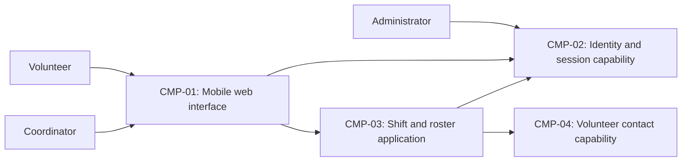

# ARCH-001 — Volunteer shift sign-up for the Riverside Food Bank architecture

## 1. Context and scope

This draft describes the shared architectural questions for PRD-001 version 1,
status approved, owned by Priya Nair. Approximately 120 volunteers use mobile web
pages to sign in and book warehouse shifts; the coordinator views the daily roster.
Session administration and protection of volunteer phone numbers are in scope.
Payroll, donations and an installed mobile app are outside scope.

The request explicitly selected PRD-001 and instructed proceeding without questions.
No inspection scope was named and no code or configuration was inspected. No existing
ARCH, ADR, approved policy or local preference was found at the contract paths.
Creating a new ARCH is proposed because no ARCH covers the system; the outcome has
not been confirmed and remains null. No ADR is written and no architectural question
is resolved. The components below are a proposal, not accepted deployment boundaries
or evidence of existing implementation.

## 2. Quality drivers

The operating context is internal, as declared by PRD-001; the pilot rollout does
not change that context. The required quality floor is constraint, security and
privacy. All three categories have requirements; no required category is missing.

PRD-001#NFR-001 requires administrator revocation of volunteer sessions to take
effect within five minutes. Sign-in and authenticated booking must share the
revocation mechanism; choosing an identity provider alone cannot establish that
guarantee. PRD-001#NFR-002 permits only the coordinator to see volunteer phone
numbers, requiring an agreed data owner and enforcement boundary. An administrator's
session-management capability does not itself grant access to phone numbers.
PRD-001#NFR-003 requires hosted services for the entire product because there is no
on-site server. It does not select a hosting provider or deployment topology.

PRD-001#FR-002 and PRD-001#FR-003 need a shared source of booking truth so an accepted
booking appears in the coordinator's roster. The summary's live-roster expectation
has no numerical freshness target; this draft does not invent one.

## 3. Components

The diagram shows proposed logical responsibilities and interactions. Ownership
assignments are provisional under ARCH-001#DEC-04 and ARCH-001#DEC-05; physical
boundaries remain open under ARCH-001#DEC-03 and ARCH-001#DEC-08.



```yaml items
components:
  - id: CMP-01
    status: active
    name: "Mobile web interface"
    responsibility: "Presents volunteer sign-in, shift booking and coordinator roster views; does not own authoritative records or decide access permissions."
    owns_data: []
    interacts_with:
      - "CMP-02"
      - "CMP-03"
    deployment: "Open: see DEC-08"
    upstream:
      - {id: PRD-001, item: NFR-001, relation: informed_by, version: 1, hash: null}
      - {id: PRD-001, item: NFR-002, relation: informed_by, version: 1, hash: null}
      - {id: PRD-001, item: NFR-003, relation: informed_by, version: 1, hash: null}
  - id: CMP-02
    status: active
    name: "Identity and session capability"
    responsibility: "Proposed authority for authentication and administrator-triggered session revocation; does not own shift bookings or authorize disclosure of phone numbers. Provider and session mechanism remain open."
    owns_data:
      - "Proposed: authentication identities and session validity records"
    interacts_with:
      - "CMP-01"
      - "CMP-03"
      - "Administrator"
    deployment: "Open: see DEC-08"
    upstream:
      - {id: PRD-001, item: NFR-001, relation: informed_by, version: 1, hash: null}
      - {id: PRD-001, item: NFR-003, relation: informed_by, version: 1, hash: null}
  - id: CMP-03
    status: active
    name: "Shift and roster application"
    responsibility: "Proposed authority for open shifts, booking acceptance and roster queries, enforcing authenticated operations and permitted contact disclosure; does not own credentials or volunteer phone records."
    owns_data:
      - "Proposed: warehouse shifts and accepted bookings"
    interacts_with:
      - "CMP-01"
      - "CMP-02"
      - "CMP-04"
    deployment: "Open: see DEC-08"
    upstream:
      - {id: PRD-001, item: NFR-001, relation: informed_by, version: 1, hash: null}
      - {id: PRD-001, item: NFR-002, relation: informed_by, version: 1, hash: null}
      - {id: PRD-001, item: NFR-003, relation: informed_by, version: 1, hash: null}
  - id: CMP-04
    status: active
    name: "Volunteer contact capability"
    responsibility: "Proposed authority for volunteer contact records associated with authenticated identities and roster entries; permits phone disclosure only through the agreed coordinator authorization boundary and does not own credentials or bookings."
    owns_data:
      - "Proposed: volunteer display identities and phone numbers"
    interacts_with:
      - "CMP-03"
    deployment: "Open: see DEC-08"
    upstream:
      - {id: PRD-001, item: NFR-002, relation: informed_by, version: 1, hash: null}
      - {id: PRD-001, item: NFR-003, relation: informed_by, version: 1, hash: null}
```

## 4. Architectural questions

Each question is blocking and unanswered. Notes describe alternatives for later
decision, not accepted choices. Feature-level schemas, endpoints and UI layout
remain work for specifications.

```yaml items
decisions:
  - id: DEC-01
    status: active
    question: "Which identity provider handles volunteer sign-in?"
    blocking: true
    state: open
    resolved_by: []
    notes: "Captures the PRD's NEEDS ADR marker. A hosted identity provider reduces credential operations; application-managed authentication offers control with greater security responsibility. The provider supplies identity to booking and constrains session integration, but does not by itself settle DEC-02. No mandate or explicit decision applies."
    upstream:
      - {id: PRD-001, item: FR-001, relation: informed_by, version: 1, hash: null}
      - {id: PRD-001, item: FR-002, relation: informed_by, version: 1, hash: null}
      - {id: PRD-001, item: NFR-001, relation: informed_by, version: 1, hash: null}
  - id: DEC-02
    status: active
    question: "How will administrator revocation invalidate volunteer sessions across authenticated operations within five minutes?"
    blocking: true
    state: open
    resolved_by: []
    notes: "A central validity check provides direct revocation enforcement with a runtime dependency; bounded token lifetimes and refresh denial reduce per-request checks but require a demonstrated five-minute maximum including caches and clock tolerance. Governs sessions created by sign-in and consumed by booking. No mechanism has been selected."
    upstream:
      - {id: PRD-001, item: FR-001, relation: informed_by, version: 1, hash: null}
      - {id: PRD-001, item: FR-002, relation: informed_by, version: 1, hash: null}
      - {id: PRD-001, item: NFR-001, relation: informed_by, version: 1, hash: null}
  - id: DEC-03
    status: active
    question: "Which logical component boundaries separate identity and sessions, booking and rosters, and volunteer contacts?"
    blocking: true
    state: open
    resolved_by: []
    notes: "The CMP model proposes separate responsibilities. Modules in one application simplify coordination; independent services strengthen isolation but require explicit cross-service contracts. The boundary determines where revocation and phone-access checks are enforced. The proposed shape is not accepted."
    upstream:
      - {id: PRD-001, item: FR-001, relation: informed_by, version: 1, hash: null}
      - {id: PRD-001, item: FR-002, relation: informed_by, version: 1, hash: null}
      - {id: PRD-001, item: FR-003, relation: informed_by, version: 1, hash: null}
      - {id: PRD-001, item: NFR-001, relation: informed_by, version: 1, hash: null}
      - {id: PRD-001, item: NFR-002, relation: informed_by, version: 1, hash: null}
  - id: DEC-04
    status: active
    question: "Which component owns authoritative shift availability and booking records used by the daily roster?"
    blocking: true
    state: open
    resolved_by: []
    notes: "An application-owned booking store gives booking and roster work one authority; a hosted scheduling service could own the records but would impose its integration contract. CMP-03 ownership is provisional. No existing scheduling system was established by evidence."
    upstream:
      - {id: PRD-001, item: FR-002, relation: informed_by, version: 1, hash: null}
      - {id: PRD-001, item: FR-003, relation: informed_by, version: 1, hash: null}
  - id: DEC-05
    status: active
    question: "Which component owns volunteer contact records linked to booking and roster identities?"
    blocking: true
    state: open
    resolved_by: []
    notes: "An application contact store permits a dedicated privacy boundary; identity-provider profiles reduce duplication but couple contact access to identity-provider capabilities. CMP-04 ownership is provisional. Booking and roster work must use a consistent volunteer reference without exposing phone numbers."
    upstream:
      - {id: PRD-001, item: FR-002, relation: informed_by, version: 1, hash: null}
      - {id: PRD-001, item: FR-003, relation: informed_by, version: 1, hash: null}
      - {id: PRD-001, item: NFR-002, relation: informed_by, version: 1, hash: null}
  - id: DEC-06
    status: active
    question: "Which trusted authorization boundary ensures volunteer phone numbers are disclosed only to the coordinator?"
    blocking: true
    state: open
    resolved_by: []
    notes: "Application-side authorization centralizes policy for booking and roster responses; datastore-enforced access policies provide an additional trust boundary but couple authorization to storage capabilities. Coordinator identity and role authority must be established. Hiding a field in the browser does not enforce the requirement. No access-control design is accepted."
    upstream:
      - {id: PRD-001, item: FR-002, relation: informed_by, version: 1, hash: null}
      - {id: PRD-001, item: FR-003, relation: informed_by, version: 1, hash: null}
      - {id: PRD-001, item: NFR-002, relation: informed_by, version: 1, hash: null}
  - id: DEC-07
    status: active
    question: "How will booking acceptance and coordinator roster reads share consistent booking state?"
    blocking: true
    state: open
    resolved_by: []
    notes: "Reading the authoritative booking store avoids a separate roster projection; event-driven roster projections allow separate read scaling but introduce propagation and recovery concerns. Concurrent attempts to book an open shift must use the same booking authority. A numerical live-roster freshness target remains a product clarification."
    upstream:
      - {id: PRD-001, item: FR-002, relation: informed_by, version: 1, hash: null}
      - {id: PRD-001, item: FR-003, relation: informed_by, version: 1, hash: null}
  - id: DEC-08
    status: active
    question: "What hosted deployment topology will run the whole product?"
    blocking: true
    state: open
    resolved_by: []
    notes: "A hosted application with managed persistence limits operational units; separate managed application services offer independent operation with more integration work. NFR-003 fixes hosted operation but neither provider nor deployment units. All functional requirements run within this topology. No platform or environment arrangement is selected."
    upstream:
      - {id: PRD-001, item: FR-001, relation: informed_by, version: 1, hash: null}
      - {id: PRD-001, item: FR-002, relation: informed_by, version: 1, hash: null}
      - {id: PRD-001, item: FR-003, relation: informed_by, version: 1, hash: null}
      - {id: PRD-001, item: NFR-003, relation: informed_by, version: 1, hash: null}
```

## 5. Evidence inspected

```yaml items
evidence:
  - id: EVD-01
    status: active
    source: "PRD-001"
    kind: prd
    finding: "Version 1, status approved: requires volunteer sign-in, authenticated shift booking and coordinator rosters, five-minute session revocation, coordinator-only phone visibility and hosted operation. The identity provider is explicitly marked NEEDS ADR. Operating context is internal; rollout begins with Tuesday and Thursday shifts."
    classification: context
```

## 6. Deployment

PRD-001#NFR-003 excludes an on-site deployment. The browser is the user client;
application hosting, identity/session infrastructure and persistent records must
use hosted services. Providers, physical deployment units and environment separation
remain open under ARCH-001#DEC-08. The four logical components do not imply four
services. The PRD's pilot rollout is not evidence of an existing pilot environment.

## 7. Requirement changes proposed to the PRD owner

- None.

## 8. Open questions

- [NEEDS CLARIFICATION: No inspection scope was named and no code or configuration was inspected; existing implementation, infrastructure and reusable components are unknown.]
- [NEEDS CLARIFICATION: The PRD summary calls for a live roster but PRD-001#FR-003 gives no measurable freshness bound; Priya Nair owns clarification of that product expectation before choosing asynchronous roster propagation.]
- [NEEDS CLARIFICATION: host model/session identity unavailable]

## Change Log

| Version | Date | Author | Change | Items affected |
|---|---|---|---|---|
| 1 | 2026-09-28 | codex (session unknown) | Initial draft for PRD-001 v1; proposed components and eight open shared questions; outcome unconfirmed, no ADRs. Policy resolution: interview.max_calls=8 (default); architecture.mandated_platforms=none (default); quality.required_categories=floor only (default) | all |
| 1 | 2026-09-28 | codex (session unknown) | Validation audit: python3 /tmp/validate-prd001-arch.py checks structure, links and unchanged PRD (PASS); host provenance self-check 3, BEH-13 and VER-14 remain BLOCKED. ERR-05: retain draft with empty approvals, null outcome and all decisions open; no ADR or prior approval needs restoration. Validated readiness handoff NOT_RUN. Policy resolution: interview.max_calls=8 (default); architecture.mandated_platforms=none (default); quality.required_categories=floor only (default) | generated_by; validation |
