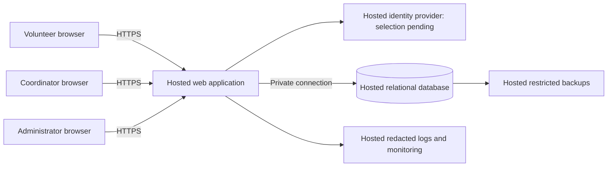

# ARCH-001 — PRD-001 pilot architecture

## Basis and decision status

This architecture covers all six active, current-release requirements in
[PRD-001](../prd/PRD-001.md), version 1, approved September 20, 2026. There is no
application code, repository architecture policy, or test configuration in the
supplied workspace. BRN-001 is referenced by the PRD but was not supplied; this
design does not assume its contents. The approved PRD and its generated epic map
are unchanged. This document is an architecture proposal, not stakeholder approval
or evidence that the product meets its requirements.

**Epic definition can proceed for FR-002 and FR-003**, using the identity contract
below and including the applicable NFR work. **FR-001 remains blocked for a
delivery epic** by the unresolved identity-provider decision in
[ADR-001](../adr/ADR-001.md). Discovery for that decision can proceed immediately.
FR-002 and FR-003 still depend on FR-001 for integrated delivery. A ready epic is
one whose scope and acceptance tests can be defined; it does not imply that its
dependencies are implemented or that it can launch independently.

## 1. Architecture decisions

| Decision | Selected design | Reason and tradeoff |
|---|---|---|
| AD-01: application boundary | One hosted web application serving mobile pages and a same-origin backend; modules for identity/session access, shift booking, and coordinator roster | About 120 volunteers and three shifts per day do not justify independently deployed services. A single deployment simplifies transactions and authorization but couples module releases. |
| AD-02: persistent state | One hosted relational database with transactions, uniqueness constraints, and a private application connection | Capacity, duplicate prevention, and revocation require consistent authoritative state. Database availability becomes a dependency of protected requests. |
| AD-03: identity boundary | External hosted identity provider behind a server-side adapter; application-owned sessions and roles | Keeps provider-specific login behavior out of booking and roster logic. Provider selection and enrollment/recovery remain open in ADR-001. |
| AD-04: confidentiality | Backend authorization plus explicit response fields; separate contact data access | Hiding a phone field in a page is insufficient. Volunteer responses and client state must never contain phone numbers. |
| AD-05: roster freshness | Read committed booking data on page load, manual refresh, and every 30 seconds while the coordinator page is active | A simple polling design serves the pilot. Thirty seconds is a proposed interpretation of “live,” not a PRD performance requirement. |

Specific hosting vendors, framework versions, region, budget, and database product
are not prescribed by the PRD. The selected topology is vendor neutral. Hosting
procurement and configuration are deployment prerequisites, not additional
unresolved architecture decisions for epic definition. No provider capability,
price, or service guarantee has been assumed verified.

Browsers are untrusted. Every protected request crosses an authorization boundary
at the backend. The database is not accessible directly from browsers. Identity
provider responses establish identity only; server-owned role grants establish
application permissions. Application runtime, identity, database, secrets,
monitoring, and backups all run on hosted services (NFR-003); no food-bank server
is needed. Browser devices are clients, not on-site infrastructure.

## 2. Data and access boundaries

| Entity | Essential fields and invariants |
|---|---|
| Principal | Internal ID; unique provider issuer/subject mapping; display name; session generation. No automatic account linking by unverified email. |
| Role grant | Principal ID and volunteer, coordinator, or administrator permission; grants maintained by a restricted operator procedure. Roles can coexist but do not imply one another. |
| Volunteer contact | Principal ID, phone number; only coordinator-authorized application reads may access it. |
| Session | Hash of opaque cookie token, principal ID, generation at issuance, issued time, expiry. Tokens and identity assertions never appear in logs. |
| Shift | ID, start/end instants, configured food-bank timezone, positive capacity, published state, pilot eligibility. |
| Booking | ID, shift ID, volunteer principal ID, creation time; unique pair of shift and volunteer. |
| Revocation audit | Actor ID, target ID, timestamp, outcome; no phone numbers or session secrets. |

Volunteer pages expose shift details, availability, and the caller's own booking
IDs. They expose no roster of other volunteers and no phone numbers, including
the caller's own. The coordinator can read roster names and phone numbers.
An administrator can revoke sessions but cannot read phone numbers unless also
explicitly granted the coordinator role. Administrative application permissions
are distinct from restricted infrastructure maintenance credentials.

Phone numbers must be absent from volunteer HTML, API payloads, identity claims
sent to browsers, analytics, logs, error messages, and shared caches. Store contact
data separately and expose it only through a coordinator-authorized projection.
Protected responses use `Cache-Control: no-store`; do not persist sensitive
responses in browser storage or service-worker caches. Host backups and database
credentials under restricted service/operator access; no general-purpose data
browser is part of the application. Retention duration and operational access
procedures need definition before real contact data is loaded.

## 3. Contracts and request flows

These are implementation contracts to carry into epics, not existing endpoints.

### Sign-in and application sessions — FR-001, NFR-001

The provider adapter returns a verified stable issuer/subject identity only after
its selected protocol has completed successfully. The backend maps that identity
to an enrolled principal, checks server-owned permissions, and creates an opaque
application session in a Secure, HttpOnly cookie with an appropriate SameSite
policy. Protect state-changing requests against CSRF. Never accept a user ID or
role supplied by the browser as authority. Enrollment, recovery, protocol details,
and provider proof are ADR-001 exit criteria.

Every protected request reads the authoritative session and principal generation
from the database. Reject missing, expired, or mismatched sessions with an
unauthenticated response. Do not use a positive authorization cache or a
long-lived bearer token that bypasses this check. Database failures deny protected
operations and return a retryable failure; they never grant access.

`POST /admin/volunteers/{id}/revoke-sessions` requires an authenticated
administrator. Atomically increment the target principal's session generation and
write an audit record, acknowledging success only after commit. All older
application sessions then fail the next authorization check, independently of
identity-provider token expiry. The design targets immediate rejection after
commit and must verify the PRD's maximum five-minute bound across all application
instances and protected routes. A failed revocation is visibly unsuccessful and
can be retried; it must never report success before persistence.

Protected mutations recheck authorization in the transaction that changes state,
locking the principal consistently with revocation. Sensitive reads recheck before
returning data. This bounds in-flight requests as well as newly arriving ones;
there are no indefinitely authorized streams. Revocation does not erase data
already displayed or promise to disable future sign-in: the PRD specifies session
revocation, not account suspension. The provider integration must ensure old
application credentials cannot silently renew into a valid session.

### Booking — FR-002

`GET /shifts` returns published, pilot-enabled future shifts and availability.
`POST /shifts/{id}/bookings` derives the volunteer ID from the validated session.
Inside one transaction, check authorization, lock the shift row, verify that it
is open, and create the booking only if capacity remains. All writers must use
the same locking path. Enforce the unique volunteer/shift pair at the database.
A retry for an existing pair returns that booking without consuming another seat.
A full/closed shift returns a conflict; an invalid session returns an
unauthenticated response. Display success only after a committed response.

The architecture interprets “open” as published, pilot-enabled, not started, and
below capacity. This is an explicit planning assumption to carry into the epic;
the PRD specifies no eligibility, overlapping-shift, cancellation, waitlist, or
booking-cutoff rules. Do not add those features implicitly. Competing requests
for the last place must result in exactly one new booking. Availability displayed
before a request is advisory; the transaction decides whether booking succeeds.

### Daily roster — FR-003, NFR-002

`GET /coordinator/roster?date=YYYY-MM-DD` checks coordinator permission before
querying any contact data. Interpret the day in the configured food-bank timezone,
using a half-open start/end interval derived for that local date. Return that
day's shifts, including empty shifts, with committed booked volunteer names and
phone numbers. Read the authoritative database so the next successful refresh
includes newly committed bookings. Clear displayed sensitive data on an
authorization failure. On a connectivity error, show that the last view is stale
and allow retry; do not label old data as live.

Timezone must be configured for the food bank, not inferred from the developer's
or browser's timezone. The 30-second polling interval and assignment of an
overnight shift to its start date are planning defaults for the roster epic.

## 4. Operations and scope

Use a restricted, repeatable operator import for the initial volunteer directory,
role grants, shift times, and capacities; a shift-management UI is not specified.
Validate imported IDs, dates, and capacities. Operator procedures must preserve
the coordinator-only application disclosure rule for phones. Initial enrollment
and provisioning details depend on ADR-001. Designate the administrator and
coordinator before the pilot; do not assume they are the same person.

Separate test and pilot data. Store secrets in the hosting environment's secret
facility. Use encrypted transport and hosted storage/backups with restricted
access. Define backup/restore procedures and exercise a restore before launch;
recovery-time and recovery-point targets are operational decisions, not invented
PRD commitments. Monitor failed logins, revocation failures, booking conflicts,
and server errors without recording personal contact data or session credentials.

Enable only Tuesday and Thursday shifts initially through shift configuration,
then expand to all shifts as the PRD directs. Keep the coordinator's shift log as
the source for SM-01: bookings alone cannot establish whether volunteers actually
attended. Payroll, donations, attendance tracking, automated reminders, and
cancellation workflows are outside this architecture's delivery scope.

## 5. Requirement coverage and readiness for epics

“Ready” means architecture is sufficient for epic definition with the contracts
and assumptions above. All product verification remains NOT_RUN until software
exists. Cross-cutting NFRs must be attached to the affected epics, not dropped
because they do not describe a separate user feature.

| Requirement | Architecture coverage | Epic readiness | Dependency or gap | Required acceptance evidence |
|---|---|---|---|---|
| FR-001 | AD-03; verified identity adapter; enrolled principal; application session | BLOCKED | ADR-001 provider, enrollment, and recovery decision | Valid/invalid sign-in, identity mapping, logout, expired session, and safe recovery tested against selected provider. |
| FR-002 | AD-01/02; booking transaction; uniqueness; open-shift definition | READY | Signed-in principal contract; FR-001 required for integrated delivery. Carry open-shift assumptions into epic. | Valid booking persists; unauthenticated request rejected; full/closed shift rejected; concurrent last-seat requests cannot overbook; retries cannot duplicate. |
| FR-003 | AD-01/04/05; coordinator authorization; local-day roster projection | READY | FR-001 for integrated delivery; booking records from FR-002. Carry freshness/timezone defaults into epic. | Correct daily roster including empty shifts; committed bookings appear on next refresh; non-coordinator denied; timezone boundary and stale-view behavior tested. |
| NFR-001 | Application session generation and authoritative per-request validation | READY as shared acceptance criteria | Applies to FR-001, FR-002, FR-003 and administrative routes. Local mechanism can be defined now; selected-provider integration remains required. | Revoke multiple active sessions; all old credentials fail on every instance and protected route within 300 seconds; replay/renewal fails; unauthorized admin action and database failure fail closed. |
| NFR-002 | Coordinator-only contact projection and explicit response fields | READY as shared acceptance criteria | Applies across sign-in/profile responses, booking, roster, operator tooling, logs, and caches. Administrator is not implicitly coordinator. | Role-matrix tests and response/log inspection find no phones outside coordinator access; forged roles and direct endpoint access are denied. |
| NFR-003 | Entire hosted topology including identity, persistence, and operations | READY as product-wide constraint | Applies to every delivery epic. Hosting configuration must be chosen before deployment. | Deployment inventory and smoke test demonstrate all server-side functions operate without on-site servers. |

Suggested epic boundaries are identity and session administration (FR-001 +
NFR-001), self-service shift booking (FR-002 + NFR-001/002), and coordinator roster
(FR-003 + NFR-001/002). NFR-003 applies to all three. These are planning boundaries,
not created epic artifacts. Booking and roster epics can use a verified-principal
test adapter while the identity decision is resolved; production must never ship
that adapter. No functional epic can be released without working sign-in,
revocation, privacy enforcement, and hosted deployment.

## 6. Open decisions and verification

| Item | Scope | Resolution needed |
|---|---|---|
| ADR-001 | Blocks FR-001 delivery-epic readiness; integration dependency for FR-002/003 | Select and validate a hosted provider and volunteer enrollment/recovery flow. |
| PRD ASM-01 | Pilot adoption, not architecture readiness | Record the smartphone/browser survey result; the supplied PRD still marks it open. |
| Planning defaults | FR-002/003 | Record open-shift rules, polling freshness, timezone, and initial shift import in epic acceptance criteria; revise architecture if different rules change the design. |
| Operational setup | Pilot release | Choose hosting region/budget, retention, backup targets, initial data and designated role holders before production data loading. |

See [VERIFY-001](VERIFY-001.md) for document verification of this working-tree
candidate and the distinction between architecture checks and unrun product tests.

## Change log

| Date | Version | Change |
|---|---|---|
| 2026-09-28 | 1 | Defined architecture, six-requirement coverage, shared NFR scope, identity decision gap, and epic readiness from PRD-001 v1. |
