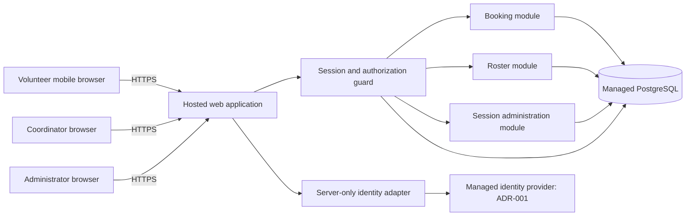

# ARCH-001 — Volunteer shift sign-up

## Scope and readiness

Source: [PRD-001 version 1](../prd/PRD-001.md), approved 2026-09-20. This document defines the architecture for epic drafting; it does not amend the approved PRD or claim implementation acceptance. No existing application, repository instructions, architecture template, or test commands are present. BRN-001 is referenced by the PRD but unavailable; no additional requirements are inferred from it.

Use one hosted web application, a managed relational database, and a managed identity provider. Keep identity, application sessions, booking, and coordinator roster as modules in one application. At approximately 120 volunteers and three shifts per day, separate services, queues, and a separate analytics platform have no demonstrated need.

**Epic readiness:** FR-002, FR-003, NFR-001, NFR-002, and NFR-003 have sufficient architecture to draft epics. FR-001 remains blocked by ADR-001's identity and account-enrollment decision. Ready means bounded design and verification obligations exist; it does not mean implementation dependencies are complete or the pilot can launch. No epics are created in this architecture task.

## Decisions and unresolved inputs

| ID | Decision or input | Disposition and effect |
|---|---|---|
| D-01 | Hosted modular web application plus managed PostgreSQL | Selected architecture. One deployment and transactional booking; applies to all requirements. Hosting vendor and language can be selected in the foundation epic without changing the boundaries below. |
| D-02 | Managed identity behind a server-only adapter | Proposed Supabase Auth in [ADR-001](../adr/ADR-001.md). The PRD establishes smartphone access, not email access or an existing account directory. Do not silently make either a product prerequisite. FR-001 is blocked pending the evidence listed in the ADR. |
| D-03 | Opaque application sessions, checked in the primary database on every protected request | Selected architecture for NFR-001, independent of identity provider token expiry. All protected modules must use this guard. |
| D-04 | Coordinator and administrator are distinct permissions | Selected least-privilege interpretation of NFR-001 and NFR-002. An administrator alone cannot see phone numbers. One person may hold both permissions through explicit provisioning. |
| A-01 | An open shift is published, in the future, and below a configured positive capacity | Working interpretation for FR-002. Capacity and dates are data, not fixed constants. No waitlist, overlapping-booking rule, cancellation, reminders, or shift-management UI is implied. Revisit if the product owner changes this interpretation. |
| A-02 | A roster day uses the food bank's configured IANA timezone and contains shifts starting that day | Working interpretation for FR-003. The actual timezone must be supplied before pilot data is loaded; do not infer it from the developer environment. |
| A-03 | Existing volunteer names, optional phone numbers, and pilot shifts can be provisioned by controlled import | Operational assumption; source and access to the data must be established before pilot. Absence of a phone number must not prevent booking. This does not add public registration or contact editing. |
| A-04 | "Live roster" means committed bookings appear on refresh and while the page is active via polling | Proposed acceptance detail: poll every 30 seconds and on focus; show last successful refresh and stale/error state. This is a design target, not a numeric PRD requirement. |

No questions are required to draft the independent epics. The product owner, Priya Nair, is the proposed owner for unresolved product inputs; this document does not claim she has confirmed them. ASM-01 remains open as recorded in the PRD, including its smartphone-access validation. Platform account ownership, budget, region, backup retention, and contact-data retention are pilot setup inputs, not facts established here.

## System boundaries

All runtime components are hosted off site, including session state, identity, backups, and operational logs. Volunteers need only a browser. Use mobile-first pages with accessible forms, explicit booking success/failure, and no offline booking queue. A browser never connects directly to the database, uses a database service credential, or treats a provider token as application authorization.

Application boundaries:

- Identity adapter verifies fresh provider authentication and returns a stable `(issuer, subject)` identity; it does not assign application roles or expose provider tokens to booking or roster code.
- Session module maps an enrolled identity to an application user, issues a session cookie, and produces a server-trusted principal after each authorization check.
- Booking module owns shift availability and transactional reservations. It accepts a trusted principal and shift ID, never a client-supplied volunteer ID.
- Roster module reads committed bookings and returns a coordinator-only projection. Phone access is isolated from volunteer queries.
- Session administration module checks the administrator permission and revokes sessions. It needs user IDs and display names, not phone numbers.

## Data and interface contracts

| Entity | Minimum data and constraints |
|---|---|
| ApplicationUser | Internal ID, display name, active flag, session generation. Enrollment maps a unique `(issuer, subject)` to this ID; names and email are not identity keys. |
| RoleAssignment | User ID and role (`volunteer`, `coordinator`, `administrator`); roles provisioned through a restricted operator process, never client input. |
| VolunteerContact | User ID and optional phone number in a restricted table. Only the coordinator query path may read it. No phone field in ordinary user/session DTOs. |
| Shift | ID, warehouse label, start/end instants, positive capacity, published flag; end must follow start. Index start time. |
| Booking | ID, shift ID, volunteer ID, created time; foreign keys and unique `(shift_id, volunteer_id)`. Index shift ID for availability and roster queries. |
| ApplicationSession | Hash of a high-entropy random token, user ID, generation at issuance, created/expiry times, optional revoked time. Store only the hash of the cookie token. |
| SecurityAudit | Actor ID, target ID, event type, timestamp, outcome, correlation ID. No credentials, cookies, tokens, or phone numbers. |

Use UTC instants in storage and the configured food-bank timezone for day boundaries and display. No production contact values in fixtures, development databases, or logs. Application database credentials are least privileged; disable public/direct data access and keep contact reads behind a restricted query function or database role. Migration and backup credentials are separate from application credentials. Backups retain the same restricted access classification as the original data.

Conceptual HTTP contracts (route names can be finalized in stories):

| Operation | Permission | Behavior |
|---|---|---|
| `POST /session` | Fresh successful identity authentication and enrolled active user | Issue opaque Secure, HttpOnly, SameSite cookie; rotate at login. No arbitrary provider-token exchange or stale-session renewal. Exact provider interaction is blocked by ADR-001. |
| `DELETE /session` | Current session | Revoke that session and clear its cookie. |
| `GET /shifts` | Volunteer | Return future published shifts and remaining places; no volunteer contacts or other volunteers' identities. Availability is advisory until booking commits. |
| `POST /shifts/{id}/bookings` | Volunteer | Book as the authenticated user; return durable confirmation. Existing booking returns the same confirmation, full/closed shift returns conflict. |
| `GET /roster?date=YYYY-MM-DD` | Coordinator | Return all shifts starting on the local day, including empty shifts, with booked names and available phone numbers; no-store response. |
| `POST /users/{id}/revoke-sessions` | Administrator | Atomically invalidate all current application sessions for the target user and audit the event; success only after commit. No phone fields. |

Return unauthenticated/expired/revoked as 401, authenticated but unauthorized as 403, invalid input as 400, and temporary dependency failure as 503. Mutating cookie-authenticated requests require CSRF protection and origin validation. Limit login and mutation request rates; do not log their sensitive payloads. Shared/CDN caches must not store authenticated responses.

## Booking and roster consistency

FR-002: begin a transaction, check the session and volunteer permission, then lock the chosen shift row. If this user already booked it, return that booking. Otherwise check published state, future start time, and committed booking count against capacity; insert and commit. All booking/import writers must use the same locking protocol. The unique booking constraint makes retries safe. Capacity changes cannot lower capacity below the booked count. A transaction failure leaves no booking and returns a retryable error, not a success message.

Two volunteers competing for the last place must result in one new booking and one conflict. A timeout after a successful commit is resolved by retrying the same booking operation; it must not consume another place. Do not use an in-memory counter or a read followed by an unlocked insert.

FR-003: use a consistent database read of shifts and their bookings, joining the restricted contact projection only after checking coordinator permission. Convert the selected local date into a half-open UTC range, including daylight-saving transitions. Refresh from committed data; show empty rosters distinctly from loading or errors. Poll only while active and clear protected UI data on logout or authorization failure. The staffing success metric still comes from the coordinator's shift log: bookings alone do not prove attendance.

## Security obligations across requirements

NFR-001 applies to sign-in sessions and every authenticated operation, including booking and roster. It is not confined to FR-001's implementation. On each request, read the session, current user status/roles, and session generation from the primary database, with no positive authorization cache. Reject a revoked, expired, inactive, or generation-mismatched session. Database failure fails closed. Use a finite session lifetime (proposed pilot default: 12 hours) and require fresh authentication after expiry or revocation; do not resurrect sessions from old provider refresh credentials.

Revoking all sessions increments the user's generation in a transaction; existing cookies remain unusable even if individual session rows have not yet been deleted. Capture generation before a fresh login starts and compare it when issuing the session so an authentication attempt spanning a revocation cannot mint a new session. Explicit fresh sign-in begun after revocation may succeed: the PRD calls for session revocation, not permanent account suspension.

Serialize protected mutations and revocation against the user record so a booking authorized after the revocation commit cannot succeed with an old session. Keep requests bounded (proposed 30-second server deadline), with no long-lived authorized connections or offline writes. The target is rejection on the next request after revocation commit, providing margin under the required five minutes. Measure from the administrator action to enforced rejection in end-to-end tests, across application instances; a failed revocation must be reported as failed. Data already delivered to a browser cannot be recalled.

NFR-002 applies wherever phone numbers could escape, including sign-in responses, volunteer booking responses, roster, administration, errors, telemetry, and cached pages. Only an explicit coordinator role can receive them. Hiding a UI column is insufficient: use explicit response allowlists and enforce permission at the server query boundary. Volunteer access to their own stored phone is also excluded by the literal PRD requirement. Administrator status grants no contact access. Infrastructure operators' privileged access to storage/backups must be restricted and audited; product role permissions do not eliminate infrastructure access.

NFR-003 applies to the entire deployment, not just the web UI. Hosted identity, database/session state, web process, backups, and logs must remain operable with no machine running at the food bank. Development tools on a laptop are not runtime dependencies.

## Operations and rollout

Use separate hosted staging and pilot environments, secret storage, HTTPS, database migrations, and managed encrypted backups with a documented restore procedure. Keep all application instances stateless outside the database. Deployments must preserve session generation and revocation state; never restore stale session state into an active service without invalidating sessions. Record failed login, booking conflicts/errors, authorization failures, roster refresh failures, and revocation latency without personal payloads.

Foundation stories must select a hosting plan/region, configure backup retention and restore checks, identify the operational owner, and document rollback. Those choices are not validated or purchased by this architecture task. No numerical availability or recovery promise is added to the PRD.

For the pilot, import and publish only Tuesday/Thursday shifts in the configured local timezone. Confirm identities, role assignments, contact access, and revocation before opening bookings. Expand the published shift set after the pilot; no topology change is needed. Keep the coordinator's existing phone/shift-log process available during outages, reconcile any manual bookings before reopening online booking, and never claim failed online writes succeeded. Payroll and donations remain explicitly out of scope.

## Requirement-to-epic handoff

These are candidate work boundaries, not generated epic records. NFRs must be copied into the acceptance criteria of each affected epic, not deferred into an optional cleanup epic. FR-003 retains its PRD `should` priority; architecture does not promote it to `must`.

| Requirement | Epic readiness | Candidate work boundary | Dependencies and required acceptance evidence |
|---|---|---|---|
| FR-001 | BLOCKED | Identity and enrollment | Resolve ADR-001. Prove valid enrolled-user login, invalid/unknown-user rejection, account recovery, no self-assigned roles, and creation of a guarded application session. Inherits NFR-001/002/003. |
| FR-002 | READY | Availability and atomic booking | Draft against the principal contract; production use depends on FR-001 and session guard. Test concurrent last-place booking, retry after lost response, closed/past/full shifts, unauthorized booking, and no phone disclosure. Inherits NFR-001/002/003. |
| FR-003 | READY | Coordinator daily roster | Depends on booked data, coordinator provisioning, and authenticated sessions. Test selected day/timezone, empty shifts, new committed booking visibility, stale/error state, non-coordinator denial, and coordinator-only phone projection. Inherits NFR-001/002/003. |
| NFR-001 | READY | Foundation/session administration plus every protected epic | Provider-independent design is defined above; end-to-end verification depends on FR-001. Test all-device revocation within 300 seconds, multi-instance checks, login/revocation races, unauthorized administrator action, and fail-closed behavior. |
| NFR-002 | READY | Restricted contact storage and authorization across all epics | Test anonymous, volunteer, administrator-only, and coordinator roles against every response surface and direct data access; inspect logs/caches for seeded phone canaries. No role except coordinator may receive a phone number. |
| NFR-003 | READY | Hosted foundation across all epics | Verify deployed UI, identity, database, sessions, backups, and logs need no on-site service; perform a hosted restore exercise. |

Suggested sequence: draft hosted foundation/session guard and booking/roster epics now; resolve the identity ADR before committing provider-specific sign-in stories; integrate sign-in before end-to-end acceptance and pilot. Test doubles allow module work but cannot count as proof of production authentication or NFR-001 compliance.

## Verification and evidence

The PRD supplies requirement statements, not detailed story acceptance tests. The tests above are derived verification obligations for later epics. Follow failing-test → implementation → refactor for behavior work. This task changes only documentation, so no application failing test can be established or run.

See [VERIFICATION-001](VERIFICATION-001.md) for the exact document hashes, commands, and results from this working-tree candidate. Architecture coverage and runtime acceptance are distinct:

| Requirement | Design review | Runtime acceptance | Evidence / remaining issue |
|---|---|---|---|
| FR-001 | BLOCKED | NOT_RUN | Provider candidate and boundary in ADR-001; enrollment suitability unresolved. |
| FR-002 | PASS | NOT_RUN | Data constraints, atomic flow, routes, concurrency/retry obligations defined. |
| FR-003 | PASS | NOT_RUN | Coordinator projection, local-day query, freshness/error obligations defined. |
| NFR-001 | PASS | NOT_RUN | Central guard, all-session generation revocation, fail-closed/race semantics and ≤300-second test defined. |
| NFR-002 | PASS | NOT_RUN | Explicit role separation and contact read boundary across all response surfaces. |
| NFR-003 | PASS | NOT_RUN | Entire runtime and operational state hosted; deployment/restore evidence remains required. |

SM-01 is retained as 95% fully staffed shifts by pilot end, measured through the coordinator's shift log. ASM-01 remains unvalidated. Neither a design review PASS nor a document validation PASS proves the staffing target or any runtime requirement.
