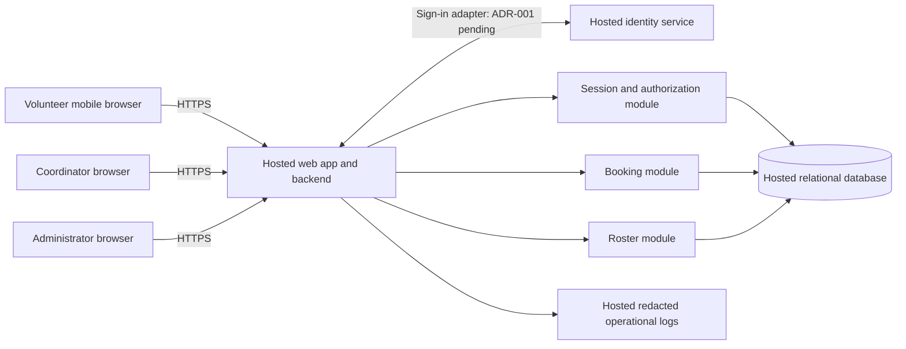

# ARCH-001 — Architecture and epic readiness

## Scope and decision summary

This design covers all six current requirements in [PRD-001](../prd/PRD-001.md),
version 1. The baseline is a mobile web application with one hosted backend,
a hosted relational database, application-owned sessions, and server-side role
checks. At about 120 volunteers and three shifts per day, separate microservices,
an event bus, and a native app add no required capability.

Five requirements are ready for epic decomposition against the contracts below.
FR-001 remains blocked by the identity-provider decision in
[ADR-001](../adr/ADR-001.md). Ready means an epic can define scope and acceptance
tests; it does not mean implemented, verified at runtime, or ready for release.
Booking and roster epics may proceed with the defined principal contract while
their production integration still depends on sign-in. This draft does not claim
stakeholder approval or change the approved PRD.

Only PRD-001 is present: there is no application code, repository instruction
file, test command, architecture template, or usable Git history. Its referenced
BRN-001 is unavailable; this design relies on the approved PRD, not an inferred
brief. The PRD's generated epic map is unchanged. No epics are created here.

## Architecture decisions

| Decision | Baseline | Reason and consequence |
|---|---|---|
| D-01 | One hosted web backend and managed relational database | Central authorization and transactions suit the pilot. All production services, including identity, logs and backups, must be hosted; no on-site dependency. Provider and language selection are implementation choices subject to these contracts. |
| D-02 | Application-owned opaque sessions, checked on every protected request | Revocation does not depend on an identity provider's token lifetime. A database outage denies protected access. |
| D-03 | Separate volunteer, coordinator and administrator permissions | Administrator status alone never grants phone-number access. Roles are assigned through an authorized operational process, never client input. |
| D-04 | Transactional bookings and database-backed roster reads | Prevent overbooking and duplicate reservations; the roster reads committed bookings without a second synchronization system. |
| D-05 | Coordinator-only phone projection | Phone numbers remain outside generic volunteer profiles and all volunteer-facing responses. |
| D-06 | Identity provider remains proposed in ADR-001 | The PRD provides no evidence about volunteer credentials or an existing organization identity service. Picking a vendor or requiring email would invent a product prerequisite. |

These are the working design decisions for decomposition. D-06 is explicitly
unresolved; the other decisions do not require a particular identity vendor.

## Components and trust boundaries

Modules are internal boundaries within one deployable application. The browser
is untrusted and never receives database credentials, identity secrets, or a
privileged direct database connection. Every protected backend route resolves
the current session and permission before reading data or changing state.
The identity adapter authenticates identity; local records authorize access.

## Data model and invariants

| Record | Essential fields and invariants |
|---|---|
| Principal | Local ID, identity issuer/subject (unique pair), display name, active flag, session generation. Stable local ID survives adapter changes through a controlled migration. |
| Role assignment | Principal ID and role; unique pair. Volunteer, coordinator and administrator are distinct permissions; one person may have multiple roles. |
| Volunteer contact | Principal ID and phone number, separate from ordinary profile queries. No phone in identity claims, session payloads, audit events or general DTOs. |
| Session | Hash of random opaque token, principal ID, generation at issue, expiry, revoked timestamp. Store no raw session token. |
| Shift | ID, UTC start/end, capacity, published/open flag. Positive capacity, end after start. Local day is derived using the configured food-bank timezone. |
| Booking | ID, shift ID, volunteer ID, creation timestamp; unique `(shift_id, volunteer_id)`. Foreign keys enforce valid references. |
| Security audit | Actor ID, target ID, action, timestamp and outcome; no phone numbers, credentials or session tokens. |

Assumed pilot semantics: an open shift is published, has not started, and has
remaining capacity. Volunteers book only for themselves. Cancellation, waiting
lists, overlap restrictions, reminders, payroll and donations are outside this
design. The first five are not specified features; the last two are explicit PRD
non-goals. Adding any requires an explicit requirement, not an incidental story.

## Authentication and session contract

FR-001's adapter returns a verified `(issuer, subject)` after completing the
selected provider's login flow. Only an active, locally provisioned principal
can receive a session. Browser-supplied IDs or role claims are never sufficient.
Provisioning must explicitly bind a verified identity; matching on display name
or accepting a user-selected volunteer record is prohibited.

Issue a random opaque session in a Secure, HttpOnly, SameSite cookie. Protect
state-changing requests against CSRF. Resolve the token hash, expiry, principal
active flag, current roles and generation from authoritative database state on
every protected request. Do not use a positive authorization cache or allow
identity tokens to bypass this check. Authenticated responses use `no-store`.

For NFR-001, an authorized administrator revokes **all existing application
sessions for a target volunteer** by atomically increasing that principal's
session generation. Serialize session issuance and revocation on the principal
record. Return success only after commit; a failed write is a failed revocation.
Every old cookie then fails on its next request, including from other devices
or backend instances. New sessions require a new login flow; revocation is not
account suspension, and provider-wide logout is a separate ADR-001 concern.

For a mutation, recheck generation under the same principal lock used by
revocation before committing the transaction. This orders a concurrent booking
before or after revocation. Protected requests must have a server-enforced
maximum lifetime of 60 seconds, with no long-lived authenticated streams or
queued session-authorized jobs. Thus an already executing read finishes within
60 seconds; subsequent access is denied immediately after commit, within the
PRD's five-minute limit. Test this bound across instances; do not infer it from
cookie deletion or provider token expiry. Revocation cannot erase information
already displayed on a device.

## Booking, roster and privacy contracts

Illustrative route names describe contracts, not a required framework:

| Operation | Authorization | Result and failure behavior |
|---|---|---|
| `GET /shifts` | Active volunteer session | Open shifts and remaining slots; no other volunteers or phone numbers. |
| `POST /shifts/{id}/bookings` | Active volunteer session | Volunteer ID comes from session. Lock principal then shift in a consistent order; check existing booking, open status and capacity; insert and commit. Retry returns existing booking without consuming capacity. Full/closed shift returns conflict, unknown shift not found. |
| `GET /roster?date=YYYY-MM-DD` | Coordinator | Group that local day's shifts, including empty shifts, with booked volunteers' names and coordinator-only contact data. Read from primary committed state. |
| `POST /volunteers/{id}/revoke-sessions` | Administrator | Increment generation and record audit event transactionally. Return acknowledged revocation only on successful commit. No phone data in request or response. |

All booking writers must hold the shift lock while checking remaining capacity.
A uniqueness constraint is the final duplicate safeguard. Capacity changes, if
supported operationally, must use the same lock and cannot reduce capacity below
existing bookings. Database errors roll back; the interface never presents a
failed request as a confirmed booking. A retry after a lost response is safe.

The coordinator page refreshes on load and on demand, with a proposed 30-second
poll while visible to support the summary's "live roster." Polling is a design
default, not a PRD latency guarantee. After a failed refresh show the last-success
time and stale status; do not label a stale or failed response as an empty roster.
Date filtering uses one configured food-bank timezone, including daylight-saving
boundaries; the environment's timezone is not evidence of the bank's location.

For NFR-002, authorization is enforced before selecting contact fields. Return
allowlisted response shapes, never serialize a whole profile and hide its phone
in the UI. A volunteer cannot read even their own phone through this product;
an administrator without coordinator permission cannot read any phone. Deny
direct contact routes to those roles too. Exclude phone data from errors, URLs,
telemetry, analytics, static assets, caches and audit records. Use synthetic data
outside production and restrict production database/backup operational access.
The requirement is interpreted as product visibility, not a claim that a hosted
database processor can never technically access stored data.

## Hosting and operations

NFR-003 applies to **FR-001, FR-002, FR-003 and both other NFRs**, not just the
sign-in service. Hosting selection must support HTTPS, secret management, the
database transactions and locks above, centrally shared sessions, restricted
database access, redacted logs, hosted backups and restoration. All application
instances use the same authoritative database; process memory is not a session
or booking source of truth. No browser direct database API is required.

Deploy database migrations before dependent application code using compatible
schema changes. Stage with synthetic volunteers; validate backup restoration
before the pilot. Configure only Tuesday/Thursday shifts initially, then expand
the published shift data for rollout. A coordinator's existing shift log remains
the SM-01 measurement source; bookings alone do not prove attendance or the 95%
fully staffed target. No new analytics or attendance subsystem is implied.

## Assumptions and unresolved decisions

| ID | Assumption or gap | Effect and closure evidence |
|---|---|---|
| A-01 | Identity provider, login method and enrollment/recovery route are unknown. | Blocks FR-001 decomposition. Close ADR-001 with actual volunteer credential/access evidence and a selected provider integration. |
| A-02 | Coordinator supplies pilot shifts, capacity and volunteer/contact data through a controlled import or seed process. | Default avoids inventing a scheduling UI. Include input validation in the booking/roster epics; data source and operator must be settled before pilot loading. |
| A-03 | Coordinator/admin role assignment uses controlled provisioning; the coordinator need not also be the administrator. | Include auditable role seeding and no public self-assignment. Identify the administrator before pilot release. |
| A-04 | Open means published, future and below capacity; one reservation per volunteer per shift. | Explicit epic baseline for FR-002. If product review changes this rule, revise acceptance tests before implementation. |
| A-05 | Food-bank timezone, hosting account, region, budget, data retention and restore objectives are unspecified. | Configuration/operational decisions before deployment; no invented PRD guarantees. If they require architectural changes, reassess affected rows below. |
| A-06 | ASM-01 smartphone/browser access is still open. | Product owner validates using the PRD's volunteer-meeting method; pilot usability remains unverified. Does not prevent mobile-web epic decomposition. |

No answers or approvals are assumed from the instruction to proceed without
questions. These gaps are recorded for later work; only A-01 prevents defining
the affected epic now. Design defaults A-02 through A-05 must be made visible
in their epics, not silently promoted into approved product requirements.

## Requirement-to-epic readiness

Every NFR must be carried into affected functional epics as an acceptance
constraint, even if a shared foundation epic implements its mechanism.

| Requirement | Architecture coverage | Ready for epics? | Dependency or constraint to carry |
|---|---|---|---|
| FR-001 | Identity adapter and local principal/session boundary; ADR-001 | **BLOCKED** | Identity provider and usable enrollment/recovery flow unresolved. Scope a decision spike first. NFR-001/002/003 all apply. |
| FR-002 | Shift/booking model, transaction, duplicate handling, volunteer authorization | **READY** | Stable session principal contract allows decomposition now. Production sign-in integration depends on FR-001. Carry NFR-001/002/003 and A-02/A-04. |
| FR-003 | Coordinator permission, day query, roster projection and freshness handling | **READY** | Production sign-in and populated bookings depend on FR-001/002. Carry NFR-001/002/003 and timezone configuration. Preserve PRD priority `should`. |
| NFR-001 | Generation-based revocation and bounded protected requests | **READY** | Applies to all authenticated routes for a revoked volunteer, including any extra roles. Implement shared session module plus administrator action; integrate provider login later. |
| NFR-002 | Restricted contact model, role checks, allowlisted serialization and redaction | **READY** | Applies across FR-001/002/003, not only roster rendering. Include administrator-without-coordinator negative tests. |
| NFR-003 | Entire production topology is hosted | **READY** | Global constraint on every epic. Concrete accounts and deployment configuration precede pilot release. |

Suggested decomposition: shared hosted/session/authorization foundation;
volunteer booking; coordinator roster; sign-in after ADR-001. These are scope
boundaries, not generated or approved epic records. Cross-cutting requirements
must not disappear into a foundation epic with no downstream verification.

## Acceptance evidence plan

These are proposed implementation tests derived from the PRD. All runtime
checks are **NOT_RUN**: this repository has no implementation or test harness.

| Requirement | Required evidence before implementation is accepted | Current runtime status |
|---|---|---|
| FR-001 | Successful selected-provider login maps to one active local volunteer; invalid login and unprovisioned identity fail; logout/expiry/recovery flows verified on mobile browser. | NOT_RUN; architecture BLOCKED by ADR-001 |
| FR-002 | Signed-in volunteer books an open shift; anonymous/expired sessions fail; two volunteers racing for one slot yield exactly one booking; repeat request creates no duplicate; full/closed/past shifts fail. | NOT_RUN |
| FR-003 | Coordinator sees the chosen local day's committed bookings grouped by shift, including empty shifts; day-boundary/DST cases and stale-refresh display; volunteer and administrator-only roster access denied. | NOT_RUN |
| NFR-001 | Start two sessions on separate instances; revoke once; replay both cookies and attempts to bypass with provider tokens; all protected routes deny by 300 seconds. Verify concurrent requests, re-login distinction, unauthorized revocation, and database-outage failure behavior. | NOT_RUN |
| NFR-002 | Seed a distinctive phone number; coordinator can see it; anonymous, volunteer (including self) and administrator-only responses cannot. Inspect HTML, API bodies, errors, logs and cache headers; role removal takes effect on next request. | NOT_RUN |
| NFR-003 | Review deployed inventory for web/backend, identity, database, logs and backups; complete sign-in, booking, roster and revocation using hosted services with no food-bank server dependency; demonstrate hosted restore. | NOT_RUN |

Architecture-document verification and exact working-file hashes are recorded
in [ARCH-001-verification.md](ARCH-001-verification.md). Document coverage PASS
does not assert that any runtime requirement has passed.
