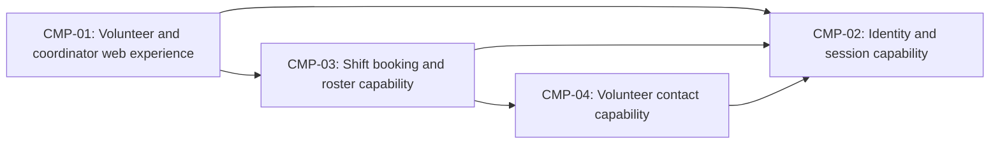

# ARCH-001 — Volunteer shift sign-up for the Riverside Food Bank architecture

## 1. Context and scope

This draft examines PRD-001 version 1, status approved, owned by Priya Nair.
The product lets approximately 120 volunteers sign in and book warehouse shifts
from mobile web pages, and lets the coordinator view each day's roster. Payroll,
donations and an installed mobile app are outside scope.

The request explicitly selected PRD-001 and instructed proceeding without questions.
No inspection scope was named; no code or configuration was inspected. No existing
ARCH, ADR or policy documents were found in their contract directories, and the
local preference file was absent. Framework defaults apply. Creating ARCH-001 is
the proposed outcome because no existing ARCH covers this system; the outcome is
unconfirmed. No ADR is written and no architectural choice is accepted by this draft.

## 2. Quality drivers

PRD-001#NFR-001 requires administrator revocation of volunteer sessions to take
effect within five minutes. This governs sign-in and subsequent authenticated
booking access; choosing a provider alone does not establish this guarantee.
PRD-001#NFR-002 limits visibility of volunteer phone numbers to the coordinator,
requiring a trusted access boundary around contact data and roster responses.
PRD-001#NFR-003 requires hosted services for the whole product because there is no
on-site server.

The operating context is `internal`, as stated in PRD-001; the Pilot release label
does not change it. Its required quality categories are constraint, security and
privacy, all covered by the three NFRs above. No required category is missing.
PRD-001#FR-002 and PRD-001#FR-003 also need a common booking authority and an agreed
way for committed bookings to reach the live roster described in the summary.
No roster freshness target is specified; that product clarification is recorded
in section 8 without inventing a requirement.

## 3. Components

The following is a proposed logical decomposition, not accepted deployment or
data ownership. ARCH-001#DEC-07 governs its boundaries; ARCH-001#DEC-03 and
ARCH-001#DEC-05 govern the proposed data owners. Arrows show proposed interactions,
not selected protocols. Authentication integration depends on ARCH-001#DEC-01 and
ARCH-001#DEC-02; roster delivery depends on ARCH-001#DEC-06.



```yaml items
components:
  - id: CMP-01
    status: active
    name: "Volunteer and coordinator web experience"
    responsibility: "Proposed mobile web entry point for sign-in, booking and roster viewing; does not own authoritative records or enforce access solely in the browser."
    owns_data: []
    interacts_with:
      - "CMP-02"
      - "CMP-03"
    deployment: "Open: see DEC-08"
    upstream:
      - {id: PRD-001, item: NFR-001, relation: informed_by, version: 1, hash: null}
      - {id: PRD-001, item: NFR-002, relation: informed_by, version: 1, hash: null}
      - {id: PRD-001, item: NFR-003, relation: informed_by, version: 1, hash: null}
  - id: CMP-02
    status: active
    name: "Identity and session capability"
    responsibility: "Proposed owner of authentication and administrator-triggered session invalidation; does not own shifts, bookings or volunteer contact records. Provider and revocation mechanism remain open."
    owns_data:
      - "Proposed: identity subjects and authentication state"
      - "Proposed: session validity and revocation state"
    interacts_with:
      - "CMP-01"
      - "CMP-03"
      - "CMP-04"
    deployment: "Open: see DEC-08"
    upstream:
      - {id: PRD-001, item: NFR-001, relation: informed_by, version: 1, hash: null}
      - {id: PRD-001, item: NFR-003, relation: informed_by, version: 1, hash: null}
  - id: CMP-03
    status: active
    name: "Shift booking and roster capability"
    responsibility: "Proposed authority for open shifts, booking commits and roster reads; consumes authenticated identity and restricted contact views without owning credentials or phone numbers."
    owns_data:
      - "Proposed: warehouse shifts and availability"
      - "Proposed: bookings associated with volunteer identifiers"
    interacts_with:
      - "CMP-01"
      - "CMP-02"
      - "CMP-04"
    deployment: "Open: see DEC-08"
    upstream:
      - {id: PRD-001, item: NFR-001, relation: informed_by, version: 1, hash: null}
      - {id: PRD-001, item: NFR-002, relation: informed_by, version: 1, hash: null}
      - {id: PRD-001, item: NFR-003, relation: informed_by, version: 1, hash: null}
  - id: CMP-04
    status: active
    name: "Volunteer contact capability"
    responsibility: "Proposed authority for volunteer contact records and coordinator-only phone-number access; does not own credentials or booking state. Access enforcement remains a decision."
    owns_data:
      - "Proposed: volunteer contact records including phone numbers"
    interacts_with:
      - "CMP-02"
      - "CMP-03"
    deployment: "Open: see DEC-08"
    upstream:
      - {id: PRD-001, item: NFR-002, relation: informed_by, version: 1, hash: null}
      - {id: PRD-001, item: NFR-003, relation: informed_by, version: 1, hash: null}
```

## 4. Architectural questions

Every question remains blocking and open. No approved platform mandate applies,
and the request to proceed without questions does not select a decision.

```yaml items
decisions:
  - id: DEC-01
    status: active
    question: "Which identity provider handles volunteer sign-in?"
    blocking: true
    state: open
    resolved_by: []
    notes: "Captures the PRD NEEDS ADR marker. The provider supplies identities used by booking and capabilities needed by session revocation; it does not settle the revocation mechanism."
    upstream:
      - {id: PRD-001, item: FR-001, relation: informed_by, version: 1, hash: null}
      - {id: PRD-001, item: FR-002, relation: informed_by, version: 1, hash: null}
      - {id: PRD-001, item: NFR-001, relation: informed_by, version: 1, hash: null}
  - id: DEC-02
    status: active
    question: "How is administrator revocation enforced across volunteer sessions and protected booking requests within five minutes?"
    blocking: true
    state: open
    resolved_by: []
    notes: "Sign-in and booking must share session validity semantics. Online validity checks and bounded credential lifetimes have different availability and propagation costs; no mechanism or cache lifetime is accepted."
    upstream:
      - {id: PRD-001, item: FR-001, relation: informed_by, version: 1, hash: null}
      - {id: PRD-001, item: FR-002, relation: informed_by, version: 1, hash: null}
      - {id: PRD-001, item: NFR-001, relation: informed_by, version: 1, hash: null}
  - id: DEC-03
    status: active
    question: "Which component is the authoritative owner of volunteer contact data consumed by the coordinator experience?"
    blocking: true
    state: open
    resolved_by: []
    notes: "CMP-04 is a proposed logical owner only. Contact ownership must be shared across roster and privacy work; phone numbers need not be placed in booking records."
    upstream:
      - {id: PRD-001, item: FR-003, relation: informed_by, version: 1, hash: null}
      - {id: PRD-001, item: NFR-002, relation: informed_by, version: 1, hash: null}
  - id: DEC-04
    status: active
    question: "What trusted authorization boundary ensures only the coordinator can retrieve volunteer phone numbers?"
    blocking: true
    state: open
    resolved_by: []
    notes: "Coordinator role authority and enforcement must agree across contact access and roster delivery. Hiding fields in browser screens alone cannot enforce the requirement. This is separate from choosing the volunteer identity provider."
    upstream:
      - {id: PRD-001, item: FR-003, relation: informed_by, version: 1, hash: null}
      - {id: PRD-001, item: NFR-002, relation: informed_by, version: 1, hash: null}
  - id: DEC-05
    status: active
    question: "Which component and persistent store form the authority for shift availability and committed bookings?"
    blocking: true
    state: open
    resolved_by: []
    notes: "Booking and roster epics need one agreed source of truth. CMP-03 proposes that responsibility; storage and the atomic booking boundary remain unselected. Table designs and migrations belong to later specifications."
    upstream:
      - {id: PRD-001, item: FR-002, relation: informed_by, version: 1, hash: null}
      - {id: PRD-001, item: FR-003, relation: informed_by, version: 1, hash: null}
  - id: DEC-06
    status: active
    question: "How do committed bookings become visible in the coordinator's roster?"
    blocking: true
    state: open
    resolved_by: []
    notes: "Shared authoritative reads or an asynchronously updated roster view imply different consistency and operating costs. The live-roster summary supplies context but no freshness target; none is invented here."
    upstream:
      - {id: PRD-001, item: FR-002, relation: informed_by, version: 1, hash: null}
      - {id: PRD-001, item: FR-003, relation: informed_by, version: 1, hash: null}
  - id: DEC-07
    status: active
    question: "What logical component boundaries separate the web experience, identity and sessions, booking and roster, and contact access?"
    blocking: true
    state: open
    resolved_by: []
    notes: "CMP-01 through CMP-04 describe proposed responsibilities. Combining capabilities as modules or separating them as services changes integration and security enforcement responsibilities; no boundary choice has been accepted."
    upstream:
      - {id: PRD-001, item: FR-001, relation: informed_by, version: 1, hash: null}
      - {id: PRD-001, item: FR-002, relation: informed_by, version: 1, hash: null}
      - {id: PRD-001, item: FR-003, relation: informed_by, version: 1, hash: null}
      - {id: PRD-001, item: NFR-001, relation: informed_by, version: 1, hash: null}
      - {id: PRD-001, item: NFR-002, relation: informed_by, version: 1, hash: null}
  - id: DEC-08
    status: active
    question: "Which hosted services and deployment units run the whole product?"
    blocking: true
    state: open
    resolved_by: []
    notes: "The PRD requires hosted services but selects no provider or topology. Web delivery, authentication, application execution and persistent storage all need a shared deployment plan; no on-site server may be assumed."
    upstream:
      - {id: PRD-001, item: FR-001, relation: informed_by, version: 1, hash: null}
      - {id: PRD-001, item: FR-002, relation: informed_by, version: 1, hash: null}
      - {id: PRD-001, item: FR-003, relation: informed_by, version: 1, hash: null}
      - {id: PRD-001, item: NFR-003, relation: informed_by, version: 1, hash: null}
```

## 5. Evidence inspected

```yaml items
evidence:
  - id: EVD-01
    status: active
    source: "PRD-001"
    kind: prd
    finding: "Version 1, status approved: mobile web volunteer sign-in and booking, coordinator roster, session revocation within five minutes, coordinator-only phone-number visibility, and whole-product hosted services. An explicit NEEDS ADR marker names the sign-in identity provider. Operating context is internal."
    classification: context
```

## 6. Deployment

PRD-001#NFR-003 fixes hosted operation for the whole product. ARCH-001#DEC-08
leaves service providers, deployable units and environments open. The four logical
components above do not imply four deployed services. No implementation, hosting
configuration or reusable service was inspected, so none is asserted to exist.

## 7. Requirement changes proposed to the PRD owner

- None.

## 8. Open questions

- [NEEDS CLARIFICATION: No inspection scope was named and no code or configuration was inspected; existing implementation, reusable capabilities and deployment arrangements are unknown.]
- [NEEDS CLARIFICATION: Priya Nair should specify the acceptable freshness of the live roster in PRD-001; the summary says live but PRD-001#FR-003 sets no timing target. This product clarification is not itself an architectural decision.]
- [NEEDS CLARIFICATION: host model/session identity unavailable]

## Change Log

| Version | Date | Author | Change | Items affected |
|---|---|---|---|---|
| 1 | 2026-09-28 | codex (session unknown) | Initial draft for PRD-001 v1; proposed components and open architectural questions, with outcome unconfirmed. Policy resolution: interview.max_calls=8 (default); architecture.mandated_platforms=none (default); quality.required_categories=floor only (default) | all |
| 1 | 2026-09-28 | codex (session unknown) | Validation unresolved: exact host model and session identities unavailable (self-check 3, BEH-13, VER-14). Draft retained; no approvals or decision resolutions required restoration. Readiness handoff withheld. Policy resolution: interview.max_calls=8 (default); architecture.mandated_platforms=none (default); quality.required_categories=floor only (default) | generated_by |
