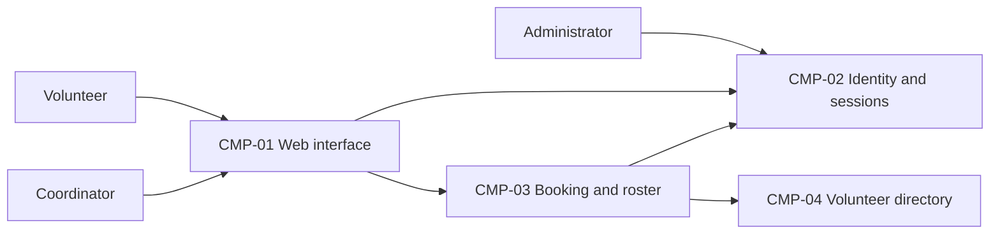

# ARCH-001 — Volunteer shift sign-up for the Riverside Food Bank architecture

## 1. Context and scope

This draft examines PRD-001 version 1, status approved, owned by Priya Nair. The
system serves approximately 120 volunteers and one coordinator through mobile-first
web pages. It covers volunteer sign-in, booking open warehouse shifts, and the
coordinator's daily roster. Payroll and donations are outside the product scope.

No inspection scope was named and no code or configuration was inspected. Existing
implementation, infrastructure and reusable services are unknown. No existing ARCH,
ADR, policy document or local preference file was found at the contract paths.

Creating ARCH-001 is the proposed outcome because no ARCH covers the system. The
request selected PRD-001 and instructed proceeding without questions; it did not
confirm an outcome or accept individual architectural decisions. Accordingly,
outcome remains null, all architectural questions remain open, and no ADR is written.
The component model below is a proposal, not an accepted implementation baseline.

## 2. Quality drivers

PRD-001's operating context is internal. The Pilot release label does not override
that explicit context. The framework requires constraint, security and privacy;
all three categories have requirements, and no policy adds further categories.

PRD-001#NFR-001 requires an administrator to revoke a volunteer's signed-in
sessions, with enforcement within five minutes. Provider choice alone cannot settle
this: session ownership and enforcement across protected requests require their
own answer in ARCH-001#DEC-02. Verification must exercise an already active session
after revocation, including attempts to book a shift, against that five-minute bound.

PRD-001#NFR-002 restricts volunteer phone numbers to the coordinator. Contact-data
ownership and authorization must be shared across roster and booking work, with
enforcement at the data-serving boundary. Verification must show that volunteers
cannot retrieve phone numbers through requests as well as through pages.

PRD-001#NFR-003 requires hosted services for the entire product because no on-site
server is available. It constrains every proposed component but does not choose
providers, deployment units, or operating environments; ARCH-001#DEC-07 remains open.

## 3. Components

These are proposed logical responsibilities. ARCH-001#DEC-03 governs their boundaries;
ARCH-001#DEC-04 governs business-data ownership. Arrows show required collaboration,
not a selected transport or service topology. No separate physical service is implied.



```yaml items
components:
  - id: CMP-01
    status: active
    name: "Volunteer and coordinator web interface"
    responsibility: "Presents sign-in, shift booking and daily roster views; does not authoritatively own business data or enforce access through presentation alone."
    owns_data: []
    interacts_with:
      - "CMP-02"
      - "CMP-03"
    deployment: "Open: see DEC-07"
    upstream:
      - {id: PRD-001, item: NFR-002, relation: informed_by, version: 1, hash: null}
      - {id: PRD-001, item: NFR-003, relation: informed_by, version: 1, hash: null}
  - id: CMP-02
    status: active
    name: "Identity and session capability"
    responsibility: "Proposed authority for authentication and administrator-triggered session revocation; does not own warehouse bookings. Provider and enforcement mechanism remain open."
    owns_data:
      - "Proposed: authenticated identities and session or revocation state, subject to DEC-01 and DEC-02"
    interacts_with:
      - "CMP-01"
      - "CMP-03"
      - "Administrator"
    deployment: "Open: see DEC-07"
    upstream:
      - {id: PRD-001, item: NFR-001, relation: informed_by, version: 1, hash: null}
      - {id: PRD-001, item: NFR-003, relation: informed_by, version: 1, hash: null}
  - id: CMP-03
    status: active
    name: "Booking and roster capability"
    responsibility: "Proposed authority for open shifts and bookings, serving the daily roster and enforcing request access; does not own credentials or duplicate authoritative contact records."
    owns_data:
      - "Proposed: warehouse shifts and bookings, subject to DEC-04"
    interacts_with:
      - "CMP-01"
      - "CMP-02"
      - "CMP-04"
    deployment: "Open: see DEC-07"
    upstream:
      - {id: PRD-001, item: NFR-001, relation: informed_by, version: 1, hash: null}
      - {id: PRD-001, item: NFR-002, relation: informed_by, version: 1, hash: null}
      - {id: PRD-001, item: NFR-003, relation: informed_by, version: 1, hash: null}
  - id: CMP-04
    status: active
    name: "Volunteer directory capability"
    responsibility: "Proposed authority for volunteer contact records and their association with identity and booking records; provides phone numbers only through coordinator-authorized access and does not authenticate users."
    owns_data:
      - "Proposed: volunteer profiles, phone numbers and identity associations, subject to DEC-04"
    interacts_with:
      - "CMP-03"
    deployment: "Open: see DEC-07"
    upstream:
      - {id: PRD-001, item: NFR-002, relation: informed_by, version: 1, hash: null}
      - {id: PRD-001, item: NFR-003, relation: informed_by, version: 1, hash: null}
```

## 4. Architectural questions

```yaml items
decisions:
  - id: DEC-01
    status: active
    question: "Which identity provider handles volunteer sign-in?"
    blocking: true
    state: open
    resolved_by: []
    notes: "Captures the PRD NEEDS ADR marker. Provider choice affects the identity used for signed-in booking and the available session controls, but does not answer DEC-02. No mandate or explicit decision exists."
    upstream:
      - {id: PRD-001, item: FR-001, relation: informed_by, version: 1, hash: null}
      - {id: PRD-001, item: FR-002, relation: informed_by, version: 1, hash: null}
      - {id: PRD-001, item: NFR-001, relation: informed_by, version: 1, hash: null}
  - id: DEC-02
    status: active
    question: "How will administrator-triggered volunteer session revocation be enforced within five minutes?"
    blocking: true
    state: open
    resolved_by: []
    notes: "Sign-in and protected booking must share session validity and revocation semantics, including any caches. Provider-owned enforcement and application-owned session validation have different integration responsibilities; neither is selected."
    upstream:
      - {id: PRD-001, item: FR-001, relation: informed_by, version: 1, hash: null}
      - {id: PRD-001, item: FR-002, relation: informed_by, version: 1, hash: null}
      - {id: PRD-001, item: NFR-001, relation: informed_by, version: 1, hash: null}
  - id: DEC-03
    status: active
    question: "What logical component boundaries will sign-in, booking, roster and volunteer-directory work share?"
    blocking: true
    state: open
    resolved_by: []
    notes: "CMP-01 through CMP-04 propose responsibility boundaries only. Epics must agree on these before independently assigning business logic and integration responsibilities; deployment units remain a separate question in DEC-07."
    upstream:
      - {id: PRD-001, item: FR-001, relation: informed_by, version: 1, hash: null}
      - {id: PRD-001, item: FR-002, relation: informed_by, version: 1, hash: null}
      - {id: PRD-001, item: FR-003, relation: informed_by, version: 1, hash: null}
  - id: DEC-04
    status: active
    question: "How is authoritative ownership of shifts, bookings and volunteer contact records assigned across components?"
    blocking: true
    state: open
    resolved_by: []
    notes: "The proposed booking and directory owners must share stable volunteer associations so roster work can relate bookings to people without introducing competing contact records. Data schemas and migrations belong to later specs."
    upstream:
      - {id: PRD-001, item: FR-002, relation: informed_by, version: 1, hash: null}
      - {id: PRD-001, item: FR-003, relation: informed_by, version: 1, hash: null}
      - {id: PRD-001, item: NFR-002, relation: informed_by, version: 1, hash: null}
  - id: DEC-05
    status: active
    question: "What shared authorization mechanism restricts volunteer phone-number access to the coordinator?"
    blocking: true
    state: open
    resolved_by: []
    notes: "Coordinator authority must be established and enforced wherever contact data is served, including roster responses. Administrator session-revocation authority does not imply permission to read phone numbers. No authorization mechanism is selected."
    upstream:
      - {id: PRD-001, item: FR-003, relation: informed_by, version: 1, hash: null}
      - {id: PRD-001, item: NFR-002, relation: informed_by, version: 1, hash: null}
  - id: DEC-06
    status: active
    question: "How will booking and roster components share committed booking state?"
    blocking: true
    state: open
    resolved_by: []
    notes: "Reading the authoritative booking state and maintaining a separate roster projection impose different consistency and failure-handling responsibilities. Epics must agree on this interaction; no numeric freshness target or transport is invented."
    upstream:
      - {id: PRD-001, item: FR-002, relation: informed_by, version: 1, hash: null}
      - {id: PRD-001, item: FR-003, relation: informed_by, version: 1, hash: null}
  - id: DEC-07
    status: active
    question: "What hosted deployment topology will run the whole product?"
    blocking: true
    state: open
    resolved_by: []
    notes: "The no-on-site-server constraint is given, but hosted platforms, deployment units and environments are not selected. The topology must support every feature, five-minute revocation and coordinator-only contact access."
    upstream:
      - {id: PRD-001, item: FR-001, relation: informed_by, version: 1, hash: null}
      - {id: PRD-001, item: FR-002, relation: informed_by, version: 1, hash: null}
      - {id: PRD-001, item: FR-003, relation: informed_by, version: 1, hash: null}
      - {id: PRD-001, item: NFR-001, relation: informed_by, version: 1, hash: null}
      - {id: PRD-001, item: NFR-002, relation: informed_by, version: 1, hash: null}
      - {id: PRD-001, item: NFR-003, relation: informed_by, version: 1, hash: null}
```

## 5. Evidence inspected

```yaml items
evidence:
  - id: EVD-01
    status: active
    source: "PRD-001"
    kind: prd
    finding: "Version 1, status approved: requires volunteer sign-in, signed-in shift booking and coordinator rosters; five-minute session revocation, coordinator-only phone numbers and hosted services constrain the design. Internal operating context is explicit. Identity provider choice is marked NEEDS ADR."
    classification: context
```

## 6. Deployment

PRD-001#NFR-003 establishes hosted execution for the whole product, with browser
access and no on-site server. ARCH-001#DEC-07 leaves the hosted platforms, physical
deployment units and environments open. The logical component diagram does not
commit to independently deployed services or to any database technology.

The PRD's Tuesday and Thursday pilot followed by wider shift coverage is a rollout
sequence, not evidence of existing test or production infrastructure. Infrastructure
availability, operational ownership and provider capabilities have not been inspected.

## 7. Requirement changes proposed to the PRD owner

- None.

## 8. Open questions

- [NEEDS CLARIFICATION: No inspection scope was named and no code or configuration was inspected; existing implementation, reusable services and hosting capability are unknown.]
- [NEEDS CLARIFICATION: ARCH-001#DEC-01 through ARCH-001#DEC-07 remain open because no mandated platform or explicit architectural decision settles them; the request requires proceeding without questions.]
- [NEEDS CLARIFICATION: The proposed create outcome for ARCH-001 is unconfirmed; defining architecture does not confirm the outcome.]
- [NEEDS CLARIFICATION: host model/session identity unavailable]

## Change Log

| Version | Date | Author | Change | Items affected |
|---|---|---|---|---|
| 1 | 2026-09-28 | codex (session unknown) | Initial draft for PRD-001 v1. Policy resolution: interview.max_calls=8 (default); architecture.mandated_platforms=none (default); quality.required_categories=floor only (default) | all |
| 1 | 2026-09-28 | codex (session unknown) | Validation audit: self-check item 3 remains unresolved because exact host model and session identities are unavailable. Retained draft status, empty approvals and open decisions; no approval or resolution required restoration. Readiness handoff withheld. Policy resolution: interview.max_calls=8 (default); architecture.mandated_platforms=none (default); quality.required_categories=floor only (default) | generated_by |
