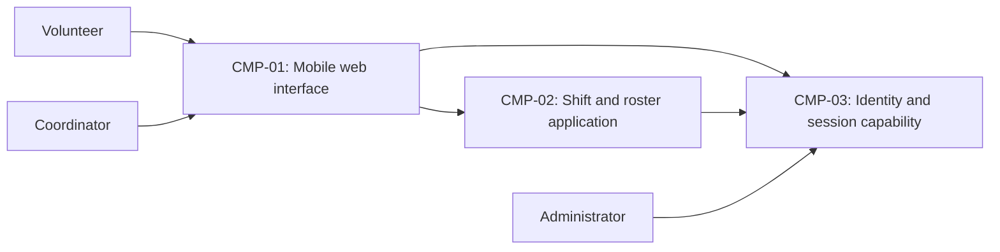

# ARCH-001 — Volunteer shift sign-up for the Riverside Food Bank architecture

## 1. Context and scope

This draft examines PRD-001 version 1, status approved, owned by Priya Nair. The
system lets approximately 120 volunteers sign in and book warehouse shifts from
mobile web browsers, and lets the coordinator view daily rosters. Payroll and
donations are outside scope. The pilot starts with Tuesday and Thursday shifts.

The request explicitly selected PRD-001 and instructed proceeding without
questions. No inspection scope was named and no code or configuration was
inspected. No existing ARCH, ADR, policy document or local preference file was
found at the contract paths. Framework defaults apply. Applicable repository
instruction files were checked at the root and documentation ancestor paths;
none were present.

Creating ARCH-001 is the proposed outcome because no ARCH covers the system.
The outcome remains unconfirmed. The components below describe a proposed
arrangement, not accepted boundaries or implementation evidence. No architectural
decision was accepted and no ADR was written.

## 2. Quality drivers

PRD-001#NFR-001 requires an administrator to revoke volunteer sessions, with
revocation effective within five minutes. Identity-provider selection and the
revocation mechanism are separate questions: selecting a provider alone cannot
establish the time bound. Sign-in and authenticated booking must agree on what
constitutes a valid session.

PRD-001#NFR-002 restricts volunteer phone numbers to the coordinator. Contact-data
ownership and enforcement of coordinator access must be shared across components;
browser display rules alone do not establish this restriction.

PRD-001#NFR-003 requires hosted services for the whole product because there is no
on-site server. This constrains all functional requirements and the infrastructure
supporting session security and contact privacy. It does not select a hosting
provider, deployment topology or persistence service.

The operating context is internal, as stated in PRD-001. Its required quality
categories are constraint, security and privacy; all are covered by the three
NFRs. No additional category is required by policy. The release name Pilot does
not override the explicit operating context. No performance or availability
target is inferred from the volunteer count.

## 3. Components

The diagram shows proposed logical responsibilities. ARCH-001#DEC-03 leaves their
boundaries open; ARCH-001#DEC-04 and ARCH-001#DEC-06 leave data ownership open.
ARCH-001#DEC-07 leaves the booking-to-roster interaction open. Arrows describe
needed cooperation, not an accepted protocol or deployment topology.



```yaml items
components:
  - id: CMP-01
    status: active
    name: "Mobile web interface"
    responsibility: "Proposed volunteer sign-in and booking screens and coordinator roster screens; does not own authoritative domain data or enforce access solely in the browser."
    owns_data: []
    interacts_with:
      - "CMP-02"
      - "CMP-03"
    deployment: "Open: see DEC-08"
    upstream:
      - {id: PRD-001, item: NFR-001, relation: informed_by, version: 1, hash: null}
      - {id: PRD-001, item: NFR-002, relation: informed_by, version: 1, hash: null}
      - {id: PRD-001, item: NFR-003, relation: informed_by, version: 1, hash: null}
  - id: CMP-02
    status: active
    name: "Shift and roster application"
    responsibility: "Proposed application responsibilities for authenticated booking, daily roster queries and coordinator-only contact access; does not own authentication credentials. Boundaries and ownership remain subject to DEC-03 through DEC-07."
    owns_data:
      - "Proposed: warehouse shifts and bookings, subject to DEC-06"
      - "Proposed: volunteer contact records including phone numbers, subject to DEC-04"
    interacts_with:
      - "CMP-01"
      - "CMP-03"
    deployment: "Open: see DEC-08"
    upstream:
      - {id: PRD-001, item: NFR-001, relation: informed_by, version: 1, hash: null}
      - {id: PRD-001, item: NFR-002, relation: informed_by, version: 1, hash: null}
      - {id: PRD-001, item: NFR-003, relation: informed_by, version: 1, hash: null}
  - id: CMP-03
    status: active
    name: "Identity and session capability"
    responsibility: "Proposed authentication and session-lifecycle responsibility, including administrator-triggered revocation; does not own shifts or bookings. Provider and revocation integration remain open in DEC-01 and DEC-02."
    owns_data:
      - "Proposed: authentication identities and session lifecycle state, subject to DEC-01 and DEC-02"
    interacts_with:
      - "CMP-01"
      - "CMP-02"
      - "Administrator"
    deployment: "Open: see DEC-08"
    upstream:
      - {id: PRD-001, item: NFR-001, relation: informed_by, version: 1, hash: null}
      - {id: PRD-001, item: NFR-003, relation: informed_by, version: 1, hash: null}
```

## 4. Architectural questions

Each question is blocking and unanswered. Requirement links identify the affected
behavior or quality at PRD-001 version 1. There is no mandated platform that can
resolve a question without a user decision.

```yaml items
decisions:
  - id: DEC-01
    status: active
    question: "Which identity provider handles volunteer sign-in?"
    blocking: true
    state: open
    resolved_by: []
    notes: "Captures the explicit PRD NEEDS ADR marker. The provider supplies identities used by authenticated booking and must support integration with the revocation mechanism; selecting it does not resolve DEC-02. No provider was selected."
    upstream:
      - {id: PRD-001, item: FR-001, relation: informed_by, version: 1, hash: null}
      - {id: PRD-001, item: FR-002, relation: informed_by, version: 1, hash: null}
      - {id: PRD-001, item: NFR-001, relation: informed_by, version: 1, hash: null}
  - id: DEC-02
    status: active
    question: "How does administrator-triggered session revocation become effective at all volunteer session consumers within five minutes?"
    blocking: true
    state: open
    resolved_by: []
    notes: "Sign-in creates the sessions and booking consumes them. A shared session-validation and revocation mechanism must establish the five-minute bound, including any cached validity. No mechanism was selected."
    upstream:
      - {id: PRD-001, item: FR-001, relation: informed_by, version: 1, hash: null}
      - {id: PRD-001, item: FR-002, relation: informed_by, version: 1, hash: null}
      - {id: PRD-001, item: NFR-001, relation: informed_by, version: 1, hash: null}
  - id: DEC-03
    status: active
    question: "What component boundaries divide the web interface, identity integration, booking and roster responsibilities?"
    blocking: true
    state: open
    resolved_by: []
    notes: "CMP-01 through CMP-03 are a proposed logical arrangement. Whether booking and roster share an application boundary or use separate services is undecided; independent epics must agree on these responsibilities."
    upstream:
      - {id: PRD-001, item: FR-001, relation: informed_by, version: 1, hash: null}
      - {id: PRD-001, item: FR-002, relation: informed_by, version: 1, hash: null}
      - {id: PRD-001, item: FR-003, relation: informed_by, version: 1, hash: null}
  - id: DEC-04
    status: active
    question: "Which component is the authoritative owner of volunteer contact data, including phone numbers?"
    blocking: true
    state: open
    resolved_by: []
    notes: "Application ownership is shown provisionally. The coordinator-facing roster and the privacy boundary need an agreed contact-data authority; this does not decide how access is enforced in DEC-05."
    upstream:
      - {id: PRD-001, item: FR-003, relation: informed_by, version: 1, hash: null}
      - {id: PRD-001, item: NFR-002, relation: informed_by, version: 1, hash: null}
  - id: DEC-05
    status: active
    question: "How is coordinator-only access to volunteer phone numbers enforced across contact-data access paths?"
    blocking: true
    state: open
    resolved_by: []
    notes: "The roster's coordinator access and contact-data access need a shared authorization boundary and trusted coordinator-role source. The PRD does not require phone numbers to appear in the roster, and this question does not add that feature."
    upstream:
      - {id: PRD-001, item: FR-003, relation: informed_by, version: 1, hash: null}
      - {id: PRD-001, item: NFR-002, relation: informed_by, version: 1, hash: null}
  - id: DEC-06
    status: active
    question: "Which component owns authoritative shift availability and booking records?"
    blocking: true
    state: open
    resolved_by: []
    notes: "Booking and roster epics must agree on the source of truth. Application ownership is provisional; exact persistence schemas and booking rules belong to later specifications."
    upstream:
      - {id: PRD-001, item: FR-002, relation: informed_by, version: 1, hash: null}
      - {id: PRD-001, item: FR-003, relation: informed_by, version: 1, hash: null}
  - id: DEC-07
    status: active
    question: "How do accepted bookings become visible to the coordinator's roster across component boundaries?"
    blocking: true
    state: open
    resolved_by: []
    notes: "Booking and roster must share an interaction and consistency contract. Reading the booking authority and maintaining a separately updated roster view have different coordination costs; no approach or numerical freshness target was selected."
    upstream:
      - {id: PRD-001, item: FR-002, relation: informed_by, version: 1, hash: null}
      - {id: PRD-001, item: FR-003, relation: informed_by, version: 1, hash: null}
  - id: DEC-08
    status: active
    question: "What hosted deployment topology runs the whole product and its supporting state?"
    blocking: true
    state: open
    resolved_by: []
    notes: "The hosted-only constraint is given, but provider, deployment units and environments are undecided. This whole-product choice affects all three features and the infrastructure that enforces session revocation and contact privacy."
    upstream:
      - {id: PRD-001, item: FR-001, relation: informed_by, version: 1, hash: null}
      - {id: PRD-001, item: FR-002, relation: informed_by, version: 1, hash: null}
      - {id: PRD-001, item: FR-003, relation: informed_by, version: 1, hash: null}
      - {id: PRD-001, item: NFR-001, relation: informed_by, version: 1, hash: null}
      - {id: PRD-001, item: NFR-002, relation: informed_by, version: 1, hash: null}
      - {id: PRD-001, item: NFR-003, relation: informed_by, version: 1, hash: null}
```

## 5. Evidence inspected

```yaml items
evidence:
  - id: EVD-01
    status: active
    source: "PRD-001"
    kind: prd
    finding: "Version 1, status approved: FR-001 requires volunteer sign-in and has an identity-provider NEEDS ADR marker; FR-002 requires authenticated shift booking; FR-003 requires daily coordinator rosters. NFR-001 requires session revocation within five minutes, NFR-002 restricts phone numbers to the coordinator, and NFR-003 requires hosted services for the whole product. Operating context is internal."
    classification: context
```

## 6. Deployment

All server-side application, identity and persistence capabilities must use hosted
services under PRD-001#NFR-003; volunteers use their existing mobile browsers.
ARCH-001#DEC-08 leaves the hosted provider, deployment units, environments and
supporting state placement open. The logical components are not a commitment to
separate deployable services. No on-site server or existing reusable deployment
has been assumed.

## 7. Requirement changes proposed to the PRD owner

- None.

## 8. Open questions

- [NEEDS CLARIFICATION: No inspection scope was named and no code or configuration was inspected; existing implementation, reusable services and deployment capabilities are unknown.]
- [NEEDS CLARIFICATION: The proposed create outcome for ARCH-001 has not been confirmed; outcome remains null under the request to proceed without questions.]
- [NEEDS CLARIFICATION: host model/session identity unavailable]

## Change Log

| Version | Date | Author | Change | Items affected |
|---|---|---|---|---|
| 1 | 2026-09-28 | codex (session unknown) | Initial draft for PRD-001 v1. Policy resolution: interview.max_calls=8 (default); architecture.mandated_platforms=none (default); quality.required_categories=floor only (default) | all |
