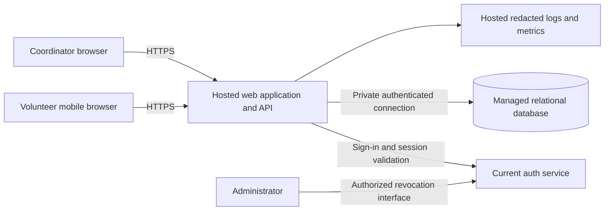

# ARCH-001 — Volunteer shift sign-up

## Scope and decisions

This architecture implements [PRD-001](../prd/PRD-001.md) version 1 for about
120 volunteers and one coordinator. A mobile web application supports sign-in,
booking open warehouse shifts, and viewing each day's roster. Include FR-003 in
the pilot despite its lower priority. Payroll and donations remain out of scope.

Use one hosted application with internal auth, booking, and roster modules and a
managed relational database. This keeps booking consistency inside one database
transaction and limits operational components at this scale. Reuse the current
auth service for sign-in, as directed by the user; see [ADR-001](../adr/ADR-001.md).
No replacement identity provider or separate credential store is introduced.
Hosting vendor, language, and framework remain implementation choices because
the workspace provides no existing stack or platform requirements.

Evidence available: the approved PRD and the user's auth reuse instruction. There
is no application code, auth contract, repository instruction file, test runner,
or validation configuration in this workspace. The auth capabilities described
below are required integration contracts, not verified existing capabilities.

## Components and trust boundaries

The browser is untrusted. The API authenticates and authorizes every protected
request; UI visibility never grants access. The database is accessible only to
the application and restricted operations accounts, never directly to browsers.
The application, database, backups, secrets, monitoring, and auth dependency must
all run on hosted services to satisfy NFR-003. Existing auth hosting is unverified.

| Component | Responsibility |
|---|---|
| Mobile web UI | Sign-in entry, open shifts, booking confirmation, coordinator daily roster |
| Auth adapter | Integrate the current sign-in flow; validate identity and session freshness; expose a stable internal principal |
| Authorization module | Map trusted identity to local volunteer/coordinator permissions; deny by default |
| Booking module | List availability and atomically enforce shift capacity and one booking per volunteer per shift |
| Roster module | Read committed bookings for a local calendar day; return contact fields only to the coordinator |
| Managed database | Store shifts, bookings, minimal volunteer profiles, role assignments, and revocation state if required |

## Identity, sessions, and revocation

FR-001 uses the current service's supported sign-in flow through the auth adapter.
Do not assume it supports OIDC, JWTs, introspection, or revocation webhooks until
its contract is inspected. Prefer a server-side session with an opaque Secure,
HttpOnly cookie; apply SameSite settings compatible with the verified sign-in
flow and CSRF protection to mutations. Validate callback state and redirect
targets where the existing protocol uses callbacks. Keep credentials and upstream
tokens out of browser storage, URLs, logs, and application profile records.

Map the service's stable issuer/subject identity to a local volunteer ID, never
an editable name or phone number. Provision known volunteers and the coordinator
through a restricted import/configuration step for the pilot. Role assignments
are server controlled and cannot be supplied through booking requests or profile
updates. An auth administrator does not automatically receive coordinator access.

NFR-001 is a hard acceptance condition: after an administrator revokes a
volunteer's sessions, every previously signed-in session must stop authorizing
protected requests within 300 seconds, across browsers and application instances.
Measure from the administrator's successful revocation operation, not from webhook
delivery or the next login. Refresh credentials must not restore a revoked session.
New interactive sign-in is distinct from reusing a revoked session; account
disablement is not required by this PRD.

The preferred contract is authoritative session validation on each protected
request, with no positive validation cache in the pilot. The service must expose
revocation state with a proven bound. Any later caching must meet the end-to-end
budget: service propagation + cache lifetime + clock tolerance + request
authorization delay <= 300 seconds. Token signature validation alone is
insufficient evidence of revocation. Request timeouts and freshness checks must
prevent a delayed validation result from authorizing access beyond that budget;
revalidate before a delayed booking commit. Do not serve authenticated data from
shared caches or retain long-lived authenticated streams in the pilot.

If current auth cannot provide bounded revocation, retain it for sign-in and
evaluate an application session registry with a shared per-user revocation epoch.
Every application session and refresh path must check that epoch. This is viable
only if the administrator's actual revocation workflow updates the epoch within
the budget and old upstream sessions cannot silently mint fresh application
sessions. Local logout or an isolated denylist does not prove service-wide
revocation. Until one complete path is verified, NFR-001 is BLOCKED and the pilot
must not claim compliance. Do not silently replace the auth service.

When session validity cannot be established, fail closed with a retryable service
error; never authorize using stale identity. An invalid/revoked session receives
401, while an authenticated principal lacking permission receives 403.

## Data and consistency

| Entity | Fields and constraints |
|---|---|
| Volunteer | ID, auth issuer/subject (unique pair), display name, active flag |
| VolunteerContact | Volunteer ID (unique foreign key), phone number; coordinator-only application reads |
| RoleAssignment | Principal ID and role; restricted provisioning; no client-selected roles |
| Shift | ID, start/end instants, warehouse timezone, positive capacity, open/closed state |
| Booking | ID, shift ID, volunteer ID, created time; foreign keys and unique (shift ID, volunteer ID) |

Phone storage is separate to reduce accidental inclusion in general profile
queries. APIs use explicit field allowlists. No volunteer response, including
their own profile, includes a phone number: the PRD permits visibility only to
the coordinator. Administrator revocation screens and ordinary operational tools
also omit phones. Restrict database operations access; backups and infrastructure
privileges do not confer a product-level contact viewing role.

Booking executes in one transaction: authenticate, derive volunteer ID from the
principal, lock the shift row, check for an existing booking, verify the shift is
open and in the future, count committed bookings, enforce capacity, insert, and
commit. All booking writers must use the same locking rule. Return an existing
booking on a duplicate retry. A unique constraint is the final duplicate guard;
concurrent requests for the last place yield exactly one new booking. The initial
availability display is advisory; the transaction determines success.

Capacity and closure are proposed definitions of "open," which the PRD does not
specify. A warehouse timezone and actual shift capacities must be configured
before pilot data is loaded. Store instants consistently and use the warehouse
timezone for daily roster boundaries, including daylight-saving transitions.
Do not infer the warehouse timezone from the developer's environment.

## Application interfaces and flows

These paths are proposed application interfaces, not claims about auth endpoints.

| Interface | Access and behavior |
|---|---|
| Sign-in start/callback | Delegate to verified existing auth protocol; create local session only after validation |
| `GET /api/shifts` | Signed-in volunteer; open future pilot shifts with times and remaining capacity; no other volunteers' identities or contacts |
| `POST /api/shifts/{id}/bookings` | Signed-in active volunteer; caller books only for self; 201 on creation, 200 on duplicate retry, 409 if unavailable |
| `GET /api/rosters?date=YYYY-MM-DD` | Coordinator only; shifts and booked volunteer names/phones for the warehouse day, including empty shifts |
| Admin session revocation | Existing service's authorized administration surface, with an application integration only if needed for the verified revocation path |

After booking, return the committed confirmation and refresh availability. If a
response is lost, retrying cannot create another booking. Full or closed shifts
show an actionable unavailable state. On database failure, roll back and show a
retryable error; never display a successful booking before commit.

Roster reads use the primary database so committed bookings appear on the next
read. Refresh on page load, after coordinator-triggered refresh, and every 30
seconds while visible; show last refresh time and a stale indicator on failure.
The 30-second interval is a design choice, not an additional PRD SLA. Each poll
rechecks identity and coordinator permission. Send private responses with
`Cache-Control: no-store`; do not persist rosters offline. On access loss, clear
the rendered roster. No web socket or event pipeline is needed for this pilot.

## Privacy and operations

NFR-002 is enforced before contact queries and again by response field selection.
Exclude phone numbers and auth secrets from analytics, logs, errors, traces, and
audit event payloads. The coordinator UI receives phones only through the
protected roster endpoint. Do not add exports or notifications in this scope.
Record booking and revocation outcomes using internal IDs and timestamps.

Use encrypted transport, managed encryption at rest, hosted secret storage,
separate test/production credentials, managed database backups, and a tested
restore procedure. Configure retention and restricted backup access before
loading real volunteer contacts; no retention duration is specified by the PRD.
Monitor booking failures, capacity conflicts, auth validation failures, revocation
latency, and roster read errors without contact data. Deploy schema migrations
with an application rollback plan that preserves committed bookings.

Seed Tuesday/Thursday shifts through a restricted operational import for the
pilot. Shift editing, cancellation, waitlists, reminders, and a scheduling admin
UI are deferred; the PRD does not require them. Expand seeded schedules after the
pilot. SM-01 remains measured by the coordinator's shift log: booked capacity
alone does not prove that a shift started fully staffed.

## Dependencies and unresolved findings

| Finding | Impact and next evidence |
|---|---|
| Auth protocol, stable identity, revocation/refresh behavior, propagation bounds, and hosting are unavailable | Reuse decision is fixed; auth integration and NFR-001/NFR-003 compliance require service documentation plus integration evidence before release |
| Capacity, open-shift rules, warehouse timezone, and volunteer/contact source are unspecified | Use the explicit defaults above for design; configure actual values and validate the import before pilot |
| Coordinator/admin provisioning and retention policy are unavailable | Assign least-privilege roles and define contact/backup retention before production data loading |

## Requirement verification plan

PASS below would require observed execution against an implementation. All runtime
checks are currently NOT_RUN or BLOCKED; architectural coverage is not proof of
runtime compliance. Follow failing-test-first development when implementation
begins, using the eventual repository's test commands and quality gates.

| Requirement | Design coverage | Required acceptance evidence | Runtime status |
|---|---|---|---|
| FR-001 | Existing auth adapter and local principal mapping | Successful sign-in with current service; rejected invalid/expired identity; stable volunteer mapping | BLOCKED: auth contract unavailable |
| FR-002 | Booking module and database transaction | Signed-in volunteer books an open shift; unauthenticated/closed/full requests fail; concurrent last-place and duplicate-retry tests preserve invariants | NOT_RUN |
| FR-003 | Coordinator daily roster | Correct day, empty shifts, committed bookings, and refresh after another browser books; non-coordinator denied | NOT_RUN |
| NFR-001 | Bounded revocation on all protected paths | Revoke all sessions for one volunteer; exercise multiple devices/instances, cached validation if introduced, refresh and outage paths; observe no successful authorization after 300 seconds | BLOCKED: revocation contract unavailable |
| NFR-002 | Coordinator-only contact query and field allowlists | Role matrix for anonymous/volunteer/admin/coordinator; direct API attempts; inspect responses, errors, logs, traces, and caches for phone leakage | NOT_RUN |
| NFR-003 | Hosted application and all dependencies | Deployment inventory proves application, auth, database, backups, secrets, and monitoring require no on-site server | BLOCKED: deployment/auth hosting unavailable |
| Mobile web UX | Responsive browser UI | Complete sign-in and booking on phone-sized browser; keyboard-accessible forms and clear errors | NOT_RUN |
| SM-01 / rollout | Tuesday/Thursday pilot and coordinator log | Compare actual fully staffed shifts with the 83% baseline and 95% target at pilot end | NOT_RUN |

Document verification evidence is recorded in
[ARCH-001-verification](ARCH-001-verification.md). The approved PRD is preserved;
ADR-001 answers its identity-provider decision marker without rewriting the
approved source or inventing service capabilities.
