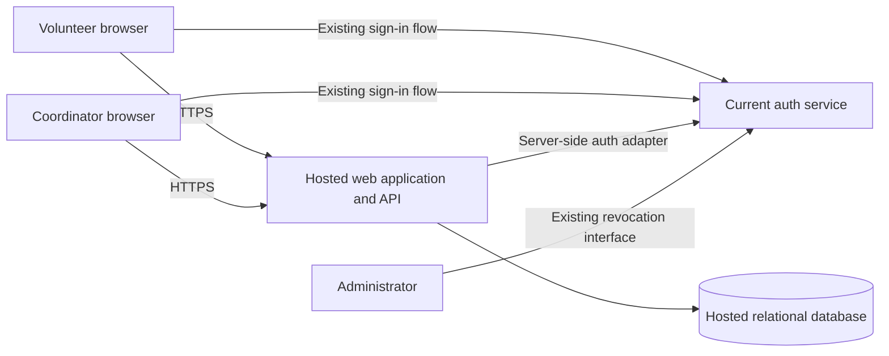

# ARCH-001 — Volunteer shift sign-up

## Scope and evidence

This design implements [PRD-001](../prd/PRD-001.md), version 1: mobile browser sign-in, volunteer booking, and the coordinator's daily roster. It includes the current-release roster requirement even though FR-003 has `should` priority. Payroll, donations, native apps, cancellation, waitlists, notifications, and a shift-management UI are outside this design.

The user directed reuse of the current auth service. [ADR-001](../adr/ADR-001.md) records that decision and the integration conditions. The supplied repository contains only the PRD; no application code, auth contract, deployment configuration, repository instructions, or test commands were available. Service capabilities and existing implementation conventions are therefore unverified. This document defines required behavior, not evidence that an implementation already satisfies it.

## Structure and hosting

Use one hosted web application with server-rendered or browser-rendered mobile pages and a server-side API, a hosted relational database, and the existing auth service. A single application is sufficient for approximately 120 volunteers and one coordinator; separate booking and roster services would add coordination work without a requirement that needs them. Select the implementation language and hosting vendor to match the organization's existing environment when that information is available.

The browser never connects directly to the database. The application separates authentication, booking, roster, and contact-data access in code within the same deployment. Database credentials and auth integration secrets remain in hosted secret storage. Use HTTPS, encrypted managed storage and backups, restricted service identities, and a tested restore procedure. No production component, including auth, may depend on an on-site server (NFR-003); the current service's hosting must be verified before release.

## Identity, sessions, and authorization

The current auth service owns credentials, sign-in, session issuance and renewal, and administrator revocation. The application implements an adapter to its documented protocol and does not introduce a second identity provider or password store. Do not assume OAuth, OIDC, JWTs, or a particular vendor without its contract.

The adapter exposes a verified principal containing a stable service-scoped subject, a session identifier or equivalent revocation handle, session expiry, and authoritative session-validity evidence. Map that subject to a provisioned application user. Unknown or disabled users receive no booking access. Provisioning must use a restricted operational path; the browser cannot assign roles or choose a different subject.

Use server-managed browser sessions with Secure, HttpOnly cookies and appropriate SameSite settings; protect state-changing requests against CSRF. Follow the existing service's supported sign-in and callback protections. An application cookie must remain tied to the underlying auth session and cannot extend its validity. Validate every protected request, including roster polling and renewal. No privileged data is embedded in public pages.

The server loads application authorization for every protected request:

| Role | Allowed access |
|---|---|
| Volunteer | View open shifts and book for their own verified user identity; receive only their own booking details |
| Coordinator | View daily rosters and the associated volunteer phone numbers |
| Administrator | Revoke a volunteer's signed-in sessions through the auth service's restricted interface |

Roles may overlap only through explicit provisioning. Administrator status alone grants no phone-number access. The user identity for booking comes from the session, never a client-supplied volunteer ID. Every roster and contact read checks coordinator authorization on the server.

### Revocation bound (NFR-001)

An administrator's successful revocation must invalidate all targeted volunteer sessions, including refresh credentials and application sessions derived from them. The auth adapter must query authoritative validity or consume revocation state with a proven upper bound. Signature verification and a long-lived token's expiry alone are insufficient.

Allocate a maximum of 240 seconds from acknowledged revocation to denial at every application instance: at most 120 seconds for auth-service propagation, 60 seconds for the aggregate application validity-cache age, 30 seconds for an already-authorized request to finish, and 30 seconds for clock uncertainty. These are proposed integration budgets, not measured service properties. Measure cache age from validation start using a monotonic clock; cap it by session expiry. Do not layer additional caches or extend the age after failures. If the service cannot meet the propagation budget, revise the allocation only with evidence that the total remains below the PRD's 300-second limit.

After cached validity expires, an unavailable or inconclusive auth check denies protected access; it must never return stale authorization. Revoked sessions receive an authentication failure. A dependency outage receives a retryable service error with no protected payload. Already rendered information cannot be recalled, but no new protected request may succeed beyond the bound. Keep requests bounded and avoid long-lived authenticated streams for this pilot.

Reusing a revoked refresh credential or signing a new application cookie from a revoked parent session must fail. A genuinely new sign-in follows the service's policy; session revocation is distinct from disabling the volunteer's account. Confirm that the existing administrator interface can perform the required account-wide revocation. If that interface is absent, a restricted operation invoking the service's documented revocation API is required. The exact mechanism is blocked on the missing auth contract, as described in ADR-001.

## Data ownership and privacy

| Record | Minimum fields and constraints |
|---|---|
| Application user | Internal ID; auth-service namespace and subject (unique together); display name; enabled state; authorized roles |
| Volunteer contact | User ID (unique foreign key); phone number; separate from normal user and booking projections |
| Shift | ID; warehouse label; start/end instants; capacity greater than zero; booking-open flag; end after start |
| Booking | ID; shift ID and user ID foreign keys; created timestamp; unique `(shift_id, user_id)` |

The auth service owns identity and credentials. The application database owns roles, shift availability, bookings, and the roster's contact records. The initial contact import source and update owner require confirmation before real volunteer data is loaded. Do not add profile editing or contact synchronization as implicit product features.

All phone-bearing responses come from a coordinator-authorized query that explicitly joins contact records. Volunteer endpoints use allowlisted response fields and never serialize a contact record, another volunteer's identity, or a complete roster. Do not rely on hidden UI elements for privacy. Phone numbers must not appear in browser-readable auth claims, volunteer-accessible profile APIs, logs, analytics, error messages, or shared caches. Verify this across the existing auth service as well as the new application; if the service exposes phone claims to volunteers, its application integration must suppress those claims or that path fails NFR-002.

Authenticated pages and API responses use `Cache-Control: no-store`; the roster does not use persistent browser storage or offline caching. Server-side contact access uses the same coordinator check on every request. Clear rendered private data on logout or session failure. Operational access to storage is restricted and audited; a product administrator receives no generic contact export capability.

Store shift instants in UTC and use one explicitly configured food-bank timezone for display and daily roster boundaries, including daylight-saving transitions. Do not infer it from a browser or this development environment. Define contact retention and backup expiration with the data owner before production data loading.

## Booking behavior (FR-002)

Working definition pending product confirmation: an open shift is marked booking-open, has not started, and has fewer bookings than its configured capacity. The PRD does not specify capacity or availability rules; these are explicit design assumptions. It also does not prohibit overlapping bookings, so this design does not add that restriction.

1. `GET /api/shifts?date=YYYY-MM-DD` returns available shifts, times, capacity remaining, and the caller's booking state, without roster or contact data.
2. `POST /api/shifts/{shift_id}/bookings` authenticates and authorizes the caller, then begins a database transaction.
3. Lock the shift row. If the caller already has a booking, return that booking as an idempotent success. Otherwise check the open flag, start time, and current booking count against capacity under the lock.
4. Insert the booking and commit. The uniqueness constraint prevents duplicate bookings, and locking serializes competing requests for the last slot. Return success only after commit.
5. Return a conflict for a full or closed shift and refresh availability in the UI. An unknown shift returns not found. A lost response is safe to retry because `(shift_id, user_id)` identifies the existing booking.

Every booking writer and any operational capacity or availability update must acquire the same shift lock. Do not reduce capacity below the booked count. Use a fresh committed count after acquiring the lock, and retry transaction conflicts within a bounded request deadline. Availability displayed in the browser is advisory; the transaction decides whether a booking succeeds. Database unavailability returns a retryable error and never a speculative booking confirmation.

The proposed routes describe the application boundary, not an existing API. They may be adapted to repository conventions without changing the behavior above.

## Daily roster (FR-003)

`GET /api/coordinator/roster?date=YYYY-MM-DD` requires coordinator authorization and returns that local day's shifts, booked volunteer names, and phone numbers where available. Use the food-bank timezone to compute the day's UTC interval and group bookings by shifts starting in that interval. A single consistent database read produces each response. Empty shifts remain visible so the coordinator can identify gaps.

The coordinator page fetches on load and date change, polls every 30 seconds while visible, and refreshes on return to the foreground. This is a proposed interpretation of the PRD's live roster, not a PRD-mandated latency target. Show the last successful update and a stale/error state after failed refreshes; clear private data on authorization failure. Committed bookings appear on the next successful refresh.

## Operations and pilot

Load Tuesday and Thursday shifts through a validated, restricted operational import, with capacity and timezone supplied by the coordinator. Expand to the remaining days after the pilot decision. Shift provisioning is necessary setup; a scheduling administration product is not part of this scope.

Deploy web assets and API together on hosted infrastructure with a managed database, migrations, backups, health checks, and application error monitoring. Database rollback and restore procedures must preserve accepted bookings. Log request IDs, operation outcomes, and restricted audit events for booking, role changes, and revocation; omit phone numbers, credentials, tokens, and roster payloads. Monitor dependency failures, booking conflicts, and roster refresh failures. Exercise revocation across instances before enabling a multi-instance deployment.

SM-01 remains measured by the coordinator's shift log: compare the 83% baseline with the 95% fully staffed target at the end of the pilot. Booked capacity is useful context but does not prove attendance. No analytics service or automated attendance feature is introduced.

## Material assumptions and integration gates

These items do not change the direction of the architecture. Their affected implementation or release steps remain gated; silence is not confirmation.

| Item | Disposition and required evidence |
|---|---|
| Existing auth protocol, stable subject, session binding and renewal | Reuse is decided; adapter implementation is BLOCKED until the actual service contract and supported integration are available |
| Account-wide revocation and five-minute bound | Release is BLOCKED until propagation, caching, renewal, and all-instance denial are demonstrated with the current service |
| Auth hosting and phone exposure | Release is BLOCKED until hosted operation and coordinator-only phone visibility across reachable service interfaces are verified |
| Open shift, capacity, timezone, roster day boundary | Proposed rules above; confirm before finalizing affected booking and date behavior |
| Volunteer provisioning, coordinator/admin assignments, contact source and retention | Use restricted operational setup; confirm owners and policy before onboarding real users |
| Smartphone assumption ASM-01 | Remains open as in the PRD; validate with volunteers, including mobile-browser usability |

## Acceptance and verification

The PRD supplies requirement statements, not separate executable acceptance tests. The scenarios below translate those statements into implementation checks. `PASS` in the design column means the requirement is addressed in this document; it does not mean runtime compliance. `NOT_RUN` means no implementation or runnable test suite exists in the supplied workspace. `BLOCKED` identifies unavailable evidence needed to assess a dependency.

| Requirement | Design | Required implementation evidence | Runtime status |
|---|---|---|---|
| FR-001: volunteer sign-in | PASS — current auth adapter, session binding, provisioned user mapping | Real-service sign-in from a mobile browser; invalid/expired session denial; renewal preserves binding | BLOCKED — auth contract unavailable |
| FR-002: signed-in booking | PASS — authenticated transaction and unique booking | Anonymous denial; successful open-shift booking; full/closed shift conflict; two callers racing for one slot produce exactly one booking; duplicate retry returns one booking | NOT_RUN |
| FR-003: daily coordinator roster | PASS — coordinator endpoint, daily grouping and polling | Coordinator sees committed bookings and empty shifts; day-boundary and daylight-saving cases; refresh and error behavior | NOT_RUN |
| NFR-001: session revocation within five minutes | PASS — bounded validity and fail-closed checks | Revoke all sessions while repeatedly exercising API, page, renewal and callback paths across instances; none succeeds after 300 seconds; include outage/cache-expiry and clock-bound cases | BLOCKED — current service behavior unknown |
| NFR-002: only coordinator sees phone numbers | PASS — role checks, separate contact projection and no-store responses | Coordinator can view phones; volunteer, admin-only and anonymous callers cannot, including forged IDs, API bodies, HTML, auth claims, profiles, logs and caches; role removal takes effect | BLOCKED — auth exposure unknown; application tests NOT_RUN |
| NFR-003: whole product hosted | PASS — hosted web, API, database and auth requirement | Deployment inventory and dependency review confirm no on-site component, including current auth service | BLOCKED — deployment evidence unavailable |
| Mobile web UX / ASM-01 | PASS — mobile browser pages | Phone-size browser sign-in, booking, retry and roster checks; volunteer validation of device assumption | NOT_RUN |
| SM-01 and rollout | PASS — shift log measurement and Tuesday/Thursday pilot | Coordinator records baseline and pilot results; verify only intended pilot shifts are offered | NOT_RUN |

Before implementation, establish meaningful failing tests for each changed behavior using the eventual repository's test commands and TDD policy. Then implement and run affected tests and all required gates. For this documentation-only change, no behavior tests can be established or run: there is no application, test harness, or repository-defined command. Record document checks separately in [ARCH-001 verification](ARCH-001-verification.md).
