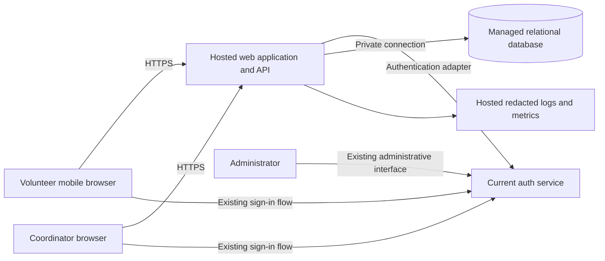

# ARCH-001 — Volunteer shift sign-up architecture

## Basis and decisions

This design covers [PRD-001 version 1](../prd/PRD-001.md): mobile browser sign-in, booking open warehouse shifts, and the coordinator's daily roster for about 120 volunteers. It includes all three functional requirements, including the should-priority roster, and all three mandatory non-functional requirements.

Use a hosted web application with one backend deployment, a managed relational database, and the **current auth service**. Reuse of that service is directed by the user and recorded in [ADR-001](../adr/ADR-001.md). Do not build password storage or select a replacement identity provider. Separate authentication, booking, and roster modules inside the backend; separate services and an event bus are unnecessary for this scope.

Only the approved PRD was available for inspection. There is no application code, auth contract, deployment configuration, repository instruction file, or test runner in this workspace. Component names, endpoints, and tables below are proposed contracts, not descriptions of an existing implementation. Auth protocol and hosting capabilities remain unverified. The approved PRD is preserved; ADR-001 resolves its identity-provider selection question at the architecture level.

## Components and trust boundaries

The browser is untrusted. The backend validates the session and resolves application roles on every protected request. Clients cannot assign identity, roles, booking ownership, capacity, or contact-field visibility. Only the backend connects to the database. The auth service is an external dependency with an explicit adapter contract; a token signature alone is insufficient evidence that a session remains active.

| Component | Responsibility | Requirements |
|---|---|---|
| Mobile web UI | Sign-in entry, open shift list, booking confirmation, coordinator daily roster | FR-001–003, PRD §8 |
| Auth adapter and session middleware | Existing sign-in integration, stable identity, current session validity, deny unavailable/invalid validation | FR-001, NFR-001 |
| Booking module | Availability reads and atomic capacity-limited bookings | FR-002 |
| Roster module | Day-based roster and coordinator-only contact projection | FR-003, NFR-002 |
| Managed database | Durable shifts, bookings, identity mapping, roles and restricted contact data | FR-002–003, NFR-002–003 |
| Hosted runtime and operations | Application, database, secrets, logs, backups, deployment tooling | NFR-003 |

## Authentication and authorization

Complete the current service's supported sign-in flow through a server-side adapter. Use its established SDK/protocol once inspected; this document does not assume OAuth, OIDC, JWTs, or any named vendor. Map a verified, stable service subject to a local volunteer ID; never use a phone number or a client-supplied volunteer ID as identity. Unknown subjects receive no application access until mapped by a trusted provisioning process.

Prefer a same-origin opaque application session in a Secure, HttpOnly cookie, with SameSite settings compatible with the verified login flow. Store only a hash of the session handle and the minimum upstream session linkage server-side. Protect state-changing requests against CSRF and verify login callback correlation using the service's supported mechanism. Keep upstream credentials out of browser storage, logs, and URLs. An application session must not outlive upstream expiration or revocation.

Require the adapter to provide these semantics, regardless of underlying API names:

- Complete sign-in and obtain a verified stable subject and session linkage.
- Validate current session status, including expiration, subject-wide revocation and refresh credentials, against authoritative service state on **every protected request**, without a positive validity cache in the pilot.
- Support an administrator revoking all of a volunteer's signed-in sessions through the current service's administrative interface, or an authenticated adapter operation if that interface is unavailable. Application coordinator status alone does not grant this power.

For NFR-001, measure from the administrator's successful revocation acknowledgment at time `t0`. Every affected credential must be rejected across all application instances by `t0 + 300 seconds`. The design target is immediate rejection on the next authoritative check. The actual bound includes the auth service's propagation delay and any validation/in-flight processing delay; these must total at most 300 seconds. Do not allow a previously authorized request to wait indefinitely and commit after that deadline: use bounded request lifetimes and revalidate before a delayed mutation or sensitive response. No offline authenticated operation or long-lived authorized stream is part of this design.

If session status cannot be established, fail closed: return an unavailable response with retry guidance, release the transaction, and perform no booking or protected data disclosure. Invalid/revoked sessions return an unauthenticated response and clear local session state. A valid signed JWT or local session cookie must never bypass this check. Refresh must not recreate access for a revoked session. Revocation of existing sessions does not itself prohibit a fresh sign-in unless the service also disables the account.

**Integration gate:** the auth adapter cannot be finalized until the existing service's subject identifiers, supported login flow, session validation, revocation semantics, role/admin controls, and deployment location are evidenced. If it lacks authoritative checks, a proven equivalent revocation mechanism with the same deadline is required and this design must be revised. Reuse alone does not establish NFR-001 compliance.

Application roles are read from trusted server-side assignments. A volunteer may list shifts and book only for their mapped identity. A coordinator may read daily rosters and phone numbers. A session administrator may revoke sessions but gains no contact access unless also assigned coordinator. Role assignment is an operational provisioning action, never a self-service input.

## Data model and booking consistency

| Entity | Minimum fields and constraints |
|---|---|
| Volunteer | Internal ID, auth issuer/service namespace and subject (unique pair), display name |
| Role assignment | Volunteer ID and role; trusted provisioning only |
| Volunteer contact | Volunteer ID (unique foreign key), phone number; kept separate from general volunteer reads |
| Shift | ID, start/end instants, warehouse timezone, positive capacity, open/closed state; end after start |
| Booking | ID, shift ID, volunteer ID, created time; foreign keys and unique `(shift_id, volunteer_id)` |
| Application session, if needed | Hashed handle, volunteer ID, upstream session reference, expiry; no passwords |

An open shift is assumed to be explicitly enabled, not yet started, and below capacity. Capacity and opening status are provisioned through a controlled operational import for the pilot; no shift-management UI is added. Warehouse timezone, actual shift times/capacities, volunteer mapping and contact source must be supplied during provisioning. These are configuration dependencies, not facts inferred from the user's timezone.

For booking, authenticate and derive the volunteer ID server-side. In one database transaction, lock the target shift row, check for an existing booking, verify state/start time, count committed bookings and compare with capacity, then insert. Every writer must follow this locking convention. Return an existing booking on a duplicate retry, including when the shift has since filled. Return a conflict for a new booking when the shift is full, closed, or started. Commit before confirming success. Concurrent requests for the final slot produce one new booking; the unique constraint additionally prevents duplicate bookings. Restrict direct database writes so imports or future capacity edits cannot bypass these invariants.

The database is the source of truth for availability and rosters. A displayed slot may fill before a request arrives; the UI handles that conflict and refreshes availability. A lost response after commit is safe to retry using the same volunteer/shift pair. Database failure produces an error, never a success confirmation.

Cancellation, waitlists, reminders, recurring-shift generation, payroll and donations are outside this design. Overlap restrictions between different shifts are not specified by the PRD and are not introduced.

## Proposed application interface and flows

| Operation | Authorization | Behavior and response |
|---|---|---|
| Existing sign-in entry/callback adapter | Public entry; service-verified completion | Establish validated identity and application session; exact routes depend on existing service |
| `GET /api/shifts?date=YYYY-MM-DD` | Signed-in volunteer or coordinator | Shift times, capacity remaining, own booking status; no other volunteer identities or phone numbers |
| `POST /api/shifts/{id}/bookings` | Signed-in volunteer | No client-selected volunteer identity; returns confirmed booking or existing booking on retry; conflict if unavailable |
| `GET /api/roster?date=YYYY-MM-DD` | Coordinator only | All shifts for the date, including empty ones; booked volunteers' names and phone numbers where available |

Use a configured warehouse timezone for the roster date: include shifts whose start falls within that local calendar day, using timezone-aware day boundaries. Store instants in UTC and present local dates/times explicitly. Reject malformed dates and identifiers before database access.

The coordinator page fetches the current roster on load, date change, manual refresh and return to the foreground. Poll every 30 seconds while visible as a proposed pilot interpretation of “live”; the PRD specifies no refresh SLA. Each response reads committed database state. Show last successful update time and a stale/error state after failed refreshes; never silently present old data as current. Do not persist roster/contact data in local storage, service-worker caches, or offline pages.

## Privacy and hosted operation

Phone numbers are exposed only by the coordinator-authorized server projection. Volunteer endpoints use explicit field allowlists; hiding a field in the browser is insufficient. Apply the same rule to error payloads, rendered HTML, auth profile responses, exports if later introduced, and diagnostic tools. If the current auth service returns phone claims, the adapter must not forward them into general browser-visible profiles or session payloads. Its browser-facing behavior must also be reviewed for NFR-002 compatibility.

Use `Cache-Control: no-store` for authenticated responses and bypass shared CDN caches. Redact phone numbers, credentials, request/response bodies, and auth claims from logs and traces. Keep audit events to actor IDs, action, result and timestamps. Restrict database, backups, secrets and operational access to dedicated service identities and accountable operators; the session administrator product role does not imply database access. Operational access to raw contact data remains privileged infrastructure access, not a product feature, and must be minimized and audited.

Deploy web assets and backend on a hosted runtime with managed database storage, secrets and backups. Use TLS at browser and service boundaries and private database connectivity. Separate pilot/test and production credentials and data. No food-bank server, local scheduled job or local backup is required. **NFR-003 applies to the whole product, including the reused auth service**; verify its hosting before pilot release. No specific cloud vendor or runtime language is selected without an existing platform baseline.

Release using versioned schema migrations, a pre-migration backup and an application rollback compatible with the migrated schema. Exercise restoration in an isolated hosted environment before the pilot. Record health, auth validation failures, booking conflicts/failures and roster refresh failures without contact data. Hosting retention and recovery targets are operational decisions still to be recorded; the PRD defines neither numerical uptime nor recovery SLAs.

## Rollout and unresolved dependencies

Enable booking for Tuesday and Thursday shifts first, then all shifts after pilot review. Provision identities, coordinator/admin roles, shift times/capacities, timezone and contact data through a controlled import. Use the coordinator's shift log for SM-01 (83% baseline, 95% target by pilot end); booked headcount is not proof that volunteers attended. ASM-01 remains open: the planned smartphone-access check has no recorded result in this repository.

| Dependency | Treatment before implementation or release |
|---|---|
| Current auth contract and administrative revocation capability absent | Inspect actual service documentation/configuration and implement adapter contract tests before completing auth integration |
| Auth revocation propagation and refresh behavior unknown | Release blocked for NFR-001 until the deadline test below passes against the real service |
| Current auth hosting and browser-visible contact claims unknown | Release blocked for NFR-002/003 until verified; amend integration if necessary |
| Volunteer/phone source, shift data and warehouse timezone absent | Provision explicitly; do not invent values or add a profile-management subsystem |
| “Live” has no numerical freshness target | Use the stated 30-second polling assumption for pilot; retain visible staleness state |

The architecture is defined for review; integration readiness remains conditional on the recorded dependencies. No user answers are needed to produce this document, and no unsupported service capability is treated as established.

## Acceptance and verification plan

Statuses here refer to **runtime evidence**, not whether a paragraph covers the requirement. All tests below are specified for implementation; none has been executed because no implementation or test harness exists. Establish failing behavior tests before implementing these contracts, then run the eventual repository's required gates against the candidate revision.

| Criterion | Design coverage | Required evidence | Runtime status |
|---|---|---|---|
| FR-001 | Existing service and auth adapter | Real-service sign-in succeeds for a mapped volunteer; invalid/expired credentials and unmapped subjects cannot access protected endpoints | BLOCKED — service contract absent |
| FR-002 | Booking transaction and uniqueness | Signed-in user books open shift; anonymous request rejected; full/closed/started shift rejected; concurrent final-slot requests cannot overbook; duplicate/lost-response retry returns one booking | NOT_RUN |
| FR-003 | Coordinator roster endpoint and polling | Correct local-day boundaries including DST; empty shifts included; confirmed bookings visible on next fetch; UI refresh and stale-state behavior; non-coordinator denied | NOT_RUN |
| NFR-001 | Authoritative request validation and administrator revocation | Two sessions/devices and multiple app instances: revoke all sessions at `t0`, probe every protected operation through and beyond 300 seconds, and attempt token refresh/replay; no revoked access at/after deadline. Repeat with auth timeout and delayed in-flight mutation | BLOCKED — real revocation behavior unknown |
| NFR-002 | Role checks, field allowlists, no-store and redaction | Coordinator can see phones; volunteer and admin-only roles cannot. Inspect API/HTML/auth payloads, errors, caches and logs; direct roster requests denied without coordinator role | NOT_RUN — auth payload portion also blocked |
| NFR-003 | Entire deployment hosted | Inventory application, auth, database, secrets, jobs, logs and backups; demonstrate product works with no on-site compute and inspect hosted restore result | BLOCKED — deployment evidence absent |
| Mobile UX / pilot | Browser UI and staged shift availability | Complete sign-in and booking in a phone-sized browser; Tuesday/Thursday availability enabled first | NOT_RUN |
| SM-01 / ASM-01 | Coordinator log / volunteer meeting check | Pilot outcome measured from attendance log; record smartphone assumption validation separately | NOT_RUN |

Documentation-only verification and the source fingerprint are recorded in [ARCH-001 verification](ARCH-001-verification.md). No runtime compliance is claimed by this design.
