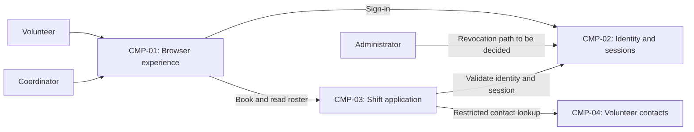

# ARCH-001 — Volunteer shift sign-up for the Riverside Food Bank architecture

## 1. Context and scope

This draft addresses PRD-001 version 1, status approved: a mobile-first web system for approximately 120 volunteers to sign in and book warehouse shifts, with a daily roster for the coordinator. Payroll and donations are outside scope. The initial rollout covers Tuesday and Thursday shifts before expansion.

No existing ARCH covers this system. The proposed outcome is create; the request to define architecture does not confirm that outcome. The user requested reuse of the current auth service for sign-in and asked to proceed without questions. That preference is recorded in ARCH-001#DEC-01. No inspection scope was named and no code or configuration was inspected. The service's location, interfaces and capabilities are unknown. Only PRD-001 supplied project evidence; no policy, local preferences, existing ARCHs or ADRs were found at the contract paths.

The components and interactions below are proposals for shared responsibilities, not accepted deployment or integration decisions. No ADR is written and every decision remains open because no mandated platform applies.

## 2. Quality drivers

PRD-001#NFR-001 requires administrator revocation of a volunteer's sessions to take effect within five minutes. Choosing an identity provider alone cannot establish this: the session issuer and every application access path must share a revocation mechanism and an enforceable propagation bound.

PRD-001#NFR-002 permits only the coordinator to see volunteer phone numbers. Contact-data ownership and server-side authorization must be consistent across booking and roster access. A browser hiding a field does not establish the required restriction.

PRD-001#NFR-003 requires hosted services for the whole product because the food bank has no on-site server. Identity, application execution and persistent data therefore all need compatible hosting arrangements.

The operating context is internal, as stated by the PRD; the Pilot release label does not change it. The required quality categories are constraint, security and privacy, all covered by the three NFRs. No policy adds categories. The PRD supplies no latency, availability or roster-freshness target; this draft invents none.

## 3. Components

The diagram shows proposed logical boundaries. ARCH-001#DEC-03 governs their division into application components; ARCH-001#DEC-07 governs deployment. Data ownership shown below remains subject to ARCH-001#DEC-04 and ARCH-001#DEC-05.



```yaml items
components:
  - id: CMP-01
    status: active
    name: "Browser experience"
    responsibility: "Provides mobile sign-in, booking and coordinator roster screens; does not own authoritative records or enforce access by itself."
    owns_data: []
    interacts_with:
      - "CMP-02"
      - "CMP-03"
    deployment: "Open: see DEC-07"
    upstream:
      - {id: PRD-001, item: NFR-001, relation: informed_by, version: 1, hash: null}
      - {id: PRD-001, item: NFR-002, relation: informed_by, version: 1, hash: null}
      - {id: PRD-001, item: NFR-003, relation: informed_by, version: 1, hash: null}
  - id: CMP-02
    status: active
    name: "Identity and sessions"
    responsibility: "Proposed authentication and session authority, preferably the current auth service per the request; does not own shifts or bookings. Revocation support is unverified."
    owns_data:
      - "Proposed: authenticated identities and session state, subject to DEC-01 and DEC-02"
    interacts_with:
      - "CMP-01"
      - "CMP-03"
      - "Administrator"
    deployment: "Open: see DEC-07"
    upstream:
      - {id: PRD-001, item: NFR-001, relation: informed_by, version: 1, hash: null}
      - {id: PRD-001, item: NFR-003, relation: informed_by, version: 1, hash: null}
  - id: CMP-03
    status: active
    name: "Shift application"
    responsibility: "Proposed shared booking and roster authority; validates sessions and enforces access to booking and roster operations. Does not manage credentials."
    owns_data:
      - "Proposed: authoritative warehouse shifts and volunteer bookings, subject to DEC-04"
    interacts_with:
      - "CMP-01"
      - "CMP-02"
      - "CMP-04"
    deployment: "Open: see DEC-07"
    upstream:
      - {id: PRD-001, item: NFR-001, relation: informed_by, version: 1, hash: null}
      - {id: PRD-001, item: NFR-002, relation: informed_by, version: 1, hash: null}
      - {id: PRD-001, item: NFR-003, relation: informed_by, version: 1, hash: null}
  - id: CMP-04
    status: active
    name: "Volunteer contacts"
    responsibility: "Proposed logical owner of volunteer phone numbers and identity-to-contact associations; exposes authorized contact information and does not authenticate users. A separate service is not decided."
    owns_data:
      - "Proposed: volunteer contact records, subject to DEC-05"
    interacts_with:
      - "CMP-03"
    deployment: "Open: see DEC-07"
    upstream:
      - {id: PRD-001, item: NFR-002, relation: informed_by, version: 1, hash: null}
      - {id: PRD-001, item: NFR-003, relation: informed_by, version: 1, hash: null}
```

## 4. Architectural questions

```yaml items
decisions:
  - id: DEC-01
    status: active
    question: "Which identity provider handles volunteer sign-in?"
    blocking: true
    state: open
    resolved_by: []
    notes: "The request prefers reuse of the current auth service; not yet decided under the architecture workflow. No service path or inspected evidence establishes its interface or suitability. This captures the PRD's NEEDS ADR marker. Provider choice also affects the identity consumed by booking and the session-revocation integration."
    upstream:
      - {id: PRD-001, item: FR-001, relation: informed_by, version: 1, hash: null}
      - {id: PRD-001, item: FR-002, relation: informed_by, version: 1, hash: null}
      - {id: PRD-001, item: NFR-001, relation: informed_by, version: 1, hash: null}
  - id: DEC-02
    status: active
    question: "How will administrator session revocation stop volunteer access within five minutes?"
    blocking: true
    state: open
    resolved_by: []
    notes: "A shared revocation check versus bounded session validity has different dependency and propagation trade-offs. The current auth service's support is unknown. Sign-in and authenticated booking must agree on session validation; provider reuse alone does not settle this question."
    upstream:
      - {id: PRD-001, item: FR-001, relation: informed_by, version: 1, hash: null}
      - {id: PRD-001, item: FR-002, relation: informed_by, version: 1, hash: null}
      - {id: PRD-001, item: NFR-001, relation: informed_by, version: 1, hash: null}
  - id: DEC-03
    status: active
    question: "What application component boundaries will sign-in integration, booking, roster and contact access share?"
    blocking: true
    state: open
    resolved_by: []
    notes: "The diagram proposes a browser client and a shared shift application with logical identity and contact boundaries. A single application with modules reduces operational overhead; separate services require additional interface and access-control coordination. Neither option is accepted."
    upstream:
      - {id: PRD-001, item: FR-001, relation: informed_by, version: 1, hash: null}
      - {id: PRD-001, item: FR-002, relation: informed_by, version: 1, hash: null}
      - {id: PRD-001, item: FR-003, relation: informed_by, version: 1, hash: null}
      - {id: PRD-001, item: NFR-001, relation: informed_by, version: 1, hash: null}
      - {id: PRD-001, item: NFR-002, relation: informed_by, version: 1, hash: null}
  - id: DEC-04
    status: active
    question: "Which component owns the authoritative shifts and bookings used by booking and roster reads?"
    blocking: true
    state: open
    resolved_by: []
    notes: "Proposed owner: the shift application. Booking and roster must agree on one authoritative source; existing scheduling or storage services have not been inspected. Schema and transaction details remain for specs."
    upstream:
      - {id: PRD-001, item: FR-002, relation: informed_by, version: 1, hash: null}
      - {id: PRD-001, item: FR-003, relation: informed_by, version: 1, hash: null}
  - id: DEC-05
    status: active
    question: "Which component owns volunteer phone numbers and their association with authenticated identities?"
    blocking: true
    state: open
    resolved_by: []
    notes: "Proposed logical owner: volunteer contacts. Application-owned contact data versus an existing directory changes synchronization and access responsibilities. The coordinator roster's contact lookup depends on this boundary; no duplication into booking responses is assumed."
    upstream:
      - {id: PRD-001, item: FR-003, relation: informed_by, version: 1, hash: null}
      - {id: PRD-001, item: NFR-002, relation: informed_by, version: 1, hash: null}
  - id: DEC-06
    status: active
    question: "Where will coordinator authorization be established and enforced so only the coordinator can see volunteer phone numbers?"
    blocking: true
    state: open
    resolved_by: []
    notes: "Provider-managed roles versus application-managed permissions require different integration contracts. Booking and roster access paths must apply the same restriction wherever contact data is reachable. UI visibility alone cannot satisfy the privacy requirement."
    upstream:
      - {id: PRD-001, item: FR-002, relation: informed_by, version: 1, hash: null}
      - {id: PRD-001, item: FR-003, relation: informed_by, version: 1, hash: null}
      - {id: PRD-001, item: NFR-002, relation: informed_by, version: 1, hash: null}
  - id: DEC-07
    status: active
    question: "What hosted deployment arrangement will run the whole product?"
    blocking: true
    state: open
    resolved_by: []
    notes: "Hosted services are required, but providers, deployment units and persistent storage are undecided. Managed application hosting and separately operated hosted services have different operational responsibilities. The current auth service's hosting is unknown. This whole-product question affects every functional requirement and the hosting constraint."
    upstream:
      - {id: PRD-001, item: FR-001, relation: informed_by, version: 1, hash: null}
      - {id: PRD-001, item: FR-002, relation: informed_by, version: 1, hash: null}
      - {id: PRD-001, item: FR-003, relation: informed_by, version: 1, hash: null}
      - {id: PRD-001, item: NFR-003, relation: informed_by, version: 1, hash: null}
  - id: DEC-08
    status: active
    question: "How will roster reads observe accepted bookings across the shared application boundary?"
    blocking: true
    state: open
    resolved_by: []
    notes: "Reading the authoritative booking source avoids a separate projection; an event-fed roster projection allows independent reads but introduces propagation and reconciliation responsibilities. The PRD's live-roster goal gives no numeric freshness target. No transport, interface fields or target is selected here."
    upstream:
      - {id: PRD-001, item: FR-002, relation: informed_by, version: 1, hash: null}
      - {id: PRD-001, item: FR-003, relation: informed_by, version: 1, hash: null}
```

## 5. Evidence inspected

```yaml items
evidence:
  - id: EVD-01
    status: active
    source: "PRD-001"
    kind: prd
    finding: "Version 1, status approved: volunteers sign in and book open warehouse shifts; the coordinator sees daily rosters. Session revocation must take effect within five minutes, phone numbers are coordinator-only, and the whole product uses hosted services. The identity provider is marked NEEDS ADR. Operating context is internal."
    classification: context
```

## 6. Deployment

PRD-001#NFR-003 excludes an on-site server. All server execution and persistent storage must use hosted services; the mobile web experience runs in volunteers' and the coordinator's browsers. ARCH-001#DEC-07 leaves the hosted provider, runtime units, data hosting and environment arrangement open. The four logical components do not imply four separately deployed services. Reusing the current auth service remains subject to its verified capabilities and hosting compatibility.

## 7. Requirement changes proposed to the PRD owner

- None.

## 8. Open questions

- [NEEDS CLARIFICATION: No inspection scope was named and no code was inspected; the current auth service's location, sign-in integration and reuse suitability are unknown.]
- [NEEDS CLARIFICATION: The current auth service's revocation mechanism, propagation bounds and hosting have not been established; these are needed for PRD-001#NFR-001 and PRD-001#NFR-003.]
- [NEEDS CLARIFICATION: Existing shift, booking, volunteer-contact and coordinator-role ownership is unknown because no inspection paths were supplied.]
- [NEEDS CLARIFICATION: The create outcome was not explicitly confirmed; outcome remains null under the no-questions workflow.]
- [NEEDS CLARIFICATION: host model/session identity unavailable]

## Change Log

| Version | Date | Author | Change | Items affected |
|---|---|---|---|---|
| 1 | 2026-09-28 | codex (session unknown) | Initial draft for PRD-001 v1; auth reuse preference recorded, all architectural questions open, no ADRs written. Policy resolution: interview.max_calls=8 (default); architecture.mandated_platforms=none (default); quality.required_categories=floor only (default) | all |
| 1 | 2026-09-28 | codex (session unknown) | Validation incomplete (ERR-05): exact host model/session identity unavailable; retained draft with empty approval fields and open decisions. No approval or decision restoration was necessary; readiness handoff withheld. Policy resolution: interview.max_calls=8 (default); architecture.mandated_platforms=none (default); quality.required_categories=floor only (default) | generated_by |
