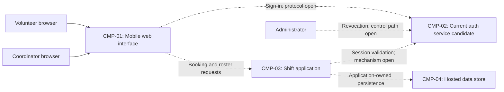

# ARCH-001 — Volunteer shift sign-up for the Riverside Food Bank architecture

## 1. Context and scope

This draft examines PRD-001 version 1, status approved, owned by Priya Nair.
The system lets approximately 120 volunteers sign in and book warehouse shifts
from mobile browsers, and gives the coordinator a daily roster. Payroll and
donations are outside its scope. The initial rollout covers Tuesday and Thursday
shifts before expanding to all shifts.

No inspection scope was named and no code or configuration was inspected. The
request says to reuse the current auth service; ARCH-001#DEC-01 records that
preference, without claiming that its interfaces or capabilities were verified.
No existing ARCH, ADR, policy document, or local preference file was found at
the contract paths. A new ARCH is proposed; the architecture outcome remains
unconfirmed. Reusing an auth component does not mean reusing an existing ARCH.

The user requested no questions. All choices below remain open; no ADR is
written. Components and interactions describe a proposed shape for review,
not accepted implementation decisions.

## 2. Quality drivers

PRD-001#NFR-001 requires an administrator to revoke a volunteer's signed-in
sessions with enforcement within five minutes. Selecting the identity provider
does not settle revocation: every session-consuming entry point must participate
in the eventual enforcement design (ARCH-001#DEC-02).

PRD-001#NFR-002 restricts phone-number visibility to the coordinator. The design
must establish contact-data ownership and enforce the restriction before data
reaches a volunteer's browser; hiding a field in the interface alone cannot meet
this requirement (ARCH-001#DEC-03 and ARCH-001#DEC-05).

PRD-001#NFR-003 requires hosted services for the whole product because there is
no on-site server. Hosting providers, deployment units, and environments remain
open in ARCH-001#DEC-07. The PRD's operating context is internal; its release
label Pilot does not change that context. The required quality floor is
constraint, security, and privacy, covered respectively by PRD-001#NFR-003,
PRD-001#NFR-001, and PRD-001#NFR-002. No floor category is missing and no policy
adds categories. No numerical availability, performance, or roster-freshness
target is inferred.

## 3. Components

All boundaries, ownership assignments, and arrows are proposals pending
ARCH-001#DEC-04, ARCH-001#DEC-05, and ARCH-001#DEC-06. The auth component represents
the user's preferred existing service; no protocol or storage technology is
assumed. The application owns the proposed business data; its datastore is not
treated as a separate business owner.



```yaml items
components:
  - id: CMP-01
    status: active
    name: "Mobile web interface"
    responsibility: "Proposed browser interface for sign-in, shift booking, and coordinator rosters; does not own durable records or enforce authorization by itself."
    owns_data: []
    interacts_with:
      - "CMP-02"
      - "CMP-03"
    deployment: "Open: see DEC-07"
    upstream:
      - {id: PRD-001, item: NFR-002, relation: informed_by, version: 1, hash: null}
      - {id: PRD-001, item: NFR-003, relation: informed_by, version: 1, hash: null}
  - id: CMP-02
    status: active
    name: "Current auth service candidate"
    responsibility: "Proposed authentication and session authority, using the current service as requested if its capabilities support the requirements; does not own shift bookings. Actual revocation capabilities are unknown."
    owns_data:
      - "Proposed identity records and session lifecycle state; existing ownership unverified"
    interacts_with:
      - "CMP-01"
      - "CMP-03"
      - "Administrator"
    deployment: "Open: see DEC-07"
    upstream:
      - {id: PRD-001, item: NFR-001, relation: informed_by, version: 1, hash: null}
      - {id: PRD-001, item: NFR-003, relation: informed_by, version: 1, hash: null}
  - id: CMP-03
    status: active
    name: "Shift application"
    responsibility: "Proposed shared application boundary for booking open shifts, reading coordinator rosters, and enforcing access to contact data; delegates authentication and does not own credentials."
    owns_data:
      - "Proposed shift and booking records, pending DEC-05"
      - "Proposed volunteer contact records and identity references, pending DEC-05"
    interacts_with:
      - "CMP-01"
      - "CMP-02"
      - "CMP-04"
    deployment: "Open: see DEC-07"
    upstream:
      - {id: PRD-001, item: NFR-001, relation: informed_by, version: 1, hash: null}
      - {id: PRD-001, item: NFR-002, relation: informed_by, version: 1, hash: null}
      - {id: PRD-001, item: NFR-003, relation: informed_by, version: 1, hash: null}
  - id: CMP-04
    status: active
    name: "Hosted data store"
    responsibility: "Proposed persistence for application-owned shift, booking, and contact records; has no independent business ownership and is not a direct browser interface."
    owns_data: []
    interacts_with:
      - "CMP-03"
    deployment: "Open: see DEC-07"
    upstream:
      - {id: PRD-001, item: NFR-002, relation: informed_by, version: 1, hash: null}
      - {id: PRD-001, item: NFR-003, relation: informed_by, version: 1, hash: null}
```

## 4. Architectural questions

Each question is blocking because no explicit non-blocking designation was made.
Options in notes are review material, not decisions. Detailed API fields, schemas,
and migrations belong to later specifications.

```yaml items
decisions:
  - id: DEC-01
    status: active
    question: "Which identity provider handles volunteer sign-in?"
    blocking: true
    state: open
    resolved_by: []
    notes: "The request prefers reuse of the current auth service; not yet decided under the no-questions workflow. This is the preferred candidate for later review, but no inspection scope identifies it and its suitability is unknown. Covers the PRD's NEEDS ADR marker. Provider selection does not resolve DEC-02."
    upstream:
      - {id: PRD-001, item: FR-001, relation: informed_by, version: 1, hash: null}
      - {id: PRD-001, item: FR-002, relation: informed_by, version: 1, hash: null}
      - {id: PRD-001, item: NFR-001, relation: informed_by, version: 1, hash: null}
  - id: DEC-02
    status: active
    question: "How will administrator revocation stop every affected volunteer session from working within five minutes?"
    blocking: true
    state: open
    resolved_by: []
    notes: "An authoritative session check offers prompt enforcement with a runtime dependency; bounded cached checks or short-lived credentials require a proven total revocation delay and renewal behavior within five minutes. The current service's revocation interface, cache limits, and failure behavior are unknown. Applies to sign-in sessions and signed-in booking requests."
    upstream:
      - {id: PRD-001, item: FR-001, relation: informed_by, version: 1, hash: null}
      - {id: PRD-001, item: FR-002, relation: informed_by, version: 1, hash: null}
      - {id: PRD-001, item: NFR-001, relation: informed_by, version: 1, hash: null}
  - id: DEC-03
    status: active
    question: "Where is coordinator-only authorization for volunteer phone numbers enforced?"
    blocking: true
    state: open
    resolved_by: []
    notes: "A shared application authorization boundary centralizes access checks; a separate contact-data service adds isolation and operational overhead. The source of coordinator authority must be established. Enforcement must cover roster responses and prevent disclosure through volunteer booking responses, caches, or diagnostic output."
    upstream:
      - {id: PRD-001, item: FR-002, relation: informed_by, version: 1, hash: null}
      - {id: PRD-001, item: FR-003, relation: informed_by, version: 1, hash: null}
      - {id: PRD-001, item: NFR-002, relation: informed_by, version: 1, hash: null}
  - id: DEC-04
    status: active
    question: "What shared component boundaries separate the web interface, authentication, booking, and roster responsibilities?"
    blocking: true
    state: open
    resolved_by: []
    notes: "The proposed shape combines booking and roster logic in one application with an external auth boundary, simplifying shared rules; separate booking and roster services allow independent deployment but require explicit contracts and synchronization. No boundary choice is accepted."
    upstream:
      - {id: PRD-001, item: FR-001, relation: informed_by, version: 1, hash: null}
      - {id: PRD-001, item: FR-002, relation: informed_by, version: 1, hash: null}
      - {id: PRD-001, item: FR-003, relation: informed_by, version: 1, hash: null}
      - {id: PRD-001, item: NFR-001, relation: informed_by, version: 1, hash: null}
      - {id: PRD-001, item: NFR-002, relation: informed_by, version: 1, hash: null}
  - id: DEC-05
    status: active
    question: "Which components are authoritative for shifts, bookings, and volunteer contact data?"
    blocking: true
    state: open
    resolved_by: []
    notes: "The proposal gives the shift application business ownership of bookings and contacts while auth supplies identity references. Keeping contacts in an existing profile authority could avoid duplication but would couple roster access and privacy enforcement to that authority. Existing contact ownership and stable identity references are unverified."
    upstream:
      - {id: PRD-001, item: FR-002, relation: informed_by, version: 1, hash: null}
      - {id: PRD-001, item: FR-003, relation: informed_by, version: 1, hash: null}
      - {id: PRD-001, item: NFR-002, relation: informed_by, version: 1, hash: null}
  - id: DEC-06
    status: active
    question: "How will booking changes become visible to the coordinator's roster across the shared application boundary?"
    blocking: true
    state: open
    resolved_by: []
    notes: "Reading from the authoritative booking store simplifies consistency; a roster projection fed by events separates reads but introduces lag and recovery behavior. The PRD calls for a live roster but gives no numerical freshness target; any product target belongs to the PRD owner. The chosen contract must preserve the meaning of an open shift under concurrent bookings."
    upstream:
      - {id: PRD-001, item: FR-002, relation: informed_by, version: 1, hash: null}
      - {id: PRD-001, item: FR-003, relation: informed_by, version: 1, hash: null}
  - id: DEC-07
    status: active
    question: "Which hosted topology will run the whole product?"
    blocking: true
    state: open
    resolved_by: []
    notes: "Hosted execution is required, but provider, deployment units, environment separation, and existing auth hosting are unknown. A managed application with managed persistence reduces operational work; separately hosted services offer more independent scaling with additional integration and operations. No on-site server is an option."
    upstream:
      - {id: PRD-001, item: FR-001, relation: informed_by, version: 1, hash: null}
      - {id: PRD-001, item: FR-002, relation: informed_by, version: 1, hash: null}
      - {id: PRD-001, item: FR-003, relation: informed_by, version: 1, hash: null}
      - {id: PRD-001, item: NFR-003, relation: informed_by, version: 1, hash: null}
```

## 5. Evidence inspected

```yaml items
evidence:
  - id: EVD-01
    status: active
    source: "PRD-001"
    kind: prd
    finding: "Version 1, status approved: volunteer sign-in, signed-in shift booking, and coordinator rosters; five-minute session revocation, coordinator-only phone visibility, and hosted execution. Internal operating context. Identity provider remains a NEEDS ADR marker."
    classification: context
```

## 6. Deployment

PRD-001#NFR-003 rules out on-site execution. ARCH-001#DEC-07 leaves the hosted
provider, runtime, datastore, and environment layout open. The diagram represents
logical responsibilities, not a commitment to four deployment units. Existing
auth hosting has not been inspected. Its ability to satisfy hosted execution and
five-minute revocation must be established before treating reuse as feasible.

## 7. Requirement changes proposed to the PRD owner

- None.

## 8. Open questions

- [NEEDS CLARIFICATION: No inspection scope was named and no code was inspected; the location, interface, hosting, and suitability of the current auth service are unknown.]
- [NEEDS CLARIFICATION: The current auth service's administrative revocation and session-validation behavior are unknown; ARCH-001#DEC-02 cannot be settled from a provider preference.]
- [NEEDS CLARIFICATION: Existing ownership of volunteer contact data and the source of coordinator authority are unknown; these affect ARCH-001#DEC-03 and ARCH-001#DEC-05.]
- [NEEDS CLARIFICATION: PRD-001 describes a live roster without a numerical freshness target; Priya Nair owns any clarification needed when evaluating ARCH-001#DEC-06.]
- [NEEDS CLARIFICATION: Creating a new ARCH is proposed, but no outcome was explicitly confirmed; outcome remains null.]
- [NEEDS CLARIFICATION: host model/session identity unavailable]

## Change Log

| Version | Date | Author | Change | Items affected |
|---|---|---|---|---|
| 1 | 2026-09-28 | codex (session unknown) | Initial draft for PRD-001 v1. Policy resolution: interview.max_calls=8 (default); architecture.mandated_platforms=none (default); quality.required_categories=floor only (default) | all |
