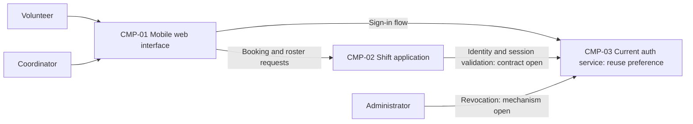

# ARCH-001 — Volunteer shift sign-up for the Riverside Food Bank architecture

## 1. Context and scope

This draft describes PRD-001 version 1, status approved: mobile web sign-in, volunteer
booking of open warehouse shifts, and a daily coordinator roster for approximately
120 volunteers. Payroll and donations are outside the product scope. The pilot
starts with Tuesday and Thursday shifts; the PRD's operating context is internal.

The request identifies PRD-001 and says to reuse the current auth service and proceed
without questions. Auth reuse is recorded in ARCH-001#DEC-01 as the stated preference.
No inspection scope was named and no code or configuration was inspected. The current
auth service's identity, interfaces, hosting and capabilities are unknown.

No existing ARCH, ADR or policy document was found in the contract document paths;
the local preference file is absent. A new architecture description is proposed.
The request does not explicitly confirm the create outcome, so outcome remains null.
No decision interviews occurred and no ADR was written. All component boundaries,
ownership allocations and interactions below are proposals pending their linked
architectural questions, not claims about the existing implementation.

## 2. Quality drivers

PRD-001#NFR-001 requires administrator revocation of a volunteer's signed-in sessions
to take effect within five minutes. Provider choice alone cannot establish this:
ARCH-001#DEC-02 must cover every application session or credential that can continue
to authorize a volunteer after revocation, including any validation cache.

PRD-001#NFR-002 limits phone-number visibility to the coordinator. Data ownership
(ARCH-001#DEC-05) and enforcement of coordinator access (ARCH-001#DEC-06) must be
shared across booking and roster work. The proposed application boundary performs
access checks before returning data; hiding phone numbers in the browser alone would
not establish this requirement.

PRD-001#NFR-003 applies to the whole product: all server-side capabilities must run on
hosted services because there is no on-site server. ARCH-001#DEC-07 covers all three
functional requirements and all three quality requirements, including auth and
persistent data. Reusing auth remains subject to confirming its hosted operation.

The internal-context quality floor is constraint, security and privacy. All required
categories are covered by PRD-001#NFR-003, PRD-001#NFR-001 and PRD-001#NFR-002,
respectively. Framework defaults apply; there are no additional policy categories.
The PRD supplies no numerical roster freshness target; this draft does not invent one.

## 3. Components

The diagram shows proposed logical responsibilities, not settled deployment units.
ARCH-001#DEC-03 governs the boundaries and authentication trust interface;
ARCH-001#DEC-04 and ARCH-001#DEC-05 govern the proposed data ownership.



```yaml items
components:
  - id: CMP-01
    status: active
    name: "Mobile web interface"
    responsibility: "Proposed volunteer sign-in and booking pages plus coordinator roster pages; presents authorized data and owns neither credentials nor authoritative booking or contact records."
    owns_data: []
    interacts_with:
      - "CMP-02"
      - "CMP-03"
    deployment: "Open: see DEC-07"
    upstream:
      - {id: PRD-001, item: NFR-001, relation: informed_by, version: 1, hash: null}
      - {id: PRD-001, item: NFR-002, relation: informed_by, version: 1, hash: null}
      - {id: PRD-001, item: NFR-003, relation: informed_by, version: 1, hash: null}
  - id: CMP-02
    status: active
    name: "Shift application"
    responsibility: "Proposed application boundary for open shifts, authorized bookings, daily roster reads and coordinator-only contact access; validates authenticated requests but does not issue identity-provider credentials. Ownership and module boundaries remain open."
    owns_data:
      - "Proposed: authoritative shift availability and bookings, subject to DEC-04"
      - "Proposed: volunteer contact records and their identity association, subject to DEC-05"
    interacts_with:
      - "CMP-01"
      - "CMP-03"
    deployment: "Open: see DEC-07"
    upstream:
      - {id: PRD-001, item: NFR-001, relation: informed_by, version: 1, hash: null}
      - {id: PRD-001, item: NFR-002, relation: informed_by, version: 1, hash: null}
      - {id: PRD-001, item: NFR-003, relation: informed_by, version: 1, hash: null}
  - id: CMP-03
    status: active
    name: "Current auth service, proposed reuse"
    responsibility: "Proposed authentication and session authority with administrator revocation capability; actual interfaces and revocation support are unverified. Does not own shift bookings or the roster in the proposed shape."
    owns_data:
      - "Proposed: authentication identities and provider session state, subject to DEC-01 and DEC-02"
    interacts_with:
      - "CMP-01"
      - "CMP-02"
      - "Administrator"
    deployment: "Open: see DEC-07"
    upstream:
      - {id: PRD-001, item: NFR-001, relation: informed_by, version: 1, hash: null}
      - {id: PRD-001, item: NFR-003, relation: informed_by, version: 1, hash: null}
```

## 4. Architectural questions

```yaml items
decisions:
  - id: DEC-01
    status: active
    question: "Which identity provider handles volunteer sign-in?"
    blocking: true
    state: open
    resolved_by: []
    notes: "The request prefers reuse of the current auth service; not yet decided under the architecture workflow. This carries PRD-001's NEEDS ADR marker. No inspection paths or service identity were supplied, so suitability is unknown. Proceeding without questions writes no ADR."
    upstream:
      - {id: PRD-001, item: FR-001, relation: informed_by, version: 1, hash: null}
      - {id: PRD-001, item: FR-002, relation: informed_by, version: 1, hash: null}
  - id: DEC-02
    status: active
    question: "How will administrator revocation stop every affected volunteer session from authorizing requests within five minutes?"
    blocking: true
    state: open
    resolved_by: []
    notes: "Sign-in creates the sessions and booking consumes them. Provider reuse alone does not resolve this mechanism. Central session validation and bounded credential lifetimes have different request dependency and invalidation costs; service capabilities and the complete five-minute bound remain unverified."
    upstream:
      - {id: PRD-001, item: FR-001, relation: informed_by, version: 1, hash: null}
      - {id: PRD-001, item: FR-002, relation: informed_by, version: 1, hash: null}
      - {id: PRD-001, item: NFR-001, relation: informed_by, version: 1, hash: null}
  - id: DEC-03
    status: active
    question: "Where are the responsibility and trust boundaries between the web interface, shift application and auth service?"
    blocking: true
    state: open
    resolved_by: []
    notes: "The proposed shape has one logical shift application behind the browser and an auth service boundary. Separate booking and roster services versus modules in one application require different shared contracts. Authentication handoff and protected-request validation must agree across these boundaries; no protocol or application framework is selected."
    upstream:
      - {id: PRD-001, item: FR-001, relation: informed_by, version: 1, hash: null}
      - {id: PRD-001, item: FR-002, relation: informed_by, version: 1, hash: null}
      - {id: PRD-001, item: FR-003, relation: informed_by, version: 1, hash: null}
      - {id: PRD-001, item: NFR-001, relation: informed_by, version: 1, hash: null}
      - {id: PRD-001, item: NFR-002, relation: informed_by, version: 1, hash: null}
  - id: DEC-04
    status: active
    question: "Which component owns authoritative shift availability and booking records?"
    blocking: true
    state: open
    resolved_by: []
    notes: "Ownership is proposed within the shift application so booking and roster work can share a source of truth. The owner must arbitrate concurrent claims to an open shift and publish committed bookings; the storage and consistency mechanism are not selected."
    upstream:
      - {id: PRD-001, item: FR-002, relation: informed_by, version: 1, hash: null}
      - {id: PRD-001, item: FR-003, relation: informed_by, version: 1, hash: null}
  - id: DEC-05
    status: active
    question: "Which component owns volunteer contact records and their association with authenticated identities?"
    blocking: true
    state: open
    resolved_by: []
    notes: "The proposal places contact records in the shift application. Ownership by the current auth service is unverified and not assumed. Booking identity, roster identity and coordinator contact access need a common association without copying phone numbers into unrestricted identity claims."
    upstream:
      - {id: PRD-001, item: FR-002, relation: informed_by, version: 1, hash: null}
      - {id: PRD-001, item: FR-003, relation: informed_by, version: 1, hash: null}
      - {id: PRD-001, item: NFR-002, relation: informed_by, version: 1, hash: null}
  - id: DEC-06
    status: active
    question: "How will coordinator-only authorization be enforced for volunteer phone numbers?"
    blocking: true
    state: open
    resolved_by: []
    notes: "A shared role authority and server-side enforcement are needed wherever booking or roster data can include contact details. Provider-managed coordinator claims versus application-managed role assignments remain open. Volunteer responses, shared caches and diagnostics must not create an alternate visibility path."
    upstream:
      - {id: PRD-001, item: FR-002, relation: informed_by, version: 1, hash: null}
      - {id: PRD-001, item: FR-003, relation: informed_by, version: 1, hash: null}
      - {id: PRD-001, item: NFR-002, relation: informed_by, version: 1, hash: null}
  - id: DEC-07
    status: active
    question: "Which hosted deployment topology will run the whole product?"
    blocking: true
    state: open
    resolved_by: []
    notes: "Hosted operation is required, but providers, deployment units, persistent storage and environments are not selected. The decision spans the web delivery, application, auth and data capabilities, including their session-validation and privacy boundaries. The existing auth service's hosting is unknown."
    upstream:
      - {id: PRD-001, item: FR-001, relation: informed_by, version: 1, hash: null}
      - {id: PRD-001, item: FR-002, relation: informed_by, version: 1, hash: null}
      - {id: PRD-001, item: FR-003, relation: informed_by, version: 1, hash: null}
      - {id: PRD-001, item: NFR-001, relation: informed_by, version: 1, hash: null}
      - {id: PRD-001, item: NFR-002, relation: informed_by, version: 1, hash: null}
      - {id: PRD-001, item: NFR-003, relation: informed_by, version: 1, hash: null}
  - id: DEC-08
    status: active
    question: "How will the daily roster obtain committed booking changes?"
    blocking: true
    state: open
    resolved_by: []
    notes: "Reading the authoritative booking owner directly avoids projection lag but couples roster availability to that owner. An event-fed roster supports independent reads but adds delivery and reconciliation responsibilities. Neither interaction is selected; no numerical freshness target is inferred from the PRD's live-roster summary."
    upstream:
      - {id: PRD-001, item: FR-002, relation: informed_by, version: 1, hash: null}
      - {id: PRD-001, item: FR-003, relation: informed_by, version: 1, hash: null}
```

## 5. Evidence inspected

```yaml items
evidence:
  - id: EVD-01
    status: active
    source: "PRD-001"
    kind: prd
    finding: "Version 1, status approved: FR-001 requires volunteer sign-in and has an identity-provider NEEDS ADR marker; FR-002 requires signed-in booking of open warehouse shifts; FR-003 requires daily coordinator rosters. NFR-001 requires session revocation within five minutes, NFR-002 restricts phone visibility to the coordinator, and NFR-003 requires hosted services for the whole product. Operating context is internal."
    classification: context
```

No code was inspected and there are no observed-practice findings. The skill's
references and templates are framework instructions, not project evidence.

## 6. Deployment

PRD-001#NFR-003 fixes hosted operation as a constraint. ARCH-001#DEC-07 leaves
the hosting platform, runtime units, persistent storage and environment arrangement
open. The mobile interface executes in volunteers' and the coordinator's browsers;
its delivery and every server-side component require a hosted arrangement.

The diagram does not imply three separately deployed services. ARCH-001#DEC-03
must settle logical boundaries before deployment units can be confirmed. The
current auth service must be checked for hosted operation and the session
revocation contract in ARCH-001#DEC-02. No on-site dependency is proposed.

## 7. Requirement changes proposed to the PRD owner

- None.

## 8. Open questions

- [NEEDS CLARIFICATION: No inspection scope was named and no code was inspected; the current auth service's identity, integration contract, hosted operation and suitability for reuse are unknown.]
- [NEEDS CLARIFICATION: The current auth service's administrator revocation support and the lifetime of all downstream sessions or credentials are unknown; the five-minute requirement cannot yet be established.]
- [NEEDS CLARIFICATION: The authority for coordinator roles and the present owner of volunteer contact records are unknown.]
- [NEEDS CLARIFICATION: The create outcome was not explicitly confirmed; outcome remains null while this new draft records the proposed architecture.]
- [NEEDS CLARIFICATION: host model/session identity unavailable]

## Change Log

| Version | Date | Author | Change | Items affected |
|---|---|---|---|---|
| 1 | 2026-09-28 | codex (session unknown) | Initial draft for PRD-001 v1; auth reuse recorded as a preference, all architectural questions open, no ADRs written, host provenance incomplete. Policy resolution: interview.max_calls=8 (default); architecture.mandated_platforms=none (default); quality.required_categories=floor only (default) | all |
