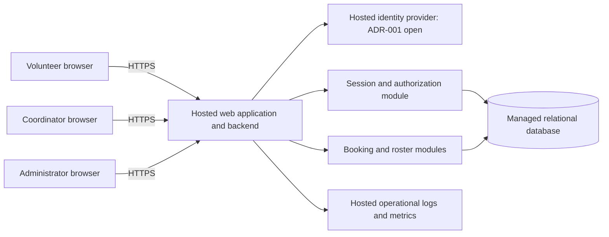

# ARCH-001 — PRD-001 pilot architecture

## Basis and scope

This design implements the boundaries needed for the approved [PRD-001 v1](../prd/PRD-001.md): mobile browser sign-in, warehouse shift booking, and a coordinator roster for about 120 volunteers. It includes session revocation, phone-number privacy, and hosted operation. Payroll and donations remain out of scope. Cancellation, waiting lists, reminders, recurring-shift editing, and attendance tracking are not added by this design.

The repository contains no implementation, repository instructions, architecture templates, or validation commands. BRN-001 is referenced by the PRD but is not present; no additional requirements are inferred from it. PRD-001 and its generated epic map are unchanged. This document defines architecture and planning gates; it does not certify implementation or product approval of unresolved choices.

Plan: establish requirement-to-component ownership; define contracts and cross-cutting controls; record unresolved decisions; verify traceability and report readiness. The resulting decisions and evidence are below and in [verification](ARCH-001-verification.md).

## Structure and deployment

Use one mobile-first web application with a server-side backend and one transactional relational database. Keep identity, sessions, scheduling, bookings, and roster access as modules of the application. The pilot does not require independently deployed microservices, an event bus, or a separate analytics system.

The diagram shows logical boundaries, not separate deployable services. The browser has no database credentials or direct access to contact records. All business requests pass through the backend, which authenticates the session and authorizes the action before reading or writing data.

NFR-003 applies to **the entire product**: web assets, backend, identity, database, backups, secrets, monitoring, and any future scheduled jobs must run on hosted services. No on-site server, coordinator laptop, or volunteer device is a runtime dependency beyond browser access. Use separate non-production and production configuration, encrypted transport, managed secrets, database migrations, backups, and a tested restore procedure. The concrete hosting vendor and runtime are implementation selections subject to these constraints; this design makes no pricing or availability claims.

## Ownership and contracts

| Module | Owns | Contract and boundary | Requirements |
|---|---|---|---|
| Identity adapter | Sign-in redirect, callback validation, provider-subject mapping | A successful sign-in produces a verified issuer and subject mapped to an active local user. The selected provider must pass ADR-001's checks. | FR-001 |
| Sessions and authorization | Application sessions, roles, revocation | Every protected request resolves an active local user and roles from authoritative server state. No caller-supplied role is trusted. | FR-001, NFR-001, NFR-002 |
| Scheduling and booking | Shift instances, capacity, bookings | List open shifts; atomically claim capacity for the current volunteer. Openness policy remains GAP-001. | FR-002 |
| Roster | Day-based projection of confirmed bookings | Return booked volunteer names and phone numbers only to a coordinator. No direct database access from the browser. | FR-003, NFR-002 |
| Hosted operations | Deployment, configuration, secrets, recovery, telemetry | All production components run off-site on hosted services. | NFR-003; supports all functional requirements |

The roles `volunteer`, `coordinator`, and `administrator` are independent permissions. Administrator authority grants session revocation, not phone visibility. One person may hold multiple roles through controlled provisioning. Role assignment is server-side and never available through volunteer self-service. Initial role provisioning and shift/contact imports use a restricted hosted operations process; a management UI is not required by the PRD.

### Data model

| Entity | Minimum fields and constraints |
|---|---|
| User | Internal ID, verified identity issuer and subject (unique pair), display name, active flag, session generation; no phone in general user projections |
| UserRole | User ID, role; unique pair; changed only through controlled administration |
| VolunteerContact | User ID (unique FK), phone number; isolated from general user queries and accessible through the coordinator projection only |
| Session | Hash of opaque token, user ID, issued generation, expiry, revoked timestamp; raw bearer tokens are not stored |
| Shift | ID, start and end instants, configured site time zone, capacity, publication state; positive capacity and end after start |
| Booking | ID, shift ID, volunteer ID, creation instant; unique shift/volunteer pair and foreign keys |
| SecurityAudit | Event type, actor ID, target ID, timestamp, outcome, correlation ID; no phone numbers, credentials, or session tokens |

Shift capacity and publication fields are a proposed representation pending GAP-001, not an approved definition of when a shift is open. There is no cancellation state until that behavior is authorized. The site time zone is deployment configuration, not inferred from the developer environment. Day rosters use the shift's start date in that zone, including daylight-saving transitions; shifts spanning midnight appear under their start date.

### Proposed HTTP boundary

Paths express contracts for epic planning, not an implemented API or framework selection.

| Operation | Authorization | Result and failure semantics |
|---|---|---|
| `GET /auth/start`, `GET /auth/callback` | Public entry; validated identity exchange | Map verified identity to a provisioned active user; issue an application session only after validation. Reject unknown accounts by default; no automatic privileged provisioning. Enrollment mechanism remains ADR-001. |
| `POST /auth/logout` | Current session | Revoke the current application session and expire its browser cookie. |
| `GET /shifts?from=...&to=...` | Volunteer | Bounded shift window with availability; no other volunteers' identities or contact data. |
| `POST /shifts/{id}/bookings` | Volunteer | Book for the authenticated user, never an arbitrary user ID from the request. New booking returns `201`; retry of the same booking returns existing booking with `200`; full/closed returns `409`. |
| `GET /roster?date=YYYY-MM-DD` | Coordinator | Shift list with booked volunteers and their phone numbers, using coordinator-only response objects. Empty roster is a valid result. |
| `POST /admin/users/{id}/revoke-sessions` | Administrator | Revoke all existing application sessions for the target user and record an audit event. Acknowledge success only after database commit. |

Protected APIs return `401` for an absent, expired, or revoked session, `403` for insufficient role, `400` for invalid input, and `503` when authoritative security or booking state is unavailable. Responses must not contain internal exception details. Cookie-authenticated writes require CSRF protection and origin checks. Use secure, HttpOnly, appropriately SameSite cookies; validate redirect state, nonce, issuer, audience, and PKCE for an OIDC implementation.

### Booking integrity

The proposed booking transaction locks the selected shift row, checks publication/time/capacity against the eventual approved openness policy, checks for an existing booking, and inserts only if capacity remains. An existing booking returns success even when the shift is now full; it must not consume another place. All capacity-changing writers follow the same locking rule. Reject capacity reductions below the confirmed booking count. Enforce the unique booking constraint in the database as a second line of defense. A failed transaction leaves no partial reservation; a timeout after commit can be retried safely.

This transaction defines how to enforce capacity, while GAP-001 determines the business policy being enforced. Do not invent per-shift capacity, booking cutoff, or overlapping-booking restrictions during implementation.

### Roster freshness and access

Read the authoritative database on each roster request. The initial mobile page load fetches the selected day; while the page is visible, refresh every 30 seconds and provide manual refresh. Show the last successful refresh and a visible stale state on failure. The 30-second interval is a design default for the PRD summary's “live roster,” not a new approved service-level requirement. An API read after a booking commit includes that booking; avoid read replicas with unspecified lag for this path.

All phone-bearing responses use `Cache-Control: no-store`. Do not persist roster data in local storage, service-worker caches, shared page caches, or analytics. Clear displayed protected data on logout, authorization failure, and session-revocation detection. Previously viewed information cannot be recalled from a person's memory or screenshots; the control prevents subsequent unauthorized system access.

## Cross-cutting decisions

### Session revocation — NFR-001

[ADR-002](../adr/ADR-002.md) selects opaque, server-validated application sessions. Every protected request checks the session and the user's session generation against authoritative database state. Revocation increments that generation in a transaction, invalidating all earlier sessions without dependence on provider token expiry or logout propagation. There is no positive authorization cache in the pilot. Database failure denies access rather than accepting a stale session.

The guarantee covers all application endpoints and application instances. Any protected read or write must be reauthorized at its data-access/commit boundary; a request whose session check occurred earlier cannot retain authorization indefinitely. Request execution is bounded to less than five minutes (design target: 30 seconds), and any retry reauthorizes. No long-lived authenticated stream or background action may bypass the same checks. The verification clock starts at successful revocation commit; new requests are denied immediately, within the PRD's five-minute maximum.

Revocation invalidates existing sessions. It does not imply a permanent account ban or prevent a new sign-in: those are distinct product policies not requested by NFR-001. Provider sessions must not silently exchange an old application cookie for a new session; creating another session requires a fresh validated sign-in flow. ADR-001 must document provider-session behavior.

### Phone privacy — NFR-002

Enforce coordinator-only phone reads on the server and in query/response projections. Volunteer self-service APIs do not return even the caller's phone, because the PRD says only the coordinator may see numbers. Administrator endpoints, general user objects, availability responses, error messages, logs, traces, and audit events exclude phone numbers. Administrative role alone cannot request a roster. Tests must try direct API calls rather than relying on hidden UI controls.

The hosted database and backups store contact data encrypted at rest; restrict service credentials and disable ordinary human browsing of production data. Authorized imports must avoid displaying phone values to operators or logging their payloads. Infrastructure custodians' exceptional access and retention rules are not defined by the PRD; record them as an operational policy gap before production. No extra user-facing access to phone numbers is assumed.

### Hosted operation — NFR-003

Use a stateless hosted backend backed by authoritative managed database state so multiple instances share sessions and booking locks. External identity failure prevents new sign-ins; existing valid application sessions may continue while their local state is available. Database failure prevents sign-in completion, protected data reads, and bookings. Roster failures show stale status rather than implying a successful refresh. Logs and metrics track authentication errors, revocation latency, booking conflicts, failed writes, and roster freshness without contact information.

The pilot initially publishes Tuesday/Thursday shift instances, then additional days through the same scheduling data. Release rollback may revert the application but must preserve committed bookings and revocation state. Use backward-compatible migrations and verify restore procedures before accepting pilot traffic. Region, retention, backup frequency, recovery objectives, and budget need operational choices; no unrequested numeric availability or recovery commitments are invented.

## Open decisions and assumptions

| ID | Unresolved item or design assumption | Impact and next evidence | Owner role |
|---|---|---|---|
| ADR-001 | Actual identity provider, volunteer enrollment and usable sign-in/recovery channel | Blocks FR-001 epic readiness. Validate the channel with volunteers, then select and document a provider against the ADR checklist. Architectural contracts alone do not close the PRD's explicit ADR marker. | Product owner and technical owner |
| GAP-001 | Meaning of “open”: who supplies shifts, capacity values, publication, and booking cutoff | Blocks FR-002. Proposed baseline: coordinator-approved shift import, positive capacity per shift, published future shifts bookable until start, first transaction to commit gets the place. Product owner must settle these business rules before committing booking acceptance criteria. | Product owner/coordinator |
| ASM-ARCH-01 | Named volunteers and contact records can be provisioned through a restricted import; public registration is not assumed | Supports independent roster/authorization planning. Enrollment implementation depends on ADR-001; readiness of data migration and launch requires confirmation of data source and field ownership. | Coordinator |
| ASM-ARCH-02 | Independent local roles and a configured food-bank time zone | Ready epic candidates must explicitly carry these design defaults. Role assignees and actual time-zone value are launch configuration. | Product owner and operator |
| GAP-002 | Hosting account, region, budget, phone retention, exceptional infrastructure access, and recovery policy | Does not change the hosted topology or block architecture-ready epic decomposition. Blocks production operational sign-off until recorded and verified. | Technical owner and product owner |
| ASM-01 | PRD assumption that most volunteers have a smartphone/browser remains open | Validate as the PRD requests; affects pilot adoption. No unsupported alternative application channel is added. | Product owner |

These are recorded decisions and work items, not questions requiring an answer in this architecture pass. Owner roles indicate responsibility; no person has been assigned or notified.

## Requirement readiness and acceptance evidence

**READY** means the architecture contract is sufficient to draft an epic with testable acceptance criteria. **BLOCKED** means an unresolved choice changes those criteria. Ready does not mean implemented or ready to launch. Integration dependencies can remain for a ready epic when its own behavior is fully specified through stable contracts. The checks below are proposed epic acceptance evidence, not reported test results.

| Requirement | Epic readiness | Architecture coverage / decision | Required implementation evidence | Dependency or blocker |
|---|---|---|---|---|
| FR-001 | BLOCKED | Identity adapter; [ADR-001](../adr/ADR-001.md) remains proposed | Valid and invalid sign-in/callback tests, account mapping, recovery/enrollment and actual provider integration | Provider and usable sign-in channel unresolved; NFR-001 and NFR-003 apply |
| FR-002 | BLOCKED | Booking transaction and API; GAP-001 | Signed-in volunteer books an approved open shift; unauthenticated request denied; concurrent last-place requests yield one booking; retry yields no duplicate; closed/full/invalid shifts rejected | GAP-001 directly blocks acceptance criteria; FR-001 required for integrated delivery; NFR-001 and NFR-003 apply |
| FR-003 | READY | Coordinator roster contract, day boundary and freshness rules | Coordinator sees exactly the booked volunteers for a day; committed bookings appear on next successful read; date-boundary, empty-day, refresh-failure and unauthorized-access tests | Integrates with FR-002's booking data and identity/roles. Can plan/test using seeded bookings and the defined principal contract. NFR-001, NFR-002 and NFR-003 apply |
| NFR-001 | READY | [ADR-002](../adr/ADR-002.md); session generation and authoritative checks | Multiple sessions and multiple instances: after administrator revokes, every old session fails within 300 seconds; non-admin denied; database outage fails closed; in-flight work cannot bypass deadline | Local session control can be built/tested with an identity-adapter fixture; actual provider integration follows ADR-001 |
| NFR-002 | READY | Separate contact storage, coordinator projection, role independence, no-store/log controls | Phone absent from every non-coordinator response, including volunteer's own and admin-only requests; present for coordinator; no phone in logs, errors or caches; role removal denies next read | Applies across all epics, not just the roster UI; infrastructure policy GAP-002 is a launch gate |
| NFR-003 | READY | Hosted deployment boundary for the whole product | Deployment inventory covers every runtime dependency; pilot works without an on-site server; hosted secret, migration, backup/restore and outage checks | Cross-cutting condition on all epics; actual account/vendor selection and GAP-002 precede production |

Suggested decomposition order, without creating epics:

1. Hosted application, database, and operational baseline (NFR-003).
2. Local authorization, revocable sessions, and restricted contact access (NFR-001, NFR-002).
3. Coordinator roster with seeded booking data and the identity principal contract (FR-003; carries all three NFRs).
4. After ADR-001 is resolved, volunteer sign-in (FR-001; carries NFR-001 and NFR-003, plus NFR-002's data exclusions).
5. After GAP-001 is resolved, shift booking (FR-002; integrates FR-001 and carries all three NFRs), followed by full roster integration.

All six active requirements are accounted for. Four are architecture-ready for epic planning; two are blocked. This is partial readiness, not an overall release approval. NFRs may be shared foundation work plus acceptance criteria in functional epics; they must not disappear after the foundation epic closes.

SM-01 remains measured by the coordinator's shift log. Booking counts do not prove attendance or a fully staffed shift at start, so this architecture does not replace the metric with an application-derived proxy. The 95% target must be evaluated during the pilot, separately from architecture verification.
