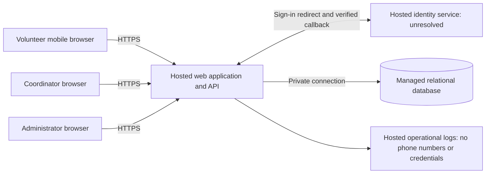

# ARCH-001 — Volunteer shift sign-up

## Scope and decision status

This architecture defines a pilot for approximately 120 volunteers and one coordinator,
based on [PRD-001](../prd/PRD-001.md), version 1. It does not change that approved PRD,
create epics, or claim stakeholder approval. BRN-001 is referenced by the PRD but is
not available in this workspace; no additional requirements are inferred from it.

The design baseline is a mobile-first web application, a single hosted application
service, a managed relational database, and an external identity service. Application
sessions and authorization remain under the application's control. The identity
provider remains unresolved in [ADR-001](../adr/ADR-001.md), as explicitly requested
by the PRD's open decision marker. Other decisions below are architecture choices
for decomposition, not additional approved product requirements.

Plan: define component and data boundaries; allocate all six requirements and their
cross-cutting constraints; record the identity decision; verify traceability and
publish readiness separately from implementation test results.

## Components and trust boundaries

The browser is untrusted. Every protected request passes through server-side session
and role checks, including polling and administrative actions. The browser has no
database credentials or direct database access. The identity service authenticates
a subject; the application maps it to an approved local account and determines its
roles. Provider claims alone cannot grant coordinator or administrator privileges.

Keep identity integration, sessions/access control, shifts/bookings, and roster
queries as modules in one application. This scale does not require independently
deployed services, a message bus, or a separate reporting database. Booking and
roster reads use the same authoritative database to avoid replication lag.

## Requirement allocation and epic readiness

**READY** means the requirement has a component owner, interfaces, and a verification
path sufficient to draft an epic. It does not mean implemented, tested, or ready to
release. **BLOCKED** means a material architecture decision prevents a settled epic
scope for that requirement. A delivery dependency does not automatically prevent
decomposition of an independent module behind an explicit interface.

| Requirement | Owning modules / surfaces | Architecture and epic readiness | Delivery dependencies / evidence required |
|---|---|---|---|
| FR-001: volunteer sign-in | Identity adapter; account mapping; session issuance; sign-in page | **BLOCKED** — ADR-001 must select the provider and sign-in/enrollment approach. Discovery work can be planned now. | Provider callback verification, account mapping, recovery/enrollment scope, and real-provider sign-in tests. |
| FR-002: signed-in volunteer books an open shift | Shift listing; booking transaction; volunteer page | **READY** — implement against the authenticated-principal contract below. | FR-001 for integrated use; NFR-001 on protected requests; NFR-002 on responses; NFR-003 on deployment. Concurrent last-place and duplicate-request tests. |
| FR-003: coordinator sees each day's booked volunteers | Roster query; coordinator page; role checks | **READY** — date-filtered query and coordinator-only response contract are defined. | FR-002 supplies bookings; authenticated coordinator provisioning; NFR-001, NFR-002, and NFR-003. Role, date-boundary, and freshness tests. |
| NFR-001: administrator revokes sessions within five minutes | Application session store; request guard; administrator endpoint | **READY** — local revocation design is independent of provider token lifetimes. | Administrator provisioning and adapter integration for end-to-end testing. All-session revocation, race, outage, and timing tests. |
| NFR-002: phone numbers visible only to coordinator | Contact storage; authorization; response projections; all UI/logging surfaces | **READY** — explicit field-level boundary applies across the product. | Role assignment and contact import for pilot use. Negative disclosure tests, including administrator-only and volunteer accounts. |
| NFR-003: entire product hosted | Web/API, identity, database, secrets, logs, backups and deployment | **READY** — all production dependencies are hosted; no on-site runtime. | Hosting account/region/budget configuration and deployment validation before pilot. Every epic inherits this constraint. |

FR-001 is the only requirement blocked for epic definition. All six remain
**NOT_RUN** for runtime acceptance because this repository contains no executable
product. Identity integration blocks an end-to-end pilot even though five
requirements can be decomposed now. NFR-002 is not limited to the roster, and
NFR-003 is not limited to an infrastructure epic.

## Interfaces and data ownership

The identity adapter returns a verified `(issuer, subject)` and authentication
attempt context to the server. It never accepts an unverified browser-provided
volunteer ID. Local mapping resolves an `account_id`. The session guard returns
`Principal { account_id, roles }` only for an active, unexpired application session.
An unknown external identity receives no local permissions.

Proposed relational records:

| Record | Essential fields / invariants |
|---|---|
| Account | Local ID, display name, active flag, session generation, last session-revocation time; server-controlled role memberships. |
| ExternalIdentity | Unique `(issuer, subject)` mapped to an account; no automatic linking by display name or phone number. |
| Session | Hash of opaque session token, account ID, generation at issuance, expiry, revocation time. Never persist the raw token in logs. |
| VolunteerContact | Account ID and optional phone number; isolated from general account and booking projections. |
| Shift | ID, UTC start/end, positive capacity, publication state; food-bank time zone is required deployment configuration. |
| Booking | ID, shift ID, volunteer account ID, created time; unique `(shift_id, account_id)`. |
| SecurityAudit | Actor and target account IDs, action, outcome, timestamp; no phone numbers, cookies, or provider tokens. |

Account roles are independent: `volunteer`, `coordinator`, and `administrator`.
Administrator status alone never grants phone visibility. An account with both
administrator and coordinator roles has phone access through its coordinator role.
Role changes take effect on subsequent protected requests by reading authoritative
roles; do not embed long-lived role permissions in browser tokens.

Indicative HTTP contracts, with names finalized during implementation:

| Operation | Authorization and response |
|---|---|
| Sign-in start / callback | Public entry, adapter-specific callback validation; issue application cookie only after approved account mapping. Exact provider flow is ADR-001's responsibility. |
| `GET /shifts` | Active volunteer session; published shifts, times and remaining capacity; no contact records or other volunteers' details. |
| `POST /shifts/{id}/bookings` | Active volunteer session; derive volunteer ID from principal; return own booking confirmation. |
| `GET /roster?date=YYYY-MM-DD` | Coordinator role; shifts starting on that local calendar date and booked volunteers' names; optional phone included only in this coordinator projection. |
| `POST /admin/accounts/{id}/revoke-sessions` | Administrator role; invalidate all existing application sessions for target account, returning success only after commit; response has no contacts. |

Protected endpoints return unauthenticated/forbidden responses consistently without
disclosing contacts or rosters. State-changing browser requests require CSRF
protection. Use a Secure, HttpOnly, SameSite cookie over HTTPS; no identity or
application session tokens in browser local storage. Validate redirect destinations
and bind callbacks to their originating authentication attempt.

## Booking and roster behavior

Design assumption: an open shift is published, has not started, and has available
capacity. Capacity and schedule are coordinator-supplied data, not hard-coded from
the PRD's description of three daily shifts. Seed/import the pilot schedule through
a controlled operator process; a scheduling editor is not a new feature in scope.

In one database transaction, lock the shift row, check whether this volunteer already
has a booking, and return that existing booking on retries. Otherwise verify that
the shift is open, count its bookings under the lock, insert only if below capacity,
and commit before confirming success. All booking writers must follow this lock
protocol; the unique constraint also prevents duplicate bookings. Reject a closed,
started, or full shift as a conflict and refresh availability. A displayed capacity
is advisory until the transaction succeeds. A failed or rolled-back write must
never appear as a confirmed booking.

Roster queries join committed bookings to account display names and, only for an
authorized coordinator, contact data. Interpret a selected day using the configured
food-bank time zone, including daylight-saving transitions, rather than the browser
or database host's time zone. Show an empty roster explicitly. Proposed freshness:
refresh on page entry, manual refresh, and every 15 seconds while visible; show
last successful update and an error/stale indicator when a refresh fails. Fifteen
seconds is a design target for the PRD's “live roster,” not an approved numeric SLA.
Avoid offline persistence and shared caching of roster/contact responses; send
`Cache-Control: no-store` and clear displayed protected data on authorization failure.

## Session revocation: NFR-001

Use application-owned opaque sessions, not provider access tokens as standalone
authorization to application APIs. Every protected request checks its session,
account active flag, expiry, current generation and roles against the primary
database. Do not use a positive authorization cache in the pilot. If validation is
unavailable, deny protected access rather than reuse stale authorization.

The administrator action locks the target account and atomically increments its
session generation and records the database time of revocation and an audit event.
A session from an earlier generation
is invalid even if its cookie or provider token has not expired. Session issuance
uses the same account lock and checks the authentication attempt's server-recorded
start time against the account's last revocation time, using the database clock for
both. Reject attempts starting at or before that revocation time, including timestamp
ties, and require a fresh attempt; otherwise issue in the current generation. This
works even when the account is unknown until callback. It prevents an in-progress
callback from resurrecting
revoked application access. Provider cookies are never exchanged silently to bypass
an invalid application session; resuming access goes through the sign-in entry flow.

The design target is denial on the next protected request after revocation commits,
which is stronger than the five-minute requirement. For booking writes, hold the
account lock from the session/generation check through the transaction commit,
then lock the shift in that order. This orders a concurrent write before or after
revocation. Bound protected requests below five minutes (proposed timeout: 30
seconds); do not introduce indefinitely authorized streams or background jobs.
Already displayed information cannot be recalled, but subsequent protected reads
and writes must be denied. Test multiple sessions and application instances.

Revocation ends existing application sessions; permanent account suspension and
global identity-provider logout are separate semantics not required by this PRD.
ADR-001 must ensure that the chosen adapter supports this application boundary.

## Privacy and hosted operations: NFR-002 / NFR-003

Phone numbers are absent from volunteer responses, including the volunteer's own
profile, booking confirmations, client bundles, analytics, error reports and URLs.
Administrator-only views and session-revocation audits also omit them. Use explicit
response field allowlists; hiding a field visually is insufficient. Restrict contact
reads to the coordinator-authorized query path. Automated tests must inspect raw
HTTP payloads as well as rendered pages and representative logs.

Within the product, only the coordinator role may retrieve phone numbers. Service
identities can process stored contacts as needed, with narrowly scoped credentials;
ordinary support and deployment accounts should not have contact browsing access.
Privileged infrastructure access is audited and restricted. Use encrypted database
connections, storage and backups; keep secrets server-side in a hosted secret store.
Do not add third-party browser analytics that can capture roster content.

Deploy the application, identity integration, database, secrets, logs and backups
to hosted services. Use separate pilot/test data and credentials, managed database
backups, migrations, and a restore exercise before launch. Choose hosting vendors,
region, retention and operational ownership during infrastructure planning; the
PRD specifies no mandated platform, budget, availability SLA, RPO or RTO. Do not
invent numerical compliance obligations. No local food-bank server, database,
scheduled worker or backup device may be a production dependency.

Monitor booking failures, denied access, revocation failures and roster refresh
errors using IDs and aggregate counts without contact data. A failed revocation
must visibly fail to the administrator; an outage must not acknowledge a booking.

## Assumptions, unresolved inputs and boundaries

| Input / decision | Handling and effect |
|---|---|
| Identity provider, enrollment and recovery | **Architecture blocker for FR-001**, recorded in ADR-001. No provider or sign-in channel is silently selected. |
| Which people hold administrator/coordinator roles | Keep capabilities separate now; explicitly provision trusted accounts before pilot. Suggested business owner: Priya Nair. Does not block defining access-control epics. |
| “Open” shift, booking cutoff and roster freshness | Use the stated design assumptions for epic drafting; have the product owner settle these before affected stories are accepted. Capacity remains data. No cancellation, waitlist, overlapping-shift policy or reminders are added. |
| Schedule, capacity, contacts and time zone | Pilot setup must supply these through restricted import/configuration. Do not infer a location or time zone from “Riverside” or the development environment. Contact provenance/retention need operational definition before real data is loaded. |
| ASM-01: smartphone access | Still open in PRD-001. Owner should record the September meeting result; do not claim it validated. Existing phone coordination can support pilot operations without adding a new software channel. |
| Hosting provider and operating details | Infrastructure epic selects a compatible hosted runtime and relational database and records costs/operations. Vendor selection does not change the defined service boundaries. |

Payroll and donations remain excluded. Native apps, scheduling management,
self-service profile editing, notifications and automated staffing analytics are
not authorized features. SM-01 continues to use the coordinator's shift log:
compare the 83% baseline to the 95% target by pilot end. Software bookings alone
do not establish that a shift actually started fully staffed.

## Suggested decomposition and release order

These are planning slices, not created epic records or edits to the PRD's generated
epic map. Each resulting epic should cite the specific PRD items above.

1. Hosted foundation: NFR-003; schema, migration, secrets, deployment and restore.
2. Access and contact boundaries: NFR-001 and NFR-002; application sessions, role
   checks, administrator revocation and privacy projections, initially verified
   with a test identity adapter.
3. Identity integration: FR-001; settle ADR-001 before defining provider-specific
   scope, then test real authentication and account provisioning.
4. Volunteer booking: FR-002 plus all three NFRs; implement against the principal
   contract and integrate once identity is available.
5. Coordinator roster: FR-003 plus all three NFRs; test committed booking visibility,
   date selection, coordinator authorization and phone restrictions.

The dependency order is foundation → sessions/access → integrated identity and
booking → integrated roster; booking and roster module development can use fixtures.
The PRD rates FR-003 “should” and the other requirements “must”; this architecture
does not change priorities or silently remove the roster from the current release.
Launch with Tuesday/Thursday shifts, then expand to all shifts after pilot review.

## Verification required during implementation

Follow failing-test → implementation → refactor for behavior. The repository has
no test runner or quality gates yet; the implementation project must establish
commands before coding. The cases below are acceptance evidence to produce, not
tests that have already passed.

| PRD item | Required evidence | Runtime result now |
|---|---|---|
| FR-001 | Real-provider successful sign-in; failed/tampered callback; unknown account denied; agreed enrollment/recovery flow. | NOT_RUN; epic scope BLOCKED by ADR-001. |
| FR-002 | Signed-out denied; available shift booked; full/started/unpublished rejected; concurrent final-slot contenders produce one booking; retries return one booking; rollback yields no confirmation. | NOT_RUN |
| FR-003 | Coordinator sees committed volunteers for selected local date; empty day; timezone/DST boundary; unauthorized roles denied; refresh and stale-state behavior. | NOT_RUN |
| NFR-001 | Revoke every existing session across browsers/instances; verify denial immediately and at five minutes; test issuance/write races, provider-token bypass and session-store outage. Measure from committed revocation; do not merely inspect expiry settings. | NOT_RUN |
| NFR-002 | Anonymous, volunteer, administrator-only and coordinator role matrix on all routes; payload, UI, cache and log checks; only coordinator receives phone numbers. | NOT_RUN |
| NFR-003 | Deployed service inventory includes every production dependency; smoke test sign-in/book/roster/revoke on hosted environment; verify restore without food-bank hardware. | NOT_RUN |

Documentation verification against the actual local files is recorded separately
in [ARCH-001 verification](ARCH-001-verification.md).
