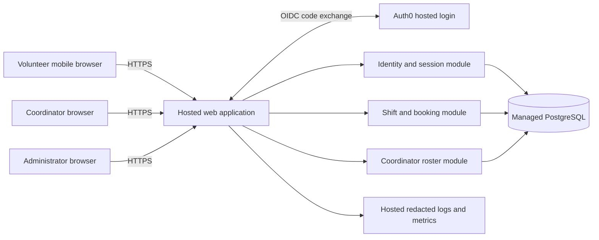

# ARCH-001 — Riverside volunteer shift sign-up

## Scope and readiness

This architecture defines the Pilot in [PRD-001](../prd/PRD-001.md), version 1:
mobile browser sign-in, booking, daily rosters, session revocation, phone privacy,
and hosted operation for about 120 volunteers and one coordinator. No existing
application, repository instructions, test commands, or architecture were supplied.
BRN-001 is referenced by the PRD but is unavailable; no additional requirements
are inferred from it. The approved PRD and its generated epic map remain unchanged.

All six current requirements are **READY for epic decomposition** under the
decisions and explicit assumptions below. READY means a component, enforceable
contract, dependencies, and acceptance evidence are defined. It does not mean
implemented, tested, deployed, or approved by the PRD owner. There are no unresolved
architecture blockers to writing epics. Operational prerequisites remain gates
to their respective implementation or pilot activities, as recorded below.

## Decisions

| Decision | Selected approach | Requirements covered |
|---|---|---|
| [ADR-001](../adr/ADR-001.md) | Auth0 hosted sign-in; application-owned, revocable sessions | FR-001, NFR-001; session checks apply to FR-002 and FR-003 |
| [ADR-002](../adr/ADR-002.md) | Hosted modular web application and managed PostgreSQL; transactional booking | FR-002, FR-003, NFR-003 across the whole product |
| [ADR-003](../adr/ADR-003.md) | Server-enforced coordinator role and separate phone projection | NFR-002; constrains FR-001, FR-002 and FR-003 |

These decisions are accepted for architecture planning in response to this task.
They do not assert procurement, account provisioning, or stakeholder sign-off.

## Components and trust boundaries

The browsers are untrusted. The application serves mobile-first HTML and
same-origin endpoints; it alone accesses product data. Auth0 authenticates identity;
local records authorize product actions. Browser-supplied roles, volunteer IDs,
remaining capacity, and identity claims are never authoritative. The database
is reachable only by application and controlled operational identities.

Use one deployable application with separate identity, booking, and roster modules.
There is no need for a message broker, microservices, a native app, or an on-site
service at this scale. A programming language/framework and hosting vendor can be
chosen in the platform epic against these contracts; they do not change product
boundaries. Use maintained OIDC and database libraries, with versions pinned during
implementation. There is no public database API or client-side privileged key.

## Data ownership and invariants

| Record | Essential fields and constraints | Owning module |
|---|---|---|
| User | ID, unique identity issuer + subject, display name, enabled, session generation, revoked-at timestamp | Identity |
| Volunteer | ID, unique user ID; maps a volunteer session to booking identity | Identity/booking |
| Role assignment | User ID + role; explicit volunteer, coordinator, administrator grants | Identity |
| Contact | Volunteer ID, optional phone; excluded from ordinary volunteer queries | Roster/contact access |
| Session | Hash of random opaque ID, user ID, generation, issued-at, absolute expiry | Identity |
| Login attempt | One-use state, nonce, PKCE verifier, started-at, expiry; bound to initiating browser | Identity |
| Shift | ID, start/end instants, capacity > 0, published/open flag | Booking |
| Booking | ID, shift ID, volunteer ID, created-at; unique (shift ID, volunteer ID), foreign keys | Booking |
| Audit event | Actor ID, action, target ID, timestamp, result; no phone, tokens, passwords or payload dump | Operations |

Store instants in UTC and configure one food-bank IANA time zone for display and
daily roster boundaries. Never infer it from a browser or this workspace's time zone.
Treat a day's interval as local midnight to the next local midnight, converted to UTC,
so daylight-saving changes do not lose or duplicate shifts. Classify a shift by
its local start date. Contacts stay in the application database, outside identity
tokens and ordinary profile responses. Database credentials and provider secrets
belong in the hosted secret store.

## Flows and endpoint contracts

Paths below are design contracts for epics, not existing APIs. All protected
endpoints validate the local session and current role. Mutations also validate
CSRF protection and origin. Fail closed if authorization storage is unavailable.

| Operation | Authorization and result |
|---|---|
| `GET /login`, `GET /auth/callback` | Auth0 OIDC authorization-code flow with PKCE, state and nonce. Validate issuer, audience, signature, expiry and freshness. Only a pre-provisioned, enabled subject gets a local session. Never attach an account by a browser-supplied email. |
| `POST /logout` | Invalidate the current local session and clear its cookie. |
| `GET /shifts` | Volunteer session; upcoming published shifts with availability, and own booking state. No roster identities or contacts. |
| `POST /shifts/{id}/bookings` | Volunteer session; derive volunteer ID from session. Return `201` for a committed new booking, `200` for an existing own booking, `409` for full/closed/past shift, `404` for unknown shift. |
| `GET /coordinator/roster?date=YYYY-MM-DD` | Coordinator role; shifts for the configured local date, including empty shifts, with booked volunteers' names and optional phones. Invalid dates return `400`. |
| `POST /admin/volunteers/{id}/revoke-sessions` | Administrator role; atomically invalidate all target sessions, record audit event and acknowledge only after commit. Response contains IDs and outcome, no contact data. |

Missing, expired or revoked sessions produce `401` on APIs; an authenticated wrong
role produces `403`. UI pages offer sign-in or access-denied states accordingly.
No route trusts a role sent by the browser. Administrator does not imply coordinator.

### Booking consistency

One database transaction validates and locks the acting user first (to serialize
against revocation), then locks the target shift, checks for an existing own
booking, then checks that the shift is published, has not started and has capacity.
Insert and commit before reporting success. All booking writers follow that lock
protocol, including operational tools; the unique constraint backs up duplicate
prevention. Capacity changes must take the same lock and cannot lower capacity
below booked count. Concurrent requests for the final slot yield one new booking;
retries after a lost response return the existing booking. Do not perform an
unprotected count followed by an insert. A failed transaction never produces a
success screen.

The coordinator reads committed bookings from the same primary database. Refresh
the visible roster every 30 seconds and on window focus, with manual refresh and
last-successful-update time. Show a stale/error indication after a failed refresh.
Thirty seconds is a proposed interpretation of “live” in the summary, not an
additional PRD performance requirement. No replica lag or asynchronous roster copy.

### Revocation and privacy

[ADR-001](../adr/ADR-001.md) specifies immediate invalidation after a committed
revocation through uncached primary-database checks on every protected request.
This is stronger than the required five-minute upper bound. No provider token is
accepted as a substitute for an active local session. [ADR-003](../adr/ADR-003.md)
specifies phone access at the query and response layers, including administrator-only
denial and protection against log/cache disclosure.

## Hosted operation and failure handling

NFR-003 applies to **every component and every epic**, including identity, web
serving, database, session storage, secrets, deployment jobs, logs and backups.
Browsers are clients; no food-bank computer is a runtime dependency. Use managed
HTTPS ingress, a hosted application service, managed PostgreSQL with encrypted
backups, hosted secrets and hosted monitoring. Separate test and pilot credentials
and databases; use synthetic contacts in test environments.

Deploy versioned builds and migrations through hosted automation. Rehearse a backup
restore before pilot use, and use backward-compatible migrations so the previous
application build can be restored. Select backup retention and recovery objectives
in the platform epic; the PRD specifies no numeric availability or recovery target.
Log booking failures, revocation failures and authorization denials using IDs only.
Do not add session-replay analytics. Check service health and alert the designated
operator on sustained errors. Hosting cost, region and plan suitability must be
validated before creating paid resources; no such resources are created here.

Auth0 failure prevents new sign-ins; valid local sessions can continue until expiry
while the application database is healthy. Database failure prevents protected
reads and writes, including revocation, with a retryable error and no success claim.
An accepted revocation cannot depend on a background worker or provider availability.
On restoring a backup, invalidate all restored sessions and outstanding login
attempts before reopening traffic, so old revoked sessions cannot return.

## Assumptions and remaining gates

These are explicit design defaults or verification tasks, not additions to the
approved PRD. If disproved, revise the affected ADR and readiness before implementing
the affected behavior. No response is requested as part of this task.

| ID | Planning default or uncertainty | Resolution point and affected work |
|---|---|---|
| A-01 | Volunteers can use an email/password account. Auth0 database login is selected; neither universal email access nor a tenant is evidenced. | Identity epic first validates account access and recovery with the coordinator and checks tenant/plan suitability before implementing onboarding. If unsuitable, revisit ADR-001 and FR-001. |
| A-02 | Pilot volunteers, role grants and shifts are provisioned through restricted operational setup; no public registration or scheduling UI. | Identity/booking epics specify repeatable provisioning. Match provider subjects explicitly; import phones only through coordinator-authorized handling. |
| A-03 | “Open” means published, not started, with remaining capacity; one booking per volunteer per shift. No cancellation, waitlist or overlap restriction is inferred. | Booking epic records these acceptance defaults and obtains actual capacities and shift times before seeding. A changed booking policy reopens FR-002 design. |
| A-04 | Administrator and coordinator are separate grants; one person may hold both. Revocation ends existing sessions but does not permanently disable a volunteer. | Identity epic identifies the initial administrator and coordinator. Permanent suspension is separate from the required session-revocation action. |
| A-05 | “Only coordinator” concerns product access to phone data; controlled hosting/database operators necessarily maintain the service. | Privacy epic records operational access controls. A demand to conceal plaintext even from infrastructure operators would require a revised encryption/key-custody design. |
| A-06 | Local time zone, hosting budget/region, operational owner, retention and recovery objectives are not specified. | Platform and roster epics resolve before environment setup/data loading or pilot launch; do not invent compliance or SLA claims. |
| ASM-01 | Smartphone/browser access remains open in the PRD. | Product owner records volunteer meeting evidence before pilot rollout; this architecture does not mark it validated. |

## Requirement-to-epic readiness and acceptance evidence

READY is an architectural planning assessment. Runtime evidence for every row is
currently **NOT_RUN** because there is no application or deployment. Proposed
verification below must become meaningful failing tests before behavior is built.

| Requirement | Readiness | Component / decision | Epic dependency | Required evidence for delivery |
|---|---|---|---|---|
| FR-001 | READY | Identity, ADR-001 | Hosted foundation; A-01 onboarding validation | Invited enabled volunteer signs in on mobile and receives a local session; incorrect credentials, unknown subjects, forged/replayed callback, wrong issuer/audience and disabled user cannot sign in; recovery path exercised. |
| FR-002 | READY | Booking, ADR-002; ADR-001 session boundary | Identity/session contract and hosted DB | Signed-in volunteer books an open shift; anonymous request fails; full, closed and started shifts reject; concurrent final-slot requests cannot overbook; retries create no duplicate. |
| FR-003 | READY | Roster, ADR-002 and ADR-003 | Committed booking data and coordinator grant | Correct names and shifts appear for the requested local day, including empty shifts and date/DST boundaries; newly committed bookings appear on refresh; stale state is visible on failure; other roles denied. |
| NFR-001 | READY | Identity/session and admin action, ADR-001 | Hosted primary DB; identity integration for reauthentication | Revoke all sessions from two browsers across two app instances; replay old cookies immediately and at 300 seconds with denial throughout; unknown/wrong-role administrator fails; DB outage fails closed; callback/revocation races and stale SSO cannot recreate the revoked session. |
| NFR-002 | READY | Authorization, contact storage, response projections, ADR-003 | Local role grants; applies to every endpoint | Coordinator sees phone; anonymous, volunteer (including own phone), and administrator-only requests do not; inspect response bodies, rendered HTML, logs and caches with a synthetic phone canary; role removal takes effect on next request. |
| NFR-003 | READY | Whole product, ADR-002 | Cross-cutting prerequisite for all delivery | Hosted environment inventory plus deploy/smoke and restore checks show login, booking, roster and revocation work with every food-bank computer except test browser powered off. Secrets, logs, sessions and backups have hosted owners. |

### Suggested epic boundaries and order

1. **Hosted foundation** — NFR-003 applied across all requirements: environments,
   database, secrets, deployment, backup/restore and monitoring. Establish contracts
   for identity, scheduling data and restricted contacts.
2. **Identity and session control** — FR-001 and NFR-001, inheriting NFR-002 and
   NFR-003: onboarding feasibility, provider integration, grants, administrator
   revocation and fail-closed session middleware.
3. **Shift discovery and booking** — FR-002, inheriting NFR-001, NFR-002 and
   NFR-003: seed pilot shifts, mobile availability and transactional booking.
4. **Coordinator roster and contact privacy** — FR-003 and NFR-002, inheriting
   NFR-001 and NFR-003: day boundaries, authorized projections and refresh behavior.

These are planning boundaries, not generated epic records or a replacement for
the PRD epic map. NFR-002 privacy checks begin with the first protected endpoint;
they are not postponed until the roster epic. Independent module work can use the
defined contracts, but integrated delivery follows the dependencies above.

## Pilot and success measurement

Seed only Tuesday and Thursday shifts initially, then publish all shifts after
pilot review. Preserve the PRD's coordinator shift log as the measurement source
for SM-01: 83% baseline, target 95% fully staffed starts by pilot end. Bookings do
not prove attendance, so do not substitute booking counts for staffing outcomes.
Payroll, donations, attendance tracking, reminders, cancellations and waitlists
are not part of this architecture's delivery scope.

## Verification record

See [ARCH-001 verification](ARCH-001-verification.md) for candidate file hashes,
commands, document checks and limitations. Delivery tests above are a specification
of future evidence, not passing test results.
