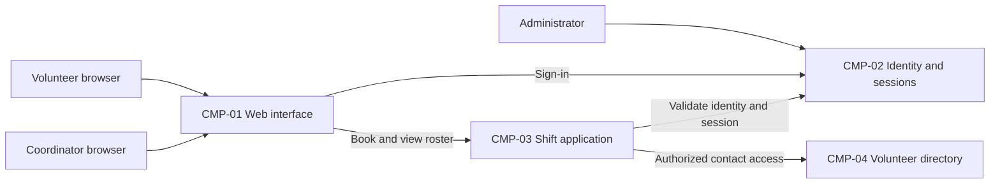

# ARCH-001 — Volunteer shift sign-up for the Riverside Food Bank architecture

## 1. Context and scope

This proposal examines PRD-001 version 1, status approved, owned by Priya Nair.
The system lets approximately 120 volunteers sign in and book warehouse shifts from
mobile web browsers, and gives the coordinator a daily roster. Session revocation,
restricted access to volunteer phone numbers, and hosted operation are in scope.
Payroll, donations, and an installed mobile app are outside the product scope.

No inspection scope was named and no code or configuration was inspected. No
existing ARCH, ADR, policy document, or local preference file was found at the
contract paths. Existing implementation and reuse feasibility remain unknown.
The proposed outcome is create because no ARCH covers this system; outcome remains
unconfirmed. The request explicitly says to proceed without questions, so every
architectural decision remains open and no ADR is written. Proposed boundaries,
ownership, and interactions below are alternatives for review, not accepted decisions.

## 2. Quality drivers

PRD-001#NFR-001 requires administrator revocation of a volunteer's signed-in sessions
to take effect within five minutes. Provider selection alone does not establish
revocation behavior: all protected booking requests must honor it, including any
application session or cached authorization state.

PRD-001#NFR-002 restricts volunteer phone numbers to the coordinator. Data ownership,
coordinator authorization, and enforcement before sending contact data to a browser
must be agreed across components. Hiding a field in the interface alone cannot
satisfy the requirement.

PRD-001#NFR-003 requires hosted services across the whole product because there is
no on-site server. It constrains every component, but does not select a provider,
deployment topology, or operating arrangement.

The PRD's operating context is internal, despite its Pilot release label. The
framework floor is constraint, security, and privacy; all three categories have
NFRs. No policy adds categories. Mobile web access shapes the client boundary.
The live-roster goal motivates a shared booking-to-roster interaction; the PRD
does not specify a numerical freshness target.

## 3. Components

The diagram shows proposed logical responsibilities, not independently deployed
services. ARCH-001#DEC-04 leaves their boundaries open; ARCH-001#DEC-05 and
ARCH-001#DEC-06 leave ownership open. The roster derives from bookings rather than
assuming a separately authoritative roster. ARCH-001#DEC-07 leaves the interaction
mechanism open. All ownership entries below describe the proposal only.



```yaml items
components:
  - id: CMP-01
    status: active
    name: "Mobile web interface"
    responsibility: "Presents sign-in, shift booking, and coordinator roster views; is not authoritative for bookings or access control."
    owns_data: []
    interacts_with:
      - "CMP-02"
      - "CMP-03"
    deployment: "Open: see DEC-08"
    upstream:
      - {id: PRD-001, item: NFR-002, relation: informed_by, version: 1, hash: null}
      - {id: PRD-001, item: NFR-003, relation: informed_by, version: 1, hash: null}
  - id: CMP-02
    status: active
    name: "Identity and sessions"
    responsibility: "Proposed authentication and session authority supporting administrator revocation; does not own shift bookings. Provider and application session responsibilities remain open."
    owns_data:
      - "Proposed: identity subjects, authentication state, and revocation state"
    interacts_with:
      - "CMP-01"
      - "CMP-03"
      - "Administrator"
    deployment: "Open: see DEC-08"
    upstream:
      - {id: PRD-001, item: NFR-001, relation: informed_by, version: 1, hash: null}
      - {id: PRD-001, item: NFR-003, relation: informed_by, version: 1, hash: null}
  - id: CMP-03
    status: active
    name: "Shift application"
    responsibility: "Proposed authority for open shifts and bookings, deriving the coordinator roster and enforcing session and contact-access checks; does not manage credentials or own phone numbers."
    owns_data:
      - "Proposed: shifts and volunteer bookings, with roster derived from bookings"
    interacts_with:
      - "CMP-01"
      - "CMP-02"
      - "CMP-04"
    deployment: "Open: see DEC-08"
    upstream:
      - {id: PRD-001, item: NFR-001, relation: informed_by, version: 1, hash: null}
      - {id: PRD-001, item: NFR-002, relation: informed_by, version: 1, hash: null}
      - {id: PRD-001, item: NFR-003, relation: informed_by, version: 1, hash: null}
  - id: CMP-04
    status: active
    name: "Volunteer directory"
    responsibility: "Proposed authority for volunteer contact data and its association with identity subjects; supplies phone numbers only through an authorized coordinator access path and does not own bookings."
    owns_data:
      - "Proposed: volunteer contact records including phone numbers and identity associations"
    interacts_with:
      - "CMP-03"
    deployment: "Open: see DEC-08"
    upstream:
      - {id: PRD-001, item: NFR-002, relation: informed_by, version: 1, hash: null}
      - {id: PRD-001, item: NFR-003, relation: informed_by, version: 1, hash: null}
```

## 4. Architectural questions

Each question is blocking and unresolved. No mandated platform or explicit decision
settles it. A choice for one question does not settle the other questions sharing
its requirements. Product clarification about roster freshness remains with the
PRD owner in section 8, rather than becoming an architectural decision.

```yaml items
decisions:
  - id: DEC-01
    status: active
    question: "Which identity provider handles volunteer sign-in?"
    blocking: true
    state: open
    resolved_by: []
    notes: "Required by the PRD NEEDS ADR marker. Provider selection affects sign-in, authenticated booking, and available session controls, but does not decide the revocation mechanism. No platform is mandated and no decision was requested interactively."
    upstream:
      - {id: PRD-001, item: FR-001, relation: informed_by, version: 1, hash: null}
      - {id: PRD-001, item: FR-002, relation: informed_by, version: 1, hash: null}
      - {id: PRD-001, item: NFR-001, relation: informed_by, version: 1, hash: null}
  - id: DEC-02
    status: active
    question: "How will administrator revocation invalidate volunteer sessions on every protected request within five minutes?"
    blocking: true
    state: open
    resolved_by: []
    notes: "The provider, application sessions, and any cached validation must share a revocation mechanism. This governs sign-in sessions and their use for booking; selecting a provider alone cannot resolve it."
    upstream:
      - {id: PRD-001, item: FR-001, relation: informed_by, version: 1, hash: null}
      - {id: PRD-001, item: FR-002, relation: informed_by, version: 1, hash: null}
      - {id: PRD-001, item: NFR-001, relation: informed_by, version: 1, hash: null}
  - id: DEC-03
    status: active
    question: "Where will coordinator authorization be established and enforced so that only the coordinator can access volunteer phone numbers?"
    blocking: true
    state: open
    resolved_by: []
    notes: "The roster and directory must share a trusted coordinator identity and an enforcement boundary before disclosure. Administrator permission to revoke sessions does not imply permission to read phone numbers."
    upstream:
      - {id: PRD-001, item: FR-003, relation: informed_by, version: 1, hash: null}
      - {id: PRD-001, item: NFR-002, relation: informed_by, version: 1, hash: null}
  - id: DEC-04
    status: active
    question: "Which component boundaries will separate the web interface, authentication, shift operations, and contact-data responsibilities?"
    blocking: true
    state: open
    resolved_by: []
    notes: "The four proposed logical components are unaccepted. Shared application modules and independently operated services would create different interfaces and enforcement responsibilities; their boundaries must be agreed before separate epics build them."
    upstream:
      - {id: PRD-001, item: FR-001, relation: informed_by, version: 1, hash: null}
      - {id: PRD-001, item: FR-002, relation: informed_by, version: 1, hash: null}
      - {id: PRD-001, item: FR-003, relation: informed_by, version: 1, hash: null}
      - {id: PRD-001, item: NFR-001, relation: informed_by, version: 1, hash: null}
      - {id: PRD-001, item: NFR-002, relation: informed_by, version: 1, hash: null}
  - id: DEC-05
    status: active
    question: "Which component is authoritative for shift availability and bookings used by both booking and roster features?"
    blocking: true
    state: open
    resolved_by: []
    notes: "The proposal places this authority in the shift application. Ownership and the consistency boundary for accepting an open shift must be shared by booking and roster epics; no table or migration design is selected."
    upstream:
      - {id: PRD-001, item: FR-002, relation: informed_by, version: 1, hash: null}
      - {id: PRD-001, item: FR-003, relation: informed_by, version: 1, hash: null}
  - id: DEC-06
    status: active
    question: "Which component owns volunteer contact records and their association with booked volunteers?"
    blocking: true
    state: open
    resolved_by: []
    notes: "The proposal uses a volunteer-directory responsibility. Ownership must prevent conflicting contact copies and preserve restricted access when the coordinator identifies booked volunteers. It does not imply adding phone numbers to every roster response."
    upstream:
      - {id: PRD-001, item: FR-003, relation: informed_by, version: 1, hash: null}
      - {id: PRD-001, item: NFR-002, relation: informed_by, version: 1, hash: null}
  - id: DEC-07
    status: active
    question: "How will committed bookings become visible in the coordinator roster?"
    blocking: true
    state: open
    resolved_by: []
    notes: "Booking and roster epics must agree on reading authoritative booking state or propagating updates to a roster view, including the consistency contract. The PRD owner must clarify the live-roster freshness expectation; no latency target is invented here."
    upstream:
      - {id: PRD-001, item: FR-002, relation: informed_by, version: 1, hash: null}
      - {id: PRD-001, item: FR-003, relation: informed_by, version: 1, hash: null}
  - id: DEC-08
    status: active
    question: "Which hosted deployment topology will run the whole product?"
    blocking: true
    state: open
    resolved_by: []
    notes: "Hosted operation is required, but provider, deployment units, persistent storage, environment separation, and operational responsibility are undecided. Hosting affects every functional requirement, the availability of revocation state, and the boundary protecting contact data."
    upstream:
      - {id: PRD-001, item: FR-001, relation: informed_by, version: 1, hash: null}
      - {id: PRD-001, item: FR-002, relation: informed_by, version: 1, hash: null}
      - {id: PRD-001, item: FR-003, relation: informed_by, version: 1, hash: null}
      - {id: PRD-001, item: NFR-001, relation: informed_by, version: 1, hash: null}
      - {id: PRD-001, item: NFR-002, relation: informed_by, version: 1, hash: null}
      - {id: PRD-001, item: NFR-003, relation: informed_by, version: 1, hash: null}
```

## 5. Evidence inspected

```yaml items
evidence:
  - id: EVD-01
    status: active
    source: "PRD-001"
    kind: prd
    finding: "Version 1, status approved: requires volunteer sign-in, authenticated shift booking, a daily coordinator roster, revocation within five minutes, coordinator-only phone-number access, and hosted services across the product. The identity provider is marked NEEDS ADR. Operating context is internal; all six requirements are active and assigned current release."
    classification: context
```

## 6. Deployment

PRD-001#NFR-003 rules out reliance on an on-site server. Browser delivery, application
execution, identity/session operations, and persistent data must use hosted services.
ARCH-001#DEC-08 leaves providers, deployment units, environments, and operational
responsibility open. The logical diagram does not commit to one service per component.
No particular runtime, database, identity vendor, or network topology is selected.

## 7. Requirement changes proposed to the PRD owner

- None.

## 8. Open questions

- [NEEDS CLARIFICATION: No inspection scope was named and no code or configuration was inspected; existing implementation, infrastructure, and reuse feasibility are unknown.]
- [NEEDS CLARIFICATION: Priya Nair must clarify the freshness expectation for the live roster described in PRD-001; FR-003 supplies no measurable update interval.]
- [NEEDS CLARIFICATION: host model/session identity unavailable]

## Change Log

| Version | Date | Author | Change | Items affected |
|---|---|---|---|---|
| 1 | 2026-09-28 | codex (session unknown) | Initial draft for PRD-001 v1; proposed components and eight open decisions, with outcome unconfirmed and incomplete host provenance. Policy resolution: interview.max_calls=8 (default); architecture.mandated_platforms=none (default); quality.required_categories=floor only (default) | all |
| 1 | 2026-09-28 | codex (session unknown) | Validation audit: structural and traceability checks PASS; provenance check BLOCKED because exact host model and session identities are unavailable. Retained draft with empty approval fields, all decisions open, and no ADRs; no approval or resolver required restoration. Readiness handoff NOT_RUN. Policy resolution: interview.max_calls=8 (default); architecture.mandated_platforms=none (default); quality.required_categories=floor only (default) | generated_by |
