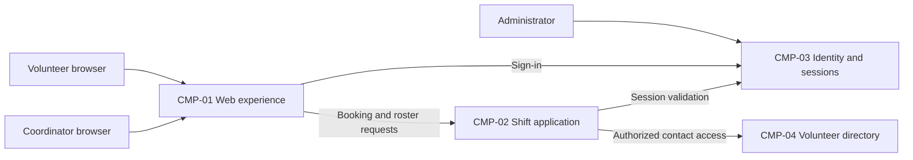

# ARCH-001 — Volunteer shift sign-up for the Riverside Food Bank architecture

## 1. Context and scope

This proposal describes PRD-001 version 1, status approved, owned by Priya Nair.
About 120 volunteers use mobile web pages to sign in and book warehouse shifts;
the coordinator views the daily roster. Session revocation and restricted access
to volunteer phone numbers are in scope. Payroll, donations, and an installed
mobile app are outside scope.

The request explicitly selected PRD-001 and instructed proceeding without
questions. No inspection scope was named and no code or configuration was
inspected. Contract document inventories found no policy, existing ARCH, or ADR
files; the local preference file was absent. Framework defaults apply.

A new ARCH is proposed because no existing ARCH covers the system. The outcome
remains unconfirmed, and the components and interactions below are proposals.
No architectural decision is accepted and no ADR is written in this run.

## 2. Quality drivers

PRD-001#NFR-001 requires administrator revocation of volunteer sessions to take
effect within five minutes. Provider selection alone does not establish that
guarantee: session checks on protected requests must enforce revocation too.
PRD-001#NFR-002 restricts volunteer phone numbers to the coordinator; authorization
must protect the data at its source as well as its presentation in web pages.
PRD-001#NFR-003 requires hosted services for the whole product because the food
bank has no on-site server.

The operating context is internal, as explicitly recorded in PRD-001; the release
name Pilot does not override it. The required quality floor is constraint,
security, and privacy. All three categories have NFR coverage. There are no
additional policy categories. Provider costs, operating responsibilities, and
existing implementation capabilities are unknown, so no vendor or deployment
topology is selected.

## 3. Components

The diagram shows proposed logical responsibilities, not approved service or
deployment boundaries. ARCH-001#DEC-05 covers the boundaries, ARCH-001#DEC-06
covers authoritative data ownership, and ARCH-001#DEC-07 covers roster updates.
Data ownership listed below is provisional until those decisions are settled.



```yaml items
components:
  - id: CMP-01
    status: active
    name: "Web experience"
    responsibility: "Present mobile sign-in, booking, and coordinator roster views; do not own authoritative records or make final authorization decisions."
    owns_data: []
    interacts_with:
      - "CMP-02"
      - "CMP-03"
    deployment: "Open: see DEC-04"
    upstream:
      - {id: PRD-001, item: NFR-002, relation: informed_by, version: 1, hash: null}
      - {id: PRD-001, item: NFR-003, relation: informed_by, version: 1, hash: null}
  - id: CMP-02
    status: active
    name: "Shift application"
    responsibility: "Proposed authority for booking open shifts and providing daily rosters with protected access; do not manage volunteer credentials or own contact details."
    owns_data:
      - "Proposed: shifts and bookings, pending DEC-06"
    interacts_with:
      - "CMP-01"
      - "CMP-03"
      - "CMP-04"
    deployment: "Open: see DEC-04"
    upstream:
      - {id: PRD-001, item: NFR-001, relation: informed_by, version: 1, hash: null}
      - {id: PRD-001, item: NFR-002, relation: informed_by, version: 1, hash: null}
      - {id: PRD-001, item: NFR-003, relation: informed_by, version: 1, hash: null}
  - id: CMP-03
    status: active
    name: "Identity and sessions"
    responsibility: "Proposed authority for authenticating volunteers and administering session revocation; do not own bookings or volunteer phone numbers. Provider and enforcement mechanism remain open."
    owns_data:
      - "Proposed: authentication identities and session revocation state, pending DEC-01 and DEC-02"
    interacts_with:
      - "CMP-01"
      - "CMP-02"
      - "Administrator"
    deployment: "Open: see DEC-04"
    upstream:
      - {id: PRD-001, item: NFR-001, relation: informed_by, version: 1, hash: null}
      - {id: PRD-001, item: NFR-003, relation: informed_by, version: 1, hash: null}
  - id: CMP-04
    status: active
    name: "Volunteer directory"
    responsibility: "Proposed authority for volunteer profiles and coordinator-only phone access; do not own credentials or shift bookings. This may be a module rather than a separate service."
    owns_data:
      - "Proposed: volunteer profiles and phone numbers, pending DEC-06"
    interacts_with:
      - "CMP-02"
    deployment: "Open: see DEC-04"
    upstream:
      - {id: PRD-001, item: NFR-002, relation: informed_by, version: 1, hash: null}
      - {id: PRD-001, item: NFR-003, relation: informed_by, version: 1, hash: null}
```

## 4. Architectural questions

Every question is blocking and open. No mandate or explicit decision resolves
any of them. The alternatives in notes frame future decisions, not selections.

```yaml items
decisions:
  - id: DEC-01
    status: active
    question: "Which identity provider handles volunteer sign-in?"
    blocking: true
    state: open
    resolved_by: []
    notes: "Captures the PRD NEEDS ADR marker. A managed provider reduces credential operations; application-managed identity offers control with greater security responsibility. Booking consumes the authenticated identity, and revocation must integrate with the selected provider. Neither option is selected."
    upstream:
      - {id: PRD-001, item: FR-001, relation: informed_by, version: 1, hash: null}
      - {id: PRD-001, item: FR-002, relation: informed_by, version: 1, hash: null}
      - {id: PRD-001, item: NFR-001, relation: informed_by, version: 1, hash: null}
  - id: DEC-02
    status: active
    question: "How will every volunteer session stop authorizing requests within five minutes of administrator revocation?"
    blocking: true
    state: open
    resolved_by: []
    notes: "Separate from provider choice. Authoritative session checks add an online dependency; bounded credential lifetimes require refresh denial and careful cache limits. Sign-in and signed-in booking must share the enforcement contract. Neither mechanism is selected."
    upstream:
      - {id: PRD-001, item: FR-001, relation: informed_by, version: 1, hash: null}
      - {id: PRD-001, item: FR-002, relation: informed_by, version: 1, hash: null}
      - {id: PRD-001, item: NFR-001, relation: informed_by, version: 1, hash: null}
  - id: DEC-03
    status: active
    question: "Where will coordinator-only access to volunteer phone numbers be enforced?"
    blocking: true
    state: open
    resolved_by: []
    notes: "A shared application authorization boundary centralizes enforcement; a separate contact-data boundary isolates exposure but adds integration work. Booking and roster responses must obey the same access rule, including coordinator identity verification. Neither boundary is selected."
    upstream:
      - {id: PRD-001, item: FR-002, relation: informed_by, version: 1, hash: null}
      - {id: PRD-001, item: FR-003, relation: informed_by, version: 1, hash: null}
      - {id: PRD-001, item: NFR-002, relation: informed_by, version: 1, hash: null}
  - id: DEC-04
    status: active
    question: "What hosted deployment topology will run the whole product?"
    blocking: true
    state: open
    resolved_by: []
    notes: "Hosted operation is required, but the platform and deployment units are undecided. A hosted application with managed persistence keeps operations together; separate managed functions and services allow independent operation but distribute session and privacy enforcement. This whole-product choice affects all FRs and NFRs."
    upstream:
      - {id: PRD-001, item: FR-001, relation: informed_by, version: 1, hash: null}
      - {id: PRD-001, item: FR-002, relation: informed_by, version: 1, hash: null}
      - {id: PRD-001, item: FR-003, relation: informed_by, version: 1, hash: null}
      - {id: PRD-001, item: NFR-001, relation: informed_by, version: 1, hash: null}
      - {id: PRD-001, item: NFR-002, relation: informed_by, version: 1, hash: null}
      - {id: PRD-001, item: NFR-003, relation: informed_by, version: 1, hash: null}
  - id: DEC-05
    status: active
    question: "What logical boundaries separate web presentation, identity, shift operations, and volunteer contact access?"
    blocking: true
    state: open
    resolved_by: []
    notes: "CMP-01 through CMP-04 propose responsibilities only. Application modules simplify shared enforcement; independent services isolate responsibilities but add trust boundaries and contracts. This question sets logical responsibilities; DEC-04 separately sets hosting and deployment units."
    upstream:
      - {id: PRD-001, item: FR-001, relation: informed_by, version: 1, hash: null}
      - {id: PRD-001, item: FR-002, relation: informed_by, version: 1, hash: null}
      - {id: PRD-001, item: FR-003, relation: informed_by, version: 1, hash: null}
      - {id: PRD-001, item: NFR-001, relation: informed_by, version: 1, hash: null}
      - {id: PRD-001, item: NFR-002, relation: informed_by, version: 1, hash: null}
  - id: DEC-06
    status: active
    question: "Which components own the authoritative booking and volunteer contact records?"
    blocking: true
    state: open
    resolved_by: []
    notes: "Proposed ownership separates shifts and bookings in CMP-02 from contacts in CMP-04. A single application data authority simplifies roster consistency; separate owners restrict contact access but require stable volunteer references and explicit contracts. No storage product or schema is selected."
    upstream:
      - {id: PRD-001, item: FR-002, relation: informed_by, version: 1, hash: null}
      - {id: PRD-001, item: FR-003, relation: informed_by, version: 1, hash: null}
      - {id: PRD-001, item: NFR-002, relation: informed_by, version: 1, hash: null}
  - id: DEC-07
    status: active
    question: "How will confirmed bookings become visible in the coordinator's daily roster?"
    blocking: true
    state: open
    resolved_by: []
    notes: "Reading the authoritative booking data directly simplifies consistency; an event-fed roster separates reads but requires propagation and failure handling. The PRD describes a live roster without a numeric freshness bound; this proposal invents no latency acceptance criterion. Neither interaction is selected."
    upstream:
      - {id: PRD-001, item: FR-002, relation: informed_by, version: 1, hash: null}
      - {id: PRD-001, item: FR-003, relation: informed_by, version: 1, hash: null}
```

## 5. Evidence inspected

```yaml items
evidence:
  - id: EVD-01
    status: active
    source: "PRD-001"
    kind: prd
    finding: "Version 1, status approved: requires volunteer sign-in, signed-in shift booking, and coordinator daily rosters; requires session revocation within five minutes, coordinator-only phone visibility, and hosted services for the whole product. Internal operating context; identity provider is explicitly marked NEEDS ADR."
    classification: context
```

## 6. Deployment

All server-side responsibilities and persistent data must run on hosted services
under PRD-001#NFR-003. Volunteer and coordinator browsers access the web experience.
ARCH-001#DEC-04 leaves the hosting platform, service topology, and environment
arrangement open. The component diagram must not be interpreted as four required
deployments. The pilot begins with Tuesday and Thursday shifts; PRD-001 does not
specify separate pilot infrastructure. No infrastructure capability or existing
deployment has been verified.

## 7. Requirement changes proposed to the PRD owner

- None.

## 8. Open questions

- [NEEDS CLARIFICATION: No inspection scope was named and no code or configuration was inspected; existing services, reuse feasibility, and operational capabilities are unknown.]
- [NEEDS CLARIFICATION: The proposed create outcome for ARCH-001 was not explicitly confirmed; outcome remains null.]
- [NEEDS CLARIFICATION: PRD-001 describes a live roster but does not specify a freshness bound; Priya Nair owns any clarification of the product acceptance criterion.]
- [NEEDS CLARIFICATION: host model/session identity unavailable]

## Change Log

| Version | Date | Author | Change | Items affected |
|---|---|---|---|---|
| 1 | 2026-09-28 | codex (session unknown) | Initial draft for PRD-001 v1; proposed components and unresolved shared decisions, with incomplete host provenance. Policy resolution: interview.max_calls=8 (default); architecture.mandated_platforms=none (default); quality.required_categories=floor only (default) | all |
| 1 | 2026-09-28 | codex (session unknown) | Validation remains unresolved: self-check 3 cannot establish the exact host model and session identity. Retained draft status, empty approvals, null outcome, and all decisions open; no ADR or approval restoration was needed. Readiness handoff withheld. Policy resolution: interview.max_calls=8 (default); architecture.mandated_platforms=none (default); quality.required_categories=floor only (default) | generated_by |
