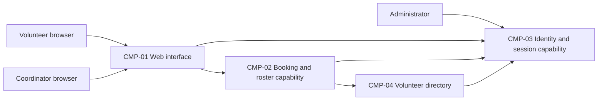

# ARCH-001 — Volunteer shift sign-up for the Riverside Food Bank architecture

## 1. Context and scope

This draft describes the shared architecture questions for PRD-001 version 1, status approved,
owned by Priya Nair. The product lets about 120 volunteers sign in and book warehouse shifts
from mobile browsers, and gives the coordinator a daily roster. Payroll, donations and an
installed mobile app are outside scope.

No inspection scope was named and no code or configuration was inspected. No existing ARCH,
ADR, policy document or local preference file was found at the contract paths. Framework
defaults apply. Existing implementation and reuse suitability remain unknown.

Creating ARCH-001 is the proposed outcome because no existing ARCH covers the system.
The request names PRD-001 and says to proceed without questions; it does not confirm the
create outcome or any architectural choice. All components below describe a proposal,
all decisions remain open, and no ADR is written.

## 2. Quality drivers

The operating context is internal, as stated by PRD-001; its Pilot release label does not
override that context. The required quality categories are constraint, security and privacy.
All three are covered by existing NFRs; no additional policy categories apply.

PRD-001#NFR-001 requires administrator revocation of a volunteer's signed-in sessions within
five minutes. The shared session validation mechanism must enforce this at protected operations,
including booking; selecting an identity provider alone does not settle revocation.

PRD-001#NFR-002 limits volunteer phone-number visibility to the coordinator. Data ownership,
role authority and enforcement across interfaces must preserve that restriction; hiding a field
in the browser alone cannot enforce it. The administrator's revocation capability does not imply
permission to view phone numbers.

PRD-001#NFR-003 requires hosted services for the whole product because there is no on-site
server. Every functional requirement depends on the deployment choice. The PRD's mobile-first
browser experience and small user population guide the proposed component shape, without
establishing a particular provider, topology or performance target.

## 3. Components

The diagram shows proposed logical responsibilities, not accepted service or deployment
boundaries. ARCH-001#DEC-04 governs that partition; ARCH-001#DEC-05 governs authoritative data
ownership. Arrows indicate required collaborations, not a chosen protocol or consistency model.



```yaml items
components:
  - id: CMP-01
    status: active
    name: "Web interface"
    responsibility: "Proposed mobile-first sign-in, booking and coordinator roster presentation; does not own authoritative records or enforce access solely in the browser."
    owns_data: []
    interacts_with:
      - "CMP-02"
      - "CMP-03"
    deployment: "Open: see DEC-03"
    upstream:
      - {id: PRD-001, item: NFR-001, relation: informed_by, version: 1, hash: null}
      - {id: PRD-001, item: NFR-002, relation: informed_by, version: 1, hash: null}
      - {id: PRD-001, item: NFR-003, relation: informed_by, version: 1, hash: null}
  - id: CMP-02
    status: active
    name: "Booking and roster capability"
    responsibility: "Proposed authority for open shifts, booking acceptance and daily roster reads; consumes identity and volunteer references rather than owning credentials or phone numbers."
    owns_data:
      - "Proposed: warehouse shifts and bookings, subject to DEC-05"
    interacts_with:
      - "CMP-01"
      - "CMP-03"
      - "CMP-04"
    deployment: "Open: see DEC-03"
    upstream:
      - {id: PRD-001, item: NFR-001, relation: informed_by, version: 1, hash: null}
      - {id: PRD-001, item: NFR-002, relation: informed_by, version: 1, hash: null}
      - {id: PRD-001, item: NFR-003, relation: informed_by, version: 1, hash: null}
  - id: CMP-03
    status: active
    name: "Identity and session capability"
    responsibility: "Proposed authentication, stable volunteer identity and session lifecycle capability, including administrator revocation; does not own warehouse bookings. Provider and role authority remain open."
    owns_data:
      - "Proposed: authentication identities and session state, subject to DEC-01, DEC-02 and DEC-05"
    interacts_with:
      - "CMP-01"
      - "CMP-02"
      - "CMP-04"
      - "Administrator"
    deployment: "Open: see DEC-03"
    upstream:
      - {id: PRD-001, item: NFR-001, relation: informed_by, version: 1, hash: null}
      - {id: PRD-001, item: NFR-002, relation: informed_by, version: 1, hash: null}
      - {id: PRD-001, item: NFR-003, relation: informed_by, version: 1, hash: null}
  - id: CMP-04
    status: active
    name: "Volunteer directory"
    responsibility: "Proposed ownership of volunteer profiles and coordinator-restricted contact information; does not authenticate volunteers or own bookings. May be a module rather than a separate service."
    owns_data:
      - "Proposed: volunteer profiles and phone numbers, subject to DEC-05"
    interacts_with:
      - "CMP-02"
      - "CMP-03"
    deployment: "Open: see DEC-03"
    upstream:
      - {id: PRD-001, item: NFR-002, relation: informed_by, version: 1, hash: null}
      - {id: PRD-001, item: NFR-003, relation: informed_by, version: 1, hash: null}
```

## 4. Architectural questions

Each question is blocking and unresolved. Notes describe alternatives for future review, not
accepted choices. No policy mandates a platform, and no user decision resolves a question.

```yaml items
decisions:
  - id: DEC-01
    status: active
    question: "Which identity provider handles volunteer sign-in?"
    blocking: true
    state: open
    resolved_by: []
    notes: "Records the PRD NEEDS ADR marker. Managed identity reduces credential operations; application-owned identity offers control but adds security maintenance. Provider capabilities constrain signed-in booking and revocation, but do not settle the revocation mechanism."
    upstream:
      - {id: PRD-001, item: FR-001, relation: informed_by, version: 1, hash: null}
      - {id: PRD-001, item: FR-002, relation: informed_by, version: 1, hash: null}
      - {id: PRD-001, item: NFR-001, relation: informed_by, version: 1, hash: null}
  - id: DEC-02
    status: active
    question: "How will all protected operations reject a volunteer's revoked sessions within five minutes?"
    blocking: true
    state: open
    resolved_by: []
    notes: "Central session validation supports direct revocation but adds a request-time dependency; bounded-lived credentials with refresh denial reduce lookups but require a proven total validity window of at most five minutes. Covers the sessions created by sign-in and consumed by booking."
    upstream:
      - {id: PRD-001, item: FR-001, relation: informed_by, version: 1, hash: null}
      - {id: PRD-001, item: FR-002, relation: informed_by, version: 1, hash: null}
      - {id: PRD-001, item: NFR-001, relation: informed_by, version: 1, hash: null}
  - id: DEC-03
    status: active
    question: "Which hosted deployment topology will run the whole product?"
    blocking: true
    state: open
    resolved_by: []
    notes: "Hosted services are required, but provider, deployment units and environments remain undecided. A managed application platform reduces operational work; independently hosted units permit separate scaling but add coordination. This whole-product choice governs every FR and all quality controls."
    upstream:
      - {id: PRD-001, item: FR-001, relation: informed_by, version: 1, hash: null}
      - {id: PRD-001, item: FR-002, relation: informed_by, version: 1, hash: null}
      - {id: PRD-001, item: FR-003, relation: informed_by, version: 1, hash: null}
      - {id: PRD-001, item: NFR-001, relation: informed_by, version: 1, hash: null}
      - {id: PRD-001, item: NFR-002, relation: informed_by, version: 1, hash: null}
      - {id: PRD-001, item: NFR-003, relation: informed_by, version: 1, hash: null}
  - id: DEC-04
    status: active
    question: "Where will the component boundaries lie between web presentation, booking and roster, identity, and volunteer profiles?"
    blocking: true
    state: open
    resolved_by: []
    notes: "CMP-01 through CMP-04 propose logical responsibilities only. Modules in one application simplify shared enforcement and operations; separate services isolate responsibilities but require cross-service security and interface agreements."
    upstream:
      - {id: PRD-001, item: FR-001, relation: informed_by, version: 1, hash: null}
      - {id: PRD-001, item: FR-002, relation: informed_by, version: 1, hash: null}
      - {id: PRD-001, item: FR-003, relation: informed_by, version: 1, hash: null}
      - {id: PRD-001, item: NFR-001, relation: informed_by, version: 1, hash: null}
      - {id: PRD-001, item: NFR-002, relation: informed_by, version: 1, hash: null}
  - id: DEC-05
    status: active
    question: "Which components are the authoritative owners of volunteer identity, contact information, shifts and bookings?"
    blocking: true
    state: open
    resolved_by: []
    notes: "Shared application persistence simplifies identity-to-booking references; separate identity, profile and booking stores provide ownership isolation but require stable references and coordinated updates. The proposed ownership in CMP items is unaccepted."
    upstream:
      - {id: PRD-001, item: FR-001, relation: informed_by, version: 1, hash: null}
      - {id: PRD-001, item: FR-002, relation: informed_by, version: 1, hash: null}
      - {id: PRD-001, item: FR-003, relation: informed_by, version: 1, hash: null}
      - {id: PRD-001, item: NFR-002, relation: informed_by, version: 1, hash: null}
  - id: DEC-06
    status: active
    question: "What shared authorization model will enforce volunteer, coordinator and administrator capabilities across interfaces?"
    blocking: true
    state: open
    resolved_by: []
    notes: "Provider-issued roles simplify shared identity integration but require controlled role freshness; application-owned roles give direct permission control but add an authoritative role store. Enforce signed-in booking, coordinator-only phone visibility and administrator revocation at trusted interfaces. Administrator revocation permission must not implicitly expose phone numbers."
    upstream:
      - {id: PRD-001, item: FR-002, relation: informed_by, version: 1, hash: null}
      - {id: PRD-001, item: FR-003, relation: informed_by, version: 1, hash: null}
      - {id: PRD-001, item: NFR-001, relation: informed_by, version: 1, hash: null}
      - {id: PRD-001, item: NFR-002, relation: informed_by, version: 1, hash: null}
  - id: DEC-07
    status: active
    question: "How will accepted bookings become visible in the coordinator's daily roster?"
    blocking: true
    state: open
    resolved_by: []
    notes: "Reading authoritative booking state avoids projection lag; an event-fed roster projection separates read workloads but introduces delay and recovery concerns. Both require agreement across booking and roster epics. The PRD calls the roster live without a measurable freshness target; the target belongs to the PRD owner."
    upstream:
      - {id: PRD-001, item: FR-002, relation: informed_by, version: 1, hash: null}
      - {id: PRD-001, item: FR-003, relation: informed_by, version: 1, hash: null}
```

## 5. Evidence inspected

```yaml items
evidence:
  - id: EVD-01
    status: active
    source: "PRD-001"
    kind: prd
    finding: "Version 1, status approved: FR-001 through FR-003 require volunteer sign-in, signed-in shift booking and a coordinator roster. NFR-001 requires session revocation within five minutes; NFR-002 restricts phone numbers to the coordinator; NFR-003 requires hosted services for the whole product. Section 12 leaves the identity provider as NEEDS ADR. Operating context is internal."
    classification: context
```

## 6. Deployment

Hosted services are required by PRD-001#NFR-003. ARCH-001#DEC-03 leaves the provider, deployment
units and environments open. The four logical components do not imply four independently
deployed services. ARCH-001#DEC-04 must settle boundaries before epics assume an application
topology. No on-site deployment is proposed. No evidence establishes existing infrastructure,
hosting accounts or reusable services.

## 7. Requirement changes proposed to the PRD owner

- None.

## 8. Open questions

- [NEEDS CLARIFICATION: No inspection scope was named and no code or configuration was inspected; existing implementation, hosting and component reuse suitability are unknown.]
- [NEEDS CLARIFICATION: host model/session identity unavailable]
- [NEEDS CLARIFICATION: Priya Nair owns clarification of the live roster freshness expectation in PRD-001; no measurable target is stated. This product detail is not an additional architectural decision.]

## Change Log

| Version | Date | Author | Change | Items affected |
|---|---|---|---|---|
| 1 | 2026-09-28 | codex (session unknown) | Initial draft for PRD-001 v1. Outcome unconfirmed; all architectural questions open. Policy resolution: interview.max_calls=8 (default); architecture.mandated_platforms=none (default); quality.required_categories=floor only (default) | all |
