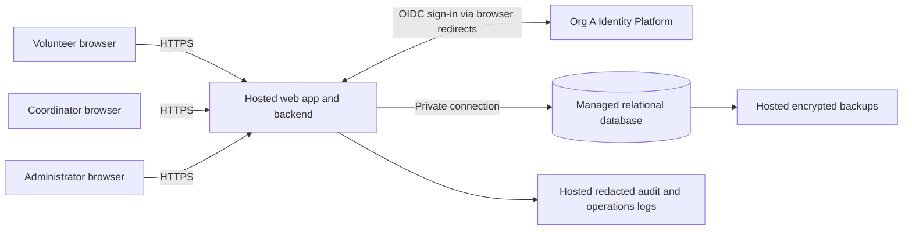

# ARC-001 — PRD-001 architecture and epic readiness

## 1. Outcome and authority

Use a mobile-first web application with one hosted backend, a managed relational database,
and **Org A Identity Platform (OIDC)**. Keep sessions and authorization on the backend;
perform bookings transactionally and restrict phone-number reads to the coordinator.

The technical design is defined below. **No requirement is unconditionally ready for an
implementation epic:** missing compliance and accessibility requirements affect the whole
product. Booking and roster scope also need the shift rules recorded in G-03. These are
explicit readiness findings, not requests to interrupt this architecture task. Discovery
work can proceed against the closure actions in section 6.

Sources are the approved [PRD-001 v1](../prd/PRD-001.md) and vendored
[POL-001 v3](../policy/POL-001.md). No implementation, repository instructions, test commands,
or document schema were supplied. BRN-001 and organizational ADR-104 are referenced by those
sources but are absent; their contents have not been inferred. Hashes above cover raw file bytes.
This architecture and its local ADRs are drafts; they do not imply stakeholder approval.

| Setting | Effective value | Consequence |
|---|---|---|
| `architecture.mandated_platforms` | POL-001#SET-01: Org A Identity Platform (OIDC), non-overridable | Provider selection is inherited. PRD section 12 is resolved at the provider-choice level by ADR-001; integration details remain to be obtained. |
| `quality.required_categories` | POL-001#SET-02: compliance and accessibility, non-overridable; matches `operating_context: internal` | Add measurable requirements for both categories before treating affected epics as ready. Internal or pilot status is not an exemption. |

PRD's initial change-log entries `mandated_platforms=none` and `floor only` conflict with the
effective policy. They are historical defaults, not permission to override policy. Preserve
the approved PRD and policy; record these corrections and the proposed requirements in its
next revision. No additional category floor is defined in the supplied files.

## 2. Components and trust boundaries

The browser is untrusted. Only the backend accesses application data. The identity provider
authenticates people; application records authorize volunteers, coordinators and administrators.
An administrator is not automatically a coordinator. Hosting encompasses identity, application,
database, secrets, telemetry and backups: NFR-003 applies to every component and feature.

| Component | Responsibility | Decision |
|---|---|---|
| Responsive web interface | Sign-in, open shifts, own booking confirmation, coordinator daily roster; accessible error and status presentation | ADR-003; G-02 |
| Identity adapter | OIDC redirects/callback, validated identity, association with an enrolled application user | [ADR-001](../adr/ADR-001.md) |
| Session and authorization module | Session issuance, per-request validity/role checks, administrator revocation, phone projection | [ADR-002](../adr/ADR-002.md) |
| Shift and booking module | Shift availability, atomic capacity check and booking, roster queries | [ADR-003](../adr/ADR-003.md) |
| Hosted data and operations | Durable records, secret storage, backups, redacted logs and deployment | ADR-003; G-01 |

A single backend is sufficient for the stated 120 volunteers and three shifts per day as a
design assumption, not a measured capacity claim. No queue, microservices, native app, payroll,
donations, cancellation, waitlist or automated reminders are introduced. Hosting vendor and
language may be selected during delivery subject to the contracts here and G-01; no other
platform mandate is evidenced in the supplied policy.

## 3. Data ownership and access

| Record | Minimum fields and constraints | Access |
|---|---|---|
| User | ID, OIDC issuer + subject (unique pair), display name, active flag, session generation, last revocation timestamp | Backend only; volunteers see their own safe projection |
| Role assignment | User ID, role from volunteer/coordinator/administrator | Trusted provisioning; never inferred from browser claims or self-editable profile fields |
| Volunteer contact | User ID, phone (optional until source is confirmed) | Separate projection readable only through coordinator-authorized paths |
| Session | Hash of opaque session ID, user ID, generation at issue, expiry | Backend only; browser holds opaque cookie |
| Pending login | One-use state/nonce, PKCE verifier, start timestamp, expiry; generation if user is already known | Backend only; timestamps use the same primary-store clock as revocation |
| Shift | ID, start/end instants, warehouse IANA time zone, positive capacity, publication state | Signed-in volunteers see published shift availability |
| Booking | ID, shift ID, volunteer ID, created time; unique (shift ID, volunteer ID) | Volunteer sees own booking; coordinator sees daily roster |
| Audit event | Actor ID, action, target ID, timestamp, outcome; no phone, tokens or session secrets | Restricted operations access; retention controlled by G-01 |

Use foreign keys and database constraints. Store times as instants and group daily rosters in
the configured warehouse time zone, not the browser's time zone. The warehouse location/time
zone and initial shift/contact provisioning are not given in PRD-001 (G-03). Database operators
are a privileged operational boundary; G-01 must specify their controlled access and evidence.
Do not silently broaden NFR-002 to let ordinary administrators read phone numbers.

## 4. Request contracts and failure behavior

These are proposed internal routes, not an existing public API.

| Route / operation | Authorization and behavior |
|---|---|
| `GET /auth/start`, `GET /auth/callback` | Initiate and validate OIDC flow; only an enrolled, active identity gets an application session. Denied or invalid callbacks create no session. |
| `GET /shifts` | Valid volunteer session; return published availability without names or phone numbers. |
| `POST /shifts/{id}/bookings` | Use session user, never a client-supplied volunteer ID. Require CSRF protection. Transactionally enforce G-03 rules, capacity and uniqueness; retries return the existing booking. Full/closed shift produces a conflict without partial changes. |
| `GET /roster?date=YYYY-MM-DD` | Coordinator role required on every request. Query committed bookings for warehouse-local day; include contact projection only here. Empty days show an explicit empty roster. |
| `POST /admin/users/{id}/revoke-sessions` | Administrator role required; CSRF protection; atomically advance target user's session generation, persist audit event, then acknowledge success. Return no contact information. |
| `POST /auth/logout` | Invalidate current local session and clear cookie. |

Booking capacity is checked under a shift-row lock on the primary database in the same
transaction as inserting the booking. Concurrent attempts for the final place produce one
success. The roster reads committed primary data without an application cache. Proposed
interpretation of “live”: refresh on open, date change, manual refresh and every 30 seconds
while visible; no stale response may be presented as newly refreshed. This interval needs
product confirmation with G-03, since the PRD specifies no freshness bound.

Every protected request checks current session generation, expiry, active status and roles
against the primary store; use no positive authorization cache. Failure to read authoritative
state denies protected access. Booking transactions recheck the session under a user lock
held until commit; revocation takes the same lock. Revocation success therefore cannot race
with a later commit under the old session. Bound request/transaction duration to 30 seconds;
an unsuccessful revocation must return an error, never report success.

After an acknowledged revocation, subsequent requests with any old session fail immediately,
which is stricter than NFR-001's five-minute maximum. Previously delivered content cannot be
retracted. A fresh OIDC login can create a new session: NFR-001 requires session revocation,
not account suspension or termination of sessions in other products. See ADR-002 for races
with login and the acceptance test.

Responses with user data use `Cache-Control: no-store`; no service worker caches them. Do not
put contact data in identity tokens, client state shared with volunteers, URL parameters,
analytics or logs. Enforce phone restrictions on server queries/serialization, not UI hiding.
On identity failure, new logins fail clearly; existing valid local sessions can continue.
On database failure, booking/roster/session operations fail closed and show a retryable error.
No success is shown until its transaction commits.

## 5. Requirement coverage and readiness

`Defined` means a concrete design and verification contract exist; it does not mean tested or
approved. `Conditional` means an unresolved product rule affects that design. Epic readiness
includes applicable cross-cutting requirements and mandatory policy gaps, not just a feature's
own row. Verification IDs refer to section 8. Draft ADR review can accompany gap closure.

| PRD item | Architecture coverage | Applicable cross-cutting scope | Design | Epic readiness / blockers | Planned evidence |
|---|---|---|---|---|---|
| FR-001 sign-in | ADR-001; ADR-002; identity adapter and sessions | NFR-001, NFR-002 (no phone claims/exposure), NFR-003; G-01, G-02 | Defined; provider mandated | BLOCKED: G-01, G-02 | V-01, V-04, V-05, V-06, V-07, V-08 |
| FR-002 book open shift | ADR-003; transactional booking | Depends on FR-001; NFR-001, NFR-002, NFR-003; G-01, G-02 | Conditional: G-03 | BLOCKED: G-01, G-02, G-03 | V-02, V-04, V-05, V-06, V-07, V-08 |
| FR-003 daily roster | ADR-002 coordinator boundary; ADR-003 roster query | Depends on bookings; NFR-001, NFR-002, NFR-003; G-01, G-02 | Conditional: G-03 | BLOCKED: G-01, G-02, G-03 | V-03, V-04, V-05, V-06, V-07, V-08 |
| NFR-001 revoke within 5 minutes | ADR-002; authoritative session generation and administrator operation | All protected features; hosted state under NFR-003 | Defined | BLOCKED: G-01, G-02 (administrator interface) | V-04, V-06, V-07, V-08 |
| NFR-002 coordinator-only phones | ADR-002; contact isolation, explicit role gates and redaction | All reads, serialization, logging and roster; hosted stores under NFR-003 | Defined | BLOCKED: G-01, G-02 (coordinator interface) | V-05, V-06, V-07, V-08 |
| NFR-003 hosted services | ADR-003; all runtime components, secrets, logs, backups | Whole product; propagates to every FR and NFR | Defined | BLOCKED: G-01, G-02 inherited at product level | V-06, V-07, V-08 |

No NFR is orphaned. NFR-001 and NFR-002 are explicit epic acceptance obligations wherever
protected operations or personal data occur. NFR-003 is a product-wide constraint even for
epics that do not cite hosting directly. G-01/G-02 likewise cannot disappear when slicing epics.

## 6. Gaps and proposed PRD amendments

All proposed owners below are routing suggestions; no external assignment or approval occurred.
The amendments are proposals, not additions to the approved PRD in this change.

| Gap | Authority / missing decision | Proposed closure and evidence | Proposed owner | Scope blocked |
|---|---|---|---|---|
| G-01 compliance | POL-001#SET-02 requires category; PRD has none. SOC 2 rationale is not a complete control specification. | Add a must/current compliance NFR mapping this pilot to Org A's control baseline and named evidence owners. Record access-review and audit retention periods, permitted hosting regions, backup retention, restore objectives, deletion rules and incident ownership; attach control mapping and approval. Until supplied, do not invent compliance certification or numerical retention requirements. | Priya Nair + Org A compliance owner | Whole product and every epic |
| G-02 accessibility | POL-001#SET-02 requires category; PRD has none and does not specify a standard/level. | Proposed must/current NFR: volunteer, coordinator and administrator journeys, including hosted sign-in, conform to WCAG 2.2 AA. Confirm Org A's required target; define browser/assistive-technology test matrix, automated checks plus manual keyboard, focus, zoom/reflow and screen-reader evidence. Require no unresolved failures against the accepted target. | Priya Nair + Org A accessibility owner | Whole product and every user-facing epic; inherited gate for platform work |
| G-03 shift semantics and source data | FR-002 leaves “open” undefined; FR-003 lacks local-day/freshness rules and source/provisioning detail. | Proposed pilot rules: published future shifts with spare capacity are open; one booking per volunteer per shift; overlapping shifts are allowed and cancellation is outside pilot scope. Administrator imports approved shifts and identity mappings; only the coordinator supplies contacts through restricted import. Configure warehouse time zone and roster refresh as section 4. Record capacities, actual time zone, responsible data steward, identity/contact mapping, and confirmation or changes to these rules in the next PRD revision. | Priya Nair / volunteer coordinator | FR-002 and FR-003; identity enrollment provisioning also informs delivery |

WCAG 2.2 AA is a proposed target, not a claim about the organization's existing standard.
The normative [WCAG 2.2 recommendation](https://www.w3.org/TR/WCAG22/) defines the success
criteria and conformance levels; policy supplies the obligation to cover the category.

Implementation prerequisites, separate from unresolved requirements: obtain Org A's OIDC
issuer/client registration, supported flow and enrollment procedure; review ADR-104 if made
available; provision hosting, secrets, database and runtime roles. These are ordinary delivery
tasks against the specified contracts, not evidence of completed integration. If ADR-104 adds
constraints, revise these drafts before affected implementation. PRD ASM-01 is still open;
validate smartphone/browser access with volunteers before rollout, without treating it as a
reason to waive accessibility.

## 7. Candidate epic boundaries and sequence

These are decomposition guidance, not created epics. Leave PRD's generated epic map untouched.

1. Resolve G-01 and G-02 and incorporate approved quality requirements; settle G-03 for shift work.
2. Hosted foundation and access: NFR-003 plus FR-001, NFR-001 and shared NFR-002 enforcement.
   Include admin revocation, role provisioning, logs and policy-derived quality acceptance.
3. Volunteer booking: FR-002, dependent on foundation and shift data; carry all three NFRs and
   the new policy-derived requirements into its acceptance criteria.
4. Coordinator roster: FR-003 and NFR-002, dependent on committed booking data; also carry
   NFR-001, NFR-003 and the new quality requirements. FR-003 remains `should/current` as approved.

Use Tuesday/Thursday shifts for the initial pilot, then all shifts as specified by PRD.
The coordinator's shift log remains SM-01's measurement source; no analytics project is added.
Do not assume the 95% staffing target is proven by architecture or software checks. Confirm
pilot acceptance and fallback operating procedures before expanding; no invented rollout date.

## 8. Verification contracts

These are acceptance-test designs for later implementation. **Every runtime check is NOT_RUN**:
the workspace contains specifications only. This change does not establish a behavior-test
failure or a passing implementation. For future behavior changes, first establish the relevant
failing test, then implement and run the repository's eventual required gates.

| ID | Requirement / proposed criterion | Evidence to collect | Current result |
|---|---|---|---|
| V-01 | FR-001 | Org A OIDC sandbox: enrolled user signs in; bad issuer/audience/signature/nonce, replay, unenrolled subject and denied sign-in create no session; roles cannot be self-asserted. | NOT_RUN |
| V-02 | FR-002 | Booking persists and appears in own confirmation; duplicate/retry yields one booking; two users contesting final place yield one success; past/unpublished/full shifts reject; simulated failure leaves no partial booking. Rules pending G-03. | NOT_RUN |
| V-03 | FR-003 | Seed multiple shifts/days/bookings, verify warehouse-local day boundaries, empty day, names and current committed bookings; verify refresh contract and visible refresh failure. Rules pending G-03. | NOT_RUN |
| V-04 | NFR-001 across FR-001/002/003 | Revoke all sessions from multiple devices/app instances; all old cookies fail protected requests within 300 seconds of acknowledged revocation (design target: next request). Test login/revoke and booking/revoke races, expiry, restart, state-store outage and unauthorized administrator attempts. | NOT_RUN |
| V-05 | NFR-002 across all features | Access matrix: anonymous, volunteer, administrator-only and coordinator. Only coordinator obtains phone through UI/API; inspect payloads, direct-ID queries, errors, caches, logs and audit events for leakage. Test role removal on next request. | NOT_RUN |
| V-06 | NFR-003 across whole product | Inspect deployment inventory/IaC: identity, app, DB, secrets, logs and backups hosted; no on-site runtime dependency. Deploy and restore into a hosted test environment. | NOT_RUN |
| V-07 | Proposed compliance NFR | Accepted control mapping, access-review evidence, log/redaction checks, retention/deletion checks, incident ownership and restore evidence under G-01's agreed targets. | BLOCKED: G-01 |
| V-08 | Proposed accessibility NFR | Automated and manual evidence for all critical journeys, including Org A login, against G-02's accepted target/matrix. | BLOCKED: G-02 |

Document-level verification, exact source/candidate hashes and tooling limitations are recorded
in [VER-001](VER-001.md). Readiness is derived from unresolved gaps above, not from a claim that
these planned tests passed.

## Change log

| Version | Date | Author | Change |
|---|---|---|---|
| 1 | 2026-09-28 | Codex | Defined draft architecture, inherited identity mandate, quality gaps, cross-cutting coverage and epic readiness against PRD v1 / policy v3. |
