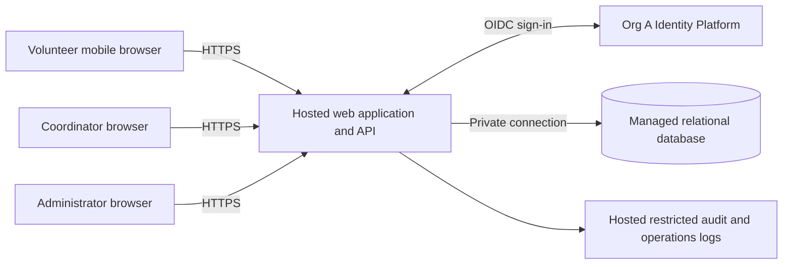

# ARCH-001 — Architecture and epic readiness

The proposed design is a mobile web application with one hosted application service,
a managed relational database, and Org A Identity Platform for authentication.
There is no need for microservices or an on-site server for approximately 120 volunteers.
The architecture is defined sufficiently to identify work boundaries, but **no requirement
is unconditionally ready for epic handoff**: the approved PRD lacks the accessibility
and compliance requirements mandated by policy. Requirement-specific readiness is below.
This draft does not approve new product requirements or create epics.

## 1. Authority and policy resolution

Sources: [PRD-001 v1](../prd/PRD-001.md) and [POL-001 v3](../policy/POL-001.md).
No implementation, repository instructions, templates, or test commands are present.
BRN-001 and the organization's ADR-104 are referenced by the sources but are not supplied.
No conclusions depend on their unseen contents.

| Setting | Effective value | Authority and effect |
|---|---|---|
| `architecture.mandated_platforms` | Identity and authentication: Org A Identity Platform (OIDC) | POL-001#SET-01, non-overridable; supersedes the PRD creation log's `none` default. No alternative sign-in provider or product-owned credentials. |
| `quality.required_categories` | Compliance and accessibility are required, in addition to existing PRD quality requirements | POL-001#SET-02, non-overridable; `operating_context: internal` matches. The PRD creation log's `floor only` default is insufficient. |

The identity-provider choice in PRD section 12 is constrained, not an open vendor
evaluation. [ADR-001](../adr/ADR-001.md) records this mandate and the still-unverified
integration contract. Do not rewrite the approved PRD's historical log or claim a policy
exception. Incorporate the quality gaps through a subsequent reviewed PRD revision.

## 2. Components and trust boundaries

Browser navigation to the identity platform is part of the sign-in flow. The application
owns shift booking, authorization, and application sessions; the platform owns credential
entry, verification, and account recovery. The browser never connects directly to the database.

| Component | Responsibility | Requirements |
|---|---|---|
| Mobile web UI | Sign-in entry, available shifts, booking result, coordinator daily roster | FR-001, FR-002, FR-003 |
| Identity adapter and session middleware | Platform sign-in integration; validate sessions on every protected request | FR-001, NFR-001 |
| Booking module | Available-shift query and atomic booking | FR-002 |
| Roster module | Authorized daily roster query; coordinator-only phone projection | FR-003, NFR-002 |
| Authorization and administration module | Server-owned roles; administrator session revocation | NFR-001, NFR-002 |
| Managed database | Volunteers, roles, sessions, shifts, bookings, protected contact data | All functional requirements, NFR-001, NFR-002 |
| Hosted runtime and operations | Managed secrets, deployment, logs, backups, restore procedures | NFR-003; proposed quality controls |

Deploy the application and database to hosted services, with separate pilot/test and
production credentials. Use managed secrets, encrypted transport and storage, restricted
database access, backups, and a documented restore procedure. These are proposed design
controls; provider, region, retention, and recovery targets require the quality decisions
in section 6. No hosting vendor is mandated by the supplied policy. Vendor selection must
preserve the session consistency, transaction, and privacy contracts below.

## 3. Data and access model

| Entity | Minimum data and invariants |
|---|---|
| Volunteer | Internal ID, unique identity `(issuer, subject)`, display name, active state, session generation counter; do not link accounts by mutable email alone. |
| Role assignment | Principal ID and server-managed `volunteer`, `coordinator`, or `administrator` role. Roles are independent; administrator does not imply coordinator. |
| Volunteer contact | Volunteer ID and phone number in a separate restricted projection/table. Never include phone in generic volunteer responses. |
| Application session | Hashed opaque session ID, principal ID, issued generation, expiry; server-side authoritative state. No identity tokens exposed in application API responses. |
| Shift | ID, UTC start/end instants, configured food-bank timezone, capacity, booking-open state. Capacity and schedule supplied by an authorized operational import. |
| Booking | ID, volunteer ID, shift ID, creation time; unique `(volunteer_id, shift_id)`. |
| Audit event | Actor ID, action, target ID, timestamp, outcome; exclude phone numbers, credentials, and session tokens. |

The approved PRD does not require a shift-management UI, cancellation, notifications,
payroll, or donations. Use an operational import for the pilot schedule and initial volunteer
records; do not silently add those features. Contact-data source and authorized import
operators remain a privacy decision under G-02.

Volunteer access is limited to shift availability and their own booking results. Only a
coordinator may access the daily roster or phone-number fields. An administrator may revoke
sessions using a principal identifier without seeing phone numbers. A person holding both
roles gains phone access through their coordinator role. Enforce permissions at the API and
query projection, including errors, exports if later added, logs, analytics, and caches.
Operational database access is exceptional privileged access, requiring controls under G-02;
it is not a general application role or an exemption for phone-number disclosure.

## 4. Behavioral contracts

### Sign-in — FR-001

Use the organization's OIDC integration with server-side callback handling. Validate the
configured issuer, intended audience, response integrity, and request correlation; use a
standard maintained client and the organization's required flow. Proposed flow: authorization
code with PKCE, pending confirmation of the platform contract. Map the verified subject to an
active volunteer and server-managed roles before issuing a secure, HttpOnly application
session cookie. Apply CSRF protection to mutations and never trust client-supplied roles.
Unknown or inactive identities receive no volunteer access. No local password fallback.
Volunteer eligibility, provisioning, and role mapping are unresolved under G-01.

### Booking — FR-002

`GET /shifts` returns bookable shift details and available places without volunteer contact data.
`POST /shifts/{id}/bookings` derives the volunteer from the checked session. In one database
transaction, lock the shift, check that it is open, has not started, and has remaining capacity,
then insert the booking. All booking writers must use this transaction. Return the existing
booking for a repeated request by the same volunteer; reject a full or closed shift with a
clear recoverable result. Commit before confirming success. Re-query after an uncertain
network result. This prevents retries from duplicating bookings and concurrent requests from
overfilling a shift. Capacity and open state are data, not a hardcoded interpretation of
"three shifts a day." Overlap restrictions and cancellation are not specified or introduced.

These definitions of an open shift and repeat submission are explicit design assumptions
for epic review. No new business approval gate is inferred from them.

### Daily roster — FR-003 and NFR-002

`GET /roster?date=YYYY-MM-DD` requires coordinator authorization on every request. Compute
the day's boundaries in the configured food-bank timezone; select shifts by start time and
include committed bookings with volunteer display names. Phone data, if displayed, is
queried only through the coordinator projection. Return empty shifts as well as populated
ones so staffing gaps are visible. Use the primary database; do not serve stale roster caches.
Provide manual refresh and proposed 30-second polling while the page is visible, with a
last-updated time and a visible stale/error state on failure. The polling interval is a design
choice, not an approved freshness SLA. The actual food-bank timezone must be configured
before importing the pilot schedule; the user's workstation timezone is not evidence of it.

### Session revocation — NFR-001

An administrator action atomically increments the target volunteer's session generation in
the authoritative database and records an audit event. Every protected request compares its
session generation with that current value and checks expiry and active state, using a
strongly consistent read with no positive authorization cache. A mismatch denies access.
If the session store is unavailable, fail closed. All application instances use this same store.

The revocation action reports success only after commit. Existing sessions must be denied
on subsequent authorization checks immediately after commit, satisfying the five-minute
upper bound without relying on identity-token lifetime or an unverified provider logout API.
For booking writes, recheck session validity within the transaction and serialize against
revocation so an old session cannot authorize a new booking after revocation commits.
Do not introduce long-lived authenticated streams that bypass these checks.

Revoking existing application sessions does not by itself disable an account or prohibit a
fresh platform authentication. Identity-provider-wide revocation is not claimed. These
boundaries must be explicit in administrator UI and tests. Previously displayed data cannot
be recalled from a browser; revocation prevents subsequent protected access.

## 5. Requirement coverage and epic readiness

`READY` below means a requirement has an actionable architecture contract for decomposition,
subject to the shared quality gaps. `BLOCKED` identifies an additional requirement-specific
gap. Readiness does not assert implementation, approval, or passing runtime tests.

| Requirement | Architecture readiness | Decision / design evidence | Epic handoff and required verification |
|---|---|---|---|
| FR-001 | BLOCKED | ADR-001; section 4 sign-in | G-01 plus G-02/G-03. Test known, unknown, inactive, and invalid-callback sign-ins against the actual platform contract. |
| FR-002 | READY | Section 4 atomic booking; unique booking invariant | G-02/G-03; execution depends on FR-001. Test concurrent requests for the last place, retries, closed shifts, and unauthenticated requests. |
| FR-003 | READY | Section 4 coordinator query and refresh | G-02/G-03; execution depends on FR-001 and FR-002 data. Test day boundaries, empty shifts, committed bookings, and forbidden volunteer access. |
| NFR-001 | READY | Section 4 authoritative session generation | G-02/G-03; integrates with FR-001. Test every protected route and multiple instances with old cookies at commit and at 300 seconds; test store outage and booking/revocation race. |
| NFR-002 | READY | Section 3 role separation and contact projections | G-02/G-03. Test volunteer, administrator-only, anonymous, and coordinator roles across UI/API/error/log paths; only coordinator receives phone data. |
| NFR-003 | READY | Section 2 hosted runtime, database, identity, logs, secrets and backups | G-02/G-03. Inspect the deployment inventory: all product components hosted, no on-site dependency. Applies to every epic, not only deployment work. |

No FR or NFR is omitted. NFR-001 crosses sign-in, booking, and roster; NFR-002 crosses
identity claims, database access, UI/API projections, and operations; NFR-003 covers the
whole product. Carry these constraints into each affected epic's acceptance criteria.

Once gaps are resolved, suggested decomposition is hosted foundation, identity and session
administration, volunteer booking, and coordinator roster. These are planning boundaries,
not created or approved epics. The foundation can be designed in parallel with the platform
contract; booking and roster integration require working identity/session enforcement.
Accessibility and compliance acceptance must accompany every affected epic.

## 6. Gaps and disposition

| Gap | Evidence and affected scope | Resolution artifact / responsible role |
|---|---|---|
| G-01 — Identity integration | Provider choice is mandated, but ADR-104 and a platform contract are absent. Volunteer eligibility, enrollment, subject/role mapping, client registration, and supported flow are unverified. Blocks FR-001 decomposition into an implementation-ready epic; dependent integration waits. | Org A identity owner supplies ADR-104 or authoritative integration guidance and a test-client contract; product owner confirms volunteer enrollment and role assignment. Update ADR-001 with evidence. |
| G-02 — Compliance requirements | POL-001#SET-02 requires compliance for this internal product; PRD has no compliance-category NFR. SOC 2 scope is stated, but required product controls and evidence are not. Affects all FRs/NFRs and hosting selection. | Product owner with organization compliance owner supplies measurable controls, retention/deletion rules, approved hosting/data region, privileged access boundaries, and evidence ownership in a reviewed PRD revision. |
| G-03 — Accessibility requirements | POL-001#SET-02 requires accessibility; PRD has no accessibility-category NFR or measurable acceptance target. Affects all user workflows, including hosted sign-in and administration. | Product owner with accessibility owner records the organization's conformance target, tested workflows, methods, and pass criteria in a reviewed PRD revision. |

Proposed inputs for that PRD revision (not active requirements):

- **Compliance:** enumerate applicable controls and owners; define evidence for restricted
  data access, administrative audit events, retention/deletion, and backup restoration.
  Specify numeric retention and recovery targets before treating those checks as pass/fail.
  Do not claim SOC 2 certification from this design or substitute encryption for compliance.
- **Accessibility:** define a measurable conformance target and require keyboard, focus,
  screen-reader, validation/error, and mobile reflow checks for sign-in, booking, roster,
  and revocation. Automated checks alone are insufficient acceptance evidence.

The mandatory categories cannot be waived because this is a pilot. Existing security,
privacy, and hosting NFRs remain in force. Performance, reliability, and usability are design
considerations here, not invented organizational thresholds: use transactional writes,
clear outage states, duplicate-safe retries, and mobile layouts; obtain measurable targets
if the product requires guarantees beyond the approved PRD.

ASM-01 remains open: the product owner should record the smartphone/browser validation
before pilot rollout. It does not change the architecture readiness of individual requirements.
Measure SM-01 through the coordinator's shift log as specified; a booking count alone does
not prove a shift actually started fully staffed. Pilot schedule imports must select Tuesday
and Thursday shifts before expansion. No new metrics pipeline is required.

## 7. Verification and handoff

See [verification evidence](ARCH-001-verification.md) for document checks against the actual
candidate files. This is a documentation-only task: no application exists, so runtime tests
and a meaningful failing behavior test cannot be established here. The scenarios in section 5
are future acceptance evidence, not completed tests. Establish failing tests before behavior
implementation and use any repository gates introduced with that implementation.

Re-evaluate readiness when G-01/G-02/G-03 receive evidence. Preserve the original requirement
IDs, add explicit approved quality requirements, carry cross-cutting NFRs into downstream
epics, and regenerate the PRD epic map only after actual epics exist.

## Change Log

| Version | Date | Author | Change |
|---|---|---|---|
| 1 | 2026-09-28 | codex | Defined hosted architecture, resolved effective policy, mapped every requirement, and recorded epic readiness gaps. |
