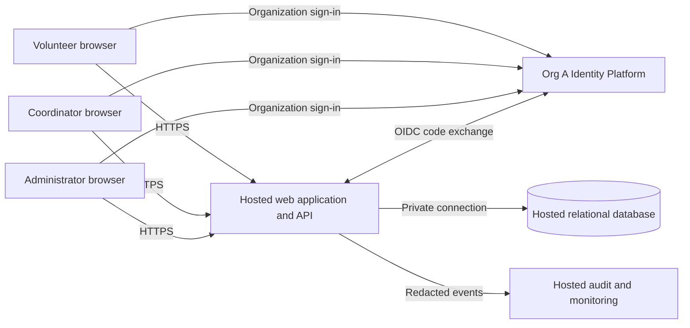

# ARC-001 — PRD-001 pilot architecture and epic readiness

## 1. Decision and readiness summary

Use a mobile web application, a single hosted application service, and a hosted relational database. Delegate authentication to the mandated **Org A Identity Platform (OIDC)**. Keep authorization, application sessions, booking consistency, and roster projections in the application service. This is a design proposal, not an approved implementation or evidence that controls work.

**FR-002, FR-003, NFR-002, and NFR-003 have sufficient architectural definition for epic drafting. FR-001 and NFR-001 need identity integration evidence first. No requirement is unconditionally ready for final epic handoff:** the product-wide compliance and accessibility criteria still need resolution under POL-001. Drafting can proceed against the explicit contracts below; the readiness table separates local design readiness from those global gates.

No epics are created by this document. Payroll and donations remain out of scope. Cancellation, waitlists, notifications, volunteer self-enrollment, and shift-management UI are not requirements of this pilot.

## 2. Authority, conflicts, and limits

Sources read: [PRD-001 v1](../prd/PRD-001.md) and [POL-001 v3](../policy/POL-001.md). The workspace contains no application code, repository instructions, architecture templates, test commands, or validation scripts. BRN-001 and the external organization ADR-104 are referenced by sources but are not supplied; their contents have not been inferred.

| Topic | Resolution | Consequence |
|---|---|---|
| PRD change log says `architecture.mandated_platforms=none` | POL-001 SET-01 mandates Org A Identity Platform for all products, with no override | Identity provider selection is closed by policy; do not evaluate alternative providers or implement password authentication. See ADR-001. |
| PRD §12 requests an identity-provider ADR | Record adoption of the mandate, not a new vendor selection | External ADR-104 remains an unverified reference. Client onboarding and integration capabilities remain GAP-01. |
| PRD change log says `quality.required_categories=floor only` | POL-001 SET-02 adds compliance and accessibility for `internal`, including this pilot | Both are required. Missing product acceptance criteria are GAP-02 and GAP-03; neither category is waived. No definition of a broader quality floor was supplied. |
| Approved PRD lacks detailed acceptance criteria | Preserve its approved text and attach proposed verification criteria here | Architecture defaults below are visible proposals; this document does not retroactively amend PRD approval. |

## 3. Components and trust boundaries

| Component | Responsibility and boundary |
|---|---|
| Mobile web UI | Sign-in entry, available shifts, booking confirmation, coordinator daily roster, administrator session revocation. Browser input and role claims are untrusted. No offline protected-data cache. |
| Application service | Serve UI and API from one origin; OIDC callback, session validation, server-side authorization, transactional booking and roster reads. One deployable with internal identity, scheduling, and roster modules; no microservice requirement at this scale. |
| Relational database | Authoritative volunteers, role grants, session state, shifts and bookings. Private access from the service; browser has no database credentials. Enforce uniqueness and transactional capacity limits. |
| Org A identity service | Authenticate people and own credentials and recovery. Stable subject mapping and client settings must be obtained under GAP-01. |
| Hosted operations | TLS termination, secret storage, deployment, backups, logs and alerts. Exact vendor, region, retention, restore targets and operational owners remain deployment decisions constrained by GAP-02. |

All application execution and persistent storage are hosted, including identity, backups and logs (NFR-003). No coordinator workstation or on-site server is an application dependency. Use one application instance initially if appropriate, but correctness must not rely on process-local locks or sessions. Database failure denies protected operations; identity outage prevents new sign-ins. Existing locally validated sessions may continue until their configured expiry, unless organizational policy requires otherwise (GAP-01).

## 4. Data ownership and authorization

| Entity | Minimum fields and invariants |
|---|---|
| Volunteer | Internal ID, unique `(issuer, subject)`, display name, active flag, session generation. Do not use email or phone as the identity key. |
| VolunteerContact | Volunteer ID and phone number, separately projected from general profile data. Phone source and permitted operational access require GAP-02 resolution. |
| RoleGrant | Principal ID and explicit role: volunteer, coordinator, administrator. Default deny; administrator does not imply coordinator. No self-assigned roles or browser-controlled grants. |
| Session | Hash of opaque session identifier, principal, generation at creation, expiry, revoked state. No tokens in browser local storage. |
| Shift | ID, start/end instants, configured food-bank timezone, positive capacity, booking-enabled flag. |
| Booking | ID, shift ID, volunteer ID, creation instant. Unique `(shift_id, volunteer_id)`; authoritative confirmed bookings only. |
| AuditEvent | Time, actor ID, action, resource ID, outcome, correlation ID. Exclude phone values, credentials, tokens and session identifiers. Retention is unresolved under GAP-02. |

Volunteers can view available shifts and their own booking results. They cannot retrieve other volunteers' profiles, bookings or phone numbers. The coordinator can retrieve the daily roster and phone projection. The administrator can revoke sessions using internal identifiers but cannot retrieve phone numbers unless separately granted coordinator status. Roles are checked on every protected request using current authoritative state.

NFR-002 applies to all application surfaces, including direct API requests, error bodies, page source, client state, logs, analytics and exports. Do not fetch phones into a volunteer's browser and merely hide them. Use explicit response-field allowlists and omit contact data from general queries. Return protected responses with `Cache-Control: no-store`; avoid shared/CDN caching of these responses. No phone-bearing exports or third-party analytics are proposed. A coordinator's authorized screen cannot prevent that person manually copying information; no such additional guarantee is claimed.

Ordinary application administrators and support users receive no raw contact-data access. Privileged database and backup access, encryption-key access, and the meaning of “only the coordinator” for hosted operators need a documented treatment before phone data is loaded (GAP-02); encryption at rest alone does not settle that boundary.

## 5. Behavior contracts

### 5.1 Sign-in and revocation — FR-001, NFR-001

Propose an OIDC authorization-code flow with PKCE, state and nonce validation. The server validates issuer, audience, signature and expiry, maps the subject to an active volunteer, and issues a Secure, HttpOnly, same-site opaque session cookie. Exact provider metadata, client registration, redirect URIs, supported flow and volunteer provisioning depend on GAP-01. No public self-registration is assumed. Apply CSRF protection to state-changing application requests.

Application sessions use central database state, never only a self-contained token. To revoke all current application sessions for a volunteer, an authorized administrator atomically increments that volunteer's session generation and records a redacted audit event. Report success only after durable commit. Every protected request checks session expiry, active status and generation against authoritative database state; do not use a lagging replica or authorization cache for these checks. If state cannot be verified, deny access.

Protected writes check generation again within their database transaction, using locking compatible with the revocation transaction. Bound protected requests to at most 30 seconds and provide no long-lived protected streams. These design constraints aim to make application revocation effective immediately for new requests and within 30 seconds for in-flight work, below the PRD's five-minute maximum. Previously delivered pages cannot be recalled, but further protected access must fail.

Revocation is distinct from account suspension: the revoked application cookie must never work again; a fresh sign-in is a new session. Whether the administrator must also terminate the identity provider's SSO session, prevent automatic reauthentication, or revoke sessions for other clients is unspecified. **Do not claim NFR-001 is satisfied end to end** until GAP-01 establishes the organizational session boundary and supported mechanism. Local generation checks supply an application mechanism without assuming any provider revocation feature.

### 5.2 Booking — FR-002

Proposed pilot meaning of “open”: shift is booking-enabled, starts in the future, and has fewer confirmed bookings than capacity. An active signed-in volunteer books only for their own identity derived from the session. No overlap rule, booking deadline beyond shift start, or cancellation policy is invented.

For each booking, begin a transaction, validate the session, lock the shift, check for an existing booking, and recheck open state and capacity using database time. An existing booking returns the same confirmation, so retries are safe even if the first response was lost. Otherwise insert the booking and commit. Enforce the unique constraint as a second guard. All writers must follow the same shift-lock protocol; operational imports cannot bypass it. A competing request for the last place returns an explicit full-shift outcome. Availability shown before submission is advisory.

Proposed API contracts: `GET /shifts` returns permitted shift information and available places; `POST /shifts/{id}/bookings` returns the caller's confirmed booking or an explicit unavailable result. Unauthenticated or revoked requests fail; submitted volunteer IDs cannot override the caller. Do not report success before commit.

Shift creation is a missing operational dependency, not a newly authorized product feature. For the pilot, propose an operator-run, validated seed/import with dates, capacities and timezone confirmed by the coordinator. Start with Tuesday and Thursday shifts enabled. Finalize this assumption during epic drafting (ASM-A1); it does not require a scheduling administration UI.

### 5.3 Daily roster — FR-003, NFR-002

`GET /coordinator/roster?date=YYYY-MM-DD` requires coordinator authorization. Interpret the date in the configured food-bank timezone, select shifts by their local start date, and return all selected shifts including empty ones, with committed booking names and the separately authorized phone projection. Use primary database reads so a refresh after a successful booking includes it. Store instants consistently and test local midnight and daylight-saving boundaries where applicable.

Propose polling every 30 seconds while the roster page is visible plus manual refresh; show the last successful refresh time and a stale/error state after failure. This is a proposed interpretation of “live” in the PRD summary, not an approved freshness SLA. Clear protected UI state on access denial. ASM-A2 tracks timezone and the freshness proposal for epic acceptance.

## 6. Quality scenarios and verification obligations

These are planned checks, **not passing implementation results**. Preserve the five-minute maximum and coordinator-only privacy requirement unchanged. Start behavior implementation with meaningful failing tests; no implementation or executable behavior tests exist in this documentation-only workspace.

| ID | Source/category | Proposed evidence required from implementing epics |
|---|---|---|
| Q-01 | FR-001, security | Org A test-client sign-in succeeds for an active mapped volunteer; unknown/inactive identities and invalid, expired or replayed callbacks fail. Test callback validation and CSRF. |
| Q-02 | NFR-001, security | Across multiple application instances and browser sessions, revoke at a recorded durable-commit time; repeated requests with every old cookie cease succeeding within 300 seconds, including concurrent booking and roster access. Test store outage, stale state, in-flight work and the agreed provider SSO boundary. Record maximum observed delay. |
| Q-03 | FR-002, integrity | Concurrent requests for the last place result in exactly one new booking. Repeated requests by one volunteer create one booking and return its confirmation. Full, disabled and started shifts reject new bookings. Failed transactions leave no partial success. |
| Q-04 | FR-003, correctness | Authorized coordinator sees exactly the committed roster for the selected local day, including empty shifts; refresh reflects a new booking. Test date boundaries, loading errors and stale indicators. |
| Q-05 | NFR-002, privacy | Exercise unauthenticated, volunteer, administrator-only and coordinator roles through direct APIs and UI. Only coordinator responses contain phones; inspect logs, errors, caches and client bundles for leaks. Verify privileged operational controls agreed in GAP-02. |
| Q-06 | NFR-003, hosting | Review deployment inventory and infrastructure configuration: application, database, identity, secrets, logs and backups are hosted; no on-site runtime dependency. Demonstrate restore and deployment rollback against agreed targets. |
| Q-07 | POL-001 SET-02, accessibility | Proposed minimum: keyboard-only completion of sign-in, booking, roster and revocation; visible focus, accessible names, announced validation/booking updates, usable zoom/reflow and non-color-only states. Include the hosted identity journey. Agree conformance standard, version, level, supported assistive technologies and manual/automated evidence under GAP-03. |
| Q-08 | POL-001 SET-02, compliance | Produce applicable-control mapping with accountable owners; review least privilege and role changes, redacted security audit evidence, data inventory, retention/deletion including backups, incident ownership and deployment/restore evidence. GAP-02 must establish actual controls and evidence retention. No claim of SOC 2 compliance is made. |
| Q-09 | Proposed reliability/operations | Alert on failed sign-ins, booking failures, database availability and audit-delivery failures without collecting sensitive payloads. Agree uptime, recovery and response targets before deployment; 120 active volunteers is context, not a concurrency benchmark. |

Use a transactional audit outbox or equivalent durable event write for successful bookings, role changes and revocations so event delivery can retry without repeating business actions. Availability failure should not fabricate booking confirmations or revocation success. Audit access is restricted and separate from coordinator contact-data access.

SM-01 remains measured through the coordinator's shift log: 83% baseline and 95% target by pilot end. Booked capacity is not evidence that volunteers attended, so do not substitute booking counts for the approved success metric. PRD ASM-01 remains open; validate phone/browser access through the planned volunteer feedback before rollout.

## 7. Gaps and assumptions

Owners below are proposed responsible roles; no approval or assignment is implied.

| ID | Missing decision/evidence | Impact and closure condition | Proposed owner |
|---|---|---|---|
| GAP-01 | External ADR-104 and Org A OIDC integration contract are unavailable | Blocks FR-001 and NFR-001 design finalization. Obtain authoritative integration guidance, volunteer onboarding/subject mapping, role-grant authority, client settings, session/SSO revocation boundary and provider outage policy; validate sign-in and revocation with a test client. Provider choice itself is not open. | Org A identity owner + application architect |
| GAP-02 | Mandatory compliance criteria and operational privacy boundary are absent | Product-wide epic handoff gate. Obtain applicable control/evidence mapping, approved hosted data locations, privileged access rules, data retention/deletion, audit ownership and backup treatment. Resolve phone visibility for operators before any phone-bearing implementation is accepted. | Organization control owner + product owner |
| GAP-03 | Mandatory accessibility acceptance target is absent | Product-wide epic handoff gate. Establish organization-approved standard/level and test matrix, including the external sign-in journey, and attach measurable acceptance criteria to affected epics. | Organization accessibility owner + product owner |
| ASM-A1 | “Open” semantics and initial shift provisioning are not detailed in PRD | Use §5.2 proposal for drafting; product owner confirms capacities, schedule, timezone and import ownership before booking stories are implementation-ready. Changes may affect FR-002/FR-003. | Product owner/coordinator |
| ASM-A2 | “Live” roster freshness is not quantified | Use §5.3 proposal for drafting; product owner confirms freshness/error behavior before roster stories are implementation-ready. | Product owner/coordinator |
| ASM-A3 | Hosting provider, region, recovery targets and support ownership are unspecified | NFR-003 determines hosted topology but not a vendor. Select compliant services and verify backup/restore before deployment; revisit topology only if selected services cannot support these contracts. | Operations owner |

These gaps are recorded without questions as requested. This draft does not grant a policy exception or silently treat proposed targets as approved requirements.

## 8. Requirement-to-epic readiness

**READY (design)** means an epic can be drafted with bounded architecture and acceptance work. **BLOCKED (handoff)** means it must not be presented as fully ready for delivery until the named gaps close. Design readiness does not imply implementation validation or authorization to release.

| Requirement | Architecture allocation | Design readiness | Final epic handoff | Verification |
|---|---|---|---|---|
| FR-001 | Org A identity + identity/session module; ADR-001 | BLOCKED: GAP-01 | BLOCKED: GAP-01, GAP-02, GAP-03 | Q-01, Q-07, Q-08 |
| FR-002 | Scheduling module + transactional database; §5.2 | READY: draft with ASM-A1 | BLOCKED: GAP-02, GAP-03; confirm ASM-A1 | Q-02, Q-03, Q-07, Q-08 |
| FR-003 | Roster module + coordinator projection; §5.3 | READY: draft with ASM-A1/ASM-A2 | BLOCKED: GAP-02, GAP-03; confirm assumptions | Q-04, Q-05, Q-07, Q-08 |
| NFR-001 | Shared session generation and administrator action; §5.1 | BLOCKED: GAP-01 | BLOCKED: GAP-01, GAP-02, GAP-03 | Q-02, Q-07, Q-08 |
| NFR-002 | Server-side role checks, separate contact projection and operational access; §4 | READY: application contract defined; operational boundary in GAP-02 | BLOCKED: GAP-02, GAP-03 | Q-05, Q-08 |
| NFR-003 | Entire hosted topology, including identity and operations; §3 | READY: applies to every epic, not only infrastructure | BLOCKED: GAP-02, GAP-03; vendor detail follows ASM-A3 | Q-06, Q-08, Q-09 |

Candidate epic boundaries (planning suggestions, not created epics):

1. **Identity and session control:** FR-001 + NFR-001, including administrator revocation. Resolve GAP-01 first; local session design can be explored meanwhile.
2. **Volunteer booking:** FR-002; define initial shift import and mobile booking flow. Can be drafted now; real integration depends on identity/session controls.
3. **Coordinator roster:** FR-003 + NFR-002; role provisioning, daily view and contact privacy. Can be drafted now; delivery depends on identity and booking data contracts.
4. **Hosted pilot foundation:** NFR-003 plus shared audit, secrets, backup and deployment controls. Supports all three user-facing epics.

Every candidate must carry applicable NFR-001 checks on protected access, NFR-002 protections wherever personal data flows, NFR-003 hosted deployment, and POL-001 compliance/accessibility criteria. Do not confine cross-cutting requirements to one epic and omit them from its consumers. Do not edit the PRD's generated epic map by hand.

## 9. Verification record

See [VER-001](VER-001.md) for checks against the actual document files, their hashes, and unresolved gates. The architecture coverage checks can pass while implementation evidence remains NOT_RUN and epic handoff remains BLOCKED.

## Change log

| Version | Date | Author | Change |
|---|---|---|---|
| 1 | 2026-09-28 | Codex | Draft topology, inherited identity decision, quality scenarios, gaps and requirement readiness from PRD-001 v1 and POL-001 v3. |
