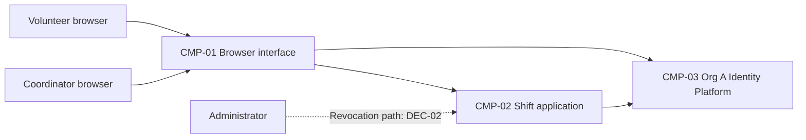

# ARCH-001 — Volunteer shift sign-up for the Riverside Food Bank architecture

## 1. Context and scope

Defined against PRD-001 version 1, status approved, owned by Priya Nair. The product lets
approximately 120 volunteers sign in and book warehouse shifts from mobile browsers, and lets
the coordinator view each day's roster. Payroll, donations and a native mobile app are outside scope.

No inspection scope was named and no code or configuration was inspected. No existing ARCH or
ADR was found in the contract document paths. The proposed outcome is create; it remains
unconfirmed because the request asks to proceed without questions. No ADR is written and no
architectural choice is accepted except the exact identity-provider mandate in POL-001#SET-01.
The proposed components below describe responsibilities for discussion, not verified implementation.

## 2. Quality drivers

PRD-001#NFR-001 requires administrator revocation of volunteer sessions to take effect within
five minutes. ARCH-001#DEC-02 must establish an end-to-end enforcement mechanism covering
sign-in and authenticated booking; the identity-provider mandate does not establish that mechanism.

PRD-001#NFR-002 restricts visibility of phone numbers to the coordinator. Contact ownership and
authorization must be shared by booking and roster work without exposing phone numbers to
volunteers. ARCH-001#DEC-03 and ARCH-001#DEC-07 leave these choices open.

PRD-001#NFR-003 requires hosted services for the entire product because there is no on-site server.
This constrains every component, but does not choose hosting services, deployment units or environments;
those remain open under ARCH-001#DEC-04.

The operating context is internal, as stated in the PRD; the Pilot release label does not change it.
The framework floor requires constraint, security and privacy, covered by the three NFRs above.
POL-001#SET-02 additionally requires compliance and accessibility. Neither has a corresponding NFR
or measurable acceptance target in this PRD. These are unanswered product requirements for Priya
Nair, recorded in section 8 rather than invented architectural decisions.

## 3. Components

The diagram proposes logical responsibilities. ARCH-001#DEC-05 governs their boundaries;
ARCH-001#DEC-03 and ARCH-001#DEC-06 govern the proposed ownership assignments. Arrows show
necessary collaboration, with session integration and booking-to-roster delivery still open.



```yaml items
components:
  - id: CMP-01
    status: active
    name: "Browser interface"
    responsibility: "Proposed mobile web interface for sign-in, booking and the coordinator roster; does not own authoritative records or enforce authorization by itself."
    owns_data: []
    interacts_with:
      - "CMP-02"
      - "CMP-03"
    deployment: "Open: see DEC-04"
    upstream:
      - {id: PRD-001, item: NFR-001, relation: informed_by, version: 1, hash: null}
      - {id: PRD-001, item: NFR-002, relation: informed_by, version: 1, hash: null}
      - {id: PRD-001, item: NFR-003, relation: informed_by, version: 1, hash: null}
  - id: CMP-02
    status: active
    name: "Shift application"
    responsibility: "Proposed application boundary for booking, roster projection, contact access and session enforcement; does not authenticate credentials itself. Internal module or service boundaries remain open under DEC-05."
    owns_data:
      - "Proposed: shifts and authoritative bookings, pending DEC-06"
      - "Proposed: volunteer contact records, pending DEC-03"
    interacts_with:
      - "CMP-01"
      - "CMP-03"
    deployment: "Open: see DEC-04"
    upstream:
      - {id: PRD-001, item: NFR-001, relation: informed_by, version: 1, hash: null}
      - {id: PRD-001, item: NFR-002, relation: informed_by, version: 1, hash: null}
      - {id: PRD-001, item: NFR-003, relation: informed_by, version: 1, hash: null}
  - id: CMP-03
    status: active
    name: "Org A Identity Platform (OIDC)"
    responsibility: "Mandated identity and authentication capability; product bookings, contact authorization and end-to-end session revocation are not settled by this mandate."
    owns_data:
      - "Identity and authentication records within the mandated capability; exact profile ownership remains unverified"
    interacts_with:
      - "CMP-01"
      - "CMP-02"
    deployment: "Open: see DEC-04"
    upstream:
      - {id: PRD-001, item: NFR-001, relation: informed_by, version: 1, hash: null}
      - {id: PRD-001, item: NFR-003, relation: informed_by, version: 1, hash: null}
      - {id: POL-001, item: SET-01, relation: constrains, version: 3, hash: null}
```

## 4. Architectural questions

```yaml items
decisions:
  - id: DEC-01
    status: active
    question: "Which identity provider handles volunteer sign-in?"
    blocking: true
    state: resolved
    resolved_by: [POL-001#SET-01]
    notes: "The PRD NEEDS ADR marker is answered exactly by the approved identity and authentication mandate: Org A Identity Platform (OIDC). This resolves provider selection only and requires no ADR."
    upstream:
      - {id: PRD-001, item: FR-001, relation: informed_by, version: 1, hash: null}
  - id: DEC-02
    status: active
    question: "How will administrator revocation stop every volunteer session from working within five minutes?"
    blocking: true
    state: open
    resolved_by: []
    notes: "Shared enforcement must cover session creation, renewal and authenticated booking. Central session checks or bounded token lifetimes with revocation-aware renewal are candidate approaches; platform support and failure behavior are unverified. No approach was selected."
    upstream:
      - {id: PRD-001, item: FR-001, relation: informed_by, version: 1, hash: null}
      - {id: PRD-001, item: FR-002, relation: informed_by, version: 1, hash: null}
      - {id: PRD-001, item: NFR-001, relation: informed_by, version: 1, hash: null}
  - id: DEC-03
    status: active
    question: "Which component owns volunteer contact data used by the coordinator?"
    blocking: true
    state: open
    resolved_by: []
    notes: "CMP-02 ownership is a proposal. Application-owned contacts or a separately governed profile source imply different access boundaries and integration dependencies. The identity mandate does not allocate phone-number ownership."
    upstream:
      - {id: PRD-001, item: FR-003, relation: informed_by, version: 1, hash: null}
      - {id: PRD-001, item: NFR-002, relation: informed_by, version: 1, hash: null}
  - id: DEC-04
    status: active
    question: "What hosted deployment topology will run the whole product?"
    blocking: true
    state: open
    resolved_by: []
    notes: "Hosted services are required, but provider, deployment units, persistence services and environment separation are undecided. This affects all product functions and enforcement of revocation and contact privacy; the mandate supplies no deployment evidence for the identity platform."
    upstream:
      - {id: PRD-001, item: FR-001, relation: informed_by, version: 1, hash: null}
      - {id: PRD-001, item: FR-002, relation: informed_by, version: 1, hash: null}
      - {id: PRD-001, item: FR-003, relation: informed_by, version: 1, hash: null}
      - {id: PRD-001, item: NFR-001, relation: informed_by, version: 1, hash: null}
      - {id: PRD-001, item: NFR-002, relation: informed_by, version: 1, hash: null}
      - {id: PRD-001, item: NFR-003, relation: informed_by, version: 1, hash: null}
  - id: DEC-05
    status: active
    question: "How will responsibilities be divided between the browser interface and application modules or services?"
    blocking: true
    state: open
    resolved_by: []
    notes: "The diagram proposes one application boundary serving browser flows. A modular application simplifies shared enforcement and booking-to-roster integration; separate services allow independent deployment but require explicit cross-service contracts. No boundary choice was accepted."
    upstream:
      - {id: PRD-001, item: FR-001, relation: informed_by, version: 1, hash: null}
      - {id: PRD-001, item: FR-002, relation: informed_by, version: 1, hash: null}
      - {id: PRD-001, item: FR-003, relation: informed_by, version: 1, hash: null}
      - {id: PRD-001, item: NFR-001, relation: informed_by, version: 1, hash: null}
      - {id: PRD-001, item: NFR-002, relation: informed_by, version: 1, hash: null}
  - id: DEC-06
    status: active
    question: "Which component is the authoritative owner of shift availability and bookings shared with the roster?"
    blocking: true
    state: open
    resolved_by: []
    notes: "CMP-02 ownership is proposed. Booking and roster epics must agree on one authority and its consistency boundary so independent implementations do not disagree about open shifts or booked volunteers. Storage technology and record fields are not selected here."
    upstream:
      - {id: PRD-001, item: FR-002, relation: informed_by, version: 1, hash: null}
      - {id: PRD-001, item: FR-003, relation: informed_by, version: 1, hash: null}
  - id: DEC-07
    status: active
    question: "Where will volunteer, coordinator and administrator permissions be established and enforced?"
    blocking: true
    state: open
    resolved_by: []
    notes: "Booking access, coordinator-only phone visibility and administrator revocation require shared authorization. Identity-platform roles or application-managed roles have different ownership and propagation trade-offs; neither is mandated by provider selection. Server-side enforcement and safe handling of contact data need an explicit design."
    upstream:
      - {id: PRD-001, item: FR-002, relation: informed_by, version: 1, hash: null}
      - {id: PRD-001, item: FR-003, relation: informed_by, version: 1, hash: null}
      - {id: PRD-001, item: NFR-001, relation: informed_by, version: 1, hash: null}
      - {id: PRD-001, item: NFR-002, relation: informed_by, version: 1, hash: null}
  - id: DEC-08
    status: active
    question: "How will confirmed bookings become visible in the coordinator roster?"
    blocking: true
    state: open
    resolved_by: []
    notes: "Direct reads from the booking authority reduce synchronization work; an event-fed roster projection separates read workloads but adds delivery and consistency responsibilities. The PRD summary calls the roster live without a measurable freshness target. No integration approach was selected."
    upstream:
      - {id: PRD-001, item: FR-002, relation: informed_by, version: 1, hash: null}
      - {id: PRD-001, item: FR-003, relation: informed_by, version: 1, hash: null}
```

## 5. Evidence inspected

```yaml items
evidence:
  - id: EVD-01
    status: active
    source: "PRD-001"
    kind: prd
    finding: "Version 1, status approved: volunteer sign-in, authenticated shift booking and coordinator rosters; five-minute session revocation, coordinator-only phone visibility and hosted services. Internal operating context; identity provider marked NEEDS ADR."
    classification: context
  - id: EVD-02
    status: active
    source: "POL-001#SET-01"
    kind: policy
    finding: "Version 3, status approved: active organization mandate specifies Org A Identity Platform (OIDC) for identity and authentication; no overrides allowed. The setting names external ADR-104 as its source, which was not independently consulted."
    classification: policy
  - id: EVD-03
    status: active
    source: "POL-001#SET-02"
    kind: policy
    finding: "Version 3, status approved: active setting adds compliance and accessibility for internal, pilot and production contexts. Applies to this PRD's internal context."
    classification: policy
```

## 6. Deployment

All product functions must run on hosted services under PRD-001#NFR-003. ARCH-001#DEC-04
leaves hosting services, deployment units and environments undecided; logical components are not
commitments to separate deployables. The mandated identity platform is an organization-provided
dependency, but its hosting arrangement and supported session controls were not inspected.
No deployment, infrastructure, persistent storage or runtime verification is claimed.

## 7. Requirement changes proposed to the PRD owner

- None.

## 8. Open questions

- [NEEDS CLARIFICATION: No inspection scope was named and no code or configuration was inspected; existing components, reusable services and implementation compatibility are unknown.]
- [NEEDS CLARIFICATION: Org A Identity Platform session-revocation controls, role support, profile ownership and hosting arrangement are unverified; the policy resolves provider selection only.]
- [NEEDS CLARIFICATION: Priya Nair must define measurable compliance and accessibility requirements to cover POL-001#SET-02; neither category has an NFR in PRD-001 v1.]
- [NEEDS CLARIFICATION: Priya Nair must clarify the roster freshness implied by the PRD summary's live roster; PRD-001#FR-003 has no freshness bound.]
- [NEEDS CLARIFICATION: The proposed create outcome has not been explicitly confirmed; outcome remains null under the request to proceed without questions.]
- [NEEDS CLARIFICATION: host model/session identity unavailable]

The session ID is exposed by the host; its exact model ID is unavailable. The provenance check
therefore remains unresolved. This draft is retained without a validated readiness handoff.

## Change Log

| Version | Date | Author | Change | Items affected |
|---|---|---|---|---|
| 1 | 2026-09-28 | codex (session 01a0ea09-3579-7be1-a70e-d82f29b3a480) | Initial draft for PRD-001 v1; provenance validation unresolved because the exact host model ID is unavailable. Policy resolution: interview.max_calls=8 (default); architecture.mandated_platforms=Org A Identity Platform (OIDC) for identity and authentication (POL-001#SET-01); quality.required_categories=+compliance,+accessibility (POL-001#SET-02) | all |
