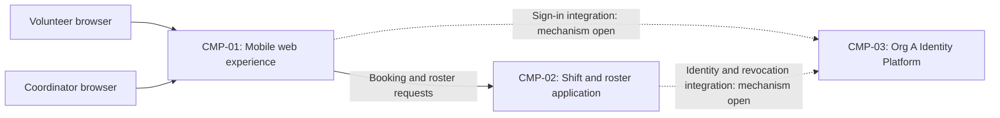

# ARCH-001 — Volunteer shift sign-up for the Riverside Food Bank architecture

## 1. Context and scope

This description examines PRD-001 version 1, status approved, owned by Priya Nair.
The system supports volunteer sign-in, self-service warehouse shift booking, and a
coordinator's daily roster for approximately 120 volunteers. Mobile-first web pages
are required; payroll, donations, and an installed mobile app are outside scope.

The request explicitly selected PRD-001 and instructed proceeding without questions.
No inspection scope was named, so no code or configuration was inspected. No ARCH or
ADR directory exists at the time of initial discovery. Create is the proposed outcome
because no architecture covers this system; the outcome remains unconfirmed.
Only the identity provider decision is settled by policy. Other boundaries and
interactions below are proposals for review, not accepted decisions.

## 2. Quality drivers

PRD-001#NFR-001 requires administrator revocation of volunteer sessions to take
effect within five minutes. The identity platform mandate does not establish the
mechanism or its timing guarantee; ARCH-001#DEC-02 remains open.

PRD-001#NFR-002 restricts volunteer phone numbers to the coordinator. Authoritative
contact ownership and enforcement across application responses and storage require
ARCH-001#DEC-04 and ARCH-001#DEC-05. PRD-001#NFR-003 requires hosted services for the
whole product, affecting every functional and non-functional requirement; the
deployment decision is ARCH-001#DEC-07.

The operating context is internal, as stated in the PRD, despite its Pilot release
label. The framework floor requires constraint, security, and privacy, all covered
by the three NFRs. POL-001#SET-02 adds compliance and accessibility. Neither category
has an NFR or measurable acceptance criteria in PRD-001. These are unanswered product
quality requirements for Priya Nair, not new architectural decisions or invented NFRs.

## 3. Components

The diagram shows proposed logical responsibilities and interactions. It does not
settle process boundaries, transport choices, session handling, or data ownership.
ARCH-001#DEC-03, ARCH-001#DEC-04, and ARCH-001#DEC-06 govern those proposals.



```yaml items
components:
  - id: CMP-01
    status: active
    name: "Mobile web experience"
    responsibility: "Proposed browser-facing sign-in, booking, and coordinator roster experience; not an authority for credentials, permissions, or persisted bookings. Boundary subject to DEC-03."
    owns_data: []
    interacts_with:
      - "CMP-02"
      - "CMP-03"
    deployment: "Open: see DEC-07"
    upstream:
      - {id: PRD-001, item: NFR-001, relation: informed_by, version: 1, hash: null}
      - {id: PRD-001, item: NFR-002, relation: informed_by, version: 1, hash: null}
      - {id: PRD-001, item: NFR-003, relation: informed_by, version: 1, hash: null}
  - id: CMP-02
    status: active
    name: "Shift and roster application"
    responsibility: "Proposed authority for booking open shifts, supplying daily rosters, and enforcing access to volunteer contacts; does not implement an independent identity provider. Boundary and ownership remain subject to DEC-03 and DEC-04."
    owns_data:
      - "Proposed: shifts and bookings, subject to DEC-04"
      - "Proposed: volunteer profile references and contact data, subject to DEC-04"
    interacts_with:
      - "CMP-01"
      - "CMP-03"
    deployment: "Open: see DEC-07"
    upstream:
      - {id: PRD-001, item: NFR-001, relation: informed_by, version: 1, hash: null}
      - {id: PRD-001, item: NFR-002, relation: informed_by, version: 1, hash: null}
      - {id: PRD-001, item: NFR-003, relation: informed_by, version: 1, hash: null}
  - id: CMP-03
    status: active
    name: "Org A Identity Platform (OIDC)"
    responsibility: "Policy-mandated identity and authentication provider; does not by this mandate settle application session revocation, coordinator authorization, or hosting topology."
    owns_data: []
    interacts_with:
      - "CMP-01"
      - "CMP-02"
    deployment: "Open: see DEC-07; provider fixed by POL-001#SET-01"
    upstream:
      - {id: PRD-001, item: NFR-001, relation: informed_by, version: 1, hash: null}
      - {id: PRD-001, item: NFR-003, relation: informed_by, version: 1, hash: null}
      - {id: POL-001, item: SET-01, relation: constrains, version: 3, hash: null}
```

## 4. Architectural questions

```yaml items
decisions:
  - id: DEC-01
    status: active
    question: "Which identity provider handles volunteer sign-in?"
    blocking: true
    state: resolved
    resolved_by: [POL-001#SET-01]
    notes: "The approved organization policy mandates Org A Identity Platform (OIDC) for identity and authentication. This answers the PRD NEEDS ADR marker without a new ADR; no session or authorization decision follows from it."
    upstream:
      - {id: PRD-001, item: FR-001, relation: informed_by, version: 1, hash: null}
  - id: DEC-02
    status: active
    question: "How will administrator revocation invalidate volunteer sessions across the application within five minutes?"
    blocking: true
    state: open
    resolved_by: []
    notes: "Open without a user decision. Compare centrally checked application sessions with bounded-lifetime credentials and revocation propagation; neither the available platform capabilities nor a timing guarantee has been established. Applies to sign-in and use of signed-in booking."
    upstream:
      - {id: PRD-001, item: FR-001, relation: informed_by, version: 1, hash: null}
      - {id: PRD-001, item: FR-002, relation: informed_by, version: 1, hash: null}
      - {id: PRD-001, item: NFR-001, relation: informed_by, version: 1, hash: null}
  - id: DEC-03
    status: active
    question: "What shared application boundaries separate the web experience, sign-in integration, booking, and roster responsibilities?"
    blocking: true
    state: open
    resolved_by: []
    notes: "CMP-01 and CMP-02 propose logical responsibilities only. A single application with modules or separately deployed interfaces and services would require different shared contracts; no option is accepted."
    upstream:
      - {id: PRD-001, item: FR-001, relation: informed_by, version: 1, hash: null}
      - {id: PRD-001, item: FR-002, relation: informed_by, version: 1, hash: null}
      - {id: PRD-001, item: FR-003, relation: informed_by, version: 1, hash: null}
  - id: DEC-04
    status: active
    question: "Which components are authoritative owners of shift, booking, and volunteer contact data?"
    blocking: true
    state: open
    resolved_by: []
    notes: "CMP-02 is a proposed owner. Shared application ownership or delegated profile and scheduling ownership imply different write authorities and privacy boundaries. The roster must use the same authoritative bookings; exact tables and fields belong to specifications."
    upstream:
      - {id: PRD-001, item: FR-002, relation: informed_by, version: 1, hash: null}
      - {id: PRD-001, item: FR-003, relation: informed_by, version: 1, hash: null}
      - {id: PRD-001, item: NFR-002, relation: informed_by, version: 1, hash: null}
  - id: DEC-05
    status: active
    question: "Where will trusted coordinator authorization enforce exclusive access to volunteer phone numbers?"
    blocking: true
    state: open
    resolved_by: []
    notes: "Compare application-enforced authorization with access rules at the authoritative data service. The role authority and enforcement boundary remain undecided; browser presentation alone cannot establish the restriction. Covers volunteer-facing booking responses and coordinator roster access."
    upstream:
      - {id: PRD-001, item: FR-002, relation: informed_by, version: 1, hash: null}
      - {id: PRD-001, item: FR-003, relation: informed_by, version: 1, hash: null}
      - {id: PRD-001, item: NFR-002, relation: informed_by, version: 1, hash: null}
  - id: DEC-06
    status: active
    question: "What shared interaction contract makes accepted bookings visible to the coordinator roster?"
    blocking: true
    state: open
    resolved_by: []
    notes: "Compare reading the authoritative booking state with an event-fed roster projection. They differ in consistency and operational cost. No numeric freshness target is specified; any product target belongs to the PRD owner. Transport and API fields remain specification detail."
    upstream:
      - {id: PRD-001, item: FR-002, relation: informed_by, version: 1, hash: null}
      - {id: PRD-001, item: FR-003, relation: informed_by, version: 1, hash: null}
  - id: DEC-07
    status: active
    question: "What hosted deployment topology will run the whole product?"
    blocking: true
    state: open
    resolved_by: []
    notes: "Hosted services are required, but the provider, application and data deployment units, environments, and identity integration location are undecided. Compare a managed application and data service with separately hosted units. This whole-product constraint affects every active FR and NFR."
    upstream:
      - {id: PRD-001, item: FR-001, relation: informed_by, version: 1, hash: null}
      - {id: PRD-001, item: FR-002, relation: informed_by, version: 1, hash: null}
      - {id: PRD-001, item: FR-003, relation: informed_by, version: 1, hash: null}
      - {id: PRD-001, item: NFR-001, relation: informed_by, version: 1, hash: null}
      - {id: PRD-001, item: NFR-002, relation: informed_by, version: 1, hash: null}
      - {id: PRD-001, item: NFR-003, relation: informed_by, version: 1, hash: null}
```

## 5. Evidence inspected

```yaml items
evidence:
  - id: EVD-01
    status: active
    source: "PRD-001"
    kind: prd
    finding: "Version 1, status approved: requires volunteer sign-in and booking, coordinator rosters, five-minute session revocation, coordinator-only phone visibility, and whole-product hosted services; operating context internal; identity provider marked NEEDS ADR."
    classification: context
  - id: EVD-02
    status: active
    source: "POL-001#SET-01"
    kind: policy
    finding: "Version 3, status approved; SET-01 active: mandates Org A Identity Platform (OIDC) for identity and authentication, without project overrides. Does not specify session revocation or application authorization."
    classification: policy
  - id: EVD-03
    status: active
    source: "POL-001#SET-02"
    kind: policy
    finding: "Version 3, status approved; SET-02 active: adds compliance and accessibility to required quality categories for internal, pilot, and production contexts. Applies to this internal product."
    classification: policy
```

## 6. Deployment

All product capabilities must run on hosted services under PRD-001#NFR-003.
ARCH-001#DEC-07 leaves provider, topology, environments, and application/data units
open. The identity provider is fixed by policy, but its hosting arrangement and
integration capabilities have not been inspected. The logical components are not
approved deployment units. The Tuesday/Thursday pilot in PRD-001 does not decide
whether separate runtime environments are needed.

## 7. Requirement changes proposed to the PRD owner

- Priya Nair: PRD-001's NFR set lacks compliance and accessibility criteria required
  by POL-001#SET-02 for internal tools. Add measurable NFRs for both categories;
  the current omission conflicts with the required category coverage. Existing
  PRD-001#NFR-001 through PRD-001#NFR-003 remain unchanged. The PRD owner must assign
  the new requirement IDs, scope, priorities, and releases.

## 8. Open questions

- [NEEDS CLARIFICATION: host model/session identity unavailable]
- [NEEDS CLARIFICATION: no inspection scope was named and no code or configuration was inspected; existing implementation, reusable services, and deployed behavior are unknown]
- [NEEDS CLARIFICATION: Org A Identity Platform revocation, role, and hosting capabilities are unverified; the policy source ADR-104 was not supplied or inspected and is not an independent resolver]
- [NEEDS CLARIFICATION: compliance and accessibility acceptance criteria are absent from PRD-001; Priya Nair must define them]
- [NEEDS CLARIFICATION: the summary calls the roster live but supplies no freshness target; Priya Nair must clarify the expected observable timing]
- [NEEDS CLARIFICATION: create is the proposed outcome and has not been confirmed; outcome remains null under the no-questions instruction]

## Change Log

| Version | Date | Author | Change | Items affected |
|---|---|---|---|---|
| 1 | 2026-09-28 | codex (session unknown) | Initial draft for PRD-001 v1. Exact host model/session identity is unavailable; provenance validation remains unresolved. Policy resolution: interview.max_calls=8 (default); architecture.mandated_platforms=Org A Identity Platform (OIDC) for identity and authentication (POL-001#SET-01); quality.required_categories=+compliance,+accessibility (POL-001#SET-02) | all |
| 1 | 2026-09-28 | codex (session unknown) | Validation audit (ERR-05): self-check 3 remains unresolved because exact host model/session identity is unavailable. Retained as draft with empty approval fields and unconfirmed outcome; no existing fields or ADRs required restoration. Readiness handoff withheld. Policy resolution: interview.max_calls=8 (default); architecture.mandated_platforms=Org A Identity Platform (OIDC) for identity and authentication (POL-001#SET-01); quality.required_categories=+compliance,+accessibility (POL-001#SET-02) | generated_by |
