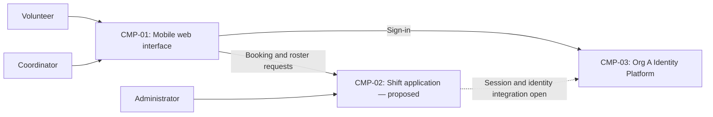

# ARCH-001 — Volunteer shift sign-up for the Riverside Food Bank architecture

## 1. Context and scope

This description examines approved PRD-001 version 1, owned by Priya Nair. It covers
volunteer sign-in, booking open warehouse shifts, and the coordinator's daily roster
for about 120 volunteers using mobile web browsers. Payroll, donations and an
installed mobile application are outside the product scope.

The request explicitly selected PRD-001 and instructed proceeding without questions.
No inspection scope was named and no code or configuration was inspected. No existing
ARCH or local ADR was found in the contract directories. A new ARCH is proposed because
none covers this system; the request did not confirm the create outcome, so outcome
remains null. No ADR is written. Only the identity-provider question is resolved by
policy; all other shared choices below remain open.

## 2. Quality drivers

PRD-001#NFR-001 requires an administrator to revoke volunteer sessions within five
minutes. This affects both session creation in PRD-001#FR-001 and acceptance of a
signed-in booking in PRD-001#FR-002. The identity mandate does not establish a session
revocation mechanism or prove that the deadline can be met.

PRD-001#NFR-002 restricts volunteer phone numbers to the coordinator. Contact ownership
and enforcement must be consistent across the roster, application responses and any
stored copies. PRD-001#NFR-003 requires hosted services for the whole product; it
does not select a provider, deployment topology or data service.

The operating context is internal, as stated in PRD-001, despite its Pilot release
label. The framework floor is constraint, security and privacy. POL-001#SET-02 adds
compliance and accessibility. The existing NFRs cover the floor, but no NFR defines
compliance or accessibility acceptance criteria. These are unanswered product quality
requirements for Priya Nair, not invented architectural decisions. Mobile-first pages
alone do not establish an accessibility target.

## 3. Components

The diagram proposes logical responsibilities, not accepted service boundaries or
deployment units. ARCH-001#DEC-03 governs the application boundary; data assignments
remain proposals under ARCH-001#DEC-02, ARCH-001#DEC-04 and ARCH-001#DEC-05. The
identity platform is mandated; its application integration remains subject to the
session and authorization decisions.



```yaml items
components:
  - id: CMP-01
    status: active
    name: "Mobile web interface"
    responsibility: "Presents volunteer sign-in, booking and coordinator roster pages; is not the authority for access control or persistent records. Boundary proposed under ARCH-001#DEC-03."
    owns_data: []
    interacts_with:
      - "CMP-02"
      - "CMP-03"
    deployment: "Open: see DEC-08"
    upstream:
      - {id: PRD-001, item: NFR-001, relation: informed_by, version: 1, hash: null}
      - {id: PRD-001, item: NFR-002, relation: informed_by, version: 1, hash: null}
      - {id: PRD-001, item: NFR-003, relation: informed_by, version: 1, hash: null}
  - id: CMP-02
    status: active
    name: "Shift application"
    responsibility: "Proposed application authority for bookings, roster reads, contact disclosure and session enforcement; does not implement its own identity provider. Shared boundaries and authority remain open."
    owns_data:
      - "Proposed: open shifts and bookings, pending ARCH-001#DEC-04"
      - "Proposed: volunteer contact records, pending ARCH-001#DEC-05"
      - "Proposed: application session revocation state, pending ARCH-001#DEC-02"
      - "Proposed: application role assignments, pending ARCH-001#DEC-06"
    interacts_with:
      - "CMP-01"
      - "CMP-03"
    deployment: "Open: see DEC-08"
    upstream:
      - {id: PRD-001, item: NFR-001, relation: informed_by, version: 1, hash: null}
      - {id: PRD-001, item: NFR-002, relation: informed_by, version: 1, hash: null}
      - {id: PRD-001, item: NFR-003, relation: informed_by, version: 1, hash: null}
  - id: CMP-03
    status: active
    name: "Org A Identity Platform (OIDC)"
    responsibility: "Provides mandated identity and authentication; does not by mandate determine booking ownership, coordinator authorization or application session revocation."
    owns_data:
      - "Identity and authentication records; exact application identity mapping remains open"
    interacts_with:
      - "CMP-01"
      - "CMP-02"
    deployment: "Open: see DEC-08"
    upstream:
      - {id: PRD-001, item: NFR-001, relation: informed_by, version: 1, hash: null}
      - {id: PRD-001, item: NFR-003, relation: informed_by, version: 1, hash: null}
      - {id: POL-001, item: SET-01, relation: constrains, version: 3, hash: null}
```

## 4. Architectural questions

```yaml items
decisions:
  - id: DEC-01
    status: active
    question: "Which identity provider handles volunteer sign-in?"
    blocking: true
    state: resolved
    resolved_by: [POL-001#SET-01]
    notes: "The approved organization mandate answers exactly the identity-provider marker in PRD-001. It does not resolve session revocation or application authorization."
    upstream:
      - {id: PRD-001, item: FR-001, relation: informed_by, version: 1, hash: null}
  - id: DEC-02
    status: active
    question: "How will administrator revocation invalidate volunteer sessions across the application within five minutes?"
    blocking: true
    state: open
    resolved_by: []
    notes: "An application session registry permits explicit invalidation but adds state and availability dependencies; provider-backed validation depends on verified provider revocation behavior and bounded caching. No option is accepted, and provider capabilities were not inspected. Booking must reject revoked volunteer sessions."
    upstream:
      - {id: PRD-001, item: FR-001, relation: informed_by, version: 1, hash: null}
      - {id: PRD-001, item: FR-002, relation: informed_by, version: 1, hash: null}
      - {id: PRD-001, item: NFR-001, relation: informed_by, version: 1, hash: null}
  - id: DEC-03
    status: active
    question: "What application boundaries will sign-in integration, booking and roster epics share?"
    blocking: true
    state: open
    resolved_by: []
    notes: "A shared application with modules centralizes session and contact enforcement; separate services isolate ownership but require shared identity and authorization contracts. CMP-01 and CMP-02 illustrate a proposal only."
    upstream:
      - {id: PRD-001, item: FR-001, relation: informed_by, version: 1, hash: null}
      - {id: PRD-001, item: FR-002, relation: informed_by, version: 1, hash: null}
      - {id: PRD-001, item: FR-003, relation: informed_by, version: 1, hash: null}
      - {id: PRD-001, item: NFR-001, relation: informed_by, version: 1, hash: null}
      - {id: PRD-001, item: NFR-002, relation: informed_by, version: 1, hash: null}
  - id: DEC-04
    status: active
    question: "Which component owns the authoritative open-shift and booking records used by booking and roster views?"
    blocking: true
    state: open
    resolved_by: []
    notes: "Application-owned records give booking and roster one authority; a separate scheduling authority introduces an integration dependency. Ownership and concurrent booking consistency must be shared across epics; exact schemas belong to specifications."
    upstream:
      - {id: PRD-001, item: FR-002, relation: informed_by, version: 1, hash: null}
      - {id: PRD-001, item: FR-003, relation: informed_by, version: 1, hash: null}
  - id: DEC-05
    status: active
    question: "Which component owns volunteer phone numbers and controls their distribution to the coordinator?"
    blocking: true
    state: open
    resolved_by: []
    notes: "Application-owned contact records keep roster retrieval local; a separate contact authority limits duplication but adds an access-controlled integration. Neither ownership nor data replication is accepted. Roster data paths must preserve coordinator-only visibility even if the roster does not display phone numbers."
    upstream:
      - {id: PRD-001, item: FR-003, relation: informed_by, version: 1, hash: null}
      - {id: PRD-001, item: NFR-002, relation: informed_by, version: 1, hash: null}
  - id: DEC-06
    status: active
    question: "What shared authorization authority governs volunteer, coordinator and administrator access?"
    blocking: true
    state: open
    resolved_by: []
    notes: "Application-owned role assignments support local permissions but require administration; provider-issued roles centralize assignments but require a verified claims contract. Sign-in must establish a consistent application identity, bookings need volunteer authorization, phone access is coordinator-only, and administrator revocation must not imply phone visibility."
    upstream:
      - {id: PRD-001, item: FR-001, relation: informed_by, version: 1, hash: null}
      - {id: PRD-001, item: FR-002, relation: informed_by, version: 1, hash: null}
      - {id: PRD-001, item: FR-003, relation: informed_by, version: 1, hash: null}
      - {id: PRD-001, item: NFR-001, relation: informed_by, version: 1, hash: null}
      - {id: PRD-001, item: NFR-002, relation: informed_by, version: 1, hash: null}
  - id: DEC-07
    status: active
    question: "How will accepted bookings become visible in the coordinator's daily roster?"
    blocking: true
    state: open
    resolved_by: []
    notes: "Reading the booking authority directly reduces synchronization paths; an event-fed roster projection separates reads but introduces delivery and freshness obligations. The PRD describes a live roster without a measurable freshness target; the owner must supply that target before assessing alternatives."
    upstream:
      - {id: PRD-001, item: FR-002, relation: informed_by, version: 1, hash: null}
      - {id: PRD-001, item: FR-003, relation: informed_by, version: 1, hash: null}
  - id: DEC-08
    status: active
    question: "What hosted deployment arrangement will run the whole product?"
    blocking: true
    state: open
    resolved_by: []
    notes: "A managed application deployment reduces operational responsibilities; independently hosted application services provide separate release boundaries but add configuration and integration work. Hosting provider, runtime and persistence placement, environment separation and identity-platform connectivity remain unselected. NFR-003 applies to every FR and NFR, including session enforcement and protected contact storage."
    upstream:
      - {id: PRD-001, item: FR-001, relation: informed_by, version: 1, hash: null}
      - {id: PRD-001, item: FR-002, relation: informed_by, version: 1, hash: null}
      - {id: PRD-001, item: FR-003, relation: informed_by, version: 1, hash: null}
      - {id: PRD-001, item: NFR-001, relation: informed_by, version: 1, hash: null}
      - {id: PRD-001, item: NFR-002, relation: informed_by, version: 1, hash: null}
      - {id: PRD-001, item: NFR-003, relation: informed_by, version: 1, hash: null}
```

## 5. Evidence inspected

```yaml items
evidence:
  - id: EVD-01
    status: active
    source: "PRD-001"
    kind: prd
    finding: "Version 1, status approved: volunteer sign-in, booking and coordinator roster; five-minute session revocation, coordinator-only phone visibility and hosted services for the whole product. Internal context; identity provider is marked NEEDS ADR."
    classification: context
  - id: EVD-02
    status: active
    source: "POL-001#SET-01"
    kind: policy
    finding: "Version 3, status approved, setting active: mandates Org A Identity Platform (OIDC) for identity and authentication with no overrides. The policy names an external ADR-104 as its source; that external document was not inspected."
    classification: policy
  - id: EVD-03
    status: active
    source: "POL-001#SET-02"
    kind: policy
    finding: "Version 3, status approved, setting active: adds compliance and accessibility quality categories for internal, pilot and production contexts; applies to this internal product."
    classification: policy
```

## 6. Deployment

All product capabilities must run on hosted services under PRD-001#NFR-003. Volunteers
and the coordinator access the web interface from browsers; no on-site server is
permitted. ARCH-001#DEC-08 leaves provider, deployment units, persistence placement
and environments open. The diagram's logical components do not imply separate servers.
The mandated identity service must integrate with whichever application arrangement
is accepted; its actual hosting, claims and revocation capabilities are unverified.
The Tuesday/Thursday pilot is the PRD's rollout scope, not evidence of a deployment
environment or an accepted hosting design.

## 7. Requirement changes proposed to the PRD owner

- Priya Nair: PRD-001 has no compliance or accessibility NFRs, leaving the quality
  coverage required by POL-001#SET-02 incomplete. Add measurable requirements for both
  categories, including the applicable obligations and accessibility target. Do not
  treat the PRD's older policy-resolution log as overriding the current approved policy.
- Priya Nair: clarify the live-roster freshness expectation for PRD-001#FR-003 so
  ARCH-001#DEC-07 can compare interaction designs against an acceptance criterion.
  No existing functional requirement has been shown infeasible. The PRD is unchanged.

## 8. Open questions

- [NEEDS CLARIFICATION: No inspection scope was named and no code or configuration was inspected; existing implementation, reusable services and operational constraints are unknown.]
- [NEEDS CLARIFICATION: The mandated identity platform's session revocation, claims and hosting capabilities are unverified; the external ADR-104 named in policy was not read.]
- [NEEDS CLARIFICATION: Priya Nair must define measurable compliance and accessibility requirements required by POL-001#SET-02.]
- [NEEDS CLARIFICATION: Priya Nair must define the live-roster freshness expectation for PRD-001#FR-003.]
- [NEEDS CLARIFICATION: host model/session identity unavailable]

The host supplied the session identifier recorded above but did not expose the exact
model ID. Model provenance remains unknown, leaving self-check item 3, BEH-13 and
VER-14 unresolved. Architectural questions ARCH-001#DEC-02 through ARCH-001#DEC-08
remain open because no decisions were requested in this run. Outcome confirmation is
also outstanding; no readiness result is stored in this document.

## Change Log

| Version | Date | Author | Change | Items affected |
|---|---|---|---|---|
| 1 | 2026-09-28 | codex (session 01a0ea2a-b9bc-72a1-b45f-4e19a80f4453) | Initial draft for PRD-001 v1; only the identity-provider mandate resolves a question. Exact model provenance unavailable; validation unresolved. Policy resolution: interview.max_calls=8 (default); architecture.mandated_platforms=Org A Identity Platform (OIDC) for identity and authentication (POL-001#SET-01); quality.required_categories=+compliance,+accessibility (POL-001#SET-02) | all |
| 1 | 2026-09-28 | codex (session 01a0ea2a-b9bc-72a1-b45f-4e19a80f4453) | Validation audit: model provenance remains unavailable (self-check 3, BEH-13, VER-14); retained new ARCH as draft with empty approvals and unconfirmed outcome. No ADR or prior approval required restoration; readiness handoff withheld. Policy resolution: interview.max_calls=8 (default); architecture.mandated_platforms=Org A Identity Platform (OIDC) for identity and authentication (POL-001#SET-01); quality.required_categories=+compliance,+accessibility (POL-001#SET-02) | generated_by; CMP-03; validation |
