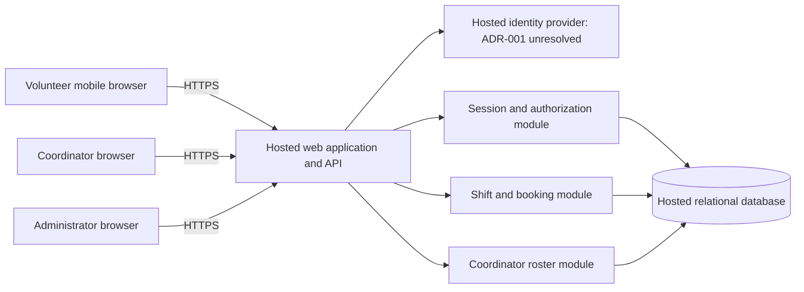

# ARCH-001 — Riverside volunteer shift pilot

## 1. Scope, evidence, and status

This architecture supports the six active, current-release requirements in
[PRD-001](../prd/PRD-001.md), version 1. It defines a mobile web application for
about 120 volunteers and one coordinator, initially serving Tuesday and Thursday
shifts. Payroll, donations, native apps, waitlists, cancellation, notifications,
and a shift-management UI are outside this design's authorized scope.

The supplied workspace contains the PRD and [POL-001](../policy/POL-001.md), but
no application, architecture template, test commands, or additional repository
instructions. BRN-001 is referenced by the PRD but was not supplied; no claims
from that document are assumed. The approved PRD remains unchanged, including
its generated epic map.

This is a proposed technical baseline, not evidence of stakeholder approval or
working software. The identity-provider choice remains unresolved in
[ADR-001](../adr/ADR-001.md). It blocks FR-001's provider-specific epic scope,
not independent planning for booking and roster behavior.

Policy resolution: POL-001 SET-01 sets `interview.max_calls=5`; the user's
instruction to proceed without questions takes precedence, so no interview was
conducted. POL-001 explicitly mandates no identity platform. The PRD's historical
change-log defaults do not supersede the current policy. No platform mandate or
additional quality thresholds have been inferred.

## 2. Components and deployment boundary

Use one application with separate internal modules and a hosted relational
database. One transactional store keeps bookings, authorization, and revocation
consistent; the pilot does not require microservices or a message broker.
Provider and hosting vendor selections are not implied by this topology.

The browser is untrusted. It holds only an opaque session cookie, renders
server-filtered responses, and never connects directly to the database. The
application validates identity at its identity adapter, then owns all local
sessions, role assignments, shift availability, booking writes, and roster
reads. Identity-provider tokens are not accepted as booking or roster API
credentials.

All production components are hosted: web/API compute, identity service,
database, secret storage, operational logs, and backups. Food-bank devices are
clients only; no on-site server or local production database is required
(NFR-003 applies to the whole product). Use separate non-production and
production data and credentials, TLS, a database inaccessible to browsers, and
least-privilege runtime credentials. Final vendor, region, cost, retention,
backup frequency, and recovery targets are deployment decisions to resolve
before launch, not unstated PRD acceptance criteria.

## 3. Data and authority

| Record | Minimum fields and constraints | Authority |
|---|---|---|
| Account | Internal ID, unique provider issuer/subject mapping, display name, active flag, session epoch | Application; identity mapping established only after verified sign-in |
| Role assignment | Account ID, role: volunteer, coordinator, or administrator | Trusted operational provisioning; never supplied by a browser |
| Session | Hash of opaque random token, account ID, issued epoch, expiry, revoked timestamp | Session module; raw tokens never stored or logged |
| Volunteer contact | Account ID, phone number when supplied | Restricted contact access through coordinator roster service |
| Shift | ID, start/end instants, capacity, booking-enabled flag | Coordinator-supplied schedule loaded through a controlled operational process |
| Booking | ID, shift ID, volunteer ID, booked timestamp; unique (shift ID, volunteer ID) | Booking transaction |

Phone numbers are kept separate from general account and booking projections.
Only requests with a current coordinator role may receive them, including a
volunteer's own phone number. An administrator role alone grants no phone
access. Trusted infrastructure operators are a separate privileged boundary:
restrict and audit database access and backup access; do not provide a general
application data export that bypasses this rule.

Store times as instants; use a configured food-bank time zone to interpret a
roster day. The actual zone is a required deployment value, not guessed from the
name Riverside. Seed schedule, capacity, volunteer names/contact data, and role
assignments through controlled imports for the pilot. These are operational
prerequisites, not new end-user features. Phone numbers are not required for
identity matching; the provider decision must establish its own account
onboarding and recovery method.

## 4. Interface and behavior contracts

### Identity and sessions — FR-001, NFR-001

The identity adapter exposes `beginSignIn`, `completeSignIn`, and a verified
principal containing stable issuer and subject. The provider must define
credential verification, account enrollment, recovery, and any provider-side
logout behavior through ADR-001. Map the verified principal to an active local
account before issuing a local session. Fail closed on invalid identity,
unmapped identity, expired sessions, or unavailable authorization storage.

Use HTTPS-only, HttpOnly session cookies with an appropriate SameSite policy,
session rotation at sign-in, and CSRF protection for state changes. Do not put
tokens in browser local storage. Every protected request reads the session,
current account status/epoch, and roles from the authoritative database without
an authorization cache or lagging replica.

`POST /admin/volunteers/{id}/revoke-sessions` requires the administrator role.
An atomic transaction increments the account's session epoch and records the
revocation event. All previously issued sessions then fail the epoch check,
including sessions on other devices and application instances. Return success
only after commit. A failed revocation returns a failure, never false success.

This makes the first authorization check after the revocation commit reject
old sessions, stronger than the PRD's five-minute ceiling. Recheck authorization
inside booking transactions, and bound protected request execution to less
than five minutes so previously admitted requests cannot run indefinitely.
Do not silently exchange an old session or provider refresh token for a new
local session after revocation. A deliberate new sign-in is allowed; disabling
an account is distinct from revoking existing sessions. The identity adapter
must preserve this distinction when its provider is selected.

### Shift booking — FR-002

`GET /shifts?from=...&to=...` requires a signed-in volunteer and returns bounded
shift listings with times and remaining capacity, never other volunteers'
contact details. `POST /shifts/{id}/bookings` derives the volunteer ID from the
session; it must not trust a caller-supplied volunteer ID.

Proposed interpretation of **open**: booking is enabled, the shift has not
started, and capacity remains. This interpretation supplies an explicit
boundary for epic acceptance criteria; additional eligibility rules or cutoff
windows would require a product amendment. Invalid schedules and non-positive
capacities are rejected during import.

In a database transaction, validate current authorization, lock the shift,
return an existing booking on a retry, check whether the shift is open, and
insert the booking if capacity remains. Enforce the unique constraint as a
second guard against duplicates. A concurrent attempt for the last place must
produce exactly one new booking; the other receives an unavailable response.
All writers, including operational tools, must follow the same locking and
capacity rules. Roll back completely on failure. After a lost response, a retry
returns the existing booking without consuming another place.

Use stable errors for unauthenticated, forbidden, not found, unavailable, and
temporarily unavailable cases. The UI can recover from a stale availability
display by refreshing after a booking conflict. Database constraints and the
transaction are authoritative, not a browser's displayed seat count.

### Daily roster — FR-003, NFR-002

`GET /coordinator/roster?date=YYYY-MM-DD` requires the coordinator role on every
request. Resolve the date to a half-open interval in the configured time zone,
including daylight-saving transitions. Return shifts starting that day and
their booked volunteers' display names and phone numbers, if available, with
an explicit empty state for shifts with no bookings.

Read committed bookings from the primary database on page load, manual
refresh, and a proposed 30-second poll while the page is visible. Display the
last successful update and a visible stale/error state on refresh failure.
This supplies the PRD summary's live-roster intent without inventing a hard
latency requirement. Realtime streaming is not required for this pilot.

Authorization and response projection happen on the server. Deny roster
requests from volunteers and administrators without a coordinator role;
never fetch phone fields into a volunteer response and merely hide them in the
UI. Send contact-bearing responses with `Cache-Control: no-store`, clear
rendered contact data after session failure/logout, and exclude phones,
session tokens, and identity credentials from logs, analytics, errors, URLs,
and shared caches.

## 5. Cross-cutting requirements and failure handling

| Requirement | Scope | Design responsibility | Required future evidence |
|---|---|---|---|
| NFR-001 | Every protected route and all application instances; gates FR-001, FR-002, FR-003 | Authoritative local sessions, atomic epoch revocation, no stale authorization cache, bounded in-flight requests | Multi-device and multi-instance revocation test; old sessions rejected within 300 seconds; storage failure denies access; provider cannot silently resurrect sessions |
| NFR-002 | Roster, all other responses, logs, caches, exports, and operational access | Coordinator role checks and minimal response projections; restricted contact storage | Role matrix and direct API tests, response/log inspection; administrator alone and volunteer cannot see any phone numbers |
| NFR-003 | Entire product, including supporting infrastructure | Hosted deployment topology and private persistent storage | Deployment inventory/configuration shows no on-site dependency; hosted restore and smoke-test evidence |

Database or authorization failures prevent booking and privileged reads.
Identity-provider outages prevent new sign-ins; existing valid local sessions
may continue while the application and session store remain available. Do not
queue speculative bookings offline or show a failed write as confirmed.

Monitor request failures, booking conflicts, and authorization/revocation
failures without collecting contact data. Record administrative revocation
actor, target internal account ID, result, and timestamp. Configure alerts and
a restore procedure before the pilot. Deployment migrations must preserve
unique bookings and epoch checks; rollback must not restore invalidated
sessions to validity. After restoring an old database backup, invalidate all
restored sessions before exposing the service.

## 6. Requirement-by-requirement epic readiness

**Ready** means sufficiently bounded for epic decomposition under this proposed
baseline. It does not mean implemented, approved, or independently deployable.
**Blocked** means a material unresolved decision prevents bounded epic scope.
Implementation dependencies do not automatically block independent planning.

| PRD item | Epic readiness | Architecture coverage and reason | Dependency / next evidence |
|---|---|---|---|
| FR-001 | BLOCKED | Identity boundary and local session lifecycle are defined, but provider, enrollment, and recovery remain undecided | Resolve ADR-001 with provider evidence; then scope provider-specific sign-in work |
| FR-002 | READY | Signed-in principal contract, explicit open-shift rule, capacity transaction, and duplicate/retry behavior are defined | Carry NFR-001/002/003; use a test principal for isolated work; production integration depends on FR-001 |
| FR-003 | READY | Coordinator-only daily query, date boundary, freshness behavior, and failure states are defined | Carry NFR-001/002/003; booking data from FR-002 and production identity from FR-001 |
| NFR-001 | READY | Provider-independent session authority and a measurable 300-second revocation limit are defined | Attach to all protected workflows; final provider conformance test depends on ADR-001/FR-001 |
| NFR-002 | READY | Coordinator-only phone projection and enforcement boundaries are defined | Attach to roster and every other data surface; verify roles, logs, and caches |
| NFR-003 | READY | Whole-product hosted boundary is explicit | Attach to every epic; hosting configuration and recovery evidence required before launch |

Suggested decomposition inputs, not created epics:

1. Hosted application foundation and local authorization/revocation, carrying
   NFR-001/002/003. Define the adapter contract while provider integration is blocked.
2. Open-shift booking, covering FR-002 and all three NFRs.
3. Daily coordinator roster, covering FR-003 and all three NFRs.
4. Volunteer sign-in integration, covering FR-001 and all three NFRs, only after
   ADR-001 is resolved. It is a release dependency for the other user workflows.

No product-wide block is imposed just because FR-001 is blocked. Conversely,
the pilot cannot launch without FR-001. FR-003 retains its PRD **should**
priority; this architecture does not change release priorities.

## 7. Open decisions, assumptions, and rollout

| Item | Impact | Resolution point |
|---|---|---|
| ADR-001 identity provider and enrollment/recovery | Blocks FR-001 epic readiness and production authentication integration | Record a concrete provider decision and evidence before FR-001 decomposition |
| Open-shift definition, 30-second roster refresh | Explicit architecture assumptions used for bounded epic planning | Carry into epic acceptance criteria; amend affected scope if product review changes them |
| Account/role provisioning and schedule/contact import | Operational bootstrap required, with no new management UI assumed | Assign an operator and validate pilot inputs before integration rollout |
| Actual time zone, hosting vendor/region, retention, recovery objectives | Required configuration and operational decisions | Resolve in deployment work before pilot launch |
| PRD ASM-01 smartphone access | PRD assumption remains open; no validation evidence supplied | Product owner records volunteer-meeting outcome before rollout |

Start with the Tuesday/Thursday schedule and provisioned pilot accounts. Verify
sign-in, revocation, last-seat concurrency, phone privacy, and roster updates
in the hosted environment before broadening to every shift. Keep SM-01's
measurement in the coordinator's shift log: 83% baseline and 95% target by the
end of the pilot. A booking count is not evidence that a shift actually starts
fully staffed, so no replacement analytics metric is introduced.

## 8. Verification approach

This change adds specifications only; it changes no executable behavior. No
repository test suite or quality-gate command was supplied, so runtime tests
are NOT_RUN. Future implementation must establish failing tests first for
authorization, booking races, revocation, and privacy, then pass them on the
actual candidate. Proposed tests above are acceptance obligations, not passes.

Document checks and the requirement-to-evidence map are recorded in
[VER-001](../verification/VER-001.md). Unresolved provider selection is explicitly
BLOCKED there; document completeness must not be confused with feature completion.

## Change log

| Version | Date | Author | Change |
|---|---|---|---|
| 1 | 2026-09-28 | Codex | Proposed architecture, cross-cutting requirement coverage, and item-level epic readiness from PRD-001 v1 and POL-001 v1 |
