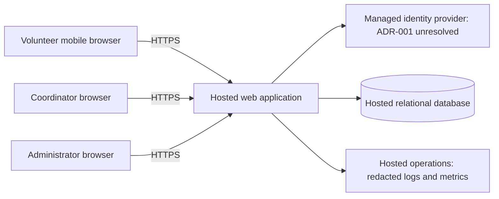

# ARCH-001 — PRD-001 pilot architecture and epic readiness

## Scope and disposition

This design covers all three functional and three non-functional requirements in
[PRD-001 v1](../prd/PRD-001.md). It supports mobile browser booking for about 120
volunteers and a coordinator's daily roster, initially for Tuesday and Thursday
shifts. Payroll, donations, native apps, and additional volunteer workflows are
outside scope.

**FR-002 and FR-003 are ready for epic definition against the contracts below.
FR-001 is blocked on the identity-provider decision in
[ADR-001](../adr/ADR-001.md).** Ready means sufficient architectural direction
to write epics; it does not mean approved for release, implemented, or tested.
This architecture is a draft, and no human approval is asserted. The identity
blocker is local to sign-in planning, but prevents integrated pilot release.

The repository contains only the PRD and vendored policy: no application,
deployment configuration, architecture baseline, or test runner. BRN-001 is
referenced by the PRD but is not present; this document relies on the approved
PRD rather than reconstructing the brainstorm.

## Policy and decision boundaries

[POL-001 v1](../policy/POL-001.md) applies organization-wide and explicitly
mandates no identity platform. Its `interview.max_calls=5` is an interaction
default; this task uses zero interviews as instructed by the user. The PRD's
historical change-log entry mentioning the earlier default of eight calls is
not the current policy resolution. Neither document supplies a hosting vendor,
an identity vendor, or a requirement for separate services.

The decisions below are proposed technical design choices within PRD scope.
Identity-provider selection remains an explicit decision gate; no vendor is
invented or treated as mandated. Hosting vendor and implementation language can
be selected during foundation epic planning against the capabilities specified
here. Selecting a provider does not require changing the approved PRD.

## System shape and trust boundaries

Use a single hosted web application with server-side modules and a managed
relational database. Keep booking, authorization, and roster queries in one
deployment and one transactional store. This scale does not justify a queue,
microservices, a separate analytics store, or an event bus.

The browser is untrusted. It has no database credentials and never determines
identity, role, shift availability, or booking ownership. The application alone
accesses the database over a private or tightly restricted encrypted connection.
Identity-provider tokens terminate at the application; they do not directly
authorize booking or roster API calls. The external identity subject maps to a
local user with application-controlled roles and sessions.

| Module | Responsibility | Requirement ownership |
|---|---|---|
| Identity adapter | Sign-in redirect/callback and verified external identity mapping | FR-001; ADR-001 |
| Access and sessions | Local sessions, role checks, administrator revocation | NFR-001 across every protected module |
| Shift booking | Published shifts, availability, atomic volunteer booking | FR-002 |
| Roster | Coordinator-only daily roster and contact projection | FR-003; NFR-002 |
| Hosted operations | Deployment, secrets, database, backups, health and audit metadata | NFR-003 across the entire product |

## Identity, sessions, and authorization

The proposed identity adapter uses managed OpenID Connect authentication with
authorization code flow and PKCE. Validate issuer, audience, signature, expiry,
state, and nonce server-side. Map `(issuer, subject)` to a local user; do not link
accounts by an unverified email or accept a browser-supplied user identifier.
Provider onboarding and account recovery are unresolved in ADR-001.

Issue an opaque, high-entropy local session identifier in a Secure, HttpOnly,
SameSite cookie, storing only its hash in the database. Protect state-changing
requests against CSRF. Provider tokens, if needed during authentication, remain
server-side and never appear in application URLs or logs. The application does
not expose refresh tokens to the browser.

Each user has a monotonically increasing `session_generation`. A session records
the generation at issuance, an expiry, and its user. Every protected request reads
the session, current generation, expiry, and roles from the authoritative store;
there is no positive authorization cache or lagging read replica on this path.
A store failure denies access rather than bypassing authorization.

An authenticated administrator revokes all current sessions for a volunteer by
atomically incrementing that user's generation. Acknowledge success only after
commit. Requests checked after commit reject any older session immediately,
which is stricter than the five-minute bound in NFR-001. Booking transactions
recheck generation under the same user-row lock used by revocation, so a booking
cannot commit using an invalidated session after revocation commits. Record only
actor ID, target ID, timestamp, action, and outcome in the revocation audit.

Revocation invalidates existing application sessions, not the volunteer's right
to authenticate again. A fresh, valid authentication may create a new session.
Preventing future sign-in or revoking all upstream provider sessions is not stated
in the PRD. Do not automatically exchange an invalidated application session for
a replacement. A callback can issue a session only after validating its own
authentication transaction. Bytes already delivered to a browser cannot be
recalled; avoid shared caches and persistent browser storage for protected data.

| Actor | Authorized access |
|---|---|
| Anonymous | Sign-in entry points only |
| Volunteer | Own session, open shifts, own booking result; no phone-number field or other volunteers' roster |
| Coordinator | Daily roster including volunteer phone numbers |
| Administrator | Session revocation; no phone-number access merely by being an administrator |

Roles are additive, explicitly assigned in the application. A person holding both
administrator and coordinator roles sees phone numbers only through the
coordinator permission. Role provisioning must not use public self-assignment.
The initial administrator and coordinator are bootstrapped through restricted
deployment operations. Operator access to contact data is not part of ordinary
application permissions and should not be granted by default.

## Data and application contracts

| Entity | Minimum fields and invariants |
|---|---|
| User | Internal ID, external issuer/subject (unique pair), display name, roles, session generation |
| VolunteerContact | User ID (unique), phone number; excluded from default user projections |
| Session | Hashed identifier, user ID, issued generation, expiry |
| Shift | ID, warehouse-local service date, start/end instants, positive capacity, published flag |
| Booking | ID, shift ID, volunteer ID, creation instant; unique `(shift_id, volunteer_id)` |
| RevocationAudit | Actor ID, target ID, committed timestamp and outcome; no contact data or session secret |

Store instants in UTC, with one configured warehouse timezone for calendar-day
queries and display. Do not infer the warehouse timezone from a developer's
machine. Seed or import approved volunteer and shift records through restricted
operations for the pilot; a coordinator scheduling UI is not required by PRD-001.

These are internal contracts for epic planning, not a mandated framework:

| Operation | Contract and failure behavior |
|---|---|
| Begin/complete sign-in | Identity adapter validates provider response, maps a provisioned user, then creates a local session; unmapped or invalid identities fail closed |
| `GET /shifts?date=YYYY-MM-DD` | Signed-in volunteer receives published, future shifts with available capacity and own booking state; no volunteer contact data |
| `POST /shifts/{id}/bookings` | Take volunteer ID from the session; return created booking, an existing booking on retry, unauthorized, or a conflict for unavailable/full shift |
| `GET /roster?date=YYYY-MM-DD` | Coordinator-only query returns that warehouse day's shifts and booked volunteers, with a narrow explicit contact projection; empty days return an empty list |
| `POST /users/{id}/revoke-sessions` | Administrator-only operation for a volunteer; increment generation and return success after commit; never return phone data |

Booking runs in one database transaction. Lock the acting user row and validate
the session generation, then lock the shift row, validate publication/start time,
and check for an existing booking. Return an existing booking on a retry. For a
new booking, compare committed booking count with capacity before inserting.
Every insertion path must acquire the shift lock; the uniqueness constraint
also prevents duplicate bookings. Operations that change capacity must use the
same lock and cannot reduce it below the booked count. This serializes requests
for the final place without a distributed lock or reliance on browser counts.
Display availability is advisory until the transaction commits.

The roster reads committed bookings from the same authoritative database. It
refreshes on page load, manual refresh, and every 30 seconds while visible. The
30-second interval is a proposed UX default, not a PRD latency requirement.
On failure show a stale-data indicator and last successful refresh time, rather
than silently presenting an old roster as current. Reauthorize every refresh;
clear the visible roster on an authorization failure.

NFR-002 is enforced at the server query/serialization boundary, not by hiding
fields in the UI. Only coordinator-authorized handlers query phone numbers;
volunteer and administrator response schemas exclude them. Phone values must
not enter logs, error messages, telemetry, identity claims, cache keys, or
client-side persistent storage. Protected responses use `Cache-Control: no-store`.
Database backups and contact storage use hosted encryption and restricted access.

## Assumptions and open work

| Item | Proposed treatment | Effect on epic planning |
|---|---|---|
| Identity provider, enrollment, recovery, and volunteer access to the chosen credential channel | Open ADR-001; product owner and implementer must validate the choice | Blocks FR-001 epic readiness; integrated release dependency for booking and roster |
| Meaning of an open shift | Published, not started, and below a configured capacity; one booking per volunteer per shift | Explicit planning assumption for FR-002; confirm during epic refinement before implementing affected behavior |
| Shift source and capacity | Restricted pilot import; capacity per shift supplied by coordinator | Planning can proceed; actual pilot data and timezone are rollout prerequisites |
| Coordinator contact records | Import only the phone data needed for the roster; blank phone values remain blank | Validate source, correction process, and retention with the owner during refinement; no new contact-management UI implied |
| “Live” roster | Same-store committed reads and visible-page polling every 30 seconds | Proposed default for FR-003; confirm whether push updates or a different latency target is needed before implementation |
| Role holders | Administrator and coordinator are separate permissions, even if one person holds both | Identify initial people and verify grants before pilot |
| Smartphone access | Preserve PRD ASM-01 as open | Pilot validation remains necessary; no claim of universal device access |

No assumptions add cancellation, waitlists, notifications, scheduling management,
or account self-registration to scope. If refinement changes a listed assumption,
reassess the affected contract and readiness row before implementation.

## Epic readiness and traceability

NFRs are carried into the epics they constrain; they are not detached optional
follow-ups. “Ready” below is a planning assessment with explicit assumptions,
not an approval of this draft. These are suggested work packages, not created
epics or changes to the PRD's generated epic map.

| Requirement | Architecture coverage | Epic-definition disposition | Evidence to require from implementation |
|---|---|---|---|
| FR-001 | Identity adapter, local user mapping and sessions | **BLOCKED**: ADR-001 provider/onboarding decision open | Supported mobile browser sign-in, invalid callback rejection, provisioned-user mapping, recovery and failed sign-in behavior |
| FR-002 | Shift booking module, transactional capacity and uniqueness | **READY**: booking epic can use the local-session contract; production integration depends on FR-001 | Signed-in booking; anonymous denial; exactly one winner for the last place; duplicate/retry stability; unpublished/past/full shift denial |
| FR-003 | Coordinator role, daily roster query and refresh | **READY**: roster epic can use the same access contract; production integration depends on FR-001 | Correct warehouse day including timezone boundary; committed booking appears on refresh; non-coordinator denial; stale-state display |
| NFR-001 | Access module and authoritative generation check on every protected operation | **READY** as mandatory acceptance criteria on identity/access, booking, and roster work | Administrator revokes multiple sessions; each protected endpoint rejects old sessions within 300 seconds; non-admin cannot revoke; outage fails closed; revocation/booking race is serialized |
| NFR-002 | Separate contact projection and coordinator authorization; redacted operations | **READY** as mandatory acceptance criteria on roster, identity responses, booking, and operations | Coordinator sees phone; volunteer and admin-only role cannot; direct API responses, errors and logs do not leak it |
| NFR-003 | Hosted application, identity, database, secrets, backups, logs | **READY** as a product-wide constraint on every work package | Deployed pilot operates without on-site infrastructure; deployment topology and restore exercise demonstrate hosted operation |

Suggested sequence:

1. **Hosted foundation and access contract** — provisioning, schema, secrets,
   migrations, role/session enforcement and revocation. Carry NFR-001/002/003.
   Provider-independent work may proceed while ADR-001 is resolved.
2. **Volunteer sign-in** — define after ADR-001 closes; integrate the selected
   provider and validated enrollment path with local access control.
3. **Volunteer booking** — define now against the access contract, including
   authentication, revocation, and concurrency criteria. It can be developed
   using test identities but cannot ship on those substitutes.
4. **Coordinator roster** — define now against the data/access contracts and
   explicit refresh assumption; include privacy and revocation criteria.

Identity planning need not hold up booking and roster decomposition. Neither
feature is releasable until real sign-in and all applicable NFR checks pass.
FR-003 remains a `should` requirement in the PRD; its security constraints are
`must` requirements whenever roster functionality is included.

## Deployment and verification approach

Use hosted environments with separate pilot/test secrets and data. Run schema
migrations as a restricted release step. Keep secrets in the hosting platform's
secret store, database access limited to the application and necessary migration
operations, and encrypted backups with a restore procedure. Select a host with
HTTPS, these controls, and usable application health/error monitoring. Vendor,
cost approval, restore objectives, and retention settings remain foundation
epic work; no uptime or cost target is invented here.

Observe authentication failures, revocation results and latency, booking
conflicts, roster read failures, and service health without phone numbers or
credentials. A revocation failure must be visible to the administrator and must
not report success. Monitor the authorization path rather than merely the
administrator button's response time.

Implementation verification should establish failing behavioral tests before
implementing each contract: unit checks for authorization/projections,
integration checks against a real transactional database for booking races and
revocation, and browser checks for sign-in, mobile booking, and coordinator
refresh. Include all user sessions, not only the browser used to revoke access.
Provider evaluation in ADR-001 needs integration evidence, not only a mock.

Before pilot release, resolve ADR-001, confirm the planning assumptions, provision
roles/shift data/timezone, exercise backup restoration, and pass end-to-end checks
for all six requirements on the actual deployment. Expand from Tuesday/Thursday
only after reviewing pilot results. SM-01 remains measured by the coordinator's
shift log with the PRD's 95% target; no analytics subsystem is added.

This documentation task does not establish runtime compliance. See
[the verification record](ARCH-001-verification.md) for checks against the saved
documents and explicit NOT_RUN entries.

## Change log

| Version | Date | Author | Change |
|---|---|---|---|
| 1 | 2026-09-28 | Codex | Draft architecture, all-requirement mapping, scoped identity blocker, and epic planning disposition |
