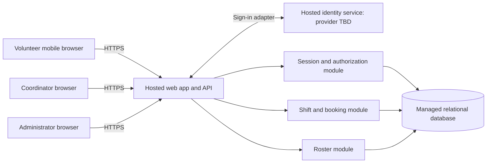

# ARC-001 — Volunteer shift sign-up architecture

## 1. Scope and evidence

This design supports [PRD-001](../prd/PRD-001.md) v1: mobile browser access for about 120 volunteers, booking warehouse shifts, and a daily coordinator roster. Payroll and donations remain outside scope. There is no application code, existing architecture, repository instruction file, test configuration, or architecture template in the supplied workspace. BRN-001 is referenced by the PRD but is unavailable; no additional requirements are inferred from it.

[POL-001](../policy/POL-001.md) v1 mandates no identity platform. Its interview.max_calls=5 supersedes the historical default of 8 recorded in the PRD change log; the user requested no questions, so zero interviews were conducted. No organization decision, provider contract, or human approval is assumed.

Work plan: define boundaries and requirement allocation; record the unresolved identity decision; check traceability and classify each requirement for epic decomposition. This is a documentation change. Runtime acceptance checks below are specifications for implementation, not executed tests.

## 2. Architecture decisions

Use one hosted web application with a server-side API and a managed relational database. Keep identity, sessions, booking, and roster as modules in that application. This is proportionate to the pilot and keeps booking transactions and access checks in one place. A hosted identity service authenticates users through an adapter; its provider is unresolved in [ADR-001](../adr/ADR-001.md).

Browsers are untrusted and have no database credentials or direct data access. All protected requests pass through session and role checks. Provider tokens remain server-side; an opaque application session cookie is the browser credential. Application roles are assigned in the database, never accepted from browser input. Administrator and coordinator are separate permissions: administrator status alone grants no phone access.

| Decision | Requirement allocation | Rationale and consequence |
|---|---|---|
| D-01: Hosted app, identity service, and managed database; no on-site component | NFR-003, whole product including FR-001–FR-003 and NFR-001–NFR-002 | All runtime and persistent services are hosted. Vendor, region, budget, and account provisioning are deployment choices still to record. |
| D-02: Authoritative server-side sessions checked on every protected request | NFR-001; supports FR-001–FR-003 | Revocation is controlled locally rather than waiting for a provider token to expire. Adds one authoritative database check per request. |
| D-03: Separate contact storage and coordinator-only response projection | NFR-002; constrains FR-001–FR-003 | Phone numbers cannot leak through generic profile or booking responses. |
| D-04: Transactional booking and database uniqueness | FR-002 | Concurrent bookings cannot exceed capacity; retries cannot create duplicate bookings. |
| D-05: Date-scoped roster queries over committed bookings | FR-003 | Roster and booking share one source of truth. No separate reporting store is needed. |
| D-06: Hosted identity adapter, concrete provider pending ADR-001 | FR-001; integration dependency for FR-002–FR-003 and NFR-001 | Internal user IDs and authorization remain independent of the provider. |

## 3. Data and interface contracts

Logical records (names describe contracts, not a prescribed framework):

| Record | Minimum fields and invariants |
|---|---|
| User | Internal ID, display name, active flag, session generation; explicit volunteer/coordinator/administrator permissions. |
| IdentityLink | Provider issuer and subject uniquely map to one User. Never link accounts using an unverified client-supplied email. |
| Session | Hash of a high-entropy opaque token, user ID, issued generation, expiry. Raw session secrets are never logged. |
| VolunteerContact | User ID and optional phone number; accessed only through the coordinator-authorized path. |
| Shift | ID, start/end instants, capacity, open/closed state. Capacity is nonnegative. The site timezone is explicit configuration. |
| Booking | ID, shift ID, volunteer ID, creation time; unique (shift ID, volunteer ID). Foreign keys preserve referential integrity. |

Interface sketch: `GET /shifts` returns open shift details and availability without volunteer contacts; `POST /shifts/{id}/bookings` books for the authenticated volunteer, ignoring any client-selected volunteer identity; `GET /roster?date=YYYY-MM-DD` requires coordinator permission; `POST /admin/users/{id}/revoke-sessions` requires administrator permission. Sign-in start/callback routes depend on ADR-001. All protected routes validate session state; cookie-authenticated writes also require CSRF protection. Use Secure, HttpOnly cookies with a SameSite policy compatible with the selected sign-in flow.

### Sign-in and revocation — FR-001, NFR-001

The adapter returns a verified issuer/subject identity to the server; the server resolves an authorized User and creates a local session using that user's current generation. Unknown identities receive no application access until enrollment rules are settled in ADR-001. Provider protocol validation is an explicit part of the eventual identity integration tests.

Every protected request reads the Session and current User generation from the primary database, checks expiry and active status, and rejects a generation mismatch. Do not use a positive authorization cache or a lagging replica. Failure to reach the session authority fails closed for protected requests.

The administrator revocation command atomically increments the user's generation and acknowledges success only after commit. Every session issued against an older generation then fails, on every application instance, without waiting five minutes. Serialize session issuance with generation updates; recheck session generation at the booking transaction and immediately before returning protected data. Bound request lifetimes to less than five minutes and reauthorize any future long-lived connection within that bound. The current design uses ordinary HTTP requests.

Revocation invalidates existing application sessions; it is not an account ban. A later successful sign-in may create a new session. The interface must not silently turn a rejected session into a replacement through automatic provider refresh. Whether an administrator must also prevent reauthentication or terminate provider SSO is a separate product decision, not a claim made by this design.

### Booking — FR-002

Within one database transaction, validate the session, lock the Shift row, check for an existing booking, then verify that the shift is open and has capacity before inserting. All booking writers must use this same serialization boundary. Return the existing booking for a retry by the same volunteer; return a conflict for a closed or full shift. Roll back on failure and report a booking as successful only after commit. A displayed available place is provisional until the write succeeds.

For epic planning, assume an open shift is explicitly enabled, has not started, and has unfilled capacity. Provision shift times, capacities, and pilot dates through a controlled operator process; a shift-management UI is not added to scope. Confirm these operational rules before story acceptance. Cancellation, waitlists, recurring-shift editing, and overlap rules are unspecified and are not introduced here.

### Roster and phone privacy — FR-003, NFR-002

The coordinator selects a local calendar date. Convert that date using the configured food-bank timezone and select shifts whose start falls within it, including correct daylight-saving boundaries. Read committed bookings from the primary database and include volunteer display names. The coordinator projection may include phone numbers; missing numbers must not prevent display or booking.

Propose refresh on page load, after a successful write in that browser, and every 30 seconds while the roster is visible. Show last successful refresh and an error/stale state when refresh fails. The PRD's word “live” has no numeric freshness criterion; 30 seconds is a design assumption to carry into epic acceptance, not an approved NFR.

Enforce phone restrictions on the server before query and serialization. Volunteer and administrator-only paths must omit phone fields entirely, including the volunteer's own phone under the literal wording of NFR-002. Keep contacts out of identity claims, public assets, logs, telemetry, errors, and generic profile payloads. Protected responses use `Cache-Control: no-store`; do not persist them in browser storage or service-worker caches. No shared CDN caching of protected data. A user with both coordinator and administrator permissions may see phones because of the coordinator permission.

The visibility boundary is application users. Hosted infrastructure operators' privileged data access must be controlled through restricted credentials and audited operational access; this design does not claim the hosting provider is technically unable to read stored data.

## 4. Hosting and operation — NFR-003

Deploy the web application, identity integration, database, secrets, logs, and backups on hosted services. HTTPS terminates at the hosted application boundary; database connectivity is private or explicitly restricted to the application service. Use separate pilot and development environments, managed secrets, encrypted database storage/backups, and a least-privilege application database account. No credentials ship to the browser.

The hosting epic must produce a service inventory showing the owner and hosted location of every runtime dependency, database migrations, backup/restore instructions with a restore exercise, and a deployment/rollback procedure. Vendor pricing, region, retention periods, recovery objectives, and availability targets are not specified by PRD-001; document selections during delivery without presenting them as existing acceptance criteria. Never restore stale sessions as valid: a database restoration must invalidate restored sessions before reopening access.

Record authentication failures, denied access, booking conflicts, revocation outcomes, and roster-refresh errors with opaque identifiers. Do not record phones, provider tokens, or session tokens. Database/session outages reject protected operations; booking errors cannot leave a partially committed reservation. Identity-service outages prevent new sign-ins while existing valid local sessions can continue subject to local authorization.

Pilot configuration initially exposes only the Tuesday/Thursday shifts. Expanding to all shifts changes configuration/data rather than architecture. SM-01 remains measured through the coordinator's shift log; booking counts alone cannot prove staffing at shift start. ASM-01 remains open and is a rollout usability risk, not a reason to invent additional channels.

## 5. Requirement readiness for epics

READY means architecture is sufficient to decompose the requirement into an epic, with explicit contracts and checks. It does not mean implemented, tested, approved, or independently releasable. BLOCKED means a material design decision remains unresolved. Draft document status does not invent a mandatory approval gate absent from the repository policy.

| PRD item | Epic readiness | Architecture evidence | Remaining dependency or condition |
|---|---|---|---|
| FR-001: volunteer sign-in | BLOCKED | D-06; ADR-001 | Choose the concrete identity provider and validate enrollment, sign-in, and recovery flow; the PRD explicitly requests an ADR. |
| FR-002: book an open shift | READY | D-02, D-04; booking transaction and interface contract | Delivery depends on sign-in and hosted storage. Carry the stated open-shift/provisioning assumptions into epic acceptance. |
| FR-003: coordinator daily roster | READY | D-03, D-05; roster query and coordinator permission | Delivery depends on bookings and sign-in. Confirm site timezone and refresh acceptance during story refinement. Preserve its should priority. |
| NFR-001: revoke sessions within 5 minutes | READY | D-02; authoritative generation check, fail-closed behavior | Can decompose the local session and administrator work now. Full end-to-end testing depends on identity integration; revocation must cover every protected route. |
| NFR-002: coordinator-only phones | READY | D-03; contact separation and role-based response projection | Applies to every epic returning user data, including sign-in responses and administrator operations. |
| NFR-003: hosted services | READY | D-01; deployment boundary and inventory | Product-wide constraint inherited by every epic, including identity. Concrete hosting selections precede deployment. |

No requirement is dropped because it is non-functional. NFR-001 has its own delivery work; NFR-002 and NFR-003 are cross-cutting acceptance constraints. The unresolved provider does not block writing booking, roster, or infrastructure epics against the specified contracts, but it blocks a complete pilot release.

Suggested decomposition (planning candidates only; no epic documents created):

| Candidate | Scope and required trace links | Sequencing |
|---|---|---|
| Hosted foundation | NFR-003; database, deployment, secrets, restoration | Can start first; all later candidates inherit NFR-003. |
| Local sessions and revocation | NFR-001, NFR-002, NFR-003; administrator command and authorization | Build against identity adapter contract; verify with actual provider before release. |
| Volunteer identity integration | FR-001, NFR-001, NFR-002, NFR-003 | Blocked by ADR-001. |
| Shift booking | FR-002, NFR-001, NFR-002, NFR-003 | Depends on local sessions and storage; final integration needs sign-in. |
| Coordinator roster | FR-003, NFR-001, NFR-002, NFR-003 | Depends on booking data and coordinator authorization. |

The PRD's generated epic map remains unchanged until actual epics exist and the appropriate generator is available.

## 6. Acceptance evidence required during implementation

| Item | Meaningful verification to establish before implementation | Current runtime result |
|---|---|---|
| FR-001 | Successful permitted sign-in, rejected unknown/invalid identity, failed callback validation, logout and recovery on a mobile browser using the selected provider. | BLOCKED — ADR-001 unresolved; no application. |
| FR-002 | Two concurrent requests for the last place yield exactly one new booking; retry creates no duplicate; full/closed shifts and invalid sessions cannot book. | NOT_RUN — no application. |
| FR-003 | Coordinator sees committed bookings on the correct local date, empty days and date boundaries work, stale/failed refresh is visible; other roles are denied. | NOT_RUN — no application. |
| NFR-001 | Create multiple sessions on separate instances; revoke and replay each against every protected route immediately and at 5 minutes; test expiry, outage, issuance/revocation races, and write-time authorization. No revoked session succeeds beyond the bound. | NOT_RUN — no application. |
| NFR-002 | Anonymous, volunteer, and administrator-only requests never return phones, including direct endpoints and errors; coordinator access works; inspect logs and cache/storage behavior. | NOT_RUN — no application. |
| NFR-003 | Inspect deployed service inventory and configuration: every runtime dependency is hosted; verify deployment and restore procedure, with restored sessions invalidated. | NOT_RUN — no deployment. |

Use failing behavior tests before implementing these behaviors. No TDD policy or required gate commands were supplied in this workspace, and there is no executable target here on which to establish a meaningful failing runtime test. Documentation checks and source fingerprints are recorded in [verification](ARC-001-verification.md).

## 7. Assumptions and outstanding decisions

| ID | Assumption or decision | Impact and disposition |
|---|---|---|
| A-01 | Hosted identity provider, enrollment identifier, and recovery method are unsettled. | Material blocker for FR-001; ADR-001 records resolution evidence. No provider is presumed purchased or approved. |
| A-02 | Shift inventory/capacity and account/role provisioning use a controlled operator process for the pilot. | Needed for usable booking and coordinator access. Confirm an operator and document the process before release; add UI scope only through product refinement. |
| A-03 | Open shifts exclude started/full/closed shifts; site timezone is configured; roster refresh is proposed at 30 seconds. | Explicit working assumptions for FR-002/FR-003 epics. Validate before finalizing affected story acceptance. Do not infer the food bank timezone from the development environment. |
| A-04 | “Revoke sessions” permits later fresh authentication; phone visibility refers to application roles. | If broader account suspension, provider-wide logout, or infrastructure-blind encryption is intended, revisit D-02/D-03 and affected readiness. |
| A-05 | Provider and hosting selection have no established budget or operational owner in the supplied documents. | Deployment planning must name account owners and establish cost/region fit. This does not block provider-independent epic decomposition. |

## Change Log

| Version | Date | Author | Change |
|---|---|---|---|
| 1 | 2026-09-28 | Codex | Defined hosted architecture, requirement allocation, identity decision boundary, epic readiness, and verification plan from PRD-001 v1 and POL-001 v1. |
