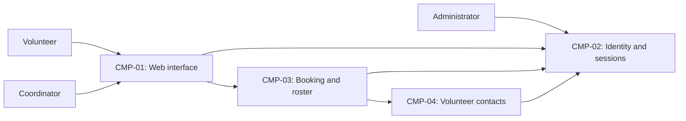

# ARCH-001 — Volunteer shift sign-up for the Riverside Food Bank architecture

## 1. Context and scope

This draft examines PRD-001 version 1, status approved, owned by Priya Nair. The product lets about
120 volunteers sign in and book warehouse shifts from mobile browsers, and lets a coordinator view
each day's roster. Payroll and donations are outside scope. No inspection scope was named and no
code or configuration was inspected; existing implementation and reuse suitability are unknown.

No existing ARCH or ADR was found in the contract document directories. Creating ARCH-001 is the
proposed outcome; the request to proceed without questions does not confirm that outcome or any
architectural decision. Consequently, outcome remains null, every decision remains open and no ADR
is written. The component diagram and data ownership below describe a candidate shape only.

## 2. Quality drivers

PRD-001#NFR-001 requires an administrator to revoke volunteer sessions with enforcement within five
minutes. This shapes session authority and every protected operation using those volunteer sessions.
PRD-001#NFR-002 restricts phone-number visibility to the coordinator, shaping contact ownership,
authorization and roster disclosure. PRD-001#NFR-003 requires the whole product to use hosted services
because no on-site server is available.

The PRD operating context is internal; the Pilot release label does not change it. Its required
quality floor is constraint, security and privacy. All three categories have NFR coverage; no
additional category is imposed by policy. POL-001#SET-01 sets the interview budget to five calls;
the request requires zero questions. There is no mandated platform.

## 3. Components

All boundaries, ownership assignments and arrows below are proposed pending ARCH-001#DEC-03 through
ARCH-001#DEC-07. Arrows represent logical interactions, not accepted protocols or deployment units.



```yaml items
components:
  - id: CMP-01
    status: active
    name: "Volunteer and coordinator web interface"
    responsibility: "Proposed mobile web interface for sign-in, booking and daily rosters; delegates identity, authorization and durable records to the responsible components."
    owns_data: []
    interacts_with:
      - "CMP-02"
      - "CMP-03"
    deployment: "Open: see DEC-08"
    upstream:
      - {id: PRD-001, item: NFR-001, relation: informed_by, version: 1, hash: null}
      - {id: PRD-001, item: NFR-002, relation: informed_by, version: 1, hash: null}
      - {id: PRD-001, item: NFR-003, relation: informed_by, version: 1, hash: null}
  - id: CMP-02
    status: active
    name: "Identity and session capability"
    responsibility: "Proposed authentication and session lifecycle capability, including administrative revocation; does not own bookings or volunteer phone numbers. Provider and revocation design remain open."
    owns_data:
      - "Proposed ownership: credentials or provider identity references and session state"
    interacts_with:
      - "CMP-01"
      - "CMP-03"
      - "CMP-04"
    deployment: "Open: see DEC-08"
    upstream:
      - {id: PRD-001, item: NFR-001, relation: informed_by, version: 1, hash: null}
      - {id: PRD-001, item: NFR-003, relation: informed_by, version: 1, hash: null}
  - id: CMP-03
    status: active
    name: "Booking and roster application"
    responsibility: "Proposed authority for shift availability, bookings and daily roster reads; applies shared authorization rules and delegates identity and contact records. Logical boundary and consistency model remain open."
    owns_data:
      - "Proposed ownership: warehouse shifts and bookings"
    interacts_with:
      - "CMP-01"
      - "CMP-02"
      - "CMP-04"
    deployment: "Open: see DEC-08"
    upstream:
      - {id: PRD-001, item: NFR-001, relation: informed_by, version: 1, hash: null}
      - {id: PRD-001, item: NFR-002, relation: informed_by, version: 1, hash: null}
      - {id: PRD-001, item: NFR-003, relation: informed_by, version: 1, hash: null}
  - id: CMP-04
    status: active
    name: "Volunteer contact capability"
    responsibility: "Proposed authority for volunteer contact records and controlled phone-number disclosure; does not own credentials or bookings. Ownership and access enforcement remain open."
    owns_data:
      - "Proposed ownership: volunteer contact records and identity associations"
    interacts_with:
      - "CMP-02"
      - "CMP-03"
    deployment: "Open: see DEC-08"
    upstream:
      - {id: PRD-001, item: NFR-002, relation: informed_by, version: 1, hash: null}
      - {id: PRD-001, item: NFR-003, relation: informed_by, version: 1, hash: null}
```

## 4. Architectural questions

```yaml items
decisions:
  - id: DEC-01
    status: active
    question: "Which identity provider handles volunteer sign-in?"
    blocking: true
    state: open
    resolved_by: []
    notes: "PRD-001 section 12 requires this decision. No mandated platform or accepted ADR exists. Provider selection must support signed-in booking and the revocation requirement; selecting it alone will not settle ARCH-001#DEC-02."
    upstream:
      - {id: PRD-001, item: FR-001, relation: informed_by, version: 1, hash: null}
      - {id: PRD-001, item: FR-002, relation: informed_by, version: 1, hash: null}
      - {id: PRD-001, item: NFR-001, relation: informed_by, version: 1, hash: null}
  - id: DEC-02
    status: active
    question: "How will administrative revocation invalidate volunteer sessions within five minutes across protected operations?"
    blocking: true
    state: open
    resolved_by: []
    notes: "Shared session authority, revocation propagation and validity checks must agree between sign-in and booking. No mechanism or enforcement timing has been accepted."
    upstream:
      - {id: PRD-001, item: FR-001, relation: informed_by, version: 1, hash: null}
      - {id: PRD-001, item: FR-002, relation: informed_by, version: 1, hash: null}
      - {id: PRD-001, item: NFR-001, relation: informed_by, version: 1, hash: null}
  - id: DEC-03
    status: active
    question: "What logical component boundaries and responsibilities will sign-in, booking, roster and contact capabilities share?"
    blocking: true
    state: open
    resolved_by: []
    notes: "The components in section 3 are proposals. A single application with modules and independently operated capabilities imply different interfaces and operational responsibilities; neither is accepted. Deployment is a separate question in ARCH-001#DEC-08."
    upstream:
      - {id: PRD-001, item: FR-001, relation: informed_by, version: 1, hash: null}
      - {id: PRD-001, item: FR-002, relation: informed_by, version: 1, hash: null}
      - {id: PRD-001, item: FR-003, relation: informed_by, version: 1, hash: null}
      - {id: PRD-001, item: NFR-001, relation: informed_by, version: 1, hash: null}
      - {id: PRD-001, item: NFR-002, relation: informed_by, version: 1, hash: null}
  - id: DEC-04
    status: active
    question: "Which component will be the authoritative owner of shift availability and booking records?"
    blocking: true
    state: open
    resolved_by: []
    notes: "Booking writes and roster reads need a common source of truth and a consistent rule for committing bookings against available capacity. Exact schemas belong to feature specifications."
    upstream:
      - {id: PRD-001, item: FR-002, relation: informed_by, version: 1, hash: null}
      - {id: PRD-001, item: FR-003, relation: informed_by, version: 1, hash: null}
  - id: DEC-05
    status: active
    question: "Which component will own volunteer phone numbers and their associations with booked volunteers?"
    blocking: true
    state: open
    resolved_by: []
    notes: "Contact ownership and permitted copies must be shared by booking and roster consumers so that only the coordinator can see phone numbers. ARCH-001#CMP-04 is a proposed owner."
    upstream:
      - {id: PRD-001, item: FR-002, relation: informed_by, version: 1, hash: null}
      - {id: PRD-001, item: FR-003, relation: informed_by, version: 1, hash: null}
      - {id: PRD-001, item: NFR-002, relation: informed_by, version: 1, hash: null}
  - id: DEC-06
    status: active
    question: "What shared authorization model will enforce volunteer, coordinator and session-revocation administrator permissions?"
    blocking: true
    state: open
    resolved_by: []
    notes: "The protected booking operation, coordinator roster and administrative revocation need consistent role authority and enforcement. Hiding phone numbers in a browser alone does not meet PRD-001#NFR-002."
    upstream:
      - {id: PRD-001, item: FR-001, relation: informed_by, version: 1, hash: null}
      - {id: PRD-001, item: FR-002, relation: informed_by, version: 1, hash: null}
      - {id: PRD-001, item: FR-003, relation: informed_by, version: 1, hash: null}
      - {id: PRD-001, item: NFR-001, relation: informed_by, version: 1, hash: null}
      - {id: PRD-001, item: NFR-002, relation: informed_by, version: 1, hash: null}
  - id: DEC-07
    status: active
    question: "How will committed bookings become visible to the daily roster?"
    blocking: true
    state: open
    resolved_by: []
    notes: "A roster reading authoritative booking state and a separately maintained projection have different consistency and delivery responsibilities. No interface or propagation mechanism is accepted; no numeric freshness target is invented."
    upstream:
      - {id: PRD-001, item: FR-002, relation: informed_by, version: 1, hash: null}
      - {id: PRD-001, item: FR-003, relation: informed_by, version: 1, hash: null}
  - id: DEC-08
    status: active
    question: "Which hosted deployment topology will run the product capabilities and their durable data?"
    blocking: true
    state: open
    resolved_by: []
    notes: "PRD-001#NFR-003 requires hosted services for the whole product but selects neither a platform nor deployment units. This decision affects every functional and quality requirement, including revocation enforcement and phone-number access."
    upstream:
      - {id: PRD-001, item: FR-001, relation: informed_by, version: 1, hash: null}
      - {id: PRD-001, item: FR-002, relation: informed_by, version: 1, hash: null}
      - {id: PRD-001, item: FR-003, relation: informed_by, version: 1, hash: null}
      - {id: PRD-001, item: NFR-001, relation: informed_by, version: 1, hash: null}
      - {id: PRD-001, item: NFR-002, relation: informed_by, version: 1, hash: null}
      - {id: PRD-001, item: NFR-003, relation: informed_by, version: 1, hash: null}
```

## 5. Evidence inspected

```yaml items
evidence:
  - id: EVD-01
    status: active
    source: "PRD-001"
    kind: prd
    finding: "Version 1, status approved: defines volunteer sign-in, signed-in booking, daily coordinator rosters, five-minute session revocation, coordinator-only phone visibility and hosted services for the whole product; explicitly leaves the identity provider for an ADR. Operating context is internal."
    classification: context
  - id: EVD-02
    status: active
    source: "POL-001#SET-01"
    kind: policy
    finding: "Version 1, status approved; SET-01 active: interview.max_calls is 5, overridable by project and local layers. No override was found; this interaction setting resolves no architecture decision."
    classification: policy
```

The policy directory contained only POL-001. The local preference file was absent. No existing ARCH
or ADR was found, and no observed-practice claim is made without code inspection.

## 6. Deployment

PRD-001#NFR-003 requires hosted services. ARCH-001#DEC-08 leaves the hosting platform, deployment
units, durable storage placement and environment arrangement open. The four logical components do
not imply four independently deployed services. Whatever topology is accepted must enforce
revocation across its protected operations and restrict phone-number access at the responsible
service and data boundaries. No platform, vendor or region has been selected.

## 7. Requirement changes proposed to the PRD owner

- None.

## 8. Open questions

- [NEEDS CLARIFICATION: No inspection scope was named and no code or configuration was inspected; existing capabilities and their suitability for reuse are unknown.]
- [NEEDS CLARIFICATION: host model/session identity unavailable]
- [NEEDS CLARIFICATION: The create outcome for ARCH-001 has not been confirmed; the user requested no questions.]

## Change Log

| Version | Date | Author | Change | Items affected |
|---|---|---|---|---|
| 1 | 2026-09-28 | codex (session unknown) | Initial draft for PRD-001 v1. Policy resolution: interview.max_calls=5 (POL-001#SET-01); architecture.mandated_platforms=none (default); quality.required_categories=floor only (default) | all |
| 1 | 2026-09-28 | codex (session unknown) | Validation failed (ERR-05): host model/session identity unavailable; BEH-13 and VER-14 remain unresolved. Structure and traceability checks passed. Retained as draft with blank approvals, open decisions and null outcome; no fields required restoration. Readiness handoff withheld. Policy resolution: interview.max_calls=5 (POL-001#SET-01); architecture.mandated_platforms=none (default); quality.required_categories=floor only (default) | generated_by; validation |
