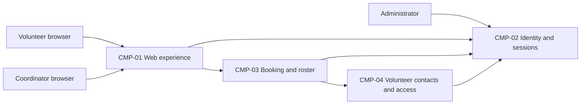

# ARCH-001 — Volunteer shift sign-up for the Riverside Food Bank architecture

## 1. Context and scope

This draft examines PRD-001 version 1, status approved, owned by Priya Nair.
The product lets approximately 120 volunteers sign in and book warehouse shifts
through mobile web pages, and gives one coordinator a daily roster. Session
revocation and protection of volunteer phone numbers are within scope. Payroll
and donations are outside scope.

No inspection scope was named and no code or configuration was inspected.
No existing ARCH or ADR was found in the contract document directories.
The proposed outcome is create because no ARCH covers this system. The request
selected PRD-001 but did not confirm an outcome; outcome remains null.

The user requested no questions. Policy mandates no platform, so all architectural
questions remain open and no ADR is written. The components and arrows below
describe a proposed logical shape, not accepted boundaries, technologies,
protocols, or deployment units. ARCH-001#DEC-03 records the boundary choice.

## 2. Quality drivers

PRD-001#NFR-001 requires an administrator to revoke a volunteer's signed-in
sessions within five minutes. The architecture must address both session issuance
and rejection of revoked sessions on signed-in operations, including booking.
Choosing an identity provider alone does not settle that enforcement mechanism
(ARCH-001#DEC-01 and ARCH-001#DEC-02).

PRD-001#NFR-002 limits phone-number visibility to the coordinator. Contact data
ownership and an authorization boundary must be agreed across the roster and
volunteer interfaces (ARCH-001#DEC-04 and ARCH-001#DEC-05). Hiding a field in a
browser alone would not meet the visibility restriction.

PRD-001#NFR-003 requires hosted services for the entire product because there is
no on-site server. It constrains every proposed component and every functional
requirement; hosting topology and provider selection remain open in
ARCH-001#DEC-08.

The operating context is internal, as declared in PRD-001; the Pilot release name
does not override it. The required quality floor is constraint, security, and
privacy. All three categories have NFRs, and policy adds no categories. The mobile
web experience and the PRD's live-roster objective inform the proposed interfaces;
no numerical freshness target or additional quality requirement is invented.

## 3. Components

Proposed logical responsibilities and data ownership are subject to
ARCH-001#DEC-03, ARCH-001#DEC-04, and ARCH-001#DEC-06. Arrows show necessary
collaboration, with interaction mechanisms still open.



```yaml items
components:
  - id: CMP-01
    status: active
    name: "Web experience"
    responsibility: "Proposed mobile web entry point for sign-in, booking, and coordinator roster views; does not own authoritative records or independently authorize phone access."
    owns_data: []
    interacts_with:
      - "CMP-02"
      - "CMP-03"
    deployment: "Open: see DEC-08"
    upstream:
      - {id: PRD-001, item: NFR-001, relation: informed_by, version: 1, hash: null}
      - {id: PRD-001, item: NFR-002, relation: informed_by, version: 1, hash: null}
      - {id: PRD-001, item: NFR-003, relation: informed_by, version: 1, hash: null}
  - id: CMP-02
    status: active
    name: "Identity and sessions"
    responsibility: "Proposed authentication and session authority, including administrator revocation; does not own bookings or volunteer phone records. Provider and revocation mechanism remain undecided."
    owns_data:
      - "Proposed ownership of authentication identities and session validity state"
    interacts_with:
      - "CMP-01"
      - "CMP-03"
      - "CMP-04"
      - "Administrator"
    deployment: "Open: see DEC-08"
    upstream:
      - {id: PRD-001, item: NFR-001, relation: informed_by, version: 1, hash: null}
      - {id: PRD-001, item: NFR-003, relation: informed_by, version: 1, hash: null}
  - id: CMP-03
    status: active
    name: "Booking and roster"
    responsibility: "Proposed authority for open shifts and bookings and source of daily roster views; does not issue sessions or own volunteer phone records. Internal module boundaries and roster update mechanism remain open."
    owns_data:
      - "Proposed ownership of shift availability and booking records"
    interacts_with:
      - "CMP-01"
      - "CMP-02"
      - "CMP-04"
    deployment: "Open: see DEC-08"
    upstream:
      - {id: PRD-001, item: NFR-001, relation: informed_by, version: 1, hash: null}
      - {id: PRD-001, item: NFR-002, relation: informed_by, version: 1, hash: null}
      - {id: PRD-001, item: NFR-003, relation: informed_by, version: 1, hash: null}
  - id: CMP-04
    status: active
    name: "Volunteer contacts and access"
    responsibility: "Proposed owner of volunteer contacts and coordinator-only phone access enforcement; does not authenticate users or own bookings. Ownership and role authority remain open."
    owns_data:
      - "Proposed ownership of volunteer contact records including phone numbers"
    interacts_with:
      - "CMP-02"
      - "CMP-03"
    deployment: "Open: see DEC-08"
    upstream:
      - {id: PRD-001, item: NFR-002, relation: informed_by, version: 1, hash: null}
      - {id: PRD-001, item: NFR-003, relation: informed_by, version: 1, hash: null}
```

## 4. Architectural questions

```yaml items
decisions:
  - id: DEC-01
    status: active
    question: "Which identity provider handles volunteer sign-in?"
    blocking: true
    state: open
    resolved_by: []
    notes: "Carries the PRD's explicit NEEDS ADR marker. No platform mandate or accepted ADR exists. Provider selection does not resolve the session revocation mechanism in ARCH-001#DEC-02."
    upstream:
      - {id: PRD-001, item: FR-001, relation: informed_by, version: 1, hash: null}
  - id: DEC-02
    status: active
    question: "How are revoked volunteer sessions rejected across signed-in operations within five minutes?"
    blocking: true
    state: open
    resolved_by: []
    notes: "Sign-in creates sessions and booking consumes them. Shared session validation versus bounded token validity have different availability and enforcement trade-offs; neither is selected. The administrator revocation control must use the same validity authority."
    upstream:
      - {id: PRD-001, item: FR-001, relation: informed_by, version: 1, hash: null}
      - {id: PRD-001, item: FR-002, relation: informed_by, version: 1, hash: null}
      - {id: PRD-001, item: NFR-001, relation: informed_by, version: 1, hash: null}
  - id: DEC-03
    status: active
    question: "What component boundaries separate web presentation, identity, booking and roster, and volunteer contact responsibilities?"
    blocking: true
    state: open
    resolved_by: []
    notes: "The CMP items propose logical responsibilities only. Shared application modules simplify integration; independent services allow separate lifecycles but add integration and operational work. The boundary choice affects session enforcement and phone access as well as all three features."
    upstream:
      - {id: PRD-001, item: FR-001, relation: informed_by, version: 1, hash: null}
      - {id: PRD-001, item: FR-002, relation: informed_by, version: 1, hash: null}
      - {id: PRD-001, item: FR-003, relation: informed_by, version: 1, hash: null}
      - {id: PRD-001, item: NFR-001, relation: informed_by, version: 1, hash: null}
      - {id: PRD-001, item: NFR-002, relation: informed_by, version: 1, hash: null}
  - id: DEC-04
    status: active
    question: "Which component owns volunteer contact data used by the coordinator?"
    blocking: true
    state: open
    resolved_by: []
    notes: "A dedicated contact authority limits copies of phone data; ownership within the roster component reduces integration. ARCH-001#CMP-04 is a proposal. No identity-provider storage of phone numbers is assumed."
    upstream:
      - {id: PRD-001, item: FR-003, relation: informed_by, version: 1, hash: null}
      - {id: PRD-001, item: NFR-002, relation: informed_by, version: 1, hash: null}
  - id: DEC-05
    status: active
    question: "What shared authorization boundary enforces coordinator-only visibility of phone numbers?"
    blocking: true
    state: open
    resolved_by: []
    notes: "Agree the coordinator role authority and enforcement point across volunteer booking and coordinator roster paths. An application authorization boundary or a separately enforced contact-data boundary must prevent phone disclosure to volunteers; browser-only hiding is insufficient."
    upstream:
      - {id: PRD-001, item: FR-002, relation: informed_by, version: 1, hash: null}
      - {id: PRD-001, item: FR-003, relation: informed_by, version: 1, hash: null}
      - {id: PRD-001, item: NFR-002, relation: informed_by, version: 1, hash: null}
  - id: DEC-06
    status: active
    question: "Which component is the authoritative owner of shift availability and booking records?"
    blocking: true
    state: open
    resolved_by: []
    notes: "Booking and roster epics must share an authority for accepted bookings and open shifts. A combined owner reduces coordination; separate scheduling and booking owners require an agreed consistency boundary. No store or transaction design is selected."
    upstream:
      - {id: PRD-001, item: FR-002, relation: informed_by, version: 1, hash: null}
      - {id: PRD-001, item: FR-003, relation: informed_by, version: 1, hash: null}
  - id: DEC-07
    status: active
    question: "How do accepted bookings become visible in the coordinator's daily roster?"
    blocking: true
    state: open
    resolved_by: []
    notes: "Reading the booking authority directly avoids a second roster copy; an event-fed roster view decouples reads but introduces update lag and reconciliation. The PRD calls for a live roster without a numeric freshness target. No transport or API fields are selected."
    upstream:
      - {id: PRD-001, item: FR-002, relation: informed_by, version: 1, hash: null}
      - {id: PRD-001, item: FR-003, relation: informed_by, version: 1, hash: null}
  - id: DEC-08
    status: active
    question: "What hosted deployment topology supports the whole product?"
    blocking: true
    state: open
    resolved_by: []
    notes: "The PRD excludes on-site hosting but does not select hosting services or deployment units. Hosting must cover web delivery, identity and revocation, booking and roster, and private contact storage. Co-located hosted application units and separately hosted services have different operational and trust boundaries."
    upstream:
      - {id: PRD-001, item: FR-001, relation: informed_by, version: 1, hash: null}
      - {id: PRD-001, item: FR-002, relation: informed_by, version: 1, hash: null}
      - {id: PRD-001, item: FR-003, relation: informed_by, version: 1, hash: null}
      - {id: PRD-001, item: NFR-001, relation: informed_by, version: 1, hash: null}
      - {id: PRD-001, item: NFR-002, relation: informed_by, version: 1, hash: null}
      - {id: PRD-001, item: NFR-003, relation: informed_by, version: 1, hash: null}
```

## 5. Evidence inspected

```yaml items
evidence:
  - id: EVD-01
    status: active
    source: "PRD-001"
    kind: prd
    finding: "Version 1, status approved: requires volunteer sign-in, booking, and coordinator roster; session revocation within five minutes, coordinator-only phone visibility, and hosted services. Internal operating context. The identity provider is explicitly marked NEEDS ADR."
    classification: context
  - id: EVD-02
    status: active
    source: "POL-001#SET-01"
    kind: policy
    finding: "Version 1, status approved: active interview.max_calls setting is 5, with project and local overrides permitted. No overriding local preference file exists. This interaction setting settles no architecture question."
    classification: policy
```

## 6. Deployment

All product services must be hosted under PRD-001#NFR-003. The diagram shows
logical components and does not imply four deployed services. ARCH-001#DEC-08
leaves provider selection, deployment units, and environment topology open.
The PRD's Tuesday-and-Thursday pilot followed by all shifts is rollout context;
it does not establish separate hosting environments. No infrastructure was
inspected, so available hosted services and existing deployment capability are
unknown.

## 7. Requirement changes proposed to the PRD owner

- None.

## 8. Open questions

- [NEEDS CLARIFICATION: No inspection scope was named and no code or configuration was inspected; existing reusable components and hosting capability are unknown.]
- [NEEDS CLARIFICATION: host model/session identity unavailable]
- [NEEDS CLARIFICATION: The proposed create outcome is unconfirmed; the request to define architecture without questions does not explicitly select that outcome.]
- [NEEDS CLARIFICATION: PRD-001 describes a live roster without a measurable freshness target; Priya Nair owns clarification of acceptable delay. This product clarification is separate from ARCH-001#DEC-07.]

## Change Log

| Version | Date | Author | Change | Items affected |
|---|---|---|---|---|
| 1 | 2026-09-28 | codex (session unknown) | Initial draft for PRD-001 v1. All decisions open; outcome unconfirmed; provenance validation unresolved. Policy resolution: interview.max_calls=5 (POL-001#SET-01); architecture.mandated_platforms=none (default); quality.required_categories=floor only (default) | all |
