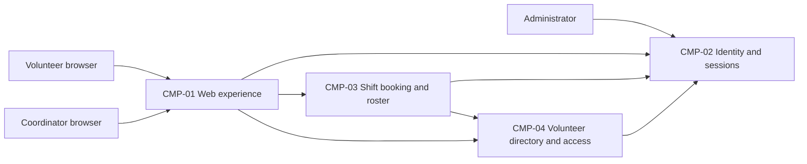

# ARCH-001 — Volunteer shift sign-up for the Riverside Food Bank architecture

## 1. Context and scope

This proposal describes the shared architecture for PRD-001 version 1, status approved,
owned by Priya Nair. About 120 volunteers use mobile web pages to sign in and book open
warehouse shifts; the coordinator views the daily roster. Payroll and donations are outside
the product scope. The PRD plans a Tuesday/Thursday pilot before extending to every shift.

The request explicitly selected PRD-001 and instructed proceeding without questions. No
inspection scope was named, so no code or configuration was inspected. The contract paths
contained no existing ARCH or ADR directories; the local preference file was absent.
Creating this first ARCH is the proposed outcome, but the request did not confirm that
outcome, so it remains null. No architectural decision is accepted by this draft.

## 2. Quality drivers

The operating context is internal, as recorded in PRD-001; the release label Pilot does not
override it. The required quality categories are constraint, security and privacy. All are
covered: PRD-001#NFR-001 requires administrative revocation of volunteer sessions within
five minutes; PRD-001#NFR-002 restricts volunteer phone numbers to the coordinator;
PRD-001#NFR-003 requires hosted services across the whole product because there is no
on-site server. Policy adds no categories and mandates no platform.

Revocation must cover both the sessions established by PRD-001#FR-001 and authenticated
booking requests under PRD-001#FR-002. A provider choice alone does not specify enforcement
or bound stale session acceptance. Phone-number protection shapes data ownership and
server-side access checks across booking and roster flows, rather than only screen visibility.
The shared booking and roster design must provide an authoritative view of booked volunteers.
The PRD supplies no numeric roster freshness target; this draft introduces none.

## 3. Components

The following are proposed logical responsibilities, not accepted service or deployment
boundaries. ARCH-001#DEC-03 governs their separation, ARCH-001#DEC-04 their data ownership,
and ARCH-001#DEC-07 their hosting. Arrows show proposed interactions; protocols remain open.



```yaml items
components:
  - id: CMP-01
    status: active
    name: "Web experience"
    responsibility: "Proposed mobile web interface for sign-in, booking and coordinator roster access; does not own authoritative records or enforce access through display controls alone."
    owns_data: []
    interacts_with:
      - "CMP-02"
      - "CMP-03"
      - "CMP-04"
    deployment: "Open: see DEC-07"
    upstream:
      - {id: PRD-001, item: NFR-002, relation: informed_by, version: 1, hash: null}
      - {id: PRD-001, item: NFR-003, relation: informed_by, version: 1, hash: null}
  - id: CMP-02
    status: active
    name: "Identity and sessions"
    responsibility: "Proposed authentication, session validation and administrator revocation capability; does not own shift bookings or volunteer phone numbers. Provider and revocation mechanism remain open under DEC-01 and DEC-02."
    owns_data:
      - "Proposed: authentication identities and session revocation state"
    interacts_with:
      - "CMP-01"
      - "CMP-03"
      - "CMP-04"
      - "Administrator"
    deployment: "Open: see DEC-07"
    upstream:
      - {id: PRD-001, item: NFR-001, relation: informed_by, version: 1, hash: null}
      - {id: PRD-001, item: NFR-003, relation: informed_by, version: 1, hash: null}
  - id: CMP-03
    status: active
    name: "Shift booking and roster"
    responsibility: "Proposed authority for open shifts, authenticated bookings and the coordinator daily roster; does not own credentials or duplicate phone numbers in roster records."
    owns_data:
      - "Proposed: warehouse shifts and volunteer booking references"
    interacts_with:
      - "CMP-01"
      - "CMP-02"
      - "CMP-04"
    deployment: "Open: see DEC-07"
    upstream:
      - {id: PRD-001, item: NFR-001, relation: informed_by, version: 1, hash: null}
      - {id: PRD-001, item: NFR-002, relation: informed_by, version: 1, hash: null}
      - {id: PRD-001, item: NFR-003, relation: informed_by, version: 1, hash: null}
  - id: CMP-04
    status: active
    name: "Volunteer directory and access"
    responsibility: "Proposed authority for volunteer contact records and coordinator-only phone access; supplies roster identity information without exposing phone numbers to volunteers and does not own authentication credentials. Access enforcement remains open under DEC-05."
    owns_data:
      - "Proposed: volunteer profiles, phone numbers and coordinator access assignments"
    interacts_with:
      - "CMP-01"
      - "CMP-02"
      - "CMP-03"
    deployment: "Open: see DEC-07"
    upstream:
      - {id: PRD-001, item: NFR-002, relation: informed_by, version: 1, hash: null}
      - {id: PRD-001, item: NFR-003, relation: informed_by, version: 1, hash: null}
```

## 4. Architectural questions

All questions remain blocking and open. The user requested no questions, no existing ADR
was available, and policy mandates no platform. The alternatives below explain unresolved
trade-offs; they are not accepted decisions.

```yaml items
decisions:
  - id: DEC-01
    status: active
    question: "Which identity provider handles volunteer sign-in?"
    blocking: true
    state: open
    resolved_by: []
    notes: "Captures the PRD NEEDS ADR marker. An external hosted identity provider reduces credential operations; application-managed identity offers control but adds credential and account operations. Booking consumes the authenticated volunteer identity. Provider capabilities constrain, but do not resolve, the separate revocation question."
    upstream:
      - {id: PRD-001, item: FR-001, relation: informed_by, version: 1, hash: null}
      - {id: PRD-001, item: FR-002, relation: informed_by, version: 1, hash: null}
      - {id: PRD-001, item: NFR-001, relation: informed_by, version: 1, hash: null}
  - id: DEC-02
    status: active
    question: "How is administrative revocation enforced across volunteer sessions within five minutes?"
    blocking: true
    state: open
    resolved_by: []
    notes: "Server-checked revocation state offers direct invalidation with a shared availability dependency; bounded-lifetime credentials require controlled renewal and bounded caches. The decision must cover sign-in session issuance and booking validation, including the worst-case delay. Selecting an identity provider alone cannot resolve this question."
    upstream:
      - {id: PRD-001, item: FR-001, relation: informed_by, version: 1, hash: null}
      - {id: PRD-001, item: FR-002, relation: informed_by, version: 1, hash: null}
      - {id: PRD-001, item: NFR-001, relation: informed_by, version: 1, hash: null}
  - id: DEC-03
    status: active
    question: "What component boundaries separate identity, booking and roster, and volunteer directory responsibilities?"
    blocking: true
    state: open
    resolved_by: []
    notes: "The component diagram is a proposal. Modules within one application reduce network coordination; separate services allow independent operation but require shared authentication and access contracts. These boundaries determine where session and phone-access checks execute across the product."
    upstream:
      - {id: PRD-001, item: FR-001, relation: informed_by, version: 1, hash: null}
      - {id: PRD-001, item: FR-002, relation: informed_by, version: 1, hash: null}
      - {id: PRD-001, item: FR-003, relation: informed_by, version: 1, hash: null}
      - {id: PRD-001, item: NFR-001, relation: informed_by, version: 1, hash: null}
      - {id: PRD-001, item: NFR-002, relation: informed_by, version: 1, hash: null}
  - id: DEC-04
    status: active
    question: "Which components own authoritative shift, booking and volunteer contact records?"
    blocking: true
    state: open
    resolved_by: []
    notes: "The proposed booking authority owns shifts and bookings, while the directory owns phone numbers. Shared persistence simplifies consistent roster reads but needs explicit access boundaries; component-owned stores isolate ownership but require coordinated references and data access. Neither ownership nor persistence has been accepted."
    upstream:
      - {id: PRD-001, item: FR-002, relation: informed_by, version: 1, hash: null}
      - {id: PRD-001, item: FR-003, relation: informed_by, version: 1, hash: null}
      - {id: PRD-001, item: NFR-002, relation: informed_by, version: 1, hash: null}
  - id: DEC-05
    status: active
    question: "Where is coordinator-only phone-number access enforced across booking and roster flows?"
    blocking: true
    state: open
    resolved_by: []
    notes: "A centralized server-side directory access boundary limits duplicated checks; enforcement at each data access point can integrate with component-owned stores but must remain consistent. The decision must identify the trusted source of coordinator authority and prevent phone exposure through responses, caches and logs. The administrator revocation role does not imply permission to read phones."
    upstream:
      - {id: PRD-001, item: FR-002, relation: informed_by, version: 1, hash: null}
      - {id: PRD-001, item: FR-003, relation: informed_by, version: 1, hash: null}
      - {id: PRD-001, item: NFR-002, relation: informed_by, version: 1, hash: null}
  - id: DEC-06
    status: active
    question: "How do accepted bookings become visible to the coordinator roster?"
    blocking: true
    state: open
    resolved_by: []
    notes: "Reading the authoritative booking state directly simplifies consistency but couples roster availability to booking storage; an event-fed roster projection separates reads but requires delivery, ordering and recovery rules. The shared interface and consistency approach must be settled before separate booking and roster epics. No numeric freshness target is invented."
    upstream:
      - {id: PRD-001, item: FR-002, relation: informed_by, version: 1, hash: null}
      - {id: PRD-001, item: FR-003, relation: informed_by, version: 1, hash: null}
  - id: DEC-07
    status: active
    question: "What hosted deployment topology runs the whole product?"
    blocking: true
    state: open
    resolved_by: []
    notes: "Hosted execution is required, but the provider, deployment units and environment arrangement are undecided. One hosted application with managed persistence reduces operational coordination; separately hosted capabilities offer isolation with additional networking and configuration. Hosting affects every feature, session-state reachability and phone-data access boundaries, so all product requirements are cited."
    upstream:
      - {id: PRD-001, item: FR-001, relation: informed_by, version: 1, hash: null}
      - {id: PRD-001, item: FR-002, relation: informed_by, version: 1, hash: null}
      - {id: PRD-001, item: FR-003, relation: informed_by, version: 1, hash: null}
      - {id: PRD-001, item: NFR-001, relation: informed_by, version: 1, hash: null}
      - {id: PRD-001, item: NFR-002, relation: informed_by, version: 1, hash: null}
      - {id: PRD-001, item: NFR-003, relation: informed_by, version: 1, hash: null}
```

## 5. Evidence inspected

```yaml items
evidence:
  - id: EVD-01
    status: active
    source: "PRD-001"
    kind: prd
    finding: "Version 1, status approved: requires volunteer sign-in, authenticated shift booking, daily coordinator rosters, five-minute session revocation, coordinator-only phone access and whole-product hosted services. The internal operating context sets the quality floor; the identity provider is explicitly marked NEEDS ADR."
    classification: context
  - id: EVD-02
    status: active
    source: "POL-001#SET-01"
    kind: policy
    finding: "Version 1, status approved: active interview.max_calls setting is 5, overridable by project and local. This governs document production and does not settle an architectural question. No platform mandate exists in the policy."
    classification: policy
```

## 6. Deployment

PRD-001#NFR-003 excludes reliance on an on-site server. Browser clients access hosted
application capabilities; authoritative persistence and any identity/session infrastructure
must also run on hosted services. This constraint does not choose a vendor, runtime, datastore
or number of deployment units. Those remain open under ARCH-001#DEC-07; logical component
boundaries remain open under ARCH-001#DEC-03. Environment separation is also undecided.
No deployment configuration was inspected or created.

## 7. Requirement changes proposed to the PRD owner

- None.

## 8. Open questions

- [NEEDS CLARIFICATION: No inspection scope was named and no code or configuration was inspected; existing implementation, reusable services and operational capabilities are unknown.]
- [NEEDS CLARIFICATION: host model/session identity unavailable]
- [NEEDS CLARIFICATION: The proposed create outcome for ARCH-001 is unconfirmed; the instruction to define architecture without questions does not confirm that outcome.]

## Change Log

| Version | Date | Author | Change | Items affected |
|---|---|---|---|---|
| 1 | 2026-09-28 | codex (session unknown) | Initial draft for PRD-001 v1; proposed components and seven open questions, no ADRs. Host provenance unavailable; validation unresolved. Policy resolution: interview.max_calls=5 (POL-001#SET-01); architecture.mandated_platforms=none (default); quality.required_categories=floor only (default) | all |
