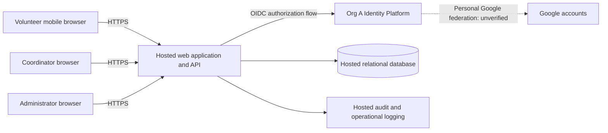

# ARC-001 — PRD-001 architecture and epic readiness

## 1. Outcome and authority

Use a mobile-first web application, a single hosted application service, and a
hosted relational database. Org A Identity Platform is the mandated authentication
boundary. Personal Google sign-in through that platform is **unverified**, so the
identity integration remains blocked; see [ADR-001](../adr/ADR-001.md).

**No functional requirement is unconditionally ready for epics.** FR-003 has
sufficient architectural coverage for decomposition after the shared quality gate
and coordinator access decisions are closed. FR-001 and FR-002 also depend on resolution of the identity conflict;
FR-002 needs confirmation of booking rules. This document defines proposed design,
not implementation evidence or approval of new product requirements.

Authority is the approved [PRD-001 v1](../prd/PRD-001.md) and vendored
[POL-001 v3](../policy/POL-001.md). The PRD change log records earlier default policy
resolution, but those defaults conflict with the supplied organizational policy.
Use SET-01 and SET-02; neither allows product overrides. Preserve the approved PRD
until its owner records any required amendment. BRN-001 and organization ADR-104
are referenced by the inputs but are absent from this workspace; no unseen content
is assumed.

## 2. Policy resolution and applicability

| Source | Effective obligation | Architecture impact |
|---|---|---|
| POL-001 SET-01 | Org A Identity Platform (OIDC) owns identity and authentication | Product integrates with that platform; direct Google authentication or a substitute provider is not an authorized fallback. |
| POL-001 SET-02 | Compliance and accessibility are required quality categories for internal, pilot, and production contexts | PRD has `operating_context: internal`; both categories apply despite pilot scope. Missing measurable requirements are GAP-02. |
| NFR-003 | Hosted services, whole product | Applies to FR-001, FR-002, FR-003 and all supporting state, secrets, jobs, and operational services. |
| NFR-004 | Personal Google accounts, sign-in | Directly constrains FR-001 and indirectly affects FR-002 through its signed-in prerequisite. It does not impose Google accounts on coordinator authentication. |
| NFR-001 | Administrator revocation takes effect within five minutes | Shared session and authorization path; cannot be solved solely by an identity provider selection. |
| NFR-002 | Only coordinator may see volunteer phone numbers | Data access, API responses, logs, operational access, and any future export must enforce the restriction. An administrator role alone grants no phone access. |

## 3. Components and trust boundaries

One application service owns booking, roster reads, authorization, and application
sessions. A single transactional database keeps the pilot small enough to operate
without distributed consistency mechanisms. Managed hosting must provide HTTPS,
secret storage, backups, and controlled deployment. Hosting provider, language,
and database product are implementation choices within this design, subject to
the eventual compliance requirements; this document selects no vendor.

The browser is untrusted. Every protected request passes server-side session and
role checks. The database is private to the service. The application validates
OIDC responses from the mandated platform before creating a local session; token
validation does not by itself establish volunteer eligibility or coordinator role.
Roles are server-managed and cannot be supplied by the browser or inferred from a
personal Google email domain.

## 4. Data and application boundaries

| Record | Minimum responsibility and constraints |
|---|---|
| Principal | Internal ID and unique identity issuer/subject pair; display name; enabled state; server-managed volunteer, coordinator, and administrator roles. Email is not the identity key. |
| Volunteer contact | Principal ID and phone number, kept outside ordinary principal/booking response projections. Access only through a coordinator-authorized path. |
| Session | Opaque session ID hash, principal ID, expiry, and captured revocation generation. No bearer session identifier in logs. |
| Principal session state | Current revocation generation, atomically incremented to invalidate all existing sessions for that volunteer. |
| Shift | ID, start/end instants, configured warehouse time zone, capacity, and open/closed state. These booking conventions are proposed pending GAP-03. |
| Booking | Shift ID, volunteer ID, creation time; unique `(shift_id, volunteer_id)` prevents duplicate reservations. |
| Audit event | Actor ID, action, target ID, timestamp, outcome; excludes phone values, tokens, and session secrets. Retention and access rules await GAP-02. |

Initial volunteer eligibility, roles, shifts, and contact records can be loaded
through a controlled operator process for the pilot. This is a proposed provisioning
boundary, not a new scheduling or volunteer-management UI. GAP-04 records the
remaining operating decisions.

### Sign-in and revocation — FR-001, NFR-001, NFR-004

Use a server-side OIDC authorization-code flow with PKCE, state, and nonce checks;
validate issuer, audience, signature, expiry, and the login transaction. Exact
endpoints, registration, claims, and personal Google federation need platform
evidence under GAP-01. Keep provider tokens on the server if needed. Set an opaque
application session in a Secure, HttpOnly cookie with appropriate SameSite handling;
protect state-changing requests against CSRF.

The administrator revocation operation increments the volunteer's session
generation in the database and records an audit event. Every protected request
reads current session state from the authoritative store, compares generations,
and checks expiry and principal eligibility. Use no positive authorization cache
or lagging replica on this path. If session state cannot be checked, fail closed.
Do not rely on a long-lived self-contained token expiring to meet the five-minute
bound. Existing sessions fail on their next authorization check after revocation
commits. Recheck within the booking transaction before a write; avoid long-lived
authorized streams. Test concurrent requests and all application instances.

Revocation invalidates the application's existing sessions. Blocking future
sign-in is a separate account-disable behavior, not specified by NFR-001. An IdP
session must never make an old revoked application session valid again. Successful
fresh authentication may establish a new session unless the account is disabled.

### Booking — FR-002

The signed-in volunteer requests an available shift and submits its ID. Derive the
volunteer ID from the session. In one database transaction, recheck authorization,
lock the shift, check open state and remaining capacity, and insert the booking.
All booking writes use that boundary. A repeated request for the same volunteer
and shift returns the existing reservation; simultaneous attempts for the final
place cannot both succeed. Return an explicit full/closed result when applicable.

Capacity and an explicit open state are proposed interpretations of “open,” not
approved acceptance criteria. GAP-03 must settle cutoff and eligibility rules
before decomposition. Cancellation, waitlists, reminders, and volunteer-facing
rosters are outside this PRD's current scope.

### Roster and phone isolation — FR-003, NFR-002

Authorize a coordinator role on the server before querying the roster. Convert
the requested warehouse-local date to a UTC interval, and return shifts with their
booked volunteers. Use committed booking data from the database. Refresh on page
load and on demand; 30-second polling is a proposed interpretation of the summary's
“live” roster, with visible last-refresh time and errors. The PRD gives no freshness
threshold, so 30 seconds is not claimed as an approved service level.

Ordinary volunteer endpoints omit phone fields entirely. If coordinator phone
display is needed, fetch it only after the coordinator check; the PRD's visibility
restriction does not itself require adding a phone display. Mark sensitive
responses private/no-store and prevent shared cache reuse. Exclude phones from
telemetry and audit payloads. Restrict database, backup, and support access so
ordinary administrators cannot bypass application controls to browse contact
values; settle privileged recovery access under GAP-02. Hiding a field in the UI
alone does not satisfy NFR-002.

## 5. Open decisions and closure evidence

| ID | Issue and scope | Responsible role and required closure evidence |
|---|---|---|
| GAP-01 | SET-01 vs NFR-004; FR-001 and dependent FR-002 blocked | Organization identity/platform owner supplies ADR-104 or authoritative integration guidance, confirms personal Google federation and eligibility/role mapping, and demonstrates a personal Google login via Org A in a test tenant. Also demonstrate application-session revocation. If federation is unavailable, Priya Nair must amend the product requirement or the organization must formally change policy; no local override. |
| GAP-02 | Required compliance and accessibility categories lack measurable requirements; shared epic gate | Priya Nair with organization compliance/accessibility owners supplies approved, traceable acceptance criteria and evidence obligations. Compliance needs applicable controls, data access including recovery, audit/retention, and hosting obligations. Accessibility needs the organization-approved conformance target, mobile keyboard/focus/error expectations, and verification method. Proposed coverage topics are not assertions of SOC 2 compliance or an invented accessibility standard. |
| GAP-03 | “Open shift” semantics incomplete; FR-002 gate | Priya Nair confirms capacity, booking cutoff, eligibility and overlap rules, and repeat-booking behavior, recording measurable cases in an authorized requirement amendment or decision. |
| GAP-04 | Pilot operating details; settle before implementation of affected paths | Coordinator/product owner confirms warehouse time zone, shift/contact data source, eligibility enrollment, role assignment and administrator identity. Confirms roster freshness expectation and verifies ASM-01 with the planned volunteer feedback. Google-account possession alone must not enroll arbitrary people. |

GAP-04 is a visible implementation prerequisite, not an invented requirement to
build administration screens. Its coordinator identity and role portion must be
resolved before the roster epic's access-control stories can be considered ready.
The missing BRN is a provenance limitation; the approved PRD is sufficient authority
for this architecture. ADR-104's absence is material to GAP-01 because platform
capabilities cannot be inferred from the policy's citation.

## 6. Requirement coverage and epic readiness

“Covered” means a concrete proposed design and verification path exist. “Ready”
requires resolved material decisions and applicable quality acceptance criteria;
coverage does not imply a passing implementation test.

| Requirement | Coverage | Epic readiness and remaining gate | Planned acceptance evidence |
|---|---|---|---|
| FR-001 | OIDC boundary and application sessions; ADR-001 | BLOCKED: GAP-01, GAP-02, enrollment portion of GAP-04 | Eligible volunteer completes personal Google login through Org A; invalid callbacks and ineligible accounts rejected. |
| FR-002 | Atomic booking, duplicate protection, authoritative authorization | BLOCKED: FR-001 dependency, GAP-02, GAP-03 | Signed-in eligible volunteer books an open shift; unsigned/revoked user cannot; repeat and concurrent final-place requests preserve capacity. |
| FR-003 | Coordinator authorization and daily committed roster | Architecture covered; BLOCKED for epics by GAP-02 and coordinator identity/role portion of GAP-04. No direct NFR-004 blocker. | Coordinator sees committed bookings for the chosen local day, including empty days and date boundaries; other roles denied. |
| NFR-001 | Shared authoritative session-generation checks | Design covered; integration BLOCKED by GAP-01; cross-cutting acceptance in sign-in and protected-feature epics | Revoke multiple sessions on multiple instances; each old session denied within 300 seconds, including stale IdP/application token replay. |
| NFR-002 | Coordinator-only contact query; restricted projections and operations | Design covered; GAP-02 must settle operational access obligations | API/UI role matrix (anonymous, volunteer, admin-only, coordinator), cache and log inspection, and database/support access review. |
| NFR-003 | Whole deployment and supporting services hosted | Architecture ready as a shared constraint; hosting compliance remains GAP-02 | Deployment inventory proves no on-site runtime dependency, including database, sessions, secrets, backups, and logs. |
| NFR-004 | Google federation through mandated platform, if supported | BLOCKED: GAP-01; applies directly to FR-001 | Actual personal Google account, not merely an organization-managed Google account, signs in through Org A. |

After gates close, candidate epic boundaries are identity/access (FR-001,
NFR-001, NFR-004), shift booking (FR-002), and coordinator roster (FR-003,
NFR-002). Every epic inherits NFR-003 and the approved compliance/accessibility
criteria; booking and roster inherit session checks. These are planning boundaries,
not created or approved epics. The PRD's generated epic map remains untouched.

SM-01 remains measured by the coordinator's shift log: 83% baseline and 95% target
by pilot end. No analytics subsystem is needed to satisfy the stated measurement.
Pilot release is Tuesday/Thursday shifts before expansion; no numeric performance,
availability, or accessibility target is invented here.

## 7. Verification record

See [VER-001](../verification/VER-001.md) for checks against these exact input
snapshots and the delivered documents. All runtime acceptance evidence above is
NOT_RUN: this workspace contains no implementation, test harness, or repository
quality commands. No behavior was changed, so no failing implementation test was
established. When implementation begins, establish meaningful failing tests for
the approved cases before implementing them.
