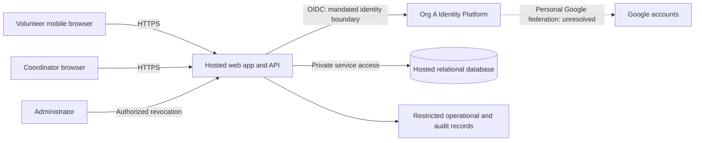

# ARCH-001 — PRD-001 pilot architecture and epic readiness

## 1. Scope and disposition

This defines a proposed architecture for the approved [PRD-001](../prd/PRD-001.md), covering all three functional requirements and all four non-functional requirements. It does not approve new product requirements, create epics, or change the approved PRD. Payroll, donations, native apps, and new user-facing features are excluded.

**No complete product requirement is unconditionally ready for an implementation epic.** Identity compatibility remains unresolved, and mandatory compliance and accessibility requirements have no approved acceptance criteria. The design below supports decomposition once those gates close; focused discovery and requirement-definition work can start now. “Ready” here means sufficiently specified for an implementation epic, not implemented or proven in production.

The workspace contains only the PRD and vendored policy: no implementation, architecture template, AGENTS.md, test commands, or quality thresholds were supplied. Referenced BRN-001 and organizational ADR-104 are absent. Missing evidence is recorded explicitly rather than inferred.

## 2. Policy resolution

| Setting | Effective source and value | Consequence |
|---|---|---|
| `architecture.mandated_platforms` | [POL-001](../policy/POL-001.md)#SET-01, v3: Org A Identity Platform (OIDC) for identity and authentication; no overrides | All application sign-in must use that platform. A direct Google integration or a separate application identity provider cannot be selected as a workaround. |
| `quality.required_categories` | POL-001#SET-02, v3: compliance and accessibility for internal, pilot, and production contexts; no overrides | PRD-001 has `operating_context: internal`; both categories apply to the entire pilot and must have explicit, traceable requirements and acceptance evidence. |

The PRD's initial change-log entry records `mandated_platforms=none` and `required_categories=floor only` as defaults. Those historical defaults do not override the supplied, approved organizational policy. The policy defines no local override mechanism. No additional “floor” categories or numerical thresholds can be recovered from the supplied files.

NFR-004 requires personal Google accounts, while SET-01 requires Org A's platform. They are compatible only if the platform supports an approved personal-Google federation path. This is an unresolved compatibility dependency, not evidence that either requirement should be dropped. [ADR-001](../adr/ADR-001.md) records the decision boundary and closure evidence.

## 3. Proposed components and trust boundaries

Use a single hosted web application with a server-side API and a hosted relational database. This is a proposed deployment shape sized for about 120 volunteers and three shifts per day; it makes no unverified throughput, cost, or availability promise. Specific hosting vendors and runtime versions are deferred to organizational service selection.

The Google edge is a dependency hypothesis, not an approved integration. Browsers cannot query the database directly. The server resolves identity and permissions on every protected request. Authentication and role authorization are separate: possession of a personal Google account does not itself establish volunteer, coordinator, or administrator access.

| Component | Responsibility | Requirement coverage |
|---|---|---|
| Mobile web interface | Sign-in entry point, available shifts and booking, coordinator's daily roster; no installation | FR-001–FR-003; PRD §8 |
| Identity adapter | Org A OIDC integration and mapping of verified platform identity to an authorized local actor | FR-001, NFR-004; SET-01 |
| Authorization and session guard | Active session validation, role checks, administrator-triggered revocation | NFR-001, NFR-002; all protected flows |
| Booking module | Open-shift eligibility and atomic capacity enforcement | FR-002 |
| Roster module | Day-scoped booked-volunteer view and coordinator-only contact projection | FR-003, NFR-002 |
| Hosted data and operations | Persistent shifts/bookings, private contacts, sessions, restricted audit records, deployment and recovery | NFR-003; proposed compliance support |

No microservices, queue, or separate analytics service is required by this design. The coordinator's shift log remains the source for SM-01 (83% baseline, 95% pilot target); a booked roster alone does not establish attendance or success.

## 4. Identity, authorization, and session lifecycle

Proposed sign-in: redirect to Org A's platform, validate the callback using its supported OIDC flow, map the verified issuer and subject to a local actor, and issue an opaque application session in a secure, HTTP-only cookie. Bind callbacks to the initiating browser, protect state-changing requests against CSRF, and keep provider credentials and tokens out of browser storage and application logs. Exact platform configuration and claims are blocked on ADR-001.

The application session is an access-control record; it is not a replacement identity provider. Proposed session records contain an actor ID, hashed random session identifier, creation/expiry timestamps, and the actor's session generation. An administrator revocation increments that generation in authoritative storage and invalidates all existing sessions for the target volunteer. Every protected request checks the current session, expiry, and generation without a positive authorization cache. A concurrent sign-in must not reactivate a revoked session. Long-lived bearer tokens alone cannot enforce this design.

Revocation is acknowledged only after its transaction commits. Requests whose authorization checks begin after that commit reject old sessions immediately; the end-to-end acceptance bound remains **within five minutes**, including every application instance. If session state cannot be verified, protected access fails closed. Use ordinary request/response reads for the pilot; any later streaming or persistent connection must revalidate access within the same bound. Revocation cannot retract data already delivered to a browser.

Proposed policy: revocation terminates existing application sessions; disabling the account and preventing a fresh sign-in are separate behaviors not specified by NFR-001. Whether the Org A platform permits application-managed session enforcement and how organization-wide revocations reach the app require confirmation. The administrator role is not implicitly granted coordinator privileges. Enrollment, role assignment authority, and administrator access are closure items, not assumed platform features.

## 5. Data and application contracts

Proposed minimum records:

| Record | Data and invariants |
|---|---|
| Actor | Local ID, platform issuer/subject (unique pair), display name, explicit role assignments; no automatic privilege based on email domain |
| VolunteerContact | Volunteer ID and phone number, separately queried through coordinator-only access paths |
| Shift | ID, start/end instants, operational local date, capacity, open/closed state; capacity and date semantics require product agreement |
| Booking | Shift ID, volunteer ID, creation time; unique `(shift_id, volunteer_id)` |
| Session / actor session generation | Authoritative session validity and generation used by all application instances |
| Audit record | Actor, action, target ID, timestamp, outcome and correlation ID; no phone values, tokens, or session secrets |

Data separation helps prevent accidental disclosure; server authorization is the enforcement boundary. Collect only the data needed by the approved flows. Contact import, shift provisioning, and role provisioning need an agreed pilot operating procedure, not an invented self-service management feature.

Conceptual application operations (names are illustrative, not a frozen API):

| Operation | Server contract |
|---|---|
| Start/callback sign-in | Through Org A platform only; callback validation failure creates no session |
| List open shifts | Requires a valid authorized volunteer session; returns availability without other volunteers' contacts |
| Book shift | Requires a valid volunteer session; derives volunteer ID from that session, never from an arbitrary client-selected actor |
| Read daily roster | Requires coordinator role; returns booked volunteers for the selected operational date, including phone only in the authorized coordinator projection |
| Revoke volunteer sessions | Requires administrator role; commits generation change before reporting success and records a redacted audit event |

The booking transaction locks the shift or uses equivalent atomic database enforcement, rechecks open status and remaining capacity, and inserts the unique booking before commit. A concurrent last-place race permits at most one additional booking. A retried request for the same volunteer and shift returns the existing booking without consuming another place. Rejected or failed transactions leave no partial reservation. Product confirmation of the proposed capacity and duplicate rules remains required.

For the live roster, propose reading committed bookings on page entry/date change and polling while the page is visible. Show last refresh time and refresh errors. Do not invent a freshness SLA: the coordinator must establish the acceptable delay before an epic promises “live” behavior. Day boundaries use the food bank's configured timezone, which is not established by the operator's workstation timezone.

Phone numbers must never be included in volunteer responses, hidden DOM fields, bootstrap payloads, shared caches, logs, or analytics. Coordinator responses use private/no-store caching and are cleared from the active UI on logout. Administrators without the coordinator role receive no phone data. Backend service access and backup access must be limited and audited; any proposed support-user visibility needs an explicit privacy decision. This design adds no volunteer contact-editing screen.

## 6. Hosting and cross-cutting quality

All application, database, secret storage, logging, and backup services must be hosted (NFR-003); no on-site server is required. Use HTTPS, private database access, scoped service credentials, separate non-production data, controlled schema migrations, and redacted operational logs. Hosting region, retention, backup recovery targets, supported hosting services, and recurring service ownership are unresolved policy/operating inputs. Do not claim SOC 2 certification from this design or infer controls solely from SET-02's rationale.

Proposed compliance acceptance topics for owner review: access and role review, audit event coverage and retention, contact-data retention/deletion, backup access and restore evidence, change/deployment records, and incident ownership. These are candidates for explicit requirements, not approved new NFRs. Their applicable controls, owners, evidence, and measurable acceptance criteria must be set by the organization's compliance owner with the product owner.

Proposed accessibility acceptance topics for owner review: keyboard-complete sign-in/booking/roster flows, focus handling, form labels and validation errors, screen-reader status feedback, readable mobile layouts, and contrast. The applicable standard/version/conformance level, supported assistive technologies, and manual/automated checks must be specified by the accessibility owner with the product owner. Org A's sign-in pages and the federated journey are included in the assessed flow; third-party UI is not an automatic exemption.

## 7. Blocking decisions and requirement gaps

The people/teams below are suggested accountable roles; no review, assignment, approval, or external communication has occurred.

| ID | Gap and affected scope | Evidence needed to close | Proposed owner |
|---|---|---|---|
| B-01 | Identity compatibility, external ADR-104, supported claims/session controls; directly FR-001, NFR-001, NFR-004; transitively authenticated booking/roster and privacy | ADR-104 and platform contract; demonstration of allowed personal-Google federation through Org A; agreed local identity mapping, enrollment, role authority and revocation integration; resolve ADR-001 | Org A identity team / architecture board and Priya Nair |
| B-02 | Required compliance category absent; whole product | Approved, traceable compliance requirements with applicable controls, acceptance evidence and ownership; resolve any hosting/data constraints they impose | Compliance owner and Priya Nair |
| B-03 | Required accessibility category absent; whole product, including sign-in | Approved, traceable accessibility requirements with conformance target and acceptance checks | Accessibility owner and Priya Nair |
| B-04 | “Open shift” and booking rules underspecified; FR-002 | Confirm capacity, eligibility, duplicate/retry semantics, cutoff/open-state rules, and how pilot shifts are provisioned | Priya Nair |
| B-05 | Daily/live roster semantics and contact source underspecified; FR-003, NFR-002 | Confirm food bank timezone, roster fields, refresh target, phone data source, and coordinator-role provisioning | Priya Nair |

No questions are needed to record these gaps. Closing them is future evidence/decision work. Do not silently resolve B-01 with an organizational policy exception, or B-02/B-03 by calling the internal pilot exempt.

## 8. Requirement-to-architecture and epic-readiness matrix

`BLOCKED` means a named prerequisite prevents unconditional implementation-epic readiness. `PASS` means architecture coverage is present, not that runtime acceptance is met. All runtime acceptance checks are currently `NOT_RUN` because no implementation exists. Whole-product constraints are inherited by every future epic even when a row has a narrower direct dependency.

| Requirement | Design coverage | Architecture coverage | Epic readiness and blocker | Required implementation acceptance evidence |
|---|---|---|---|---|
| FR-001: volunteer sign-in | §§3–4; ADR-001 | BLOCKED: identity route unverified | BLOCKED: B-01, B-02, B-03 | Personal Google account completes allowed Org A flow; invalid callbacks and unauthorized enrollment are rejected; approved accessibility checks cover sign-in |
| FR-002: book open shift | §5 booking operation/transaction | PASS: proposed transaction boundary defined | BLOCKED: B-04; B-01 dependency; B-02, B-03 | Valid volunteer books an open shift; closed/full shifts rejected under agreed rules; concurrent last-place requests and retries cannot overbook; revoked session cannot book |
| FR-003: coordinator daily roster | §5 roster operation | PASS: proposed authorized read boundary defined | BLOCKED: B-05; B-01 dependency; B-02, B-03 | Correct committed bookings for agreed local date, including boundary cases; agreed freshness achieved; non-coordinators denied; approved accessibility checks cover roster |
| NFR-001: revoke within 5 minutes | §4 authoritative session guard | BLOCKED: platform/session contract unverified | BLOCKED: B-01, B-02, B-03 | Revoke multiple sessions across instances and measure denial within 300 seconds; exercise sign-in race, storage failure, and every protected API; non-admin revocation denied |
| NFR-002: phones coordinator-only | §5 contact separation and response contracts | PASS: server enforcement designed | BLOCKED: B-05; B-01 role dependency; B-02, B-03 | Coordinator can view phones; volunteer, anonymous, and admin-only actors cannot obtain them through API, HTML, caches, or logs; access checked on each request |
| NFR-003: hosted services | §§3, 6 | PASS: whole-product deployment boundary defined | BLOCKED: B-02, B-03 (global quality gates); architecture decomposition can proceed | Deployment inventory confirms all runtime/data/operations services hosted and no on-site dependency; approved compliance/quality controls evidenced |
| NFR-004: personal Google | §§2–4; ADR-001 | BLOCKED: federation compatibility unverified | BLOCKED: B-01, B-02, B-03 | Personal Google accounts work through the mandated platform; no requirement for an organizational Google account; no bypass of Org A identity |

NFR-003 is a global constraint on all three functional requirements. NFR-004 directly constrains FR-001. NFR-001 protects every signed-in surface, and NFR-002 constrains every surface that could expose contacts, especially FR-003. These relationships must appear in future epic upstream references, not be lost when splitting the work.

## 9. Epic handoff and verification sequence

The following are candidate boundaries, not created epics or an edited PRD epic map:

1. Hosted foundation and shared quality controls: NFR-003, B-02/B-03 outcomes; can be decomposed now, but complete implementation readiness awaits those outcomes.
2. Identity, roles, and revocation: FR-001, NFR-001, NFR-004, ADR-001; close B-01 and global quality gaps before committing implementation scope.
3. Volunteer booking: FR-002; consumes identity/session contracts and hosted foundation; close B-04 and inherit global quality requirements.
4. Coordinator roster and contact privacy: FR-003, NFR-002; consumes identity/role contracts and booking data; close B-05 and inherit global quality requirements. FR-003 retains its `should` priority; no scope or priority escalation is implied.

Immediate actionable work is retrieving identity evidence and specifying missing requirements. If the platform cannot support personal Google accounts, the product owner must amend NFR-004 or the organizational authority must change its policy through its own process. Until then the sign-in decision remains blocked.

Future implementation must establish meaningful failing behavior tests before code, then run the repository's eventual required gates. Prioritize session revocation, authorization/contact leakage, atomic booking, local-date roster behavior, and approved compliance/accessibility checks. Runtime results remain NOT_RUN here; planned tests are not evidence of a pass.

Pilot rollout follows the approved Tuesday/Thursday scope before all shifts. Confirm the operating procedures and ASM-01 smartphone/browser assumption before rollout; the proposed owner is Priya Nair. ASM-01 is a rollout risk, not evidence of an additional architecture failure. Use the coordinator's shift log to evaluate SM-01. Verification of this documentation is recorded in [PRD-001-verification.md](PRD-001-verification.md).

## Change log

| Version | Date | Author | Change |
|---|---|---|---|
| 1 | 2026-09-28 | Codex | Proposed architecture, policy resolution, scoped dependencies, and requirement-level epic readiness; no approval asserted |
