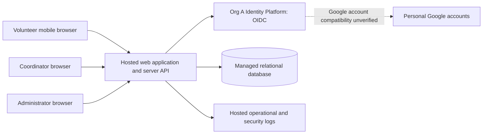

# ARCH-001 — Volunteer shift sign-up

## 1. Outcome and authority

The proposed design is a mobile web application on hosted services, with a server-side application, a managed relational database, and authentication through Org A Identity Platform. Personal Google accounts must work through that mandated platform; a direct Google integration cannot replace it.

**No delivery epic is fully ready under the current specification.** The architecture can define useful boundaries now, but identity compatibility and missing mandatory quality requirements prevent an unconditional handoff. Section 6 distinguishes architectural coverage from epic readiness so a blocked sign-in decision does not obscure the settled hosting and data boundaries.

Authority is [PRD-001 v1](../prd/PRD-001.md) and [POL-001 v3](../policy/POL-001.md). POL-001 has non-overridable organization settings. The PRD's initial change-log entry records `architecture.mandated_platforms=none` and `quality.required_categories=floor only`; those defaults are inconsistent with the applicable policy. They are historical text, not exceptions. This document applies SET-01 and SET-02 and leaves the approved PRD unchanged.

The repository contains no application, architecture template, AGENTS.md, test commands, or validation scripts. ADR-104 and BRN-001 are referenced upstream but are not supplied. No claim is made that either has been reviewed. The two local ADRs are proposals, not recorded organization approvals.

## 2. Decisions and boundaries

| Decision | Disposition | Evidence / rationale |
|---|---|---|
| Use Org A Identity Platform for identity and authentication | Mandated | POL-001#SET-01; local [ADR-001](../adr/ADR-001.md) records unresolved integration evidence |
| Preserve personal Google accounts | Required, compatibility unresolved | PRD-001#NFR-004; federation through Org A is a candidate, not a verified capability |
| Run the whole product on hosted services | Required | PRD-001#NFR-003; no on-site component |
| Use one server application and a managed relational database | Proposed | [ADR-002](../adr/ADR-002.md); appropriate to about 120 volunteers and three shifts per day |
| Authorize every protected request and isolate phone data | Proposed | ADR-002; PRD-001#NFR-002 |
| Specify compliance and accessibility acceptance criteria before epic handoff | Required | POL-001#SET-02 applies because PRD-001 is `operating_context: internal` |

The browser is untrusted. Only the server accesses application data and secrets. Org A owns authentication; the server owns application authorization and local session enforcement. The database is not directly accessible to browsers. Hosted logging must exclude phone numbers, credentials, session tokens, and identity tokens. Hosting provider, region, runtime, and database product are not selected without the organization's applicable hosting and compliance constraints; no particular vendor is necessary to settle the boundaries above.

## 3. Components, data, and behavior

### Identity and application access

The server integrates with Org A over OIDC; the proposed browser flow is authorization code with PKCE, server-held secrets, and Secure, HttpOnly session cookies. Exact provider endpoints, claims, token validation, session lifecycle, and supported Google federation require evidence under ADR-001. No local passwords or alternative sign-in provider are proposed.

Application users map to a stable `(issuer, subject)` identity. Email addresses and Google profile fields do not grant volunteer, coordinator, or administrator privileges. Role assignments come from a controlled source whose ownership and provisioning procedure must be established (GAP-05). Administrator and coordinator are separate capabilities; an administrator has no automatic access to phone numbers.

Every protected request checks the user's current local session generation and roles against authoritative server state. Revocation atomically advances that user's generation, invalidating all earlier application sessions. The initial design uses no authorization cache. If authorization state cannot be checked, protected access fails closed. The five-minute requirement must include long-lived connections and responses already being prepared, not just a fresh page request. Exact treatment of renewed provider sessions remains blocked by GAP-02.

### Booking and roster

The initial application has these internal modules, deployed together:

- Identity/session adapter: Org A integration, application sessions, roles, administrative revocation.
- Shifts/bookings: eligible shift listing, capacity checks, atomic booking, duplicate protection.
- Coordinator roster: daily authorized query of bookings and permitted contact fields.

Proposed minimum entities:

| Entity | Minimum data and invariants |
|---|---|
| User | Internal ID, identity issuer/subject, display name, active flag; unique issuer/subject |
| Role assignment | User ID, explicit role; controlled writes and auditable changes |
| Volunteer contact | User ID, optional phone; stored separately from general user projections |
| Session | Opaque identifier digest, user ID, issued generation, expiration, revoked state |
| User authorization state | User ID, current session generation; authoritative revocation state |
| Shift | ID, start/end instant, local service date, capacity, booking-open state |
| Booking | ID, shift ID, user ID, created time; unique shift/user pair |

Phone collection and editing are not requested by the PRD. They need a defined source before implementation; no volunteer-facing phone form is assumed. The roster can show names and booking counts without adding a new requirement to display phone numbers.

Proposed server contracts (route names are illustrative):

| Operation | Authorization and result |
|---|---|
| `GET /shifts` | Active volunteer; return open shifts and availability, with no contact fields |
| `POST /shifts/{id}/bookings` | Active volunteer; derive user from session, never from caller-selected user ID |
| `GET /roster?date=YYYY-MM-DD` | Coordinator only; daily shifts and booked volunteers; explicitly selected fields |
| `POST /admin/users/{id}/revoke-sessions` | Administrator only; atomic revocation and an audit event without phone data |

Booking locks the relevant shift inside a database transaction, checks that it is open and has capacity, and inserts the booking. A database uniqueness constraint prevents duplicates; a retry for the same volunteer and shift returns the existing booking. Competing requests for the last place cannot both succeed. The response distinguishes full/closed shifts from authentication failures. Cookie-authenticated mutations require CSRF protection. These are proposed interpretations of “open shift,” subject to the operational definitions in GAP-06.

The roster reads committed bookings from the same database. For the pilot, propose an authenticated refresh every 30 seconds while the page is visible, plus manual refresh; always recheck access and show the last successful update time. After an error, mark the view stale. “Live” has no approved freshness threshold yet (GAP-07); the proposed interval is not a new approved acceptance criterion.

### Hosting and operations

Host application instances, database, backups, secrets, and logging off site. Use encrypted transport, a private database connection, and least-privilege service credentials. Shared durable session state allows multiple instances without inconsistent revocation. A database outage stops bookings rather than accepting unconfirmed reservations; retries must preserve booking uniqueness. An identity outage cannot initiate new sign-ins; existing session handling must follow the verified provider contract.

Propose managed database backups and a restore exercise before pilot launch. Retention, recovery targets, allowed regions, and audit-log access require the compliance requirements in GAP-03; no numerical targets are invented here. Observe failed sign-ins, rejected access, revocations, booking conflicts, application errors, and roster staleness without contact data in telemetry.

Roll out by configuring Tuesday and Thursday pilot shifts, then expand eligible shifts after pilot review. Keep the existing coordinator process available during outages. PRD-001#SM-01 remains measured by the coordinator's shift log; no analytics platform is added. PRD-001#ASM-01 remains open and must be validated for pilot participation. Payroll, donations, cancellation, notifications, waitlists, and new shift-management screens are outside this design's authorized scope.

## 4. Gaps and closure evidence

Owners below are proposed routing, not claims that work has been assigned or approved. No exception to policy is assumed.

| Gap | Affected scope | Closure evidence | Proposed owner |
|---|---|---|---|
| GAP-01 | FR-001, NFR-004; authenticated dependents FR-002/FR-003 | Obtain applicable ADR-104 details and Org A configuration or integration proof that personal Google accounts authenticate through Org A. If unsupported, record a product/policy conflict for authorized resolution; do not bypass SET-01. | Identity platform owner + architecture board + Priya Nair |
| GAP-02 | NFR-001 and FR-001 session lifecycle | Verify that admin revocation invalidates every prior application session within 300 seconds across instances and connections, including silent refresh and provider-session reuse. Establish whether fresh Google authentication or a provider-side revocation action is needed. | Identity platform owner + application security owner |
| GAP-03 | Whole product: mandatory compliance category | Approve compliance requirements with applicability, ownership, measurable acceptance criteria, and verification evidence. Resolve handling/retention of volunteer and audit data, hosting constraints, and relevant SOC 2 controls. Policy mentions SOC 2 scope; it does not specify these controls or certify this application. | Compliance owner + Priya Nair |
| GAP-04 | Whole product: mandatory accessibility category | Approve an accessibility target and acceptance criteria for sign-in, booking, roster, errors, keyboard/focus behavior, assistive technology, and mobile presentation; define verification method. Mobile-first design alone is not accessibility coverage. | Accessibility owner + Priya Nair |
| GAP-05 | FR-001/FR-002/FR-003, NFR-001/NFR-002 | Define volunteer enrollment/deactivation, who provisions coordinator/admin roles, trusted role source, and phone-data source. Verify ordinary Google-account possession cannot create privileged access. | Priya Nair + identity platform owner |
| GAP-06 | FR-002 | Confirm capacity, opening/closing rules, site time zone, and the source/maintenance of shift records for the pilot. Decide whether overlapping bookings need a rule; do not invent that restriction. | Priya Nair |
| GAP-07 | FR-003 | Confirm daily-roster time zone and acceptable refresh delay; accept or replace the proposed 30-second refresh. | Priya Nair |

GAP-03 and GAP-04 are specification gaps, not optional future improvements. They require an authorized PRD revision or approved companion requirements before delivery epics can claim complete policy coverage. A candidate design and validation work may proceed while those gaps are resolved.

## 5. Planned verification for implementation

No application exists yet. These are future acceptance checks, all **NOT_RUN**, not evidence that behavior works. Establish failing tests before implementing behavior under the repository's eventual test policy.

| Check | Requirements | Necessary evidence |
|---|---|---|
| V-01 | FR-001, NFR-004, SET-01 | Personal Google test account completes sign-in through Org A; invalid identity callbacks rejected; no alternate provider bypass |
| V-02 | FR-002 | Open-shift booking succeeds; closed/full shifts rejected; last-place concurrency admits one; retries create no duplicates; unsigned caller rejected |
| V-03 | FR-003 | Coordinator sees committed bookings on the correct local date within the agreed freshness bound; non-coordinator rejected; stale view indicated |
| V-04 | NFR-001 | Revoke multiple sessions on multiple instances; all stop authorizing within 300 seconds, including existing connections, refresh and provider reuse paths; unauthorized revocation rejected |
| V-05 | NFR-002 | Role matrix proves only coordinator can retrieve phones from every UI/API/export path; admin-only and volunteer users denied; phone data absent from logs and generic user responses |
| V-06 | NFR-003 | Deployment inventory and restore evidence demonstrate all required components operate on hosted services |
| V-07 | SET-02 compliance | Execute the approved controls and collect evidence after GAP-03 closes |
| V-08 | SET-02 accessibility | Run agreed automated and manual checks across complete user journeys after GAP-04 closes |

## 6. Requirement coverage and epic readiness

Architectural coverage uses **PASS** for an explicit design satisfying the known requirement at design level, **BLOCKED** where missing information prevents that conclusion. It is not runtime verification. Epic readiness includes shared constraints and policy requirements; it cannot be inferred from a single row's architectural PASS.

| Requirement | Design coverage | Mapping | Epic readiness / remaining gate |
|---|---|---|---|
| FR-001 — volunteer sign-in | BLOCKED | ADR-001; identity adapter; V-01 | BLOCKED: GAP-01/02/05 and global GAP-03/04 |
| FR-002 — book an open shift | BLOCKED | ADR-002; transaction and duplicate protection; V-02 | BLOCKED: GAP-06/05, FR-001 dependency, global GAP-03/04 |
| FR-003 — coordinator daily roster | BLOCKED | ADR-002; coordinator query and refresh; V-03 | BLOCKED: GAP-07/05, authenticated access dependency, global GAP-03/04 |
| NFR-001 — revoke sessions within 5 minutes | BLOCKED | ADR-001; shared generation checks; V-04 | BLOCKED: GAP-02/05 and global GAP-03/04 |
| NFR-002 — coordinator-only phone visibility | PASS | ADR-002; isolated contact projection and server role checks; V-05 | BLOCKED: GAP-05, authenticated access dependency, global GAP-03/04 |
| NFR-003 — hosted services, whole product | PASS | ADR-002; hosted topology; V-06 | BLOCKED for delivery handoff: global GAP-03/04; hosting boundary is settled |
| NFR-004 — personal Google accounts for sign-in | BLOCKED | ADR-001; candidate federation through Org A; V-01 | BLOCKED: GAP-01 and global GAP-03/04 |

NFR-003 constrains every eventual epic. NFR-004 directly constrains sign-in and affects booking/roster through their authentication dependency. NFR-001 applies to every protected operation. NFR-002 governs all phone-data paths, including administrative surfaces. SET-02 applies to the entire internal product, regardless of the pilot's size.

Candidate decomposition, **not authorized ready epics**:

| Candidate boundary | Requirement scope | Readiness condition |
|---|---|---|
| Identity and access foundation | FR-001, NFR-001, NFR-004; role portion of NFR-002; shared NFR-003 | Close GAP-01/02/05 and global quality gaps; resolve ADR-001 |
| Shift booking | FR-002; shared NFR-001/002/003 | Close GAP-06, settle identity/role contracts, and global quality gaps |
| Coordinator roster | FR-003, NFR-002; shared NFR-001/003 | Close GAP-07, settle identity/role contracts and contact handling, and global quality gaps |

Drafting scoped work and provider feasibility checks is possible now. Marking these as ready delivery epics is not. This document creates no epic records and does not edit the PRD's generated epic map.

## 7. Document verification

See [VERIFICATION-001](VERIFICATION-001.md) for checks against this candidate. Implementation tests and external platform evidence remain NOT_RUN or BLOCKED as explicitly recorded above.
