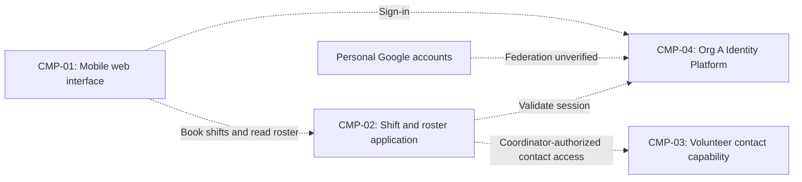

# ARCH-001 — Volunteer shift sign-up for the Riverside Food Bank architecture

## 1. Context and scope

This draft examines PRD-001 version 1, status approved, owned by Priya Nair.
The product lets approximately 120 volunteers sign in and book warehouse shifts
from mobile web browsers, and gives the coordinator a daily roster. Payroll,
donations, and an installed mobile application are outside the stated scope.

No inspection scope was named and no code or configuration was inspected.
No existing ARCH or local ADR was found at the contract document paths.
The proposed outcome is create because no ARCH covers this system. The request
to proceed without questions does not confirm that outcome; it remains null.
Only the mandated identity provider is resolved. The component shape below is
a proposal, not evidence of implementation or acceptance.

## 2. Quality drivers

PRD-001#NFR-001 requires administrator revocation of volunteer sessions to take
effect within five minutes. This governs both session creation in PRD-001#FR-001
and continued authenticated booking in PRD-001#FR-002; selecting a provider alone
does not establish that guarantee.

PRD-001#NFR-002 restricts phone-number visibility to the coordinator. Data ownership
and access enforcement must therefore agree across contact data and the roster.
PRD-001#NFR-003 requires hosted services for the whole product; it does not select
a provider, deployment units, or environments. PRD-001#NFR-004 requires personal
Google accounts. POL-001#SET-01 mandates Org A Identity Platform (OIDC) as the
identity and authentication platform. Google federation through that platform
could reconcile the requirements, but its availability is unknown. Direct Google
integration that bypasses the mandated platform would conflict with policy.

The operating context is internal, from PRD-001, despite its release being named
Pilot. The framework floor requires constraint, security, and privacy; these are
covered by the existing NFRs. POL-001#SET-02 additionally requires compliance and
accessibility, neither of which has an NFR in this PRD. Their targets remain PRD
owner questions, not invented architectural decisions.

## 3. Components

Dashed connections show proposed logical interactions. Application boundaries
await ARCH-001#DEC-04; they do not imply separate services or deployments. Data
ownership awaits ARCH-001#DEC-05 and ARCH-001#DEC-08. Authentication and session
integration await ARCH-001#DEC-02 and ARCH-001#DEC-07.



```yaml items
components:
  - id: CMP-01
    status: active
    name: "Mobile web interface"
    responsibility: "Proposed browser-facing sign-in, booking, and coordinator roster interface; does not own authoritative booking or contact data or enforce access by itself. Boundary awaits ARCH-001#DEC-04."
    owns_data: []
    interacts_with:
      - "CMP-02"
      - "CMP-04"
    deployment: "Open: see DEC-03"
    upstream:
      - {id: PRD-001, item: NFR-001, relation: informed_by, version: 1, hash: null}
      - {id: PRD-001, item: NFR-002, relation: informed_by, version: 1, hash: null}
      - {id: PRD-001, item: NFR-003, relation: informed_by, version: 1, hash: null}
      - {id: PRD-001, item: NFR-004, relation: informed_by, version: 1, hash: null}
  - id: CMP-02
    status: active
    name: "Shift and roster application"
    responsibility: "Proposed booking authority and roster query capability, enforcing authenticated access; does not authenticate Google credentials or expose volunteer contacts without authorization. Boundary awaits ARCH-001#DEC-04."
    owns_data:
      - "Proposed: shift availability and bookings, pending ARCH-001#DEC-05"
    interacts_with:
      - "CMP-01"
      - "CMP-03"
      - "CMP-04"
    deployment: "Open: see DEC-03"
    upstream:
      - {id: PRD-001, item: NFR-001, relation: informed_by, version: 1, hash: null}
      - {id: PRD-001, item: NFR-002, relation: informed_by, version: 1, hash: null}
      - {id: PRD-001, item: NFR-003, relation: informed_by, version: 1, hash: null}
  - id: CMP-03
    status: active
    name: "Volunteer contact capability"
    responsibility: "Proposed authority for volunteer contact data and coordinator-only disclosure; does not own credentials or bookings. This logical capability need not be a separate service."
    owns_data:
      - "Proposed: volunteer contact records, including phone numbers, pending ARCH-001#DEC-08"
    interacts_with:
      - "CMP-02"
    deployment: "Open: see DEC-03"
    upstream:
      - {id: PRD-001, item: NFR-002, relation: informed_by, version: 1, hash: null}
      - {id: PRD-001, item: NFR-003, relation: informed_by, version: 1, hash: null}
  - id: CMP-04
    status: active
    name: "Org A Identity Platform (OIDC)"
    responsibility: "Mandated identity and authentication capability; does not settle application session revocation, personal Google federation, or coordinator authorization. Internal implementation and data ownership were not inspected."
    owns_data: []
    interacts_with:
      - "CMP-01"
      - "CMP-02"
      - "Personal Google accounts (federation unverified)"
    deployment: "Open: see DEC-03"
    upstream:
      - {id: PRD-001, item: NFR-001, relation: informed_by, version: 1, hash: null}
      - {id: PRD-001, item: NFR-003, relation: informed_by, version: 1, hash: null}
      - {id: PRD-001, item: NFR-004, relation: informed_by, version: 1, hash: null}
      - {id: POL-001, item: SET-01, relation: constrains, version: 3, hash: null}
```

## 4. Architectural questions

```yaml items
decisions:
  - id: DEC-01
    status: active
    question: "Which identity provider handles volunteer sign-in?"
    blocking: true
    state: resolved
    resolved_by: [POL-001#SET-01]
    notes: "The PRD NEEDS ADR marker is answered exactly by the approved identity and authentication mandate. This resolves platform selection only; Google account compatibility and session revocation remain separate questions. No ADR is required for this policy resolution."
    upstream:
      - {id: PRD-001, item: FR-001, relation: informed_by, version: 1, hash: null}
      - {id: PRD-001, item: NFR-004, relation: informed_by, version: 1, hash: null}
  - id: DEC-02
    status: active
    question: "How will administrator revocation invalidate volunteer sessions across application entry points within five minutes?"
    blocking: true
    state: open
    resolved_by: []
    notes: "The identity mandate specifies no revocation protocol or application session behavior. Central validation versus bounded session lifetimes with revocation checks entails availability and enforcement trade-offs; no mechanism is accepted."
    upstream:
      - {id: PRD-001, item: FR-001, relation: informed_by, version: 1, hash: null}
      - {id: PRD-001, item: FR-002, relation: informed_by, version: 1, hash: null}
      - {id: PRD-001, item: NFR-001, relation: informed_by, version: 1, hash: null}
  - id: DEC-03
    status: active
    question: "What hosted deployment topology will run the whole product?"
    blocking: true
    state: open
    resolved_by: []
    notes: "Hosted services are required, but provider, units, environments, and integration with the organization platform are unselected. A consolidated managed application reduces deployment coordination; separate managed units permit independent operation but add integration work. Neither is decided."
    upstream:
      - {id: PRD-001, item: FR-001, relation: informed_by, version: 1, hash: null}
      - {id: PRD-001, item: FR-002, relation: informed_by, version: 1, hash: null}
      - {id: PRD-001, item: FR-003, relation: informed_by, version: 1, hash: null}
      - {id: PRD-001, item: NFR-003, relation: informed_by, version: 1, hash: null}
  - id: DEC-04
    status: active
    question: "What shared application boundaries separate the web interface, session integration, booking and roster logic, and contact capability?"
    blocking: true
    state: open
    resolved_by: []
    notes: "The component diagram proposes logical responsibilities only. Modules in one application reduce inter-service interfaces; separate services introduce explicit contracts and operational overhead. No boundary choice has been accepted."
    upstream:
      - {id: PRD-001, item: FR-001, relation: informed_by, version: 1, hash: null}
      - {id: PRD-001, item: FR-002, relation: informed_by, version: 1, hash: null}
      - {id: PRD-001, item: FR-003, relation: informed_by, version: 1, hash: null}
      - {id: PRD-001, item: NFR-001, relation: informed_by, version: 1, hash: null}
      - {id: PRD-001, item: NFR-002, relation: informed_by, version: 1, hash: null}
  - id: DEC-05
    status: active
    question: "Which component owns the authoritative shift availability and booking records used by booking and roster views?"
    blocking: true
    state: open
    resolved_by: []
    notes: "The proposal places authority in the shift and roster application. Ownership and the shared read/write interface must be agreed so independent epics do not maintain conflicting booking truth. No datastore or service is selected."
    upstream:
      - {id: PRD-001, item: FR-002, relation: informed_by, version: 1, hash: null}
      - {id: PRD-001, item: FR-003, relation: informed_by, version: 1, hash: null}
  - id: DEC-06
    status: active
    question: "Where and how will coordinator-only authorization be enforced for every phone-number disclosure?"
    blocking: true
    state: open
    resolved_by: []
    notes: "Coordinator role authority and enforcement across roster and contact interfaces are unspecified. Authentication policy does not establish authorization; hiding fields in the browser alone would not meet the privacy requirement."
    upstream:
      - {id: PRD-001, item: FR-003, relation: informed_by, version: 1, hash: null}
      - {id: PRD-001, item: NFR-002, relation: informed_by, version: 1, hash: null}
  - id: DEC-07
    status: active
    question: "How will personal Google accounts authenticate through the mandated organization identity platform?"
    blocking: true
    state: open
    resolved_by: []
    notes: "Federation is a possible reconciliation, not a verified capability or accepted design. Direct Google sign-in bypassing the mandated platform conflicts with policy. If federation is unavailable, the PRD owner must resolve the account constraint; the architecture cannot silently replace it."
    upstream:
      - {id: PRD-001, item: FR-001, relation: informed_by, version: 1, hash: null}
      - {id: PRD-001, item: NFR-004, relation: informed_by, version: 1, hash: null}
  - id: DEC-08
    status: active
    question: "Which component is the authoritative owner of volunteer contact data consumed by coordinator views?"
    blocking: true
    state: open
    resolved_by: []
    notes: "A contact capability is proposed, but ownership and its interface to roster data are unaccepted. The identity mandate does not assign ownership of phone numbers."
    upstream:
      - {id: PRD-001, item: FR-003, relation: informed_by, version: 1, hash: null}
      - {id: PRD-001, item: NFR-002, relation: informed_by, version: 1, hash: null}
```

## 5. Evidence inspected

```yaml items
evidence:
  - id: EVD-01
    status: active
    source: "PRD-001"
    kind: prd
    finding: "Version 1, status approved: volunteer sign-in, authenticated shift booking, and coordinator rosters; five-minute volunteer session revocation, coordinator-only phone visibility, hosted services, and personal Google accounts. Internal operating context; no compliance or accessibility NFR."
    classification: context
  - id: EVD-02
    status: active
    source: "POL-001#SET-01"
    kind: policy
    finding: "Version 3, status approved; SET-01 active: mandates Org A Identity Platform (OIDC) for identity and authentication with no overrides. The referenced organization ADR-104 is not supplied locally and was not consulted."
    classification: policy
  - id: EVD-03
    status: active
    source: "POL-001#SET-02"
    kind: policy
    finding: "Version 3, status approved; SET-02 active: adds compliance and accessibility for internal, pilot, and production operating contexts. Applies to this internal product."
    classification: policy
```

## 6. Deployment

All product runtime services must be hosted under PRD-001#NFR-003. No deployment
platform, persistence technology, environment layout, or number of deployment
units is accepted. ARCH-001#DEC-03 holds these choices open. The browser is a client,
not an on-site server. The mandated identity capability's hosting arrangement is
unverified; its mandate alone does not settle the topology. Logical components
in section 3 can be modules or separately deployed capabilities pending the
boundary and deployment decisions.

## 7. Requirement changes proposed to the PRD owner

- Priya Nair — PRD-001#NFR-004: direct personal Google sign-in would conflict with
  POL-001#SET-01 if it bypasses the organization platform. Proposed clarification:
  personal Google accounts authenticate through Org A Identity Platform, contingent
  on verified federation support. If unsupported, the owner must revise the account
  constraint with the policy owner; no override or PRD edit is made here.
- Priya Nair — PRD-001, missing compliance and accessibility NFRs: POL-001#SET-02
  requires both categories. Add applicable obligations and measurable acceptance
  criteria. Their scope and targets remain product questions; no new requirement
  IDs, priorities, or releases are assigned by this architecture.

## 8. Open questions

- [NEEDS CLARIFICATION: No inspection scope was named and no code or configuration was inspected; existing implementation, reusable services, and runtime behavior are unknown.]
- [NEEDS CLARIFICATION: The organization platform's personal Google federation and revocation capabilities are unverified; organization ADR-104 and platform implementation were not inspected.]
- [NEEDS CLARIFICATION: Compliance obligations and accessibility acceptance criteria required by POL-001#SET-02 are absent from PRD-001 and need owner definition.]
- [NEEDS CLARIFICATION: ARCH-001#DEC-02 through ARCH-001#DEC-08 remain open because no explicit architectural choices were made; the create outcome is also unconfirmed.]
- [NEEDS CLARIFICATION: host model/session identity unavailable]

## Change Log

| Version | Date | Author | Change | Items affected |
|---|---|---|---|---|
| 1 | 2026-09-28 | codex (session unknown) | Initial draft for PRD-001 v1; proposed components and open shared decisions recorded without questions; exact host provenance unavailable. Policy resolution: interview.max_calls=8 (default); architecture.mandated_platforms=Org A Identity Platform (OIDC) for identity and authentication (POL-001#SET-01); quality.required_categories=+compliance,+accessibility (POL-001#SET-02) | all |
