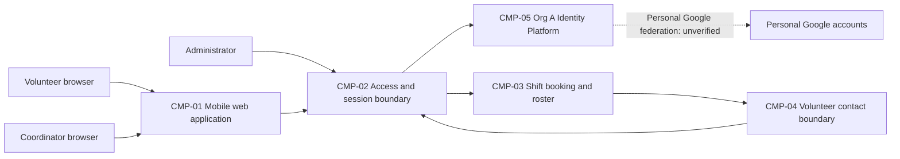

# ARCH-001 — Volunteer shift sign-up for the Riverside Food Bank architecture

## 1. Context and scope

This proposal describes mobile web sign-in, warehouse shift booking, and the coordinator's daily roster for approximately 120 volunteers. It examines PRD-001 version 1, status approved, owned by Priya Nair. Payroll and donations are outside the product scope.

The request explicitly selected PRD-001 and instructed proceeding without questions. No inspection scope was named and no code or configuration was inspected. No existing ARCH or ADR documents were found at the contract paths. A new architecture is proposed because no ARCH covers this system; the creation outcome remains unconfirmed. The proposed component boundaries and interactions below are not accepted decisions. Only the identity-provider question is resolved by approved policy; no ADR is written.

## 2. Quality drivers

PRD-001#NFR-001 requires administrator revocation to stop a volunteer's sessions within five minutes, including access to authenticated booking. PRD-001#NFR-002 restricts volunteer phone numbers to the coordinator. These require explicit session enforcement and contact-data authorization decisions, beyond choosing an identity provider.

PRD-001#NFR-003 applies hosted services to the whole product; it does not choose a hosting platform or deployment topology. PRD-001#NFR-004 requires personal Google accounts for sign-in. POL-001#SET-01 mandates Org A Identity Platform (OIDC) for identity and authentication. Whether that platform can federate personal Google accounts is unknown; the mandate alone does not demonstrate compatibility.

The operating context is internal, taken from PRD-001, despite its Pilot release label. The framework floor requires constraint, security, and privacy. POL-001#SET-02 adds compliance and accessibility. The PRD covers the floor but contains no compliance or accessibility NFRs; their required outcomes remain unanswered product questions for Priya Nair. They are not invented architectural requirements or DEC items.

## 3. Components

The diagram shows proposed logical responsibilities, not approved service boundaries. Solid arrows show proposed interactions; the dotted Google federation path is unverified. ARCH-001#DEC-04 leaves boundaries open, and ARCH-001#DEC-07 leaves deployment open. Proposed data ownership remains subject to ARCH-001#DEC-02, ARCH-001#DEC-05, and ARCH-001#DEC-06.



```yaml items
components:
  - id: CMP-01
    status: active
    name: "Mobile web application"
    responsibility: "Presents sign-in, booking, and coordinator roster views; is not the authority for authorization or durable business data."
    owns_data: []
    interacts_with:
      - "CMP-02"
    deployment: "Open: see DEC-07"
    upstream:
      - {id: PRD-001, item: NFR-002, relation: informed_by, version: 1, hash: null}
      - {id: PRD-001, item: NFR-003, relation: informed_by, version: 1, hash: null}
  - id: CMP-02
    status: active
    name: "Access and session boundary"
    responsibility: "Proposed enforcement point for application sessions, administrator revocation, and role checks; delegates authentication to the mandated identity platform and does not own booking records."
    owns_data:
      - "Proposed application session and revocation state; ownership remains open in DEC-02."
      - "Proposed application role assignments; authority remains open in DEC-06."
    interacts_with:
      - "CMP-01"
      - "CMP-03"
      - "CMP-04"
      - "CMP-05"
    deployment: "Open: see DEC-07"
    upstream:
      - {id: PRD-001, item: NFR-001, relation: informed_by, version: 1, hash: null}
      - {id: PRD-001, item: NFR-002, relation: informed_by, version: 1, hash: null}
      - {id: PRD-001, item: NFR-003, relation: informed_by, version: 1, hash: null}
  - id: CMP-03
    status: active
    name: "Shift booking and roster"
    responsibility: "Proposed authority for open shifts, accepted bookings, and daily roster reads; does not authenticate users or own volunteer phone numbers."
    owns_data:
      - "Proposed shift availability and booking records; ownership remains open in DEC-05."
    interacts_with:
      - "CMP-02"
      - "CMP-04"
    deployment: "Open: see DEC-07"
    upstream:
      - {id: PRD-001, item: NFR-002, relation: informed_by, version: 1, hash: null}
      - {id: PRD-001, item: NFR-003, relation: informed_by, version: 1, hash: null}
  - id: CMP-04
    status: active
    name: "Volunteer contact boundary"
    responsibility: "Proposed owner and disclosure boundary for volunteer phone numbers, enforcing coordinator-only access; does not own credentials or shift bookings."
    owns_data:
      - "Proposed volunteer contact records including phone numbers; ownership remains open in DEC-06."
    interacts_with:
      - "CMP-02"
      - "CMP-03"
    deployment: "Open: see DEC-07"
    upstream:
      - {id: PRD-001, item: NFR-002, relation: informed_by, version: 1, hash: null}
      - {id: PRD-001, item: NFR-003, relation: informed_by, version: 1, hash: null}
  - id: CMP-05
    status: active
    name: "Org A Identity Platform (OIDC)"
    responsibility: "Provides organization-mandated identity and authentication; personal Google federation and application session revocation capabilities are unverified. Does not own shift bookings."
    owns_data:
      - "Identity-provider account associations and authentication state; exact storage and Google federation arrangements are unverified."
    interacts_with:
      - "CMP-02"
      - "Personal Google accounts (proposed federation; unverified)"
    deployment: "External mandated platform; hosted-service compliance and integration remain open in DEC-07."
    upstream:
      - {id: PRD-001, item: NFR-001, relation: informed_by, version: 1, hash: null}
      - {id: PRD-001, item: NFR-003, relation: informed_by, version: 1, hash: null}
      - {id: PRD-001, item: NFR-004, relation: informed_by, version: 1, hash: null}
      - {id: POL-001, item: SET-01, relation: constrains, version: 3, hash: null}
```

## 4. Architectural questions

Each question is blocking because the user has not designated any as non-blocking. Options in notes describe trade-offs for later decisions; they have not been selected. A resolved identity-provider question does not resolve the other questions affecting sign-in.

```yaml items
decisions:
  - id: DEC-01
    status: active
    question: "Which identity provider handles volunteer sign-in?"
    blocking: true
    state: resolved
    resolved_by: [POL-001#SET-01]
    notes: "The approved organization mandate answers the PRD's NEEDS ADR marker exactly. It mandates Org A Identity Platform (OIDC), but does not settle Google federation, revocation, or hosting."
    upstream:
      - {id: PRD-001, item: FR-001, relation: informed_by, version: 1, hash: null}
      - {id: PRD-001, item: NFR-004, relation: informed_by, version: 1, hash: null}
  - id: DEC-02
    status: active
    question: "What session enforcement mechanism guarantees administrator revocation takes effect within five minutes?"
    blocking: true
    state: open
    resolved_by: []
    notes: "Compare centrally checked revocable application sessions with provider-backed validation and bounded token lifetimes. Central checks add availability dependencies; token-based enforcement must bound caching and renewal after revocation. The provider mandate proves neither mechanism. Includes sign-in sessions and authenticated booking requests."
    upstream:
      - {id: PRD-001, item: FR-001, relation: informed_by, version: 1, hash: null}
      - {id: PRD-001, item: FR-002, relation: informed_by, version: 1, hash: null}
      - {id: PRD-001, item: NFR-001, relation: informed_by, version: 1, hash: null}
  - id: DEC-03
    status: active
    question: "How will personal Google accounts authenticate through the mandated identity platform?"
    blocking: true
    state: open
    resolved_by: []
    notes: "Native Google federation would preserve both requirements if supported; a platform-approved federation broker would add an integration dependency. Neither capability is evidenced. Direct Google sign-in bypassing the mandated platform is not a policy-compliant fallback."
    upstream:
      - {id: PRD-001, item: FR-001, relation: informed_by, version: 1, hash: null}
      - {id: PRD-001, item: NFR-004, relation: informed_by, version: 1, hash: null}
  - id: DEC-04
    status: active
    question: "What component boundaries separate presentation, session enforcement, booking, and contact-data responsibilities?"
    blocking: true
    state: open
    resolved_by: []
    notes: "The CMP items propose logical boundaries. Modules within one application reduce operational overhead; independently deployed services strengthen isolation but add distributed authorization and interface coordination. No option is accepted."
    upstream:
      - {id: PRD-001, item: FR-001, relation: informed_by, version: 1, hash: null}
      - {id: PRD-001, item: FR-002, relation: informed_by, version: 1, hash: null}
      - {id: PRD-001, item: FR-003, relation: informed_by, version: 1, hash: null}
      - {id: PRD-001, item: NFR-001, relation: informed_by, version: 1, hash: null}
      - {id: PRD-001, item: NFR-002, relation: informed_by, version: 1, hash: null}
  - id: DEC-05
    status: active
    question: "Which component is the authoritative owner of shift availability and accepted bookings?"
    blocking: true
    state: open
    resolved_by: []
    notes: "A single booking authority could serialize competing claims on open shifts and supply roster reads. A separate scheduling authority would require a shared reservation contract. Storage ownership and the consistency guarantee need a decision before booking and roster epics diverge; table structures remain for specs."
    upstream:
      - {id: PRD-001, item: FR-002, relation: informed_by, version: 1, hash: null}
      - {id: PRD-001, item: FR-003, relation: informed_by, version: 1, hash: null}
  - id: DEC-06
    status: active
    question: "Which trusted data boundary owns volunteer phone numbers and enforces coordinator-only disclosure?"
    blocking: true
    state: open
    resolved_by: []
    notes: "An application-owned contact module reduces integration work; a separate contact service isolates sensitive data but adds authorization calls. Either needs an authoritative coordinator role and must prevent phone disclosure through volunteer responses, caches, or logs. The proposed roster interaction does not require adding phone numbers to the roster UI."
    upstream:
      - {id: PRD-001, item: FR-003, relation: informed_by, version: 1, hash: null}
      - {id: PRD-001, item: NFR-002, relation: informed_by, version: 1, hash: null}
  - id: DEC-07
    status: active
    question: "What hosted deployment topology will run the whole product?"
    blocking: true
    state: open
    resolved_by: []
    notes: "A managed application with managed storage limits operational burden; separately hosted presentation and services permit independent scaling but increase integration work. Hosting provider, deployment units, environments, storage placement, and mandated-platform hosting evidence remain unsettled. No on-site server is permitted."
    upstream:
      - {id: PRD-001, item: FR-001, relation: informed_by, version: 1, hash: null}
      - {id: PRD-001, item: FR-002, relation: informed_by, version: 1, hash: null}
      - {id: PRD-001, item: FR-003, relation: informed_by, version: 1, hash: null}
      - {id: PRD-001, item: NFR-003, relation: informed_by, version: 1, hash: null}
  - id: DEC-08
    status: active
    question: "How will accepted bookings become visible in the coordinator's daily roster?"
    blocking: true
    state: open
    resolved_by: []
    notes: "Reading the booking authority directly simplifies consistency but couples roster availability to it; an event-fed read model separates reads but introduces delivery and freshness guarantees. The PRD's live-roster summary provides no numeric freshness target; the owner must clarify that target without an invented NFR."
    upstream:
      - {id: PRD-001, item: FR-002, relation: informed_by, version: 1, hash: null}
      - {id: PRD-001, item: FR-003, relation: informed_by, version: 1, hash: null}
```

## 5. Evidence inspected

```yaml items
evidence:
  - id: EVD-01
    status: active
    source: "PRD-001"
    kind: prd
    finding: "Version 1, status approved: three active FRs cover sign-in, booking, and daily roster; four active NFRs cover five-minute revocation, coordinator-only phone visibility, hosted services for the whole product, and personal Google sign-in. The identity-provider question has a NEEDS ADR marker. Operating context is internal."
    classification: context
  - id: EVD-02
    status: active
    source: "POL-001#SET-01"
    kind: policy
    finding: "Version 3, status approved; SET-01 active: mandates Org A Identity Platform (OIDC) for identity and authentication, with no permitted override. Its cited organization ADR-104 was not supplied or inspected; no federation, revocation, or hosting capabilities are established by this setting."
    classification: policy
  - id: EVD-03
    status: active
    source: "POL-001#SET-02"
    kind: policy
    finding: "Version 3, status approved; SET-02 active: adds compliance and accessibility for internal, pilot, and production contexts. It applies to this internal product; the PRD has no NFR in either category."
    classification: policy
```

## 6. Deployment

PRD-001#NFR-003 requires hosted services across sign-in, booking, roster, and persistent data. ARCH-001#DEC-07 leaves provider, units, environments, and storage placement open. The logical components are not instructions to deploy five services. The identity platform is an external policy dependency whose hosting details remain unverified. The Tuesday/Thursday pilot is a rollout constraint, not evidence of a deployment environment.

## 7. Requirement changes proposed to the PRD owner

- Priya Nair: PRD-001#NFR-004 has an unverified compatibility dependency on POL-001#SET-01. Clarify that personal Google authentication must pass through the mandated identity platform if supported. If federation is unavailable, revise the account constraint through the PRD process or seek a policy-owner change; this ARCH does not waive either requirement or assert incompatibility as fact.
- Priya Nair: PRD-001's NFR collection omits compliance and accessibility, conflicting with the required quality-category coverage in POL-001#SET-02. Add measurable requirements for both categories, with scope and acceptance criteria chosen by the PRD owner. No new requirement IDs or targets are assigned here.

## 8. Open questions

- [NEEDS CLARIFICATION: No inspection scope was named and no code or configuration was inspected; existing implementations, reusable services, and infrastructure capabilities are unknown.]
- [NEEDS CLARIFICATION: Org A platform evidence for personal Google federation, revocation integration, and hosted operation is unavailable; the policy's external ADR-104 source was not inspected.]
- [NEEDS CLARIFICATION: Priya Nair must supply compliance and accessibility outcomes required by policy.]
- [NEEDS CLARIFICATION: PRD-001#FR-003 and the live-roster summary have no measurable freshness target; Priya Nair must clarify it for interface acceptance criteria.]
- [NEEDS CLARIFICATION: ARCH-001#DEC-02 through ARCH-001#DEC-08 remain unanswered because the user requested proceeding without questions; create is proposed but outcome confirmation remains absent.]
- [NEEDS CLARIFICATION: host model/session identity unavailable]

## Change Log

| Version | Date | Author | Change | Items affected |
|---|---|---|---|---|
| 1 | 2026-09-28 | codex (session unknown) | Initial draft for PRD-001 v1. Policy resolution: interview.max_calls=8 (default); architecture.mandated_platforms=Org A Identity Platform (OIDC) for identity and authentication (POL-001#SET-01); quality.required_categories=+compliance,+accessibility (POL-001#SET-02) | all |
| 1 | 2026-09-28 | codex (session unknown) | Validation audit: structural checks passed; host model/session provenance remains unavailable (self-check 3, BEH-13, VER-14). Retained draft status, empty approval fields, and unconfirmed outcome; no ADR or approval required restoration. Readiness handoff withheld under ERR-05. Policy resolution: interview.max_calls=8 (default); architecture.mandated_platforms=Org A Identity Platform (OIDC) for identity and authentication (POL-001#SET-01); quality.required_categories=+compliance,+accessibility (POL-001#SET-02) | generated_by, validation |
