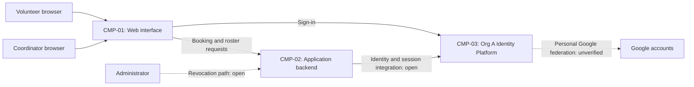

# ARCH-001 — Volunteer shift sign-up for the Riverside Food Bank architecture

## 1. Context and scope

Defined against PRD-001 version 1, status approved, owned by Priya Nair. The system
lets about 120 volunteers book warehouse shifts from mobile browsers and lets the
coordinator see a daily roster. Sign-in, booking, roster access and their shared
security and data responsibilities are in scope. Payroll, donations and installed
mobile apps are outside the product scope.

The operating context is internal, as stated by the PRD; its Pilot target release
does not change that context. No inspection scope was named and no code or
configuration was inspected. No existing ARCH or ADR was found in the contract
document paths. Existing implementation and reuse suitability remain unknown.

A new architecture description is proposed because no ARCH covers this system.
The request selected PRD-001 but did not explicitly confirm the create outcome;
outcome remains null. Per the request to proceed without questions, only the
mandated platform resolves a decision, and no ADR is written. Components and
interactions below are proposals wherever an open decision applies.

## 2. Quality drivers

PRD-001#NFR-001 requires administrator revocation of volunteer sessions to take
effect within five minutes. ARCH-001#DEC-02 must establish how revocation reaches
every volunteer-session enforcement point, including booking requests. The
identity mandate alone does not establish this behavior.

PRD-001#NFR-002 limits phone-number visibility to the coordinator. Contact ownership
and authorization enforcement remain separate questions, ARCH-001#DEC-05 and
ARCH-001#DEC-08; browser hiding alone cannot establish this restriction.

PRD-001#NFR-003 requires hosted services for the whole product. Hosting provider,
deployment units and environments remain open under ARCH-001#DEC-03.
PRD-001#NFR-004 requires personal Google accounts. POL-001#SET-01 mandates Org A
Identity Platform (OIDC) as the product identity provider. Google federation through
that platform is a possible compatible route, but its support is unknown and
ARCH-001#DEC-04 remains open. Direct Google integration that bypasses the mandated
provider must not be assumed to satisfy policy.

The internal-context floor requires constraint, security and privacy categories;
PRD-001#NFR-001 through PRD-001#NFR-004 cover those categories. POL-001#SET-02 adds
compliance and accessibility. Both categories lack NFRs and measurable acceptance
criteria; these are unanswered product questions for Priya Nair, not decisions
that architecture can invent. No availability, latency or roster-freshness target
is inferred from the summary's description of a live roster.

## 3. Components

The proposed shape places business enforcement behind the web interface. Logical
components do not select deployment units. Application boundaries are open under
ARCH-001#DEC-06; proposed data ownership is subject to ARCH-001#DEC-05 and
ARCH-001#DEC-07. Dashed Google federation is unverified (ARCH-001#DEC-04).



```yaml items
components:
  - id: CMP-01
    status: active
    name: "Web interface"
    responsibility: "Proposed mobile browser interface for sign-in, booking and the coordinator roster; does not own authoritative business data or enforce access by itself."
    owns_data: []
    interacts_with:
      - "CMP-02"
      - "CMP-03"
    deployment: "Open: see DEC-03"
    upstream:
      - {id: PRD-001, item: NFR-002, relation: informed_by, version: 1, hash: null}
      - {id: PRD-001, item: NFR-003, relation: informed_by, version: 1, hash: null}
  - id: CMP-02
    status: active
    name: "Application backend"
    responsibility: "Proposed shared boundary for booking, roster reads and application access enforcement; does not act as an independent identity provider. Internal boundaries and session integration remain open."
    owns_data:
      - "Proposed: warehouse shifts and bookings (DEC-07)"
      - "Proposed: volunteer contact records (DEC-05)"
    interacts_with:
      - "CMP-01"
      - "CMP-03"
    deployment: "Open: see DEC-03"
    upstream:
      - {id: PRD-001, item: NFR-001, relation: informed_by, version: 1, hash: null}
      - {id: PRD-001, item: NFR-002, relation: informed_by, version: 1, hash: null}
      - {id: PRD-001, item: NFR-003, relation: informed_by, version: 1, hash: null}
  - id: CMP-03
    status: active
    name: "Org A Identity Platform (OIDC)"
    responsibility: "Policy-mandated product identity and authentication provider; does not own booking or roster behavior. Google federation and revocation capabilities are unverified."
    owns_data:
      - "Organization identity records; application mapping remains undecided"
    interacts_with:
      - "CMP-01"
      - "CMP-02"
      - "Google accounts (federation unverified)"
    deployment: "External organization platform; application integration hosting open under DEC-03"
    upstream:
      - {id: PRD-001, item: NFR-001, relation: informed_by, version: 1, hash: null}
      - {id: PRD-001, item: NFR-004, relation: informed_by, version: 1, hash: null}
      - {id: POL-001, item: SET-01, relation: constrains, version: 3, hash: null}
```

## 4. Architectural questions

```yaml items
decisions:
  - id: DEC-01
    status: active
    question: "Which identity provider handles volunteer sign-in?"
    blocking: true
    state: resolved
    resolved_by: [POL-001#SET-01]
    notes: "POL-001#SET-01 mandates Org A Identity Platform (OIDC). This settles only the provider choice, not Google federation, application sessions or revocation."
    upstream:
      - {id: PRD-001, item: FR-001, relation: informed_by, version: 1, hash: null}
      - {id: PRD-001, item: FR-002, relation: informed_by, version: 1, hash: null}
      - {id: PRD-001, item: NFR-001, relation: informed_by, version: 1, hash: null}
      - {id: PRD-001, item: NFR-004, relation: informed_by, version: 1, hash: null}
  - id: DEC-02
    status: active
    question: "How will administrator revocation invalidate every volunteer session within five minutes?"
    blocking: true
    state: open
    resolved_by: []
    notes: "Open: the mandate specifies no session lifetime or revocation contract. Platform-mediated invalidation and application session enforcement require capability evidence and a decision."
    upstream:
      - {id: PRD-001, item: FR-001, relation: informed_by, version: 1, hash: null}
      - {id: PRD-001, item: FR-002, relation: informed_by, version: 1, hash: null}
      - {id: PRD-001, item: NFR-001, relation: informed_by, version: 1, hash: null}
  - id: DEC-03
    status: active
    question: "What hosted deployment topology will run the whole product?"
    blocking: true
    state: open
    resolved_by: []
    notes: "Open: hosted services are required, but provider, application and persistence deployment units, and environment boundaries have not been selected."
    upstream:
      - {id: PRD-001, item: FR-001, relation: informed_by, version: 1, hash: null}
      - {id: PRD-001, item: FR-002, relation: informed_by, version: 1, hash: null}
      - {id: PRD-001, item: FR-003, relation: informed_by, version: 1, hash: null}
      - {id: PRD-001, item: NFR-003, relation: informed_by, version: 1, hash: null}
  - id: DEC-04
    status: active
    question: "How will personal Google accounts authenticate through the mandated Org A identity platform?"
    blocking: true
    state: open
    resolved_by: []
    notes: "Open: federation compatibility is unverified. No direct Google bypass is accepted. If the organization platform cannot support personal accounts, the PRD owner must resolve the requirement conflict."
    upstream:
      - {id: PRD-001, item: FR-001, relation: informed_by, version: 1, hash: null}
      - {id: PRD-001, item: FR-002, relation: informed_by, version: 1, hash: null}
      - {id: PRD-001, item: NFR-004, relation: informed_by, version: 1, hash: null}
  - id: DEC-05
    status: active
    question: "Which component is authoritative for volunteer contact data?"
    blocking: true
    state: open
    resolved_by: []
    notes: "Open: application-owned contact records are proposed; an organization directory could instead be authoritative. Neither source availability nor a shared ownership contract is established."
    upstream:
      - {id: PRD-001, item: FR-003, relation: informed_by, version: 1, hash: null}
      - {id: PRD-001, item: NFR-002, relation: informed_by, version: 1, hash: null}
  - id: DEC-06
    status: active
    question: "What component boundaries will separate identity integration, booking and roster responsibilities?"
    blocking: true
    state: open
    resolved_by: []
    notes: "Open: a web interface and shared application backend are proposed. Shared backend modules versus independently deployed services require an explicit choice before separate epics establish incompatible boundaries."
    upstream:
      - {id: PRD-001, item: FR-001, relation: informed_by, version: 1, hash: null}
      - {id: PRD-001, item: FR-002, relation: informed_by, version: 1, hash: null}
      - {id: PRD-001, item: FR-003, relation: informed_by, version: 1, hash: null}
      - {id: PRD-001, item: NFR-001, relation: informed_by, version: 1, hash: null}
      - {id: PRD-001, item: NFR-002, relation: informed_by, version: 1, hash: null}
  - id: DEC-07
    status: active
    question: "What authoritative booking-data contract will connect shift reservations to coordinator roster reads?"
    blocking: true
    state: open
    resolved_by: []
    notes: "Open: application-owned bookings with roster reads of the same authority are proposed. A separate roster projection would require an agreed consistency contract; exact fields and migrations belong in feature specs."
    upstream:
      - {id: PRD-001, item: FR-002, relation: informed_by, version: 1, hash: null}
      - {id: PRD-001, item: FR-003, relation: informed_by, version: 1, hash: null}
  - id: DEC-08
    status: active
    question: "Where will coordinator-only access to volunteer phone numbers be enforced?"
    blocking: true
    state: open
    resolved_by: []
    notes: "Open: server-side authorization shared by booking and roster interfaces is proposed. Coordinator role authority and enforcement across every contact-data response require a decision; client-side hiding is insufficient."
    upstream:
      - {id: PRD-001, item: FR-002, relation: informed_by, version: 1, hash: null}
      - {id: PRD-001, item: FR-003, relation: informed_by, version: 1, hash: null}
      - {id: PRD-001, item: NFR-002, relation: informed_by, version: 1, hash: null}
```

## 5. Evidence inspected

```yaml items
evidence:
  - id: EVD-01
    status: active
    source: "PRD-001"
    kind: prd
    finding: "Version 1, status approved: three functional requirements cover sign-in, booking and the roster; four NFRs cover revocation, phone privacy, hosted services and personal Google accounts. The identity-provider NEEDS ADR marker is represented by DEC-01."
    classification: context
  - id: EVD-02
    status: active
    source: "POL-001#SET-01"
    kind: policy
    finding: "Version 3, status approved: active setting mandates Org A Identity Platform (OIDC) for identity and authentication, with no override allowed. ADR-104 is a source reference in policy; its external contents were not inspected."
    classification: policy
  - id: EVD-03
    status: active
    source: "POL-001#SET-02"
    kind: policy
    finding: "Version 3, status approved: active setting adds compliance and accessibility for internal, pilot and production contexts. It applies to this internal product; the PRD has no NFRs in these categories."
    classification: policy
```

## 6. Deployment

All product capabilities must run on hosted services under PRD-001#NFR-003; no
on-site server is available. ARCH-001#DEC-03 leaves the hosting provider, web and
backend deployment arrangement, persistence hosting and environments undecided.
The organization identity platform is an external dependency. Its operational
capabilities were not inspected. Proposed logical components do not commit the
project to a cloud vendor, database technology or service count.

## 7. Requirement changes proposed to the PRD owner

- Priya Nair — PRD-001#NFR-004: clarify that personal Google accounts authenticate
  through the mandated Org A Identity Platform, subject to confirmed federation
  support. If that support is unavailable, the personal-account requirement
  conflicts with the platform mandate; revise the account requirement or seek a
  policy change from its owner. No incompatibility is asserted without evidence.
- Priya Nair — missing compliance and accessibility NFRs: POL-001#SET-02 requires
  both categories. Add measurable requirements and owner-approved priorities and
  releases. Architecture does not invent requirement IDs or acceptance targets.

## 8. Open questions

- [NEEDS CLARIFICATION: No inspection scope was named and no code was inspected; existing components, hosting and reuse suitability are unknown.]
- [NEEDS CLARIFICATION: Org A platform support for personal Google federation, session revocation and role integration is unknown; policy does not document these capabilities.]
- [NEEDS CLARIFICATION: Required compliance and accessibility categories have no PRD acceptance criteria; Priya Nair must supply them.]
- [NEEDS CLARIFICATION: The create outcome was proposed but not explicitly confirmed; outcome remains null.]
- [NEEDS CLARIFICATION: host model/session identity unavailable]

## Change Log

| Version | Date | Author | Change | Items affected |
|---|---|---|---|---|
| 1 | 2026-09-28 | codex (session unknown) | Initial draft for PRD-001 v1. Policy resolution: interview.max_calls=8 (default); architecture.mandated_platforms=Org A Identity Platform (OIDC) for identity and authentication (POL-001#SET-01); quality.required_categories=+compliance,+accessibility (POL-001#SET-02) | all |
| 1 | 2026-09-28 | codex (session unknown) | Validation unresolved: host model and session identity unavailable. Draft retained; no status or approval fields required restoration and no ADR was written. Readiness handoff withheld. Policy resolution: interview.max_calls=8 (default); architecture.mandated_platforms=Org A Identity Platform (OIDC) for identity and authentication (POL-001#SET-01); quality.required_categories=+compliance,+accessibility (POL-001#SET-02) | generated_by |
