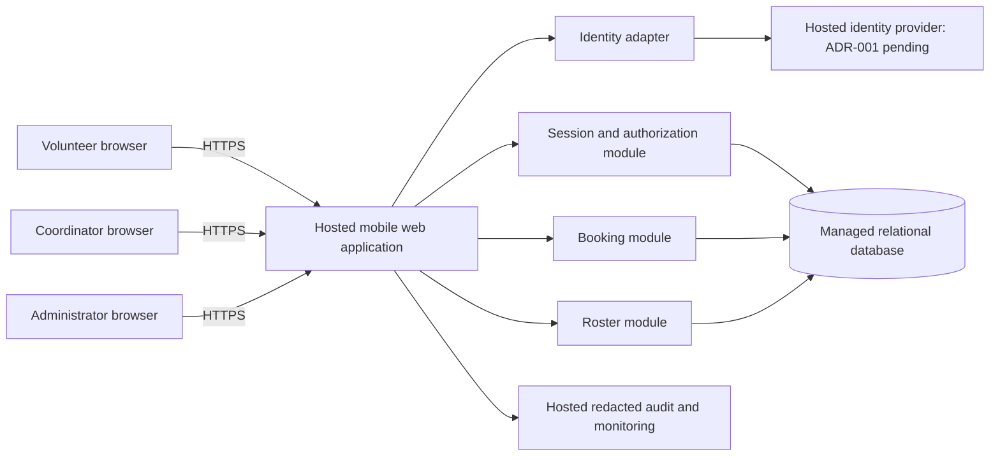

# ARCH-001 — Volunteer shift sign-up

## Scope and design status

This design covers every active current-release requirement in [PRD-001](../prd/PRD-001.md), version 1. It defines a hosted, mobile-first web application for approximately 120 volunteers and one coordinator. It is a proposed architecture, not a record of stakeholder approval or deployed behavior. [Epic readiness](ARCH-001-readiness.md) distinguishes decomposition readiness from implementation dependencies and acceptance evidence.

The source PRD is the only supplied specification. Its referenced BRN-001 is unavailable; no additional requirements are inferred from it. There is no existing application, repository instruction file, test suite, or validation configuration in the supplied workspace.

The identity-provider question in PRD §12 remains material. [ADR-001](../adr/ADR-001.md) records its scope, options, and evidence needed to resolve it. Provider-specific sign-in must not enter an implementation epic as a settled design. Independent booking, roster, security, and hosting contracts are defined below so their epics can be drafted with explicit dependencies.

## Architecture decisions

| ID | Decision | Reason / consequence |
|---|---|---|
| AD-01 | Use one hosted web application with server-side modules and a managed relational database. | The pilot does not justify independently deployed microservices. Transactions keep booking capacity and roster reads consistent. |
| AD-02 | Put all authenticated application access behind the server; use opaque application sessions backed by durable database state. | Application revocation is enforced locally on every protected request, without relying on an identity provider's token lifetime. |
| AD-03 | Separate volunteer, coordinator, and administrator capabilities. | Administration grants session revocation, not access to phone numbers. Roles may be combined only through explicit assignment. |
| AD-04 | Store phone numbers separately and expose them only through the coordinator roster projection. | Privacy applies to APIs, exports, logs, caches, and rendered pages as well as visible controls. |
| AD-05 | Enforce booking invariants in a single database transaction. | Concurrent volunteers cannot take the same last place; retries cannot create duplicate bookings. |
| AD-06 | Host every runtime component and durable store off site. | NFR-003 applies to the whole product, including identity, audit data, backups, and operational tools. |
| AD-07 | Isolate provider integration behind an identity adapter; concrete provider selection is pending ADR-001. | Feature modules depend on an authenticated principal contract rather than provider SDKs or claims. This does not resolve FR-001's provider choice. |

These are design choices for epic planning. No specific cloud vendor, framework, or commercial plan is mandated by the PRD or selected here. The hosted deployment topology is decided; vendor procurement is an implementation task unless it reveals a requirement conflict.

## Components and trust boundaries

The browser is untrusted. Every protected server route resolves the application session, checks account state and role, and performs object-level authorization before accessing data. A browser-supplied volunteer ID or role is never authoritative. The identity provider establishes identity; application-owned role records determine privileges.

The database is private to server workloads and operator access. Browser clients receive neither database credentials nor administrative provider credentials. Deployment secrets reside in the hosting platform's secret store. Use TLS at public boundaries and encrypted managed storage and backups. Human access to production phone data is restricted to the coordinator; runtime service identities may process it to fulfill roster requests. Do not grant administrators routine database-console or export access that bypasses this policy.

| Component | Owns | Contracts / requirements |
|---|---|---|
| Web interface | Mobile sign-in, open-shift list, booking result, daily roster | FR-001–FR-003; all protected requests use session middleware |
| Identity adapter | Login initiation/callback, external identity mapping, fresh-authentication proof | FR-001; ADR-001; no phone or role claims copied into client sessions |
| Session and authorization | Session issuance, expiration, revocation, principal resolution, roles | NFR-001, NFR-002; applied to every protected route |
| Booking | Shift availability and transactional booking | FR-002; volunteer acts only for self |
| Roster | Daily booking projection, coordinator-only contact lookup | FR-003, NFR-002 |
| Hosted data and operations | Durable data, deployment, audit events, recovery | NFR-003; privacy and revocation apply during failure and recovery |

## Data and consistency

| Record | Minimum fields and constraints |
|---|---|
| Account | Internal ID, external issuer/subject mapping (unique), display name, active flag, session generation, authentication-not-before timestamp |
| Role assignment | Account ID and capability; no implicit administrator-to-coordinator inheritance |
| Volunteer contact | Account ID (unique), nullable phone number; separate repository access restricted to roster's authorized coordinator path |
| Application session | Hash of high-entropy cookie token, account ID, generation at issuance, created/expires timestamps, revoked timestamp; never store raw cookie tokens in logs |
| Shift | ID, warehouse label, UTC start/end, local service date, positive capacity, open/closed state, pilot-enabled flag |
| Booking | ID, shift ID, volunteer account ID, creation time; unique `(shift_id, volunteer_id)` |
| Audit event | Event ID, actor internal ID, target internal ID where needed, action, timestamp, outcome, correlation ID; no phone, cookie, password, or provider token |

For the pilot, operational staff provision volunteer records, roles, contacts, and the Tuesday/Thursday shift schedule through a restricted hosted import/runbook. A scheduling or user-management UI is not required by this PRD. Only the coordinator may handle phone input or output; administrators can provision roles and revoke sessions without accessing contacts. The food bank's actual timezone and schedule are deployment inputs, not inferred from the developer workstation's timezone.

An open shift is a future, explicitly open, pilot-enabled shift with remaining capacity. This is a planning assumption to make FR-002 precise; capacity and schedule are configured from the coordinator's existing shift plan. Cancellation, waitlists, overlap limits, booking cutoffs beyond shift start, reminders, and recurring booking are not introduced. If the product requires any of these, amend the PRD before expanding the booking epic.

Booking locks the target shift row, rechecks availability using server time, checks for an existing booking, counts bookings, and inserts only if below capacity, then commits. Every writer uses the same transaction boundary. A repeated booking by the same volunteer returns the existing booking without consuming another place. The final available place admits one concurrent claimant; another receives a full-shift conflict. The daily roster reads committed bookings from the primary database, with no eventually consistent read replica in the pilot path.

## Interfaces and flows

Paths are proposed application contracts, not existing endpoints. Protected responses are private and must not be cached by a shared CDN or service worker. State-changing cookie-authenticated requests require CSRF protection.

| Interface | Authorization | Result / failure behavior |
|---|---|---|
| `GET /auth/start`, `GET /auth/callback` | Identity adapter validates provider response, transaction state, and replay protection | Issues application cookie only after trusted identity resolution; exact protocol and enrollment behavior blocked by ADR-001 |
| `POST /auth/logout` | Current session | Revokes local session and clears cookie; provider logout behavior must be specified in ADR-001 |
| `GET /shifts?from=&to=` | Active volunteer session | Bounded list of eligible shifts with times and remaining places; no volunteer contact data |
| `POST /shifts/{id}/bookings` | Active volunteer session | Books authenticated volunteer; created/existing booking or `409` for full, closed, or started shift; no arbitrary volunteer ID accepted |
| `GET /roster?date=YYYY-MM-DD` | Coordinator capability | Local service day's shifts, counts, booked volunteers' names and available phone numbers; `403` for volunteer or administrator without coordinator capability |
| `POST /admin/volunteers/{id}/revoke-sessions` | Administrator capability | Atomically advances session generation and revocation barrier; success only after durable commit; audit actor/target/outcome |

Missing, expired, or revoked sessions receive `401`. Authenticated callers lacking a capability receive `403`. Invalid date ranges and malformed inputs receive `400`; unavailable dependencies return a generic retryable error without private data. Resource errors must not disclose other volunteers' bookings or contacts.

After login the volunteer sees the open-shift list, submits a booking, and receives the committed result. The coordinator opens a date's roster and can refresh it manually; the page also polls every 30 seconds while visible and refetches on foregrounding. This interval is a proposed interpretation of “live roster” in the summary, not an additional approved latency NFR. The page shows its last successful update and an error when refresh fails, rather than implying stale data is current. No streaming connection is needed.

## Security and privacy acceptance design

### NFR-001: revocation within five minutes

Use a Secure, HttpOnly, SameSite application cookie carrying only an opaque random session token. The server checks its hash against durable session state, account activity, expiration, and the account's session generation on **every** protected request. Do not cache positive authorization results across requests. Long-running jobs and streams that outlive request authorization are outside this pilot design.

An administrator revokes all application sessions for the target volunteer by atomically increasing the account generation and setting an authentication-not-before barrier using database time. Existing sessions immediately mismatch the generation after commit. All replicas consult the authoritative store; a database outage denies protected access rather than accepting a cached session. This design has no planned five-minute grace period: the first subsequent authorization check rejects the old session. Require protected request timeouts below five minutes, and recheck generation inside booking's transaction with a compatible account lock, so a mutation cannot commit on an authorization check older than a completed revocation.

Revocation ends existing application sessions, not the volunteer's right to perform a new sign-in. The identity adapter must reject replays, refreshes, or silent provider sessions that would recreate access using authentication predating the barrier. It must establish fresh authentication after the barrier before issuing a new-generation session. The concrete provider's support for this contract is a blocking evaluation criterion in ADR-001; merely clearing the browser cookie or revoking a provider refresh token is insufficient evidence.

Verify with multiple sessions for the same volunteer across different application replicas, another unaffected volunteer, successful administrator revocation, and protected requests and booking attempts made immediately and at the five-minute boundary. Include concurrent revocation/login, a replayed pre-revocation callback, cached state, store failure, and an in-flight booking. Record server timestamps from the durable revocation commit to rejection. Provider integration must also prove that old provider credentials cannot silently mint a replacement application session.

### NFR-002: phone visibility

Roster authorization runs before the contact lookup, and explicit output projections allow phone only in coordinator responses. Volunteer-facing profile, shift, and booking responses omit phone entirely, including the caller's own phone. An administrator without coordinator capability is also denied. Never send contacts to the browser and hide them with CSS. Disable request/response-body capture and session replay for authenticated pages; redact contacts at log and error-reporting boundaries. Do not place phones in URLs, analytics, public assets, shared caches, or audit payloads.

Verify the volunteer/coordinator/administrator role matrix against direct API calls and rendered payloads, including guessed IDs, forged roles, errors, and warm-cache requests made by a different role. Inspect captured logs and traces for phone values. Removing the coordinator role must affect the next request. Previously viewed information cannot be erased from a person's memory or screenshots; this requirement governs system disclosure.

### NFR-003: hosted whole-product deployment

Production consists of hosted web/server compute, hosted identity, managed relational storage and backups, hosted secret management, and hosted redacted monitoring/audit storage. No local food-bank machine is a runtime dependency. The mobile browser is a client, not an on-site server. Development machines and automated test doubles are not production hosting substitutes.

Use separate production and test environments with synthetic test contacts. Deployment migrations establish constraints and role access before enabling routes. Backups inherit contact access restrictions. A recovery runbook invalidates all restored application sessions and requires fresh authentication, preventing backup restoration from resurrecting revoked access. No availability, recovery-time, or retention target is supplied by the PRD; these are operating-policy inputs, not silently added acceptance thresholds. Establish those policies before storing production contacts.

Verify the deployment inventory includes every runtime/data dependency and exercise login, booking, roster, and revocation using the hosted environment while no food-bank server is available. Exercise recovery and session invalidation in staging. Record the selected vendor configuration and test evidence with the implementation revision.

## Epic boundaries and delivery order

1. **Hosted foundation and application security contracts:** managed schema, application principal/session boundary, roles, secret handling, deployment and audit redaction. Owns shared NFR-001–NFR-003 infrastructure. Provider-independent tests may use a test-only identity adapter.
2. **Volunteer identity:** resolve ADR-001, then implement enrollment/account linking, sign-in, logout, fresh-authentication proof, and administrator revocation end to end. FR-001 is blocked for implementation-epic extraction until the ADR is decided. Do not ship a test adapter or provider bypass.
3. **Open shifts and booking:** shift reads, transaction invariant, mobile booking result. Can be decomposed against the principal contract now; live delivery depends on foundation and completed identity.
4. **Coordinator roster:** date projection, contact authorization, refresh behavior. Can be decomposed now; live delivery depends on foundation, provisioned coordinator identity, and booking data.

These are suggested boundaries, not created or approved epics. No epic IDs or source PRD epic-map entries are generated. Roll out with the PRD's Tuesday/Thursday shifts and then expand the configured schedule. SM-01 remains measured in the coordinator's shift log; no attendance-tracking feature is inferred from a list of bookings.

## Risks and unresolved inputs

| Item | Impact and handling |
|---|---|
| ADR-001 identity provider, enrollment, account recovery and fresh-authentication behavior | Blocks FR-001 epic extraction and integrated sign-in/revocation delivery; resolution criteria are in the ADR. Other epics retain this dependency. |
| ASM-01 smartphone assumption is still open in PRD | Record volunteer-meeting validation before pilot readiness; do not claim it has been validated or add a native app. |
| Shift schedule, capacity, food-bank timezone and initial roster/contact source | Required before importing production shifts and contacts. The data model supports these inputs without a new subsystem. |
| Administrator designation and role assignments | Assign an authorized operator before pilot; do not assume the coordinator automatically has administrator privileges. |
| Hosting vendor, cost, backup/retention and operator access policy | Resolve during foundation work before production data; deployment must meet the already defined NFR-002/NFR-003 boundaries. |
| Roster freshness interpretation | Thirty-second polling is a design assumption. A later stricter latency requirement requires a scoped design review. |

## Verification strategy

This change adds specifications only. There is no runnable application to test, and no repository-defined gate is available. Documentation checks and per-requirement runtime evidence statuses are recorded in [ARCH-001-readiness](ARCH-001-readiness.md). No future acceptance test is reported as passing.

Implementation should establish failing tests before each behavior change: transactional contention and replay tests for booking; session-generation, revocation-race and provider contract tests for identity; role/projection/logging tests for privacy; and hosted end-to-end checks for integration and topology. Run affected checks against the actual candidate revision and record commands, outcomes, and deployment configuration. All must requirements, including shared NFRs, gate pilot release; FR-003 retains its source `should` priority despite inclusion in the current-release design.
