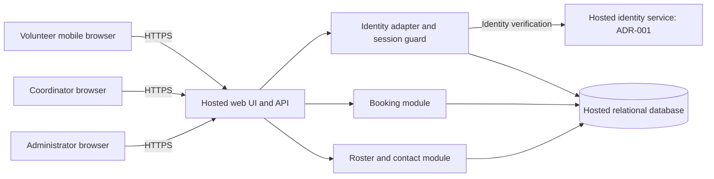

# ADD-001 — Architecture and epic readiness

## 1. Scope and disposition

Source: approved [PRD-001 v1](../prd/PRD-001.md). This document defines the
architecture for its pilot: about 120 volunteers, one coordinator, three daily
warehouse shifts, mobile web access, and hosted operation. Payroll and donations
remain excluded. No application code, repository policies, architecture templates,
or test configuration were present. Referenced BRN-001 was unavailable; this design
uses the approved PRD without reconstructing its upstream material.

**Ready for epic drafting:** FR-002, FR-003, NFR-001, NFR-002, NFR-003.
**Blocked for a provider-specific sign-in epic:** FR-001, pending
[ADR-001](../adr/ADR-001.md). A bounded identity evaluation can proceed now.
Ready means the architecture supplies boundaries, contracts, and testable outcomes;
it does not mean implementation is verified or stakeholder approval has occurred.
Booking and roster can be specified against the identity contract below, but cannot
ship until sign-in and the shared security controls pass integration verification.

## 2. Architecture decisions

| Decision | Design and rationale | Requirement coverage |
|---|---|---|
| D-01 | One hosted web application with internal identity, booking, and roster modules, backed by a hosted relational database. This workload does not justify independent services or a message bus. | All FRs; NFR-003 applies product-wide |
| D-02 | Keep identity verification behind an adapter. Prefer a hosted identity service; leave the specific provider and sign-in method open in ADR-001. | FR-001 |
| D-03 | Own application sessions in the database and validate them on every protected request. Provider tokens never authorize booking or roster APIs directly. | NFR-001; all authenticated flows |
| D-04 | Enforce role checks and phone-field access on the server, using separate public-profile and restricted-contact projections. | NFR-002; FR-003 |
| D-05 | Serialize competing bookings for a shift in a database transaction; enforce unique volunteer/shift bookings. | FR-002 |
| D-06 | Read the roster from committed bookings in the primary database; use refresh and polling rather than a separate reporting store. | FR-003 |

These are the design baseline for drafting epics, not records of human approval.
Vendor, language, and framework choices are deferred unless they change these
contracts. No existing platform mandate was supplied.

## 3. Components and trust boundaries

All modules except the external identity service run within one application
deployment. The browser is untrusted. The server resolves the actor from its session,
checks authorization, and derives volunteer IDs itself. Neither database credentials
nor identity service secrets reach browser code. The database is accessible only to
authorized backend and operational identities, not to public browser clients.

Volunteer, coordinator, and administrator are explicit permissions; administrator
does not imply coordinator. An administrator can revoke sessions but cannot view
phone numbers unless separately assigned coordinator permission. Roles are stored
server-side and are never accepted from client parameters or user-editable claims.

## 4. Data ownership and contracts

| Record | Minimum fields and ownership |
|---|---|
| Account | Internal ID, unique identity issuer/subject pair, active flag, roles, session generation; identity module owns it. Names/emails alone are not identity keys. |
| VolunteerProfile | Account ID and roster display name; contains no phone field. |
| VolunteerContact | Account ID and phone number; restricted contact module owns reads. Kept out of ordinary account, session, and booking responses. |
| Session | Hash of opaque random session ID, account ID, issued generation, expiry; identity module owns it. |
| Shift | ID, start/end instants, capacity, booking-enabled flag; booking module owns it. Site timezone is configuration. |
| Booking | ID, shift ID, volunteer account ID, created time; unique constraint on shift/account pair. Foreign keys preserve referential integrity. |
| SecurityEvent | Actor ID, target ID, action, timestamp, outcome; excludes phones, credentials, and session tokens. |

The identity adapter returns a verified stable issuer/subject pair to the server.
The server maps it to an active local account and issues an opaque application
session in a Secure, HttpOnly cookie with an appropriate SameSite policy. Verify
callback correlation and replay protection; exact protocol checks belong to the
provider decision. Protect state-changing cookie-authenticated requests against CSRF.
Do not store bearer credentials in browser local storage.

Conceptual HTTP contracts (exact routes may be refined in stories):

| Operation | Authorization and result |
|---|---|
| `GET /shifts` | Active volunteer session; available shift details and remaining capacity, no other volunteer contact data. |
| `POST /shifts/{id}/bookings` | Active volunteer session; book for the session actor, never a submitted volunteer ID. Return booking confirmation, or conflict when closed/full. Repeating an existing booking returns that booking. |
| `GET /roster?date=YYYY-MM-DD` | Coordinator permission; list that local day's shifts and booked volunteer names. Only this authorized projection may include phones. |
| `POST /accounts/{id}/revoke-sessions` | Administrator permission; increment target account's session generation durably and record the event before reporting success. |

Unauthenticated, revoked, and expired sessions receive an authentication error;
authenticated actors lacking permission receive an authorization error. Contact
fields must be absent from unauthorized response bodies, HTML, embedded page data,
exports, telemetry, and error details. Hiding a field in the UI is insufficient.
Sensitive responses use `Cache-Control: no-store`; no service worker or shared cache
stores roster/contact payloads. Authorized people can retain information already
shown to them; revocation governs subsequent access, not erasure of past knowledge.

## 5. Critical flows and failure behavior

### Sign-in and session revocation — FR-001, NFR-001

Sign-in completes external identity verification, resolves an eligible local account,
and creates an application session. Provisioning, recovery, and sign-in method are
unresolved in ADR-001; no public self-registration is assumed.

For every protected request, read Session and Account from the primary database.
Accept only unexpired sessions for active accounts whose generation equals the
current account generation. No cached authorization result or read replica may
extend session validity. Fail closed if this check cannot complete.

Revocation increments the account generation transactionally, invalidating all of
that account's existing application sessions across devices and application instances.
Serialize session issuance and revocation on the account row. Do not let an old
callback or silent refresh renew a revoked generation; starting a new sign-in after
revocation is allowed, because revocation is not account suspension. The identity
adapter must not provide a bypass around the application session guard.

The bound is stronger than the PRD's five minutes: protected requests checked after
revocation commits must fail immediately. Recheck authorization inside booking
transactions and before sensitive response delivery. Apply a server request deadline
below five minutes (design target: 30 seconds) so an already running request cannot
continue beyond the revocation window. No persistent authenticated stream is needed.
Revocation must not report success if its database transaction fails.

### Booking — FR-002

An open shift is provisionally defined as booking-enabled, not yet started, and below
capacity. In one transaction, lock the target Shift row, recheck the session and shift
state, return an existing booking if present, otherwise count bookings and insert only
when capacity remains. All writers use this path. The unique constraint protects
against duplicate retries; locking prevents two users taking the final place. Return
success only after commit. A client that loses the response can retry safely.

### Daily roster — FR-003, NFR-002

Translate the requested day into a half-open interval in the configured food-bank
timezone; include shifts whose start is in that interval. Query shifts and committed
bookings, then add contact fields only after coordinator authorization. Include empty
shifts, use deterministic ordering, and fetch from the primary database.

Provide manual refresh and a proposed 30-second polling interval while visible.
Show last successful refresh time and an explicit stale/error state on failure.
The PRD gives no numerical freshness requirement; this is a design target to carry
into the roster epic. Browser polling never substitutes for server authorization.

## 6. Hosting and operations — NFR-003 applies to the whole product

Deploy the web application, database, identity integration, secrets, backups, and
operational logging on hosted services. Volunteers and staff need only a browser;
normal operation requires no food-bank server or staff workstation background process.
Use HTTPS, private backend database access, managed secrets, separate test/production
data, database migrations, and hosted backups with a restore check before the pilot.
Do not log phone fields, auth payloads, or cookies. Use synthetic contacts in tests.

Keep application instances stateless apart from the shared database. Database outage
means booking, roster, and authorization are unavailable; show an explicit error and
never queue an unconfirmed booking as successful. Identity outage prevents new
sign-ins; existing valid application sessions can continue while the database works.
Record server errors, booking conflicts, and revocation outcomes without contact data.
Recovery objectives, retention periods, hosting region, service accounts, and operating
budget must be specified during hosted-foundation planning before deployment; the PRD
does not supply values or vendor commitments.

Pilot only Tuesday/Thursday shifts through configured shift data, then broaden it.
The coordinator's shift log remains the source for SM-01 (83% baseline, 95% target);
bookings alone do not establish attendance or that a shift started fully staffed.

## 7. Assumptions and unresolved decisions

| Item | Working treatment and consequence |
|---|---|
| Identity provider / sign-in method | Explicit PRD decision; ADR-001 is proposed and unresolved. FR-001 is blocked for implementation-epic definition until the evaluation establishes a viable method and account lifecycle. |
| Meaning of open and duplicate booking | Use the transactional semantics in section 5 for epic drafting. Multiple different shifts are allowed; cancellation, waitlists, and conflict scheduling are not introduced. Confirm business semantics when writing booking acceptance criteria. |
| Shift/account/contact provisioning | Assume a controlled hosted operator import/setup process for the pilot. Specify who supplies shift capacity, names, identity mappings, and contacts in foundation stories; no new management UI is promised. Identity mapping depends on ADR-001. |
| Timezone and day boundary | Require explicit food-bank timezone configuration before pilot data is loaded; do not infer it from this editing environment. |
| Coordinator and administrator assignment | Bootstrap roles through controlled operator setup; privilege assignment is not self-service. The same person may hold both roles, but the permissions remain distinct. |
| Roster freshness | Thirty-second polling is proposed, not an approved PRD threshold. A different freshness goal may change the delivery approach. |
| ASM-01 | Still open in the PRD. The smartphone assumption needs its planned user validation; this architecture does not claim that meeting occurred. |

No source requirement is waived, reprioritized, or marked implemented by these assumptions.

## 8. Requirement-to-epic readiness and verification criteria

Every functional epic must inherit **all three NFRs**: revocation governs its protected
requests, phone privacy governs its data paths, and hosted operation governs its runtime.
NFR-003 is product-wide even though no individual FR explicitly references it.

| Requirement | Owner / design evidence | Epic readiness | Required implementation evidence (not yet executed) |
|---|---|---|---|
| FR-001 | Identity adapter; D-02; ADR-001 | BLOCKED: identity provider, method, account lifecycle unresolved | Valid mapped volunteer signs in on mobile; invalid, unmapped, inactive, and replayed sign-ins fail; provider outage handled; callback and session protections verified. |
| FR-002 | Booking module; D-05; section 5 | READY for drafting against session contract; delivery depends on FR-001 and all NFRs | Signed-in volunteer books open shift; closed/full/started reject; concurrent final-place requests yield one new booking; retries yield no duplicates; actor cannot book as another volunteer; revoked session rejects. |
| FR-003 | Roster/contact module; D-04/D-06 | READY for drafting; delivery depends on bookings, sign-in, and all NFRs | Correct day and timezone boundaries, empty shifts, committed booking visibility, refresh/error state; volunteer and administrator-only users denied; coordinator sees authorized phone data. |
| NFR-001 | Session guard and administrator operation; D-03 | READY: application-owned revocation is provider-independent; final identity integration remains a delivery gate | Revoke all sessions on multiple devices/instances; old cookies and provider tokens cannot authorize APIs; verify denial within 300 seconds, including cache, outage, issuance races, and in-flight request cases. |
| NFR-002 | Role guard, contact projection, response/log policy; D-04 | READY: applies across all functional epics | Permission matrix for anonymous, volunteer, administrator-only, coordinator, and dual-role accounts; inspect API/page/cache/log/error outputs for phone leaks; test role removal on next request. |
| NFR-003 | Hosted foundation; D-01; section 6 | READY: applies across the whole product | Deployment inventory and pilot smoke test show every runtime dependency hosted; operate with on-site computers off; verify secrets, backups/restore, and outage behavior. |

Suggested epic boundaries, without creating epic records or changing the generated PRD
epic map: hosted foundation (NFR-003), shared session/security controls (NFR-001/002),
volunteer sign-in (FR-001, after ADR-001), shift booking (FR-002), and coordinator roster
(FR-003). Privacy and revocation acceptance criteria must also appear in each consuming
epic. Foundation and identity evaluation can start together; release requires all must
requirements and a product decision on the should-priority roster requirement.

## 9. Verification record

See [architecture verification](ADD-001-verification.md) for checks against the actual
written documents. The criteria above are future tests, not passing implementation
evidence. This change creates design documents only; it contains no behavior change
to which a failing implementation test could be applied.
