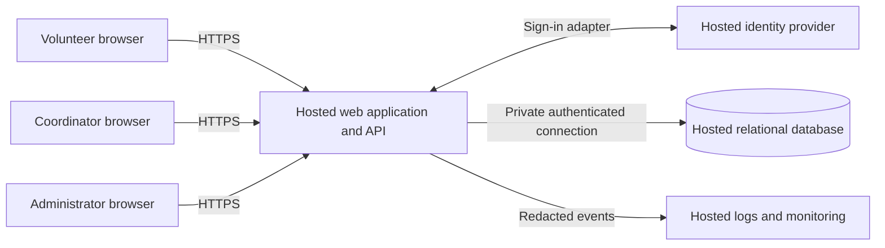

# ARCH-001 — Volunteer shift pilot

## Scope and outcome

This design covers all six active, current-release requirements in [PRD-001](../prd/PRD-001.md), version 1. Five requirements are ready for epic decomposition against the contracts below; FR-001 remains blocked on the identity-provider decision in [ADR-001](../adr/ADR-001.md). Ready means enough architectural definition to write an epic, not implemented, tested, approved, or ready to release. No epics are created here.

The PRD remains authoritative and unchanged, including its generated epic map. This document proposes technical decisions; it does not imply stakeholder approval. Only the PRD is present in this workspace. Its referenced BRN-001, application code, architecture templates, repository instructions, and validation commands are unavailable. Nothing here asserts that those missing sources were reviewed.

Work sequence: define service and data boundaries; settle session and privacy contracts; record the unresolved identity decision and its precise effects; verify coverage and references. Runtime verification belongs to the implementation epics.

## System boundary

Use one mobile-first web application with a server API on a hosted application service, one hosted relational database, and an external hosted identity provider behind a server-side adapter. This keeps transactions and authorization in one service for roughly 120 volunteers and one coordinator. No on-site infrastructure is required. Vendor, language, and hosting region are not mandated by the PRD; choose those in technical setup work without changing these contracts. Identity-provider selection has a separate gate because the PRD explicitly calls for that ADR.

All browser input is untrusted. Browsers have no database credentials or direct database access. The identity provider verifies identity; the application owns roles, sessions, bookings, and access to contact details. An authenticated identity does not itself grant a coordinator or administrator role.

| Component | Responsibility | Requirements |
|---|---|---|
| Sign-in adapter | Validate provider sign-in result and resolve a stable local user ID | FR-001 |
| Session and access module | Authoritative session validation, role checks, administrative revocation | FR-001, NFR-001; used by FR-002 and FR-003 |
| Shift and booking module | List available pilot shifts; atomically reserve capacity | FR-002 |
| Roster module | Return a selected day's booked volunteers to a coordinator | FR-003, NFR-002 |
| Contact repository | Keep phone data out of general user and volunteer-facing projections | NFR-002 |
| Hosted runtime, database, operations | Operate the whole product without an on-site server | NFR-003; constrains every other row |

These are modules in a single deployment, not independent services. A transactional database is the shared source of truth. A queue, microservices, native app, payroll, and donations are not needed for this pilot's stated requirements.

## Data ownership and invariants

| Entity | Minimum fields and invariants |
|---|---|
| User | Local ID, identity issuer and subject (unique pair), display name, active flag, session generation. Never link accounts solely by a matching display name or email. |
| UserRole | User ID and role: volunteer, coordinator, administrator. Provisioned by a trusted operational process; client input cannot assign roles. |
| VolunteerContact | User ID and optional phone number, stored separately from general user data. Read only through coordinator-authorized application operations. |
| Session | Hash of an opaque random credential, user ID, issued time, expiry, user session generation, optional revoked time. Raw credentials are never persisted or logged. |
| Shift | ID, start and end instants, positive capacity, booking-enabled flag. A configured food-bank time zone defines local dates; no time zone is guessed. |
| Booking | ID, shift ID, volunteer ID, creation time; unique (shift ID, volunteer ID). Database foreign keys ensure valid references. |

The proposed meaning of an **open shift** is booking-enabled, not yet started, and below capacity. Seed shifts and capacities through a trusted coordinator-operated setup process. These are explicit design assumptions to carry into the booking epic; the PRD does not specify scheduling administration, capacity rules, cancellations, waiting lists, or shift overlaps. No new management UI or overlap restriction is implied.

## Behavioral contracts

### Identity and sessions

The sign-in adapter exposes a verified `(issuer, subject)` result to the application and never returns provider tokens to booking or roster modules. A known, active local user receives an application session. Unknown identities do not gain access automatically; onboarding and account recovery must be settled in ADR-001. The adapter must validate the authentication protocol's authenticity, audience, expiry, and request binding before issuing a result.

Use an opaque, high-entropy cookie with Secure, HttpOnly, and SameSite attributes and a finite server-side expiry. Mutating browser requests require CSRF protection. The server derives the acting user from the session, never from a submitted volunteer ID. Provider selection does not change these internal contracts.

Every protected request checks its session and the user's current session generation against the authoritative database. Do not cache successful authorization or authorize application calls using a standalone provider access token. [ADR-002](../adr/ADR-002.md) defines the revocation and privacy design, including race handling.

### Book an open shift

1. `GET /shifts?date=YYYY-MM-DD` requires a valid volunteer session and returns shift times, availability, and the caller's booking status. It returns no contact details or other volunteers' identities.
2. `POST /shifts/{id}/bookings` requires the volunteer role. Lock the shift row in a transaction, recheck that it is open, count current bookings, and insert only while capacity permits.
3. Check for the caller's existing booking before returning a full-shift error; a retry returns the same booking without consuming another place. The unique database constraint is a second guard against duplicates.
4. Commit before reporting success. Unknown shift: 404. Closed or full shift: 409 with a stable machine-readable reason. Invalid or revoked session: 401. Missing role: 403. Do not retry an uncertain write as a new logical booking; use the unique pair to recover the result.

All writes use the same locking discipline. A concurrent booking can make displayed availability stale, so the transaction's decision is authoritative. Capacity must not be reduced below existing bookings by the setup process. Successful bookings remain visible after session revocation; revocation is not cancellation.

### Coordinator roster and phone privacy

`GET /coordinator/roster?date=YYYY-MM-DD` requires the coordinator role and queries booked volunteers for shifts starting on that local date. Include shift, booking, and volunteer display identifiers; phone is optional and may be included only in this coordinator response. The PRD requires phone visibility restrictions, not mandatory collection or a new contact-management feature.

Query the primary database so the next read after a committed booking includes it. Refresh on entry, date change, browser focus, and every 30 seconds while visible; provide manual refresh and a last-updated indicator. This refresh interval is a proposed pilot interpretation of the summary's “live roster,” not an invented PRD service-level target. A failed refresh shows an error and the age of previous data; it must not present stale data as current.

Authorize before loading contact records. Use allowlisted response fields, not serialization of whole user records. A volunteer cannot see any phone number, including their own, through this application. An administrator without the coordinator role cannot see phone numbers. A person with both roles can access phones only through coordinator-authorized operations. Phone values must be absent from volunteer HTML, API payloads, preloaded browser state, URLs, logs, errors, analytics, and shared caches. Coordinator responses use `Cache-Control: no-store`; clear displayed roster data on logout or authorization failure.

### Administrative session revocation

`POST /admin/users/{id}/revoke-sessions` requires the administrator role and increments that user's session generation in a transaction. The API reports success only after commit and records a redacted audit event. All existing sessions then fail validation against the new generation. The operation does not require or expose a phone number.

Revocation terminates existing application sessions; disabling future sign-in is a separate action and is not requested by NFR-001. A new deliberate sign-in may issue a new session. No silent renewal may convert a revoked application session into a valid one.

## Hosting and operations

NFR-003 applies to the entire product, including identity, web/API, database, backups, and logs. Deploy runtime components to hosted services, use HTTPS externally, private database connectivity where supported, secrets outside source control, and separate development and pilot data. Expose database access only to the application and restricted operational accounts. Routine infrastructure access does not grant an application role; do not copy phone data into support tools or unrestricted backups.

Use hosted database backups with restricted access; perform a restore exercise before the pilot. A database or session-validation outage must deny protected operations and show a retryable service error, not bypass access checks. Identity-provider failure prevents new sign-ins; existing valid application sessions can continue until their own expiry or revocation. Record booking outcomes, revocation commits, authorization errors, and roster refresh errors without contact data or session secrets.

No availability, retention, recovery-time, or performance targets are stated in the PRD. Do not present implementation defaults as approved requirements. Select retention and backup settings in operations work, and record the configured values before real volunteer data is loaded.

Pilot configuration enables Tuesday and Thursday shifts first, then every shift as authorized by the coordinator. Food-bank time zone, initial shifts/capacities, coordinator and administrator accounts, and trusted contact-data setup are deployment prerequisites. They can be tasks within epics; they do not require additional architecture decisions. Use the coordinator's shift log to evaluate SM-01 (83% baseline, 95% target); booking counts alone do not prove actual staffing at shift start. ASM-01 remains open; this architecture does not claim smartphone access was validated.

## Decision register and readiness

| Decision | State | Effect |
|---|---|---|
| Hosted single application plus relational database | Defined in this proposed architecture | Satisfies NFR-003 structurally; hosting vendor is an epic setup choice |
| ADR-001: identity provider and volunteer sign-in method | Unresolved; blocking | FR-001 cannot receive a provider-specific epic acceptance contract yet |
| ADR-002: application sessions and coordinator-only contacts | Defined/proposed; no unresolved design alternatives | Supports NFR-001 and NFR-002 without relying on provider-specific revocation |

For this assessment, **READY** means a requirement has an owner, stable interface, constraints, and concrete verification scenarios. **BLOCKED** means a material architecture choice prevents that definition. Proposed decisions are usable for decomposition under this request, but are not labeled approved. Delivery dependencies still belong in the epic graph.

| Requirement | Epic readiness | Coverage and expected epic boundary | Dependencies and required evidence |
|---|---|---|---|
| FR-001 | BLOCKED | Identity integration: sign-in adapter and application-session issuance | Close ADR-001 with a selected provider/method, onboarding/recovery model, and integration evidence. Valid sign-in must resolve the intended user; invalid results must issue no session. |
| FR-002 | READY | Shift availability and transactional booking | Depends on the session contract, NFR-001, NFR-003, and FR-001 for integrated delivery. Test open/full/closed shifts, duplicate retries, concurrent last-place booking, and unauthorized requests. Provider-independent module work may use a test adapter. |
| FR-003 | READY | Coordinator daily roster and refresh behavior | Depends on the session/role contract, FR-002 booking data, NFR-001, NFR-002, NFR-003, and FR-001 for integrated delivery. Test date boundaries, committed booking visibility, refresh errors, and coordinator authorization. |
| NFR-001 | READY | Session authority and administrator revocation across all protected operations | ADR-002; exercised in FR-001, FR-002, FR-003 and administrator APIs. Test multiple sessions, cross-instance checks, revocation races, failure to validate, and the five-minute deadline. Provider-specific sign-in integration still depends on FR-001. |
| NFR-002 | READY | Contact isolation and server-enforced coordinator authorization | ADR-002; primarily FR-003, with negative assertions across FR-001/FR-002 and operational outputs. Test anonymous, volunteer, administrator-only, and coordinator roles against APIs, rendered state, logs, and caches. |
| NFR-003 | READY | Hosted deployment and operations for the whole product | Applies to FR-001, FR-002, FR-003, NFR-001, NFR-002. Verify deployment inventory, secrets, remote operation, restricted backups, and restore evidence. Final inventory must include the identity service selected in ADR-001. |

ADR-001 blocks FR-001 decomposition directly. It blocks integrated sign-in and therefore end-to-end delivery of booking and roster transitively; it does not block writing their epics against the defined local session contract. NFR-001 has no provider-revocation dependency because the application validates its own sessions on every request. NFR-002 and NFR-003 must be inherited by all affected epics, not left as unconnected checklist entries.

Suggested decomposition sequence: hosted foundation and session/access contracts; provider-independent booking and roster/contact work; selected identity integration once ADR-001 closes; integrated revocation/privacy tests and pilot rollout. Do not deploy a test adapter or treat a mock-based test as proof of real sign-in.

## Acceptance evidence to require from epics

These are proposed verification scenarios derived from the PRD, not executed runtime results or edits to its requirements. Behavior implementation must first establish meaningful failing tests, then implement and refactor. No repository-specific TDD commands or quality gates are available in this snapshot.

| Requirement | Minimum evidence before delivery acceptance | Current runtime result |
|---|---|---|
| FR-001 | Successful real-provider sign-in; failed and expired authentication rejected; stable user mapping; unknown users handled by the selected onboarding policy | BLOCKED — ADR-001 and implementation absent |
| FR-002 | Persisted booking for a signed-in volunteer; two volunteers competing for the last slot produce exactly one success; retries create one row; full/closed/anonymous attempts fail | NOT_RUN — implementation absent |
| FR-003 | Coordinator sees the correct local day's persisted roster and refreshes after a booking; unauthorized roles denied; no stale-success UI on failures | NOT_RUN — implementation absent |
| NFR-001 | Revoke all of one user's sessions; exercise every protected operation on multiple app instances immediately and at five minutes; old credentials fail, other users remain valid; no mutation commits using authorization invalidated before its final check | NOT_RUN — implementation absent |
| NFR-002 | Seed distinctive phone values; assert absence from non-coordinator responses, HTML/state, errors, logs, analytics, and caches; coordinator succeeds; administrator-only is denied | NOT_RUN — implementation absent |
| NFR-003 | Inventory proves every runtime dependency is hosted; exercise mobile booking and coordinator roster with no food-bank server; restore a restricted hosted backup | NOT_RUN — deployment absent |

Document coverage and link checks are recorded in [verification](ARCH-001-verification.md). They do not substitute for this acceptance evidence.
