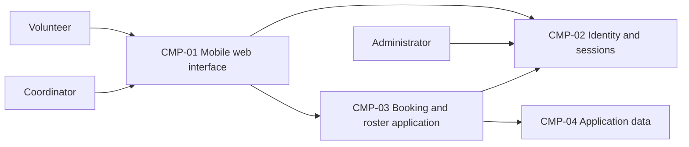

# ARCH-001 — Volunteer shift sign-up for the Riverside Food Bank architecture

## 1. Context and scope

This proposal covers PRD-001 version 1, status approved: mobile web sign-in, volunteer shift booking,
and a daily coordinator roster for approximately 120 volunteers. Session administration and restricted
contact-data access support these capabilities. Payroll and donations are outside the product.

The request selected PRD-001 and instructed proceeding without questions. No existing ARCH covers
the system; creating this description is the proposed outcome, which remains unconfirmed. No
inspection scope was named and no code or configuration was inspected. No policy documents, local
preferences, or ADRs were available at their contract paths. Components and interactions below are
proposals; no architectural decision has been accepted, and no ADR is written.

## 2. Quality drivers

PRD-001#NFR-001 requires administrator revocation of volunteer sessions to take effect within five
minutes. Sign-in and every subsequent booking authorization must share a revocation mechanism;
choosing an identity provider alone does not settle this requirement.

PRD-001#NFR-002 restricts volunteer phone numbers to the coordinator. Ownership of contact data,
coordinator authorization, and filtering at the data-access boundary need an agreed design.
Hiding a field in the browser alone does not establish this privacy property.

PRD-001#NFR-003 requires hosted services for the whole product because there is no on-site server.
Every functional requirement therefore depends on the hosting decision. The PRD's operating
context is internal; its pilot release label does not change that context. The required categories
are constraint, security, and privacy, all covered by these NFRs. No additional policy categories
apply. Mobile browser access and the live roster in the summary also shape shared interfaces.

## 3. Components

The proposed logical responsibilities below do not prescribe separate deployable services.
ARCH-001#DEC-05 governs their boundaries, ARCH-001#DEC-06 their application-data ownership, and
ARCH-001#DEC-07 booking-to-roster interaction. Solid arrows illustrate proposed calls and identity
checks, not accepted interface contracts.



```yaml items
components:
  - id: CMP-01
    status: active
    name: "Mobile web interface"
    responsibility: "Presents sign-in, booking, and coordinator roster flows; is not the authority for identity, booking state, or privacy enforcement."
    owns_data: []
    interacts_with:
      - "CMP-02"
      - "CMP-03"
    deployment: "Open: see DEC-04"
    upstream:
      - {id: PRD-001, item: NFR-001, relation: informed_by, version: 1, hash: null}
      - {id: PRD-001, item: NFR-002, relation: informed_by, version: 1, hash: null}
      - {id: PRD-001, item: NFR-003, relation: informed_by, version: 1, hash: null}
  - id: CMP-02
    status: active
    name: "Identity and sessions"
    responsibility: "Proposed authority for volunteer authentication and administrator session revocation; does not own shift bookings or volunteer phone numbers. Provider and revocation mechanism remain open."
    owns_data:
      - "Proposed: authentication identities and session or revocation state"
    interacts_with:
      - "CMP-01"
      - "CMP-03"
      - "Administrator"
    deployment: "Open: see DEC-04"
    upstream:
      - {id: PRD-001, item: NFR-001, relation: informed_by, version: 1, hash: null}
      - {id: PRD-001, item: NFR-003, relation: informed_by, version: 1, hash: null}
  - id: CMP-03
    status: active
    name: "Booking and roster application"
    responsibility: "Proposed shared application boundary for booking commands, daily roster reads, and coordinator-only contact access; delegates authentication and durable data storage."
    owns_data: []
    interacts_with:
      - "CMP-01"
      - "CMP-02"
      - "CMP-04"
    deployment: "Open: see DEC-04"
    upstream:
      - {id: PRD-001, item: NFR-001, relation: informed_by, version: 1, hash: null}
      - {id: PRD-001, item: NFR-002, relation: informed_by, version: 1, hash: null}
      - {id: PRD-001, item: NFR-003, relation: informed_by, version: 1, hash: null}
  - id: CMP-04
    status: active
    name: "Application data"
    responsibility: "Proposed authoritative storage boundary for shifts, bookings, and volunteer contact records under application access controls; does not authenticate users or independently expose phone numbers to browsers."
    owns_data:
      - "Proposed: warehouse shifts and bookings"
      - "Proposed: volunteer contact records and their identity references"
    interacts_with:
      - "CMP-03"
    deployment: "Open: see DEC-04"
    upstream:
      - {id: PRD-001, item: NFR-002, relation: informed_by, version: 1, hash: null}
      - {id: PRD-001, item: NFR-003, relation: informed_by, version: 1, hash: null}
```

## 4. Architectural questions

```yaml items
decisions:
  - id: DEC-01
    status: active
    question: "Which identity provider handles volunteer sign-in?"
    blocking: true
    state: open
    resolved_by: []
    notes: "Captures the PRD NEEDS ADR marker. Provider identity is also consumed by signed-in booking and session administration. No mandated platform or explicit decision applies."
    upstream:
      - {id: PRD-001, item: FR-001, relation: informed_by, version: 1, hash: null}
      - {id: PRD-001, item: FR-002, relation: informed_by, version: 1, hash: null}
      - {id: PRD-001, item: NFR-001, relation: informed_by, version: 1, hash: null}
  - id: DEC-02
    status: active
    question: "How will administrator revocation make every affected volunteer session unusable within five minutes?"
    blocking: true
    state: open
    resolved_by: []
    notes: "Sign-in and authenticated booking must agree on revocation authority and enforcement across session checks and caches. Identity-provider selection does not independently answer this question."
    upstream:
      - {id: PRD-001, item: FR-001, relation: informed_by, version: 1, hash: null}
      - {id: PRD-001, item: FR-002, relation: informed_by, version: 1, hash: null}
      - {id: PRD-001, item: NFR-001, relation: informed_by, version: 1, hash: null}
  - id: DEC-03
    status: active
    question: "Which shared authorization boundary ensures only the coordinator can read volunteer phone numbers?"
    blocking: true
    state: open
    resolved_by: []
    notes: "Booking and roster access share volunteer records in the proposed shape. The coordinator role and enforcement boundary must prevent phone-number disclosure through either access path."
    upstream:
      - {id: PRD-001, item: FR-002, relation: informed_by, version: 1, hash: null}
      - {id: PRD-001, item: FR-003, relation: informed_by, version: 1, hash: null}
      - {id: PRD-001, item: NFR-002, relation: informed_by, version: 1, hash: null}
  - id: DEC-04
    status: active
    question: "What hosted deployment topology will run the whole product?"
    blocking: true
    state: open
    resolved_by: []
    notes: "Hosted services are required, but provider, deployment units, and environments are undecided. All functional capabilities, session enforcement, and private data access depend on this shared topology."
    upstream:
      - {id: PRD-001, item: FR-001, relation: informed_by, version: 1, hash: null}
      - {id: PRD-001, item: FR-002, relation: informed_by, version: 1, hash: null}
      - {id: PRD-001, item: FR-003, relation: informed_by, version: 1, hash: null}
      - {id: PRD-001, item: NFR-001, relation: informed_by, version: 1, hash: null}
      - {id: PRD-001, item: NFR-002, relation: informed_by, version: 1, hash: null}
      - {id: PRD-001, item: NFR-003, relation: informed_by, version: 1, hash: null}
  - id: DEC-05
    status: active
    question: "What component boundaries divide web presentation, identity and sessions, booking and roster behavior, and application storage?"
    blocking: true
    state: open
    resolved_by: []
    notes: "The component collection proposes logical responsibilities only. Separate epics must agree on those responsibilities and trust boundaries before treating the diagram as settled; physical deployment is a separate question."
    upstream:
      - {id: PRD-001, item: FR-001, relation: informed_by, version: 1, hash: null}
      - {id: PRD-001, item: FR-002, relation: informed_by, version: 1, hash: null}
      - {id: PRD-001, item: FR-003, relation: informed_by, version: 1, hash: null}
      - {id: PRD-001, item: NFR-001, relation: informed_by, version: 1, hash: null}
      - {id: PRD-001, item: NFR-002, relation: informed_by, version: 1, hash: null}
  - id: DEC-06
    status: active
    question: "Which component is the authoritative owner of shifts, bookings, and volunteer contact records?"
    blocking: true
    state: open
    resolved_by: []
    notes: "The proposed application-data component centralizes records used by booking and roster epics. Ownership, identity references, and authority for contact-data access need agreement; exact schemas remain specification work."
    upstream:
      - {id: PRD-001, item: FR-002, relation: informed_by, version: 1, hash: null}
      - {id: PRD-001, item: FR-003, relation: informed_by, version: 1, hash: null}
      - {id: PRD-001, item: NFR-002, relation: informed_by, version: 1, hash: null}
  - id: DEC-07
    status: active
    question: "How will confirmed bookings become visible in the coordinator's daily roster?"
    blocking: true
    state: open
    resolved_by: []
    notes: "Booking and roster epics need a shared interaction and consistency contract, whether through authoritative reads or propagated updates. The PRD describes a live roster but supplies no numeric freshness target; none is invented here."
    upstream:
      - {id: PRD-001, item: FR-002, relation: informed_by, version: 1, hash: null}
      - {id: PRD-001, item: FR-003, relation: informed_by, version: 1, hash: null}
```

## 5. Evidence inspected

```yaml items
evidence:
  - id: EVD-01
    status: active
    source: "PRD-001"
    kind: prd
    finding: "Version 1, status approved: volunteer sign-in, signed-in booking, and coordinator daily roster; five-minute session revocation, coordinator-only phone numbers, and hosted services for the whole product. Internal operating context; identity-provider NEEDS ADR marker affects FR-001."
    classification: context
```

## 6. Deployment

PRD-001#NFR-003 fixes hosted execution for the whole product, but does not select a provider or
deployment topology. ARCH-001#DEC-04 leaves the web delivery, identity/session runtime, application
runtime, storage, and environment arrangement open. The logical diagram does not imply four
separate services. The Tuesday/Thursday pilot followed by broader use comes from the PRD; it does
not establish a separate pilot infrastructure. No infrastructure was inspected or provisioned.

## 7. Requirement changes proposed to the PRD owner

- None.

## 8. Open questions

- [NEEDS CLARIFICATION: No inspection scope was named and no code or configuration was inspected; existing implementation, reusable services, and deployment capabilities are unknown.]
- [NEEDS CLARIFICATION: host model/session identity unavailable]
- [NEEDS CLARIFICATION: PRD-001 describes a live roster without a numeric freshness target; Priya Nair owns any product clarification needed to evaluate ARCH-001#DEC-07.]
- [NEEDS CLARIFICATION: The proposed create outcome is unconfirmed; the request to define architecture without questions does not confirm an outcome or accept the open architectural decisions.]

## Change Log

| Version | Date | Author | Change | Items affected |
|---|---|---|---|---|
| 1 | 2026-09-28 | codex (session unknown) | Initial draft for PRD-001 v1; all architectural questions remain open and provenance validation is unresolved. Policy resolution: interview.max_calls=8 (default); architecture.mandated_platforms=none (default); quality.required_categories=floor only (default) | all |
