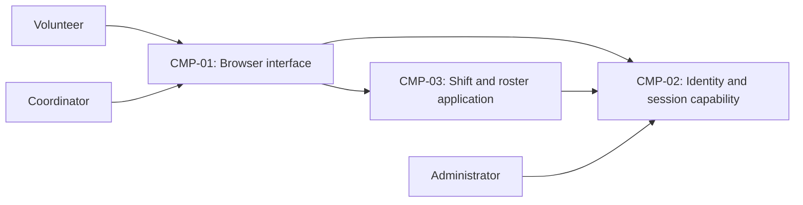

# ARCH-001 — Volunteer shift sign-up for the Riverside Food Bank architecture

## 1. Context and scope

This proposal addresses PRD-001 version 1, status approved: browser-based volunteer sign-in,
warehouse shift booking, and the coordinator's daily roster for about 120 volunteers.
Payroll and donations are outside the product. The PRD specifies mobile-first web pages,
not an installed application.

The request explicitly selected PRD-001 and instructed proceeding without questions.
No inspection scope was named; no application code or configuration was inspected.
No existing ARCH, ADR, policy, or local preference document was found at the contract paths.
Create is the proposed outcome because no ARCH covers this system; it remains unconfirmed.
The components and interactions below are proposals, not accepted decisions or observed implementation.

## 2. Quality drivers

PRD-001#NFR-001 requires administrator revocation of volunteer sessions to take effect within
five minutes. The sign-in flow and every operation accepting those sessions must share an
enforcement contract; selecting an identity provider alone does not establish that guarantee.

PRD-001#NFR-002 restricts visibility of volunteer phone numbers to the coordinator. Enforcement
must cover access to authoritative data and data sent to browsers, rather than relying only
on hiding interface elements. The mechanism and coordinator-role authority remain open.

PRD-001#NFR-003 requires hosted services for the whole product because there is no on-site
server. This fixes the hosting constraint, but does not select a provider, deployment topology,
or persistence service.

The operating context is internal, as stated in PRD-001; the release name Pilot does not
override it. The required quality categories are constraint, security, and privacy. All three
have corresponding NFRs. Framework defaults apply: interview.max_calls=8, no mandated
platforms, and no quality categories added to the floor. No interview calls were made.

## 3. Components

The diagram proposes logical responsibilities, not independently deployable services.
ARCH-001#DEC-05 governs the boundaries, ARCH-001#DEC-06 and ARCH-001#DEC-07 govern ownership,
and ARCH-001#DEC-08 governs the booking-to-roster interaction. Arrows do not settle a protocol.



```yaml items
components:
  - id: CMP-01
    status: active
    name: "Browser interface"
    responsibility: "Proposed mobile-first sign-in, booking, and coordinator roster interface; does not own authoritative records or enforce access merely through display logic."
    owns_data: []
    interacts_with:
      - "CMP-02"
      - "CMP-03"
    deployment: "Open: see DEC-04"
    upstream:
      - {id: PRD-001, item: NFR-001, relation: informed_by, version: 1, hash: null}
      - {id: PRD-001, item: NFR-002, relation: informed_by, version: 1, hash: null}
      - {id: PRD-001, item: NFR-003, relation: informed_by, version: 1, hash: null}
  - id: CMP-02
    status: active
    name: "Identity and session capability"
    responsibility: "Proposed authentication, identity establishment, and session lifecycle capability including administrator revocation; does not own shifts, bookings, or the roster. Provider and enforcement integration remain open."
    owns_data:
      - "Proposed authentication identities and session lifecycle state; subject to DEC-01, DEC-02, and DEC-05"
    interacts_with:
      - "CMP-01"
      - "CMP-03"
    deployment: "Open: see DEC-04"
    upstream:
      - {id: PRD-001, item: NFR-001, relation: informed_by, version: 1, hash: null}
      - {id: PRD-001, item: NFR-003, relation: informed_by, version: 1, hash: null}
  - id: CMP-03
    status: active
    name: "Shift and roster application"
    responsibility: "Proposed application authority for booking open shifts, presenting the daily roster, and restricting phone-number access; does not authenticate credentials itself. Persistence and boundaries remain undecided."
    owns_data:
      - "Proposed authoritative shifts and bookings, with the roster derived from bookings; subject to DEC-06"
      - "Proposed volunteer contact records linked to identities; subject to DEC-07"
    interacts_with:
      - "CMP-01"
      - "CMP-02"
    deployment: "Open: see DEC-04"
    upstream:
      - {id: PRD-001, item: NFR-001, relation: informed_by, version: 1, hash: null}
      - {id: PRD-001, item: NFR-002, relation: informed_by, version: 1, hash: null}
      - {id: PRD-001, item: NFR-003, relation: informed_by, version: 1, hash: null}
```

## 4. Architectural questions

All questions remain blocking and open. No mandate or explicit decision resolves them.
The notes describe alternatives and their trade-offs for later consideration, not selected options.

```yaml items
decisions:
  - id: DEC-01
    status: active
    question: "Which identity provider handles volunteer sign-in?"
    blocking: true
    state: open
    resolved_by: []
    notes: "Captures the PRD NEEDS ADR marker. A hosted identity provider reduces credential-management responsibility; application-managed identity gives more direct control but adds security and operational work. The provider affects booking identity and available revocation mechanisms without resolving DEC-02."
    upstream:
      - {id: PRD-001, item: FR-001, relation: informed_by, version: 1, hash: null}
      - {id: PRD-001, item: FR-002, relation: informed_by, version: 1, hash: null}
      - {id: PRD-001, item: NFR-001, relation: informed_by, version: 1, hash: null}
  - id: DEC-02
    status: active
    question: "How will administrator revocation stop all use of a volunteer session within five minutes?"
    blocking: true
    state: open
    resolved_by: []
    notes: "An authoritative session check couples protected requests to session-state availability; bounded token lifetime with denied renewal reduces checks but requires a proven bound across expiration, refresh, and caches. Applies to session creation and signed-in booking. Coordinator session revocation is not specified by this NFR."
    upstream:
      - {id: PRD-001, item: FR-001, relation: informed_by, version: 1, hash: null}
      - {id: PRD-001, item: FR-002, relation: informed_by, version: 1, hash: null}
      - {id: PRD-001, item: NFR-001, relation: informed_by, version: 1, hash: null}
  - id: DEC-03
    status: active
    question: "Where will coordinator-only authorization for volunteer phone numbers be enforced?"
    blocking: true
    state: open
    resolved_by: []
    notes: "Application-layer authorization concentrates checks at the roster boundary; datastore-enforced authorization can protect direct data access but requires consistent identity and role propagation. The choice must establish the trusted coordinator-role authority and prevent disclosure to volunteers, including browser payloads."
    upstream:
      - {id: PRD-001, item: FR-003, relation: informed_by, version: 1, hash: null}
      - {id: PRD-001, item: NFR-002, relation: informed_by, version: 1, hash: null}
  - id: DEC-04
    status: active
    question: "Which hosted deployment arrangement will run the whole product?"
    blocking: true
    state: open
    resolved_by: []
    notes: "An integrated managed application and persistence platform reduces deployment coordination; separately hosted application, identity, and data services allow independent choices but add configuration and operational boundaries. Provider, units, and environments remain undecided. The whole-product constraint affects every functional requirement and both security and privacy enforcement."
    upstream:
      - {id: PRD-001, item: FR-001, relation: informed_by, version: 1, hash: null}
      - {id: PRD-001, item: FR-002, relation: informed_by, version: 1, hash: null}
      - {id: PRD-001, item: FR-003, relation: informed_by, version: 1, hash: null}
      - {id: PRD-001, item: NFR-001, relation: informed_by, version: 1, hash: null}
      - {id: PRD-001, item: NFR-002, relation: informed_by, version: 1, hash: null}
      - {id: PRD-001, item: NFR-003, relation: informed_by, version: 1, hash: null}
  - id: DEC-05
    status: active
    question: "What shared component boundaries will separate browser presentation, identity and sessions, and shift and roster logic?"
    blocking: true
    state: open
    resolved_by: []
    notes: "The proposed three logical capabilities can be composed behind one application boundary for simpler coordination, or exposed through separate service boundaries for independent operation with more integration work. The choice allocates session and privacy enforcement responsibilities and determines deployment units; the diagram is provisional."
    upstream:
      - {id: PRD-001, item: FR-001, relation: informed_by, version: 1, hash: null}
      - {id: PRD-001, item: FR-002, relation: informed_by, version: 1, hash: null}
      - {id: PRD-001, item: FR-003, relation: informed_by, version: 1, hash: null}
      - {id: PRD-001, item: NFR-001, relation: informed_by, version: 1, hash: null}
      - {id: PRD-001, item: NFR-002, relation: informed_by, version: 1, hash: null}
      - {id: PRD-001, item: NFR-003, relation: informed_by, version: 1, hash: null}
  - id: DEC-06
    status: active
    question: "Which component owns the authoritative shift availability and booking records used by the roster?"
    blocking: true
    state: open
    resolved_by: []
    notes: "One application owner keeps booking and roster semantics together; separate scheduling and booking owners need an agreed consistency boundary. The choice must support booking an open shift under concurrent requests and prevent independent epics from maintaining conflicting records."
    upstream:
      - {id: PRD-001, item: FR-002, relation: informed_by, version: 1, hash: null}
      - {id: PRD-001, item: FR-003, relation: informed_by, version: 1, hash: null}
  - id: DEC-07
    status: active
    question: "Which component owns volunteer contact data and its association with roster identities?"
    blocking: true
    state: open
    resolved_by: []
    notes: "Application-owned contacts keep roster privacy rules close to the data; identity-profile-owned contacts reduce separate profile storage but couple roster access to identity-provider disclosure controls. Phone numbers must not be propagated in general volunteer identity payloads."
    upstream:
      - {id: PRD-001, item: FR-003, relation: informed_by, version: 1, hash: null}
      - {id: PRD-001, item: NFR-002, relation: informed_by, version: 1, hash: null}
  - id: DEC-08
    status: active
    question: "How will committed bookings become visible in the coordinator's daily roster?"
    blocking: true
    state: open
    resolved_by: []
    notes: "Reading the authoritative booking data avoids a separate projection; event-fed roster projections decouple reads but introduce delay and delivery recovery. Agree on this interaction across booking and roster epics; exact API fields and UI update mechanics belong to later specifications."
    upstream:
      - {id: PRD-001, item: FR-002, relation: informed_by, version: 1, hash: null}
      - {id: PRD-001, item: FR-003, relation: informed_by, version: 1, hash: null}
```

## 5. Evidence inspected

```yaml items
evidence:
  - id: EVD-01
    status: active
    source: "PRD-001"
    kind: prd
    finding: "Version 1, status approved: volunteer sign-in, signed-in shift booking, and daily coordinator roster; five-minute volunteer session revocation, coordinator-only phone-number visibility, and whole-product hosted services. Operating context is internal. Identity provider selection is explicitly marked NEEDS ADR."
    classification: context
```

## 6. Deployment

PRD-001#NFR-003 requires all server-side capabilities and persistence to use hosted services.
The browser runs on volunteer and coordinator devices. ARCH-001#DEC-04 leaves the hosting
provider, deployment units, persistence arrangement, and environments open; ARCH-001#DEC-05
leaves logical boundaries open. No on-site server is proposed. The PRD's Tuesday-and-Thursday
pilot is rollout scope, not a decision to create a separate deployment environment.

## 7. Requirement changes proposed to the PRD owner

- None.

## 8. Open questions

- [NEEDS CLARIFICATION: No inspection scope was named and no application code or configuration was inspected; existing implementation, reusable services, and deployment capabilities are unknown.]
- [NEEDS CLARIFICATION: The create outcome is proposed for ARCH-001 but was not explicitly confirmed; the request to proceed without questions leaves outcome null.]
- [NEEDS CLARIFICATION: host model/session identity unavailable]

## Change Log

| Version | Date | Author | Change | Items affected |
|---|---|---|---|---|
| 1 | 2026-09-28 | codex (session unknown) | Initial draft for PRD-001 v1; proposed components and eight open architectural questions; host provenance unavailable. Policy resolution: interview.max_calls=8 (default); architecture.mandated_platforms=none (default); quality.required_categories=floor only (default) | all |
