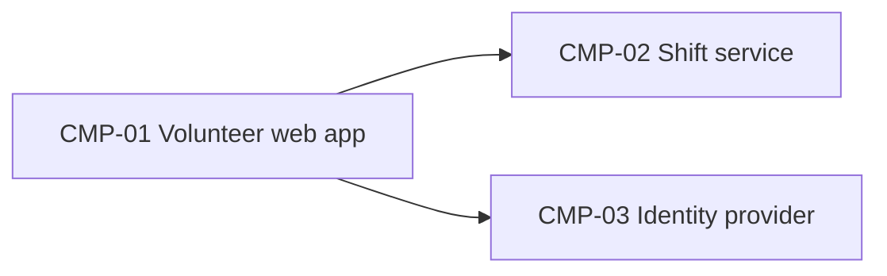

# ARCH-001 — Riverside Food Bank volunteer shift sign-up architecture

## 1. Context and scope

Originally defined against PRD-001 version 1; reused for approved PRD-001 version 2. Volunteers sign in, book warehouse shifts, and the coordinator sees the roster. No inspection scope was named, and no code was inspected.

The PRD version 2 change log records only FR-003's priority changing from `should` to `must`, with no requirement text changes. The existing component responsibilities, deployment, and architectural decisions remain applicable; no design change is proposed. The user explicitly confirmed the reuse outcome on 2026-09-28. The approval metadata above records the original architecture approval on 2026-09-22.

Reuse does not resolve DEC-02: session revocation within 5 minutes remains an open, blocking architectural decision. ADR-001 resolves only the identity-provider choice (DEC-01).

## 2. Quality drivers

NFR-001 (session revocation) and NFR-002 (private phone numbers) drive the design; NFR-003 rules out an on-site server.

## 3. Components



```yaml items
components:
  - id: CMP-01
    status: active
    name: "Volunteer web app"
    responsibility: "Sign-in and booking screens; holds no data of its own"
    owns_data: []
    interacts_with:
      - "CMP-02"
      - "CMP-03"
    deployment: "Static site on the hosting provider"
  - id: CMP-02
    status: active
    name: "Shift service"
    responsibility: "Shifts, bookings and volunteer contact details"
    owns_data:
      - "Shifts and bookings"
      - "Volunteer phone numbers"
    interacts_with:
      - "CMP-01"
    deployment: "One hosted service with its database"
    upstream:
      - {id: PRD-001, item: NFR-002, relation: informed_by, version: 2, hash: null}
  - id: CMP-03
    status: active
    name: "Identity provider"
    responsibility: "Authenticates volunteers and issues sessions"
    owns_data:
      - "Volunteer credentials"
    interacts_with:
      - "CMP-01"
    deployment: "External: Auth0 (ADR-001)"
    upstream:
      - {id: PRD-001, item: NFR-001, relation: informed_by, version: 2, hash: null}
```

## 4. Architectural questions

```yaml items
decisions:
  - id: DEC-01
    status: active
    question: "Which identity provider handles volunteer sign-in?"
    blocking: true
    state: resolved
    resolved_by: [ADR-001]
    notes: null
    upstream:
      - {id: PRD-001, item: FR-001, relation: informed_by, version: 2, hash: null}
  - id: DEC-02
    status: active
    question: "How are a volunteer's sessions revoked within 5 minutes (NFR-001)?"
    blocking: true
    state: open
    resolved_by: []
    notes: null
    upstream:
      - {id: PRD-001, item: FR-001, relation: informed_by, version: 2, hash: null}
      - {id: PRD-001, item: NFR-001, relation: informed_by, version: 2, hash: null}
```

## 5. Evidence inspected

```yaml items
evidence:
  - id: EVD-01
    status: active
    source: "PRD-001"
    kind: prd
    finding: "Version 2, status approved: the change log records only FR-003's priority changing from should to must, with no requirement text changes. Sign-in (FR-001) and session revocation (NFR-001) remain in scope; the identity provider is a NEEDS ADR marker addressed by ADR-001."
    classification: context
  - id: EVD-02
    status: active
    source: "ADR-001"
    kind: adr
    finding: "Version 1, status accepted: Auth0 handles volunteer sign-in."
    classification: decided
```

## 6. Deployment

The web app and the shift service run on the hosting provider (NFR-003); Auth0 is external.

## 7. Requirement changes proposed to the PRD owner

- None.

## 8. Open questions

- DEC-02 remains open and blocking: how are a volunteer's sessions revoked within 5 minutes (NFR-001)? The accepted identity-provider choice in ADR-001 does not settle this mechanism.

## Change Log

| Version | Date | Author | Change | Items affected |
|---|---|---|---|---|
| 1 | 2026-09-21 | claude-code (session fixture-session) | Initial draft for PRD-001 v1. Policy resolution: interview.max_calls=8 (default); architecture.mandated_platforms=none (default); quality.required_categories=floor only (default) | all |
| 1 | 2026-09-22 | Priya Nair | Approved | status |
| 2 | 2026-09-28 | Codex | User-confirmed reuse for approved PRD-001 v2; FR-003 priority changed from should to must only. Refreshed PRD references and evidence; retained the existing design and original approval metadata. DEC-02 remains open and blocking; ADR-001 still resolves only DEC-01. No code inspected | outcome, upstream, EVD-01, context, open questions |
