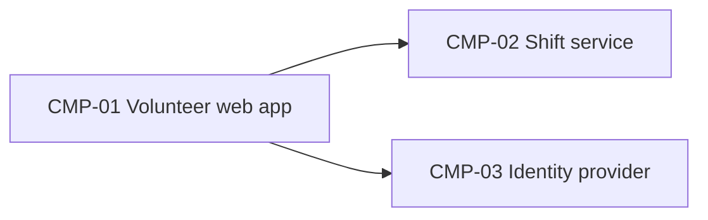

# ARCH-001 — Riverside Food Bank volunteer shift sign-up architecture

## 1. Context and scope

Defined against PRD-001 version 1 (approved): volunteers sign in and book warehouse shifts. Payroll and donations are outside the system. No inspection scope was named, and no code was inspected.

This amendment reflects accepted ADR-003, which supersedes ADR-002 and requires every service to run on the hosting provider before the back-office server is removed at the end of October. ADR-003 settles hosting only; the replacement identity provider remains undecided. The user confirmed the amend outcome; version 2 is a draft and does not inherit version 1's approval.

## 2. Quality drivers

NFR-001 (phone numbers visible only to the coordinator) drives data ownership.

## 3. Components



```yaml items
components:
  - id: CMP-01
    status: active
    name: "Volunteer web app"
    responsibility: "Sign-in and booking screens; holds no data of its own"
    owns_data: []
    interacts_with:
      - "CMP-02"
      - "CMP-03"
    deployment: "Static site on the hosting provider"
  - id: CMP-02
    status: active
    name: "Shift service"
    responsibility: "Shifts, bookings and volunteer contact details"
    owns_data:
      - "Shifts and bookings"
      - "Volunteer phone numbers"
    interacts_with:
      - "CMP-01"
    deployment: "One hosted service with its database"
    upstream:
      - {id: PRD-001, item: NFR-001, relation: informed_by, version: 1, hash: null}
  - id: CMP-03
    status: active
    name: "Identity provider"
    responsibility: "Authenticates volunteers and issues sessions"
    owns_data:
      - "Volunteer credentials"
    interacts_with:
      - "CMP-01"
    deployment: "Hosting provider (ADR-003); replacement identity provider pending DEC-01"
```

## 4. Architectural questions

```yaml items
decisions:
  - id: DEC-01
    status: active
    question: "Which identity provider handles volunteer sign-in?"
    blocking: true
    state: open
    resolved_by: []
    notes: "Reopened: ADR-002 is superseded by ADR-003. ADR-003 settles hosting only and explicitly leaves the replacement identity provider undecided. A new identity-provider ADR is required."
    upstream:
      - {id: PRD-001, item: FR-001, relation: informed_by, version: 1, hash: null}
  - id: DEC-02
    status: active
    question: "Where are shift, booking and contact data stored, and which component owns them?"
    blocking: true
    state: resolved
    resolved_by: [ADR-001]
    notes: null
    upstream:
      - {id: PRD-001, item: FR-002, relation: informed_by, version: 1, hash: null}
      - {id: PRD-001, item: NFR-001, relation: informed_by, version: 1, hash: null}
  - id: DEC-03
    status: active
    question: "Where will services run after the on-premises server is retired?"
    blocking: true
    state: resolved
    resolved_by: [ADR-003]
    notes: "Every service runs on the hosting provider; this does not resolve the identity-provider choice in DEC-01."
    upstream:
      - {id: PRD-001, item: FR-001, relation: informed_by, version: 1, hash: null}
      - {id: PRD-001, item: FR-002, relation: informed_by, version: 1, hash: null}
```

## 5. Evidence inspected

```yaml items
evidence:
  - id: EVD-01
    status: active
    source: "PRD-001"
    kind: prd
    finding: "Version 1, status approved: sign-in (FR-001), booking (FR-002) and private phone numbers (NFR-001)."
    classification: context
  - id: EVD-02
    status: active
    source: "ADR-001"
    kind: adr
    finding: "Version 1, status accepted: the shift service owns shift, booking and contact data in one managed PostgreSQL database."
    classification: decided
  - id: EVD-03
    status: active
    source: "ADR-002"
    kind: adr
    finding: "Version 1, status superseded by ADR-003: the former choice of on-premises Keycloak no longer resolves DEC-01. Retained as historical evidence."
    classification: context
  - id: EVD-04
    status: active
    source: "ADR-003"
    kind: adr
    finding: "Version 1, status accepted: every service must run on the hosting provider because the on-premises server is being removed at the end of October. Supersedes ADR-002 for hosting only; the replacement identity provider is explicitly undecided."
    classification: decided
```

## 6. Deployment

The web app, shift service and future identity-provider service run on the hosting provider (ADR-003). No component may depend on the on-premises server after its removal at the end of October. CMP-02 continues to own shift, booking and contact data in one managed PostgreSQL database (ADR-001).

The identity-provider product and sign-in integration remain blocked on DEC-01. ADR-003 does not select a replacement or authorize treating the former Keycloak choice as current; a new ADR must resolve that choice within the hosting constraint. These are architecture requirements, not evidence that deployment or migration has occurred.

## 7. Requirement changes proposed to the PRD owner

- None.

## 8. Open questions

- [NEEDS ADR: replacement identity provider for volunteer sign-in on the hosting provider; affects PRD-001#FR-001 and CMP-03; blocking DEC-01 remains open.]

## Change Log

| Version | Date | Author | Change | Items affected |
|---|---|---|---|---|
| 1 | 2026-09-21 | claude-code (session fixture-session) | Initial draft for PRD-001 v1. Policy resolution: interview.max_calls=8 (default); architecture.mandated_platforms=none (default); quality.required_categories=floor only (default) | all |
| 1 | 2026-09-22 | Priya Nair | Approved | status |
| 2 | 2026-09-28 | Codex | User confirmed amend outcome. Applied accepted ADR-003's hosting constraint; reopened DEC-01 because superseded ADR-002 no longer resolves identity selection; retained ADR-001's data ownership decision. Updated evidence and returned amended version to draft pending review. | outcome, status, CMP-03, DEC-01, DEC-03, EVD-03, EVD-04, deployment, open questions |
