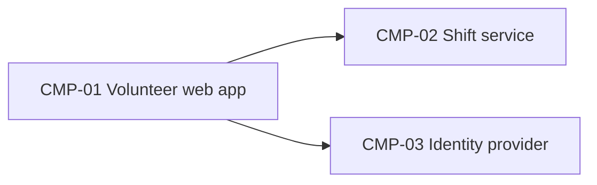

# ARCH-001 — Riverside Food Bank volunteer shift sign-up architecture

## 1. Context and scope

Defined against PRD-001 version 1 (approved): volunteers sign in and book warehouse shifts. Payroll and donations are outside the system. No inspection scope was named, and no code was inspected.

This amendment reflects accepted ADR-003, which supersedes ADR-002 and retires the on-premises server at the end of October 2026. ADR-003 settles hosting only; the replacement identity provider remains undecided. The amend outcome was confirmed by the requester. Version 2 is a draft; version 1's approval is retained in the change log and does not apply to this amendment.

## 2. Quality drivers

NFR-001 (phone numbers visible only to the coordinator) drives data ownership.

## 3. Components



```yaml items
components:
  - id: CMP-01
    status: active
    name: "Volunteer web app"
    responsibility: "Sign-in and booking screens; holds no data of its own"
    owns_data: []
    interacts_with:
      - "CMP-02"
      - "CMP-03"
    deployment: "Static site on the hosting provider"
  - id: CMP-02
    status: active
    name: "Shift service"
    responsibility: "Shifts, bookings and volunteer contact details"
    owns_data:
      - "Shifts and bookings"
      - "Volunteer phone numbers"
    interacts_with:
      - "CMP-01"
    deployment: "One service on the hosting provider with one managed PostgreSQL database (ADR-001, ADR-003)"
    upstream:
      - {id: PRD-001, item: NFR-001, relation: informed_by, version: 1, hash: null}
  - id: CMP-03
    status: active
    name: "Identity provider"
    responsibility: "Authenticates volunteers and issues sessions"
    owns_data:
      - "Volunteer credentials"
    interacts_with:
      - "CMP-01"
    deployment: "Hosting provider (ADR-003); replacement identity provider pending a new ADR (DEC-01)"
```

## 4. Architectural questions

```yaml items
decisions:
  - id: DEC-01
    status: active
    question: "Which identity provider handles volunteer sign-in?"
    blocking: true
    state: open
    resolved_by: []
    notes: "Reopened: ADR-002 is superseded by ADR-003. ADR-003 settles hosting only and explicitly leaves the replacement identity provider undecided. A new accepted ADR is required to resolve this blocking question."
    upstream:
      - {id: PRD-001, item: FR-001, relation: informed_by, version: 1, hash: null}
  - id: DEC-02
    status: active
    question: "Where are shift, booking and contact data stored, and which component owns them?"
    blocking: true
    state: resolved
    resolved_by: [ADR-001]
    notes: null
    upstream:
      - {id: PRD-001, item: FR-002, relation: informed_by, version: 1, hash: null}
      - {id: PRD-001, item: NFR-001, relation: informed_by, version: 1, hash: null}
  - id: DEC-03
    status: active
    question: "Where do the system's services run after the on-premises server is retired?"
    blocking: true
    state: resolved
    resolved_by: [ADR-003]
    notes: "Every service runs on the hosting provider. This hosting decision does not select the replacement identity provider or resolve DEC-01."
    upstream:
      - {id: PRD-001, item: FR-001, relation: informed_by, version: 1, hash: null}
      - {id: PRD-001, item: FR-002, relation: informed_by, version: 1, hash: null}
```

## 5. Evidence inspected

```yaml items
evidence:
  - id: EVD-01
    status: active
    source: "PRD-001"
    kind: prd
    finding: "Version 1, status approved: sign-in (FR-001), booking (FR-002) and private phone numbers (NFR-001)."
    classification: context
  - id: EVD-02
    status: active
    source: "ADR-001"
    kind: adr
    finding: "Version 1, status accepted: the shift service owns shift, booking and contact data in one managed PostgreSQL database."
    classification: decided
  - id: EVD-03
    status: active
    source: "ADR-002"
    kind: adr
    finding: "Version 1, status superseded by ADR-003: the former decision selected Keycloak on the on-premises server. Retained as historical evidence, not a current resolution of DEC-01."
    classification: context
  - id: EVD-04
    status: active
    source: "ADR-003"
    kind: adr
    finding: "Version 1, status accepted: retires the on-premises server at the end of October 2026 and places every service on the hosting provider. Decides hosting only; the replacement identity provider remains undecided. Supersedes ADR-002."
    classification: decided
```

## 6. Deployment

Every service runs on the hosting provider (ADR-003). The web app remains a static site, and the shift service retains ownership of shift, booking and contact data in one managed PostgreSQL database (ADR-001). Phone numbers remain visible only to the coordinator (PRD-001#NFR-001).

The on-premises server is being removed at the end of October 2026 and cannot remain a deployment target, including for the former Keycloak instance. The identity component's provider and concrete deployment remain pending DEC-01 within ADR-003's hosting constraint; ADR-003 does not authorize moving Keycloak or select another identity provider.

## 7. Requirement changes proposed to the PRD owner

- None.

## 8. Open questions

- DEC-01 (blocking; PRD-001#FR-001): Which identity provider replaces the former on-premises Keycloak instance within ADR-003's hosting constraint? A new accepted ADR must resolve provider selection before the sign-in architecture is settled.

## Change Log

| Version | Date | Author | Change | Items affected |
|---|---|---|---|---|
| 1 | 2026-09-21 | claude-code (session fixture-session) | Initial draft for PRD-001 v1. Policy resolution: interview.max_calls=8 (default); architecture.mandated_platforms=none (default); quality.required_categories=floor only (default) | all |
| 1 | 2026-09-22 | Priya Nair | Approved | status |
| 2 | 2026-09-28 | codex | Amend outcome confirmed by requester. Apply accepted ADR-003's hosting decision; record ADR-002 as superseded and reopen identity-provider selection without inferring a replacement. Preserve ADR-001 data ownership. Return amended version to draft and clear prior-version approval metadata. | metadata, CMP-02, CMP-03, DEC-01, DEC-03, EVD-03, EVD-04, deployment, open questions |
